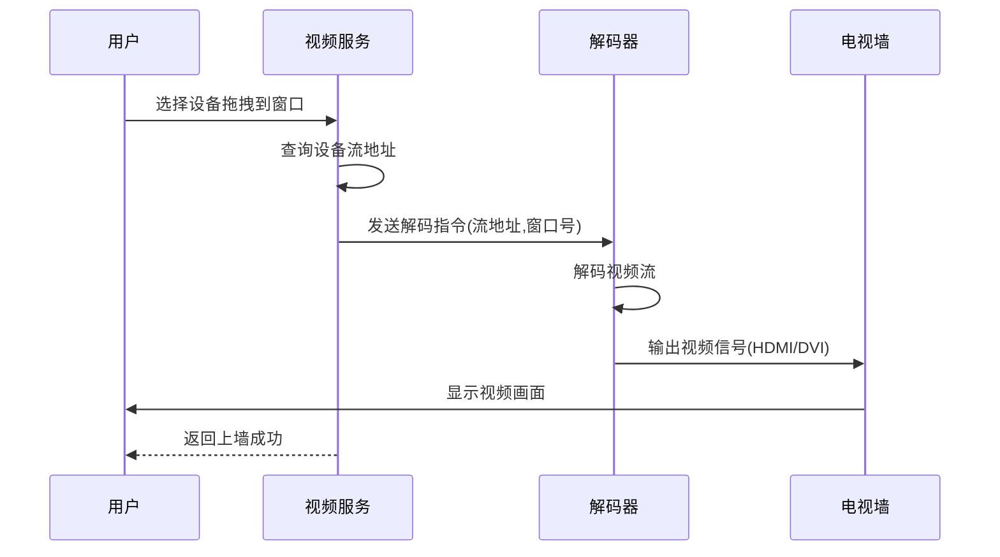
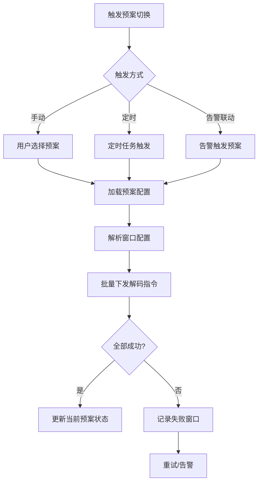
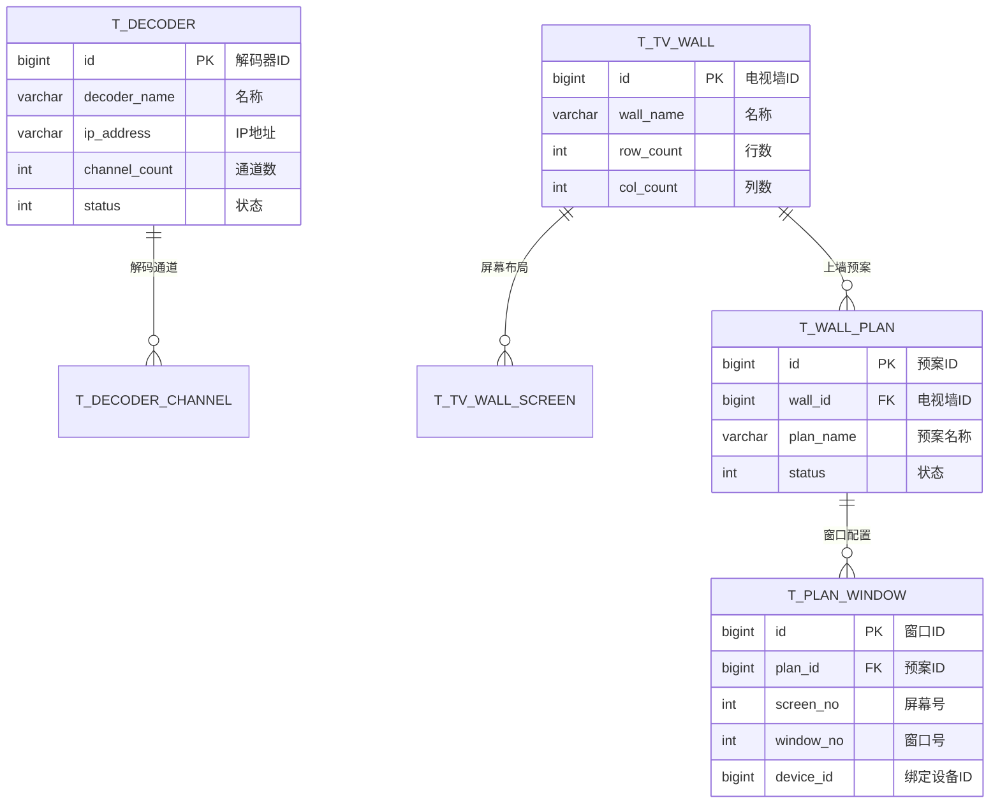

# 解码上墙模块 - 完整设计文档

## 📋 模块概述

### 模块定位
解码上墙模块负责管理解码器设备和电视墙布局，支持视频画面的灵活上墙展示，是大型监控中心的核心功能。

### 核心价值
- **灵活布局**: 支持多种分屏模式和自定义布局
- **预案管理**: 一键切换预设场景
- **轮巡功能**: 自动循环切换视频源

---

## 👥 用户故事

### US-DW-001: 电视墙布局配置
**作为** 系统管理员  
**我希望** 配置电视墙的屏幕布局和分屏模式  
**以便** 合理利用电视墙展示监控画面

**验收标准**:
1. 支持拖拽配置屏幕位置
2. 支持1/4/9/16等分屏模式
3. 配置实时预览效果

### US-DW-002: 视频上墙操作
**作为** 安保人员  
**我希望** 将视频画面快速投放到电视墙  
**以便** 在大屏幕上查看监控画面

**验收标准**:
1. 支持拖拽视频到窗口
2. 上墙延迟≤2秒
3. 支持画面切换和关闭

### US-DW-003: 预案管理
**作为** 安保主管  
**我希望** 创建和管理上墙预案  
**以便** 快速切换不同场景的监控布局

**验收标准**:
1. 支持保存当前布局为预案
2. 支持一键调用预案
3. 支持预案定时切换

---

## 📊 业务流程图

### 视频上墙流程



### 预案切换流程



---

## 🗄️ 数据结构设计

### ER图



### 核心表结构

```sql
-- 解码器表
CREATE TABLE t_decoder (
    id              BIGINT PRIMARY KEY AUTO_INCREMENT COMMENT '解码器ID',
    decoder_name    VARCHAR(100) NOT NULL COMMENT '解码器名称',
    decoder_code    VARCHAR(64) NOT NULL COMMENT '解码器编码',
    ip_address      VARCHAR(64) NOT NULL COMMENT 'IP地址',
    port            INT NOT NULL DEFAULT 8000 COMMENT '端口',
    username        VARCHAR(64) COMMENT '账号',
    password        VARCHAR(256) COMMENT '密码(加密)',
    channel_count   INT NOT NULL DEFAULT 4 COMMENT '输出通道数',
    manufacturer    VARCHAR(64) COMMENT '厂商',
    model           VARCHAR(64) COMMENT '型号',
    status          TINYINT NOT NULL DEFAULT 1 COMMENT '状态:1-在线,2-离线',
    deleted_flag    TINYINT NOT NULL DEFAULT 0,
    create_time     DATETIME NOT NULL DEFAULT CURRENT_TIMESTAMP,
    update_time     DATETIME NOT NULL DEFAULT CURRENT_TIMESTAMP ON UPDATE CURRENT_TIMESTAMP,
    UNIQUE KEY uk_decoder_code (decoder_code)
) ENGINE=InnoDB DEFAULT CHARSET=utf8mb4 COMMENT='解码器表';

-- 电视墙表
CREATE TABLE t_tv_wall (
    id              BIGINT PRIMARY KEY AUTO_INCREMENT COMMENT '电视墙ID',
    wall_name       VARCHAR(100) NOT NULL COMMENT '电视墙名称',
    wall_code       VARCHAR(64) NOT NULL COMMENT '电视墙编码',
    row_count       INT NOT NULL DEFAULT 2 COMMENT '行数',
    col_count       INT NOT NULL DEFAULT 2 COMMENT '列数',
    description     VARCHAR(512) COMMENT '描述',
    status          TINYINT NOT NULL DEFAULT 1 COMMENT '状态:1-启用,2-禁用',
    deleted_flag    TINYINT NOT NULL DEFAULT 0,
    create_time     DATETIME NOT NULL DEFAULT CURRENT_TIMESTAMP,
    UNIQUE KEY uk_wall_code (wall_code)
) ENGINE=InnoDB DEFAULT CHARSET=utf8mb4 COMMENT='电视墙表';

-- 电视墙屏幕布局表
CREATE TABLE t_tv_wall_screen (
    id              BIGINT PRIMARY KEY AUTO_INCREMENT COMMENT '屏幕ID',
    wall_id         BIGINT NOT NULL COMMENT '电视墙ID',
    screen_no       INT NOT NULL COMMENT '屏幕序号',
    row_index       INT NOT NULL COMMENT '行索引(0开始)',
    col_index       INT NOT NULL COMMENT '列索引(0开始)',
    decoder_id      BIGINT COMMENT '关联解码器ID',
    decoder_channel INT COMMENT '解码器通道',
    split_mode      TINYINT NOT NULL DEFAULT 1 COMMENT '分屏模式:1-1分屏,4-4分屏,9-9分屏',
    INDEX idx_wall_id (wall_id)
) ENGINE=InnoDB DEFAULT CHARSET=utf8mb4 COMMENT='电视墙屏幕布局表';

-- 上墙预案表
CREATE TABLE t_wall_plan (
    id              BIGINT PRIMARY KEY AUTO_INCREMENT COMMENT '预案ID',
    wall_id         BIGINT NOT NULL COMMENT '电视墙ID',
    plan_name       VARCHAR(100) NOT NULL COMMENT '预案名称',
    plan_code       VARCHAR(64) NOT NULL COMMENT '预案编码',
    description     VARCHAR(512) COMMENT '描述',
    is_default      TINYINT NOT NULL DEFAULT 0 COMMENT '是否默认预案',
    status          TINYINT NOT NULL DEFAULT 1 COMMENT '状态:1-启用,2-禁用',
    deleted_flag    TINYINT NOT NULL DEFAULT 0,
    create_time     DATETIME NOT NULL DEFAULT CURRENT_TIMESTAMP,
    update_time     DATETIME NOT NULL DEFAULT CURRENT_TIMESTAMP ON UPDATE CURRENT_TIMESTAMP,
    UNIQUE KEY uk_plan_code (plan_code),
    INDEX idx_wall_id (wall_id)
) ENGINE=InnoDB DEFAULT CHARSET=utf8mb4 COMMENT='上墙预案表';

-- 预案窗口配置表
CREATE TABLE t_plan_window (
    id              BIGINT PRIMARY KEY AUTO_INCREMENT COMMENT '配置ID',
    plan_id         BIGINT NOT NULL COMMENT '预案ID',
    screen_no       INT NOT NULL COMMENT '屏幕序号',
    window_no       INT NOT NULL COMMENT '窗口序号',
    device_id       BIGINT COMMENT '设备ID',
    channel_no      INT DEFAULT 1 COMMENT '通道号',
    INDEX idx_plan_id (plan_id)
) ENGINE=InnoDB DEFAULT CHARSET=utf8mb4 COMMENT='预案窗口配置表';
```

---

## 🔌 接口设计

| 方法 | 路径 | 说明 | 权限 |
|------|------|------|------|
| GET | /api/v1/decoders | 解码器列表 | Level 3+ |
| GET | /api/v1/tv-walls | 电视墙列表 | Level 3+ |
| POST | /api/v1/tv-walls/{id}/decode | 视频上墙 | Level 3+ |
| DELETE | /api/v1/tv-walls/{id}/decode | 关闭窗口 | Level 3+ |
| GET | /api/v1/wall-plans | 预案列表 | Level 3+ |
| POST | /api/v1/wall-plans | 创建预案 | Level 4+ |
| POST | /api/v1/wall-plans/{id}/apply | 应用预案 | Level 3+ |

---

## 📈 性能指标

| 指标 | 要求 |
|------|------|
| 上墙延迟 | ≤ 2秒 |
| 预案切换 | ≤ 5秒(全量) |
| 画面流畅度 | ≥ 25fps |

---

## ✅ 验收标准

- [ ] 电视墙布局配置正常
- [ ] 视频上墙延迟≤2秒
- [ ] 预案一键切换有效
- [ ] 轮巡功能正常运行
