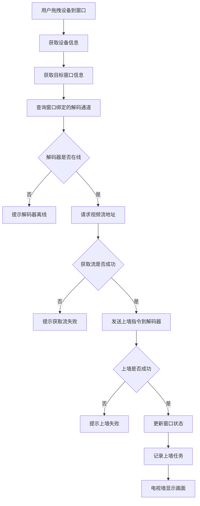
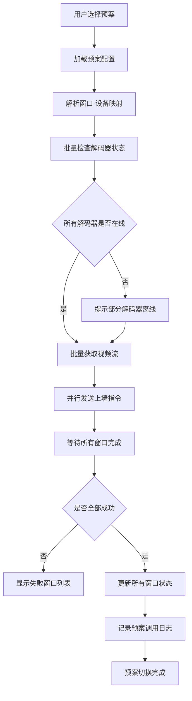
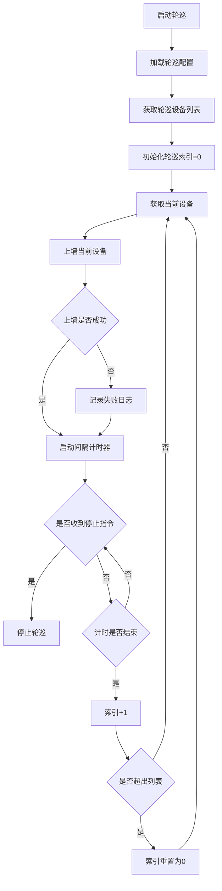
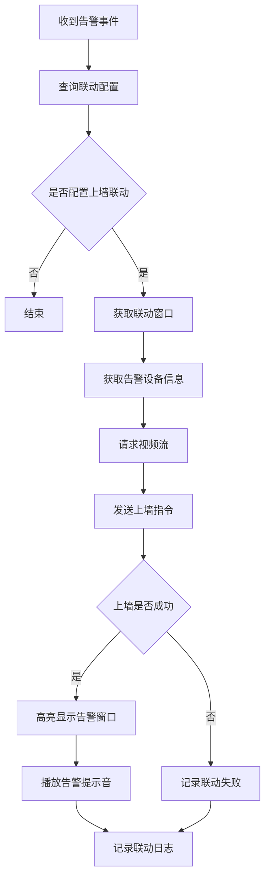
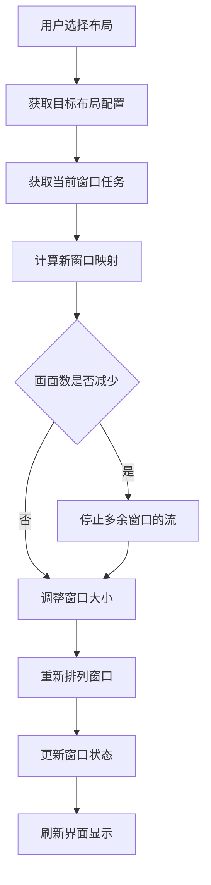
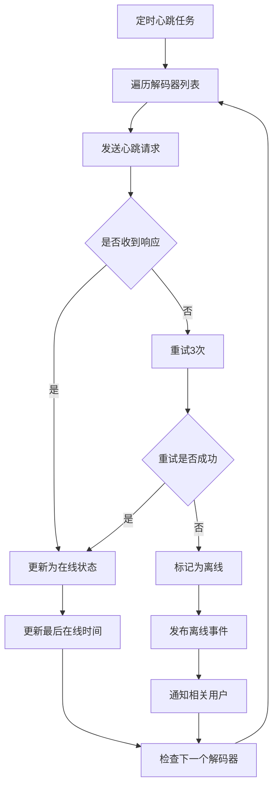

# 解码上墙模块 - 业务流程图

## 手动上墙流程

```mermaid
flowchart TD
    A[用户拖拽设备到窗口] --> B[获取设备信息]
    B --> C[获取目标窗口信息]
    C --> D[查询窗口绑定的解码通道]
    D --> E{解码器是否在线}
    E -->|否| F[提示解码器离线]
    E -->|是| G[请求视频流地址]
    G --> H{获取流是否成功}
    H -->|否| I[提示获取流失败]
    H -->|是| J[发送上墙指令到解码器]
    J --> K{上墙是否成功}
    K -->|否| L[提示上墙失败]
    K -->|是| M[更新窗口状态]
    M --> N[记录上墙任务]
    N --> O[电视墙显示画面]
```

## 预案调用流程

```mermaid
flowchart TD
    A[用户选择预案] --> B[加载预案配置]
    B --> C[解析窗口-设备映射]
    C --> D[批量检查解码器状态]
    D --> E{所有解码器是否在线}
    E -->|否| F[提示部分解码器离线]
    E -->|是| G[批量获取视频流]
    G --> H[并行发送上墙指令]
    H --> I[等待所有窗口完成]
    I --> J{是否全部成功}
    J -->|否| K[显示失败窗口列表]
    J -->|是| L[更新所有窗口状态]
    L --> M[记录预案调用日志]
    M --> N[预案切换完成]
    F --> G
```

## 轮巡执行流程

```mermaid
flowchart TD
    A[启动轮巡] --> B[加载轮巡配置]
    B --> C[获取轮巡设备列表]
    C --> D[初始化轮巡索引=0]
    D --> E[获取当前设备]
    E --> F[上墙当前设备]
    F --> G{上墙是否成功}
    G -->|否| H[记录失败日志]
    G -->|是| I[启动间隔计时器]
    H --> I
    I --> J{是否收到停止指令}
    J -->|是| K[停止轮巡]
    J -->|否| L{计时是否结束}
    L -->|否| J
    L -->|是| M[索引+1]
    M --> N{是否超出列表}
    N -->|是| O[索引重置为0]
    N -->|否| E
    O --> E
```

## 告警联动上墙流程

```mermaid
flowchart TD
    A[收到告警事件] --> B[查询联动配置]
    B --> C{是否配置上墙联动}
    C -->|否| D[结束]
    C -->|是| E[获取联动窗口]
    E --> F[获取告警设备信息]
    F --> G[请求视频流]
    G --> H[发送上墙指令]
    H --> I{上墙是否成功}
    I -->|否| J[记录联动失败]
    I -->|是| K[高亮显示告警窗口]
    K --> L[播放告警提示音]
    L --> M[记录联动日志]
    J --> M
```

## 布局切换流程

```mermaid
flowchart TD
    A[用户选择布局] --> B[获取目标布局配置]
    B --> C[获取当前窗口任务]
    C --> D[计算新窗口映射]
    D --> E{画面数是否减少}
    E -->|是| F[停止多余窗口的流]
    E -->|否| G[调整窗口大小]
    F --> G
    G --> H[重新排列窗口]
    H --> I[更新窗口状态]
    I --> J[刷新界面显示]
```

## 解码器状态监控流程

```mermaid
flowchart TD
    A[定时心跳任务] --> B[遍历解码器列表]
    B --> C[发送心跳请求]
    C --> D{是否收到响应}
    D -->|是| E[更新为在线状态]
    D -->|否| F[重试3次]
    F --> G{重试是否成功}
    G -->|是| E
    G -->|否| H[标记为离线]
    H --> I[发布离线事件]
    I --> J[通知相关用户]
    E --> K[更新最后在线时间]
    J --> L[检查下一个解码器]
    K --> L
    L --> B
```
