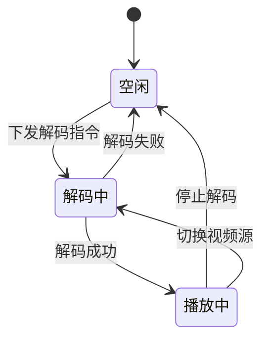

# 解码上墙模块 - 详细设计

## 1. 类设计

### 1.1 Controller层

```java
@RestController
@RequestMapping("/ivs/v1/wall")
public class TvWallController {
    @Resource
    private TvWallService tvWallService;
    
    @GetMapping("/decoders")
    public ResponseDTO<List<DecoderVO>> getDecoders();
    
    @GetMapping("/walls")
    public ResponseDTO<List<TvWallVO>> getWalls();
    
    @PostMapping("/task")
    public ResponseDTO<Long> createDecodeTask(@Valid @RequestBody DecodeTaskForm form);
    
    @DeleteMapping("/task/{taskId}")
    public ResponseDTO<Void> cancelDecodeTask(@PathVariable Long taskId);
    
    @GetMapping("/plans")
    public ResponseDTO<List<WallPlanVO>> getPlans(@RequestParam Long wallId);
    
    @PostMapping("/plans")
    public ResponseDTO<Long> savePlan(@Valid @RequestBody PlanSaveForm form);
    
    @PostMapping("/plans/{planId}/apply")
    public ResponseDTO<Void> applyPlan(@PathVariable Long planId);
}
```

### 1.2 Service层

```java
@Service
@Transactional(rollbackFor = Exception.class)
public class TvWallServiceImpl implements TvWallService {
    @Resource
    private DecoderDao decoderDao;
    @Resource
    private TvWallDao tvWallDao;
    @Resource
    private WallPlanDao wallPlanDao;
    @Resource
    private DecoderManager decoderManager;
    
    @Override
    public Long createDecodeTask(DecodeTaskForm form) {
        // 1. 查询解码器和通道信息
        // 2. 获取视频流地址
        // 3. 下发解码指令到解码器
        // 4. 记录上墙任务
    }
    
    @Override
    public void applyPlan(Long planId) {
        // 1. 加载预案配置
        // 2. 批量下发解码指令
        // 3. 更新当前预案状态
    }
}
```

## 2. 解码指令协议

### 2.1 上墙指令

```json
{
  "cmd": "START_DECODE",
  "decoderId": "DEC001",
  "channel": 1,
  "streamUrl": "rtsp://192.168.1.100:554/live/ch1",
  "protocol": "RTSP",
  "windowNo": 1
}
```

### 2.2 停止指令

```json
{
  "cmd": "STOP_DECODE",
  "decoderId": "DEC001",
  "channel": 1
}
```

## 3. 接口详细设计

### 3.1 创建上墙任务

**请求**:
```http
POST /ivs/v1/wall/task
Content-Type: application/json

{
  "wallId": 1,
  "screenNo": 1,
  "windowNo": 1,
  "deviceId": 1001,
  "channelNo": 1
}
```

**响应**:
```json
{
  "code": 200,
  "data": 10001,
  "message": "success"
}
```

### 3.2 应用预案

**请求**:
```http
POST /ivs/v1/wall/plans/1/apply
```

**响应**:
```json
{
  "code": 200,
  "message": "预案应用成功",
  "data": {
    "successCount": 16,
    "failedCount": 0
  }
}
```

## 4. 状态机设计


