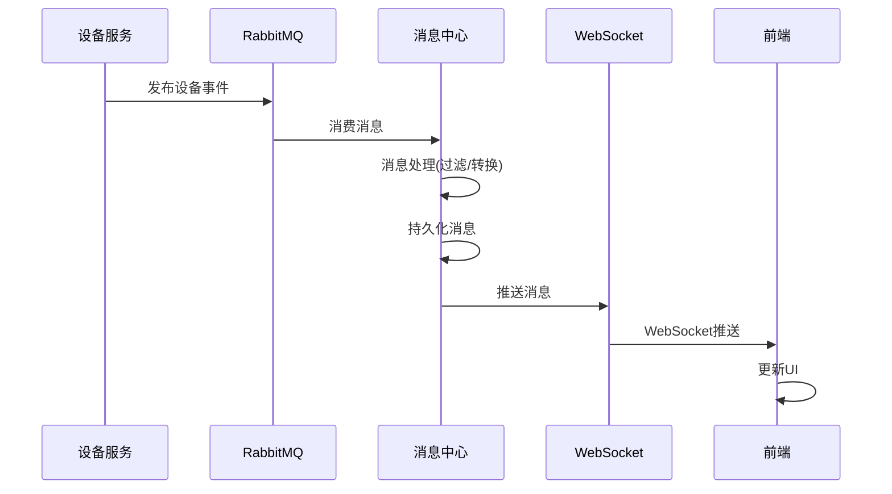
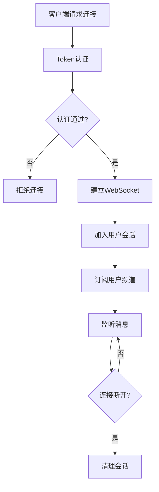

# 消息中心模块 - 完整设计文档

## 📋 模块概述

### 模块定位
消息中心是视频服务的事件订阅中枢，负责与设备通讯服务、其他业务服务之间的消息传递和事件分发。

### 核心价值
- **事件订阅**: 订阅设备状态、告警等事件
- **消息推送**: WebSocket实时推送消息到前端
- **消息存储**: 持久化重要消息便于查询

### 消息架构

```
┌─────────────────────────────────────────────────────────────┐
│                      消息中心架构                            │
├─────────────────────────────────────────────────────────────┤
│  ┌─────────────┐                    ┌─────────────┐         │
│  │ 设备服务    │──────RabbitMQ──────│ 消息中心    │         │
│  │ (生产者)    │                    │ (消费者)    │         │
│  └─────────────┘                    └──────┬──────┘         │
│                                           │                │
│                                    ┌──────┴──────┐         │
│                                    │ WebSocket   │         │
│                                    │ 推送服务    │         │
│                                    └──────┬──────┘         │
│                                           │                │
│  ┌─────────────┐  ┌─────────────┐  ┌─────────────┐         │
│  │ Web前端    │  │ APP         │  │ 第三方系统  │         │
│  └─────────────┘  └─────────────┘  └─────────────┘         │
└─────────────────────────────────────────────────────────────┘
```

---

## 👥 用户故事

### US-MSG-001: 消息实时推送
**作为** 前端应用  
**我希望** 通过WebSocket接收实时消息  
**以便** 及时更新界面状态

**验收标准**:
1. WebSocket连接稳定
2. 消息延迟≤1秒
3. 支持断线自动重连

### US-MSG-002: 消息历史查询
**作为** 用户  
**我希望** 查询历史消息记录  
**以便** 回顾已处理和未读消息

**验收标准**:
1. 支持按类型/时间筛选
2. 分页查询性能良好
3. 支持标记已读/未读

---

## 📊 业务流程图

### 消息订阅发布流程



### WebSocket连接管理



---

## 🗄️ 数据结构设计

### 核心表结构

```sql
-- 消息记录表
CREATE TABLE t_message (
    id              BIGINT PRIMARY KEY AUTO_INCREMENT COMMENT '消息ID',
    message_code    VARCHAR(64) NOT NULL COMMENT '消息编码',
    message_type    TINYINT NOT NULL COMMENT '消息类型:1-系统,2-告警,3-设备,4-业务',
    title           VARCHAR(256) NOT NULL COMMENT '消息标题',
    content         TEXT COMMENT '消息内容',
    sender_id       BIGINT COMMENT '发送者ID',
    sender_type     VARCHAR(32) COMMENT '发送者类型:system/user/service',
    target_type     TINYINT NOT NULL COMMENT '目标类型:1-全员,2-角色,3-用户',
    target_ids      JSON COMMENT '目标ID列表',
    priority        TINYINT NOT NULL DEFAULT 2 COMMENT '优先级:1-高,2-中,3-低',
    expire_time     DATETIME COMMENT '过期时间',
    extra_data      JSON COMMENT '附加数据',
    create_time     DATETIME NOT NULL DEFAULT CURRENT_TIMESTAMP,
    UNIQUE KEY uk_message_code (message_code),
    INDEX idx_message_type (message_type),
    INDEX idx_create_time (create_time)
) ENGINE=InnoDB DEFAULT CHARSET=utf8mb4 COMMENT='消息记录表';

-- 用户消息状态表
CREATE TABLE t_user_message (
    id              BIGINT PRIMARY KEY AUTO_INCREMENT COMMENT 'ID',
    user_id         BIGINT NOT NULL COMMENT '用户ID',
    message_id      BIGINT NOT NULL COMMENT '消息ID',
    is_read         TINYINT NOT NULL DEFAULT 0 COMMENT '是否已读:0-未读,1-已读',
    read_time       DATETIME COMMENT '阅读时间',
    is_deleted      TINYINT NOT NULL DEFAULT 0 COMMENT '是否删除',
    create_time     DATETIME NOT NULL DEFAULT CURRENT_TIMESTAMP,
    UNIQUE KEY uk_user_message (user_id, message_id),
    INDEX idx_user_id (user_id),
    INDEX idx_is_read (is_read)
) ENGINE=InnoDB DEFAULT CHARSET=utf8mb4 COMMENT='用户消息状态表';

-- WebSocket会话表
CREATE TABLE t_ws_session (
    id              BIGINT PRIMARY KEY AUTO_INCREMENT COMMENT '会话ID',
    session_id      VARCHAR(64) NOT NULL COMMENT 'WebSocket会话ID',
    user_id         BIGINT NOT NULL COMMENT '用户ID',
    client_type     VARCHAR(32) COMMENT '客户端类型:web/app',
    client_ip       VARCHAR(64) COMMENT '客户端IP',
    connect_time    DATETIME NOT NULL COMMENT '连接时间',
    last_heartbeat  DATETIME COMMENT '最后心跳',
    status          TINYINT NOT NULL DEFAULT 1 COMMENT '状态:1-在线,2-离线',
    UNIQUE KEY uk_session_id (session_id),
    INDEX idx_user_id (user_id)
) ENGINE=InnoDB DEFAULT CHARSET=utf8mb4 COMMENT='WebSocket会话表';
```

---

## 🔌 接口设计

| 方法 | 路径 | 说明 | 权限 |
|------|------|------|------|
| GET | /api/v1/messages | 消息列表 | Level 2+ |
| GET | /api/v1/messages/unread-count | 未读数量 | Level 2+ |
| PUT | /api/v1/messages/{id}/read | 标记已读 | Level 2+ |
| PUT | /api/v1/messages/read-all | 全部已读 | Level 2+ |
| WS | /ws/message | WebSocket连接 | Level 2+ |

### WebSocket消息格式

```json
{
  "type": "DEVICE_STATUS",
  "action": "UPDATE",
  "data": {
    "deviceId": 1001,
    "status": 2,
    "updateTime": "2024-01-15T10:30:00Z"
  },
  "timestamp": 1705312200000
}
```

---

## 📈 性能指标

| 指标 | 要求 |
|------|------|
| WebSocket连接数 | ≥ 5000 |
| 消息推送延迟 | ≤ 1秒 |
| 消息吞吐量 | ≥ 10000/秒 |

---

## ✅ 验收标准

- [ ] WebSocket连接稳定可靠
- [ ] 消息推送延迟≤1秒
- [ ] 断线自动重连正常
- [ ] 消息历史查询性能良好
