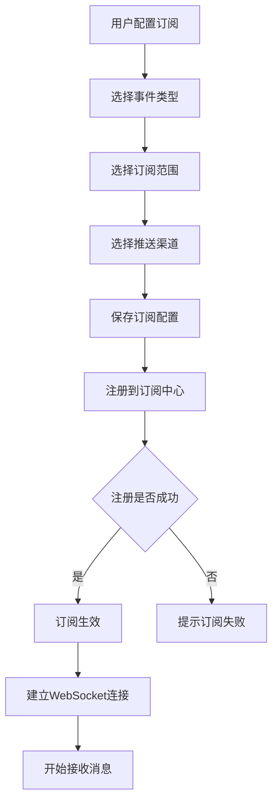
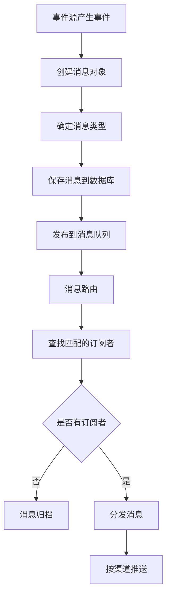
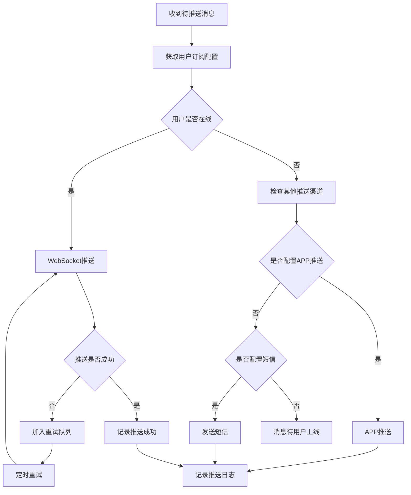
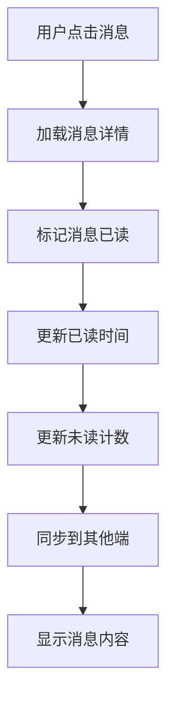
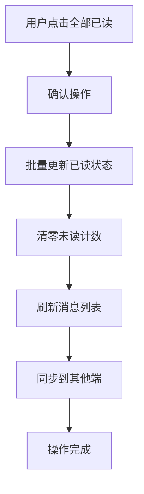
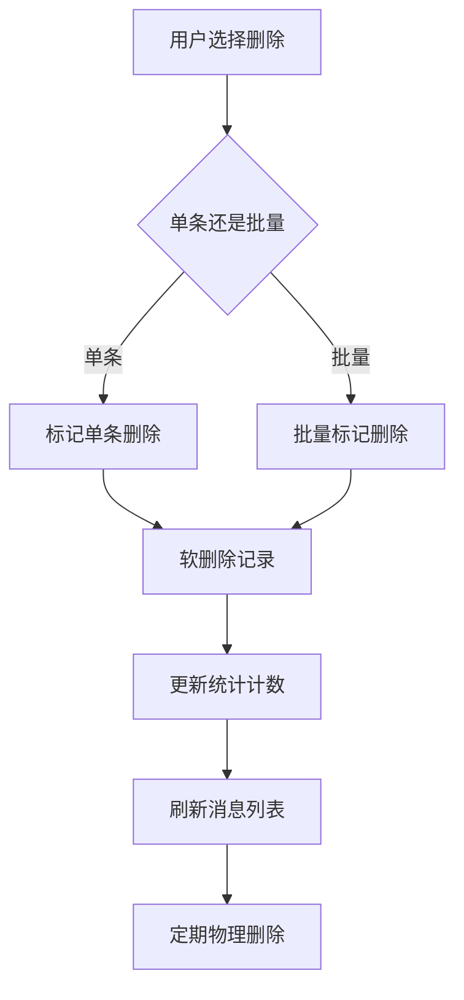
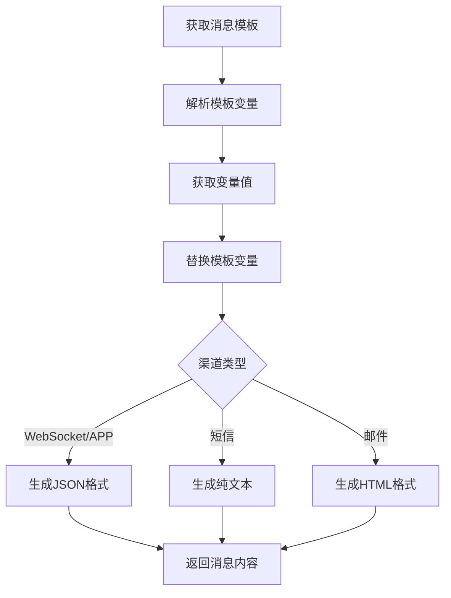

# 消息中心模块 - 业务流程图

## 消息订阅流程

```mermaid
flowchart TD
    A[用户配置订阅] --> B[选择事件类型]
    B --> C[选择订阅范围]
    C --> D[选择推送渠道]
    D --> E[保存订阅配置]
    E --> F[注册到订阅中心]
    F --> G{注册是否成功}
    G -->|是| H[订阅生效]
    G -->|否| I[提示订阅失败]
    H --> J[建立WebSocket连接]
    J --> K[开始接收消息]
```

## 消息发布流程

```mermaid
flowchart TD
    A[事件源产生事件] --> B[创建消息对象]
    B --> C[确定消息类型]
    C --> D[保存消息到数据库]
    D --> E[发布到消息队列]
    E --> F[消息路由]
    F --> G[查找匹配的订阅者]
    G --> H{是否有订阅者}
    H -->|否| I[消息归档]
    H -->|是| J[分发消息]
    J --> K[按渠道推送]
```

## 实时推送流程

```mermaid
flowchart TD
    A[收到待推送消息] --> B[获取用户订阅配置]
    B --> C{用户是否在线}
    C -->|是| D[WebSocket推送]
    C -->|否| E[检查其他推送渠道]
    D --> F{推送是否成功}
    F -->|是| G[记录推送成功]
    F -->|否| H[加入重试队列]
    E --> I{是否配置APP推送}
    I -->|是| J[APP推送]
    I -->|否| K{是否配置短信}
    K -->|是| L[发送短信]
    K -->|否| M[消息待用户上线]
    J --> N[记录推送日志]
    L --> N
    G --> N
    H --> O[定时重试]
    O --> D
```

## 消息阅读流程

```mermaid
flowchart TD
    A[用户点击消息] --> B[加载消息详情]
    B --> C[标记消息已读]
    C --> D[更新已读时间]
    D --> E[更新未读计数]
    E --> F[同步到其他端]
    F --> G[显示消息内容]
```

## 全部已读流程

```mermaid
flowchart TD
    A[用户点击全部已读] --> B[确认操作]
    B --> C[批量更新已读状态]
    C --> D[清零未读计数]
    D --> E[刷新消息列表]
    E --> F[同步到其他端]
    F --> G[操作完成]
```

## 消息删除流程

```mermaid
flowchart TD
    A[用户选择删除] --> B{单条还是批量}
    B -->|单条| C[标记单条删除]
    B -->|批量| D[批量标记删除]
    C --> E[软删除记录]
    D --> E
    E --> F[更新统计计数]
    F --> G[刷新消息列表]
    G --> H[定期物理删除]
```

## 消息模板渲染流程

```mermaid
flowchart TD
    A[获取消息模板] --> B[解析模板变量]
    B --> C[获取变量值]
    C --> D[替换模板变量]
    D --> E{渠道类型}
    E -->|WebSocket/APP| F[生成JSON格式]
    E -->|短信| G[生成纯文本]
    E -->|邮件| H[生成HTML格式]
    F --> I[返回消息内容]
    G --> I
    H --> I
```
