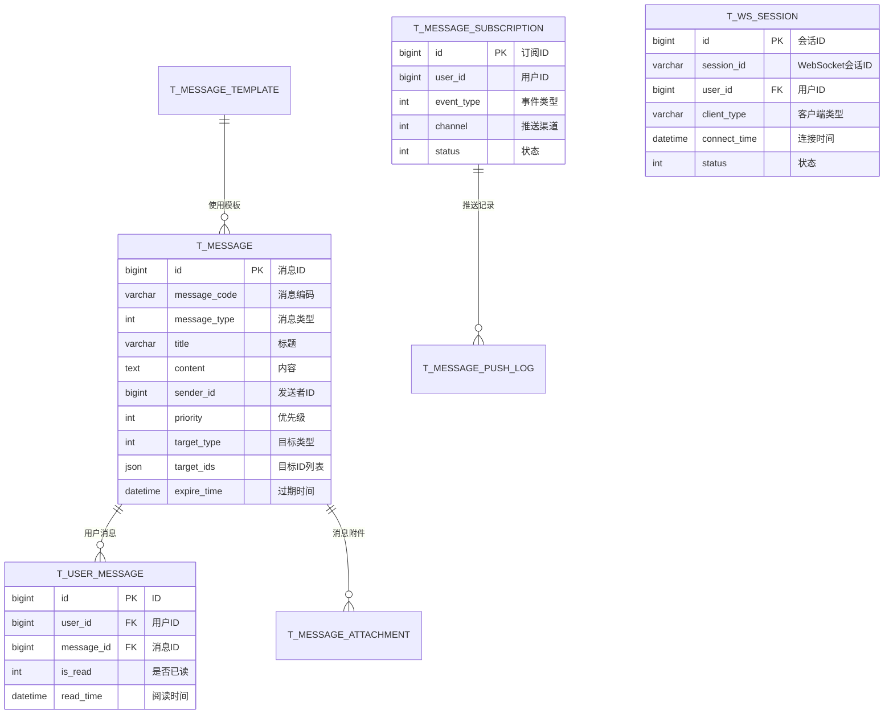

# 消息中心模块 - 数据结构设计

## ER图



## 核心表结构

### 1. 消息记录表

```sql
CREATE TABLE t_message (
    id              BIGINT PRIMARY KEY AUTO_INCREMENT COMMENT '消息ID',
    message_code    VARCHAR(64) NOT NULL COMMENT '消息编码',
    message_type    TINYINT NOT NULL COMMENT '消息类型:1-系统通知,2-告警消息,3-设备消息,4-业务消息,5-审批消息',
    title           VARCHAR(256) NOT NULL COMMENT '消息标题',
    content         TEXT COMMENT '消息内容',
    content_type    VARCHAR(32) DEFAULT 'text' COMMENT '内容类型:text/html/markdown',
    sender_id       BIGINT COMMENT '发送者ID',
    sender_type     VARCHAR(32) DEFAULT 'system' COMMENT '发送者类型:system/user/service',
    sender_name     VARCHAR(64) COMMENT '发送者名称',
    target_type     TINYINT NOT NULL DEFAULT 1 COMMENT '目标类型:1-全员,2-角色,3-部门,4-指定用户',
    target_ids      JSON COMMENT '目标ID列表',
    priority        TINYINT NOT NULL DEFAULT 2 COMMENT '优先级:1-紧急,2-普通,3-低',
    category        VARCHAR(64) COMMENT '消息分类',
    biz_type        VARCHAR(64) COMMENT '业务类型',
    biz_id          BIGINT COMMENT '业务ID',
    extra_data      JSON COMMENT '附加数据(JSON)',
    action_url      VARCHAR(512) COMMENT '跳转链接',
    expire_time     DATETIME COMMENT '过期时间',
    is_persistent   TINYINT NOT NULL DEFAULT 1 COMMENT '是否持久化:0-否,1-是',
    deleted_flag    TINYINT NOT NULL DEFAULT 0 COMMENT '删除标记',
    create_time     DATETIME NOT NULL DEFAULT CURRENT_TIMESTAMP COMMENT '创建时间',
    UNIQUE KEY uk_message_code (message_code),
    INDEX idx_message_type (message_type),
    INDEX idx_sender_id (sender_id),
    INDEX idx_create_time (create_time),
    INDEX idx_biz (biz_type, biz_id)
) ENGINE=InnoDB DEFAULT CHARSET=utf8mb4 COMMENT='消息记录表';
```

### 2. 用户消息状态表

```sql
CREATE TABLE t_user_message (
    id              BIGINT PRIMARY KEY AUTO_INCREMENT COMMENT 'ID',
    user_id         BIGINT NOT NULL COMMENT '用户ID',
    message_id      BIGINT NOT NULL COMMENT '消息ID',
    is_read         TINYINT NOT NULL DEFAULT 0 COMMENT '是否已读:0-未读,1-已读',
    read_time       DATETIME COMMENT '阅读时间',
    is_starred      TINYINT NOT NULL DEFAULT 0 COMMENT '是否星标:0-否,1-是',
    is_deleted      TINYINT NOT NULL DEFAULT 0 COMMENT '是否删除:0-否,1-是',
    delete_time     DATETIME COMMENT '删除时间',
    create_time     DATETIME NOT NULL DEFAULT CURRENT_TIMESTAMP COMMENT '创建时间',
    UNIQUE KEY uk_user_message (user_id, message_id),
    INDEX idx_user_id (user_id),
    INDEX idx_is_read (user_id, is_read),
    INDEX idx_create_time (create_time)
) ENGINE=InnoDB DEFAULT CHARSET=utf8mb4 COMMENT='用户消息状态表';
```

### 3. 消息订阅配置表

```sql
CREATE TABLE t_message_subscription (
    id              BIGINT PRIMARY KEY AUTO_INCREMENT COMMENT '订阅ID',
    user_id         BIGINT NOT NULL COMMENT '用户ID',
    event_type      VARCHAR(64) NOT NULL COMMENT '事件类型:ALARM/DEVICE/SYSTEM/BUSINESS',
    event_subtype   VARCHAR(64) COMMENT '事件子类型',
    channel         TINYINT NOT NULL DEFAULT 1 COMMENT '推送渠道:1-站内信,2-APP推送,4-短信,8-邮件(支持位运算组合)',
    is_enabled      TINYINT NOT NULL DEFAULT 1 COMMENT '是否启用:0-禁用,1-启用',
    config          JSON COMMENT '订阅配置(时间段/免打扰等)',
    create_time     DATETIME NOT NULL DEFAULT CURRENT_TIMESTAMP COMMENT '创建时间',
    update_time     DATETIME NOT NULL DEFAULT CURRENT_TIMESTAMP ON UPDATE CURRENT_TIMESTAMP COMMENT '更新时间',
    UNIQUE KEY uk_user_event (user_id, event_type, event_subtype),
    INDEX idx_user_id (user_id),
    INDEX idx_event_type (event_type)
) ENGINE=InnoDB DEFAULT CHARSET=utf8mb4 COMMENT='消息订阅配置表';
```

### 4. 消息推送日志表

```sql
CREATE TABLE t_message_push_log (
    id              BIGINT PRIMARY KEY AUTO_INCREMENT COMMENT '日志ID',
    message_id      BIGINT NOT NULL COMMENT '消息ID',
    user_id         BIGINT NOT NULL COMMENT '用户ID',
    channel         TINYINT NOT NULL COMMENT '推送渠道:1-WebSocket,2-APP推送,3-短信,4-邮件',
    receiver        VARCHAR(128) COMMENT '接收地址(手机号/邮箱)',
    push_content    TEXT COMMENT '推送内容',
    status          TINYINT NOT NULL DEFAULT 1 COMMENT '状态:1-待发送,2-发送中,3-成功,4-失败',
    retry_count     TINYINT NOT NULL DEFAULT 0 COMMENT '重试次数',
    error_code      VARCHAR(32) COMMENT '错误码',
    error_msg       VARCHAR(512) COMMENT '错误信息',
    push_time       DATETIME COMMENT '推送时间',
    arrive_time     DATETIME COMMENT '到达时间',
    create_time     DATETIME NOT NULL DEFAULT CURRENT_TIMESTAMP COMMENT '创建时间',
    INDEX idx_message_id (message_id),
    INDEX idx_user_id (user_id),
    INDEX idx_status (status),
    INDEX idx_push_time (push_time)
) ENGINE=InnoDB DEFAULT CHARSET=utf8mb4 COMMENT='消息推送日志表';
```

### 5. WebSocket会话表

```sql
CREATE TABLE t_ws_session (
    id              BIGINT PRIMARY KEY AUTO_INCREMENT COMMENT '会话ID',
    session_id      VARCHAR(64) NOT NULL COMMENT 'WebSocket会话ID',
    user_id         BIGINT NOT NULL COMMENT '用户ID',
    client_type     VARCHAR(32) NOT NULL COMMENT '客户端类型:web/app/miniapp',
    client_version  VARCHAR(32) COMMENT '客户端版本',
    client_ip       VARCHAR(64) COMMENT '客户端IP',
    user_agent      VARCHAR(512) COMMENT 'User-Agent',
    connect_time    DATETIME NOT NULL COMMENT '连接时间',
    last_heartbeat  DATETIME COMMENT '最后心跳时间',
    status          TINYINT NOT NULL DEFAULT 1 COMMENT '状态:1-在线,2-离线',
    disconnect_time DATETIME COMMENT '断开时间',
    disconnect_reason VARCHAR(256) COMMENT '断开原因',
    UNIQUE KEY uk_session_id (session_id),
    INDEX idx_user_id (user_id),
    INDEX idx_status (status),
    INDEX idx_connect_time (connect_time)
) ENGINE=InnoDB DEFAULT CHARSET=utf8mb4 COMMENT='WebSocket会话表';
```

### 6. 消息模板表

```sql
CREATE TABLE t_message_template (
    id              BIGINT PRIMARY KEY AUTO_INCREMENT COMMENT '模板ID',
    template_code   VARCHAR(64) NOT NULL COMMENT '模板编码',
    template_name   VARCHAR(100) NOT NULL COMMENT '模板名称',
    message_type    TINYINT NOT NULL COMMENT '消息类型',
    title_template  VARCHAR(256) NOT NULL COMMENT '标题模板',
    content_template TEXT NOT NULL COMMENT '内容模板',
    variables       JSON COMMENT '变量定义',
    channel         TINYINT NOT NULL DEFAULT 1 COMMENT '适用渠道',
    status          TINYINT NOT NULL DEFAULT 1 COMMENT '状态:1-启用,2-禁用',
    description     VARCHAR(512) COMMENT '描述',
    deleted_flag    TINYINT NOT NULL DEFAULT 0 COMMENT '删除标记',
    create_time     DATETIME NOT NULL DEFAULT CURRENT_TIMESTAMP COMMENT '创建时间',
    update_time     DATETIME NOT NULL DEFAULT CURRENT_TIMESTAMP ON UPDATE CURRENT_TIMESTAMP COMMENT '更新时间',
    UNIQUE KEY uk_template_code (template_code)
) ENGINE=InnoDB DEFAULT CHARSET=utf8mb4 COMMENT='消息模板表';
```

## 字段枚举说明

### 消息类型 (message_type)
| 值 | 说明 | 示例 |
|---|------|------|
| 1 | 系统通知 | 系统维护通知、版本更新 |
| 2 | 告警消息 | 设备告警、AI告警 |
| 3 | 设备消息 | 设备上线、离线 |
| 4 | 业务消息 | 审批通知、任务提醒 |
| 5 | 审批消息 | 审批待办、审批结果 |

### 推送渠道 (channel)
| 值 | 说明 | 特点 |
|---|------|------|
| 1 | 站内信 | 必达，可持久化 |
| 2 | APP推送 | 实时，需安装APP |
| 3 | 短信 | 即时，有成本 |
| 4 | 邮件 | 正式，有延迟 |
| 5 | WebSocket | 实时，需在线 |

### 优先级 (priority)
| 值 | 说明 | 处理策略 |
|---|------|----------|
| 1 | 紧急 | 立即推送，多渠道并发 |
| 2 | 普通 | 正常推送 |
| 3 | 低 | 可延迟推送/汇总推送 |

## 索引设计说明

1. **消息表索引**
   - `uk_message_code`: 保证消息编码唯一
   - `idx_message_type`: 按类型查询
   - `idx_create_time`: 按时间排序查询

2. **用户消息表索引**
   - `uk_user_message`: 防止重复推送
   - `idx_is_read`: 快速查询未读消息

3. **会话表索引**
   - `uk_session_id`: 会话ID唯一
   - `idx_user_id`: 查询用户在线状态
