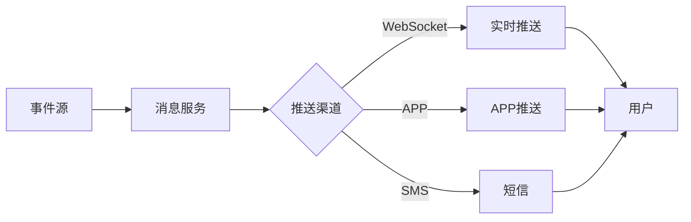

# 消息中心模块 - 详细设计

## 1. 类设计

### 1.1 Controller层

```java
@RestController
@RequestMapping("/ivs/v1/message")
public class MessageController {
    @Resource
    private MessageService messageService;
    
    @GetMapping("/list")
    public ResponseDTO<PageResult<MessageVO>> getMessages(@Valid MessageQueryForm form);
    
    @GetMapping("/unread/count")
    public ResponseDTO<Integer> getUnreadCount();
    
    @PostMapping("/{messageId}/read")
    public ResponseDTO<Void> markAsRead(@PathVariable Long messageId);
    
    @PostMapping("/read/batch")
    public ResponseDTO<Void> batchMarkAsRead(@RequestBody List<Long> messageIds);
    
    @GetMapping("/subscription")
    public ResponseDTO<SubscriptionVO> getSubscription();
    
    @PostMapping("/subscription")
    public ResponseDTO<Void> updateSubscription(@Valid @RequestBody SubscriptionForm form);
}
```

### 1.2 WebSocket处理器

```java
@Component
@ServerEndpoint("/ws/message/{userId}")
public class MessageWebSocketHandler {
    
    @OnOpen
    public void onOpen(Session session, @PathParam("userId") Long userId) {
        // 1. 验证用户Token
        // 2. 保存会话
        // 3. 推送离线消息
    }
    
    @OnMessage
    public void onMessage(String message, Session session) {
        // 处理心跳和确认消息
    }
    
    @OnClose
    public void onClose(Session session) {
        // 移除会话
    }
    
    public void pushMessage(Long userId, MessageVO message) {
        // 查找用户会话并推送
    }
}
```

### 1.3 消息推送服务

```java
@Service
public class MessagePushServiceImpl implements MessagePushService {
    @Resource
    private MessageWebSocketHandler wsHandler;
    @Resource
    private AppPushClient appPushClient;
    @Resource
    private SmsSender smsSender;
    
    @Override
    public void push(Long userId, MessageEntity message) {
        // 1. 查询用户订阅配置
        SubscriptionEntity sub = subscriptionDao.selectByUserId(userId);
        
        // 2. 根据配置推送到各渠道
        if (sub.isWebsocketEnabled()) {
            wsHandler.pushMessage(userId, convert(message));
        }
        if (sub.isAppPushEnabled()) {
            appPushClient.push(userId, message);
        }
        if (sub.isSmsEnabled() && message.getPriority() == 1) {
            smsSender.send(userId, message);
        }
    }
}
```

## 2. WebSocket消息格式

### 2.1 推送消息

```json
{
  "type": "MESSAGE",
  "data": {
    "messageId": 10001,
    "messageType": 2,
    "title": "设备离线告警",
    "content": "摄像机[大门口]已离线",
    "priority": 1,
    "createTime": "2024-01-15T10:30:25Z"
  }
}
```

### 2.2 心跳消息

```json
{
  "type": "PING",
  "timestamp": 1705300225000
}
```

### 2.3 确认消息

```json
{
  "type": "ACK",
  "messageId": 10001
}
```

## 3. 接口详细设计

### 3.1 获取消息列表

**请求**:
```http
GET /ivs/v1/message/list?pageNum=1&pageSize=20&messageType=2&isRead=0
```

**响应**:
```json
{
  "code": 200,
  "data": {
    "list": [
      {
        "messageId": 10001,
        "messageType": 2,
        "title": "设备离线告警",
        "content": "摄像机[大门口]已离线",
        "isRead": false,
        "createTime": "2024-01-15T10:30:25Z"
      }
    ],
    "total": 50,
    "pageNum": 1,
    "pageSize": 20
  }
}
```

## 4. 消息流转设计


