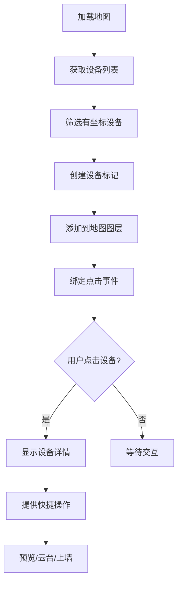
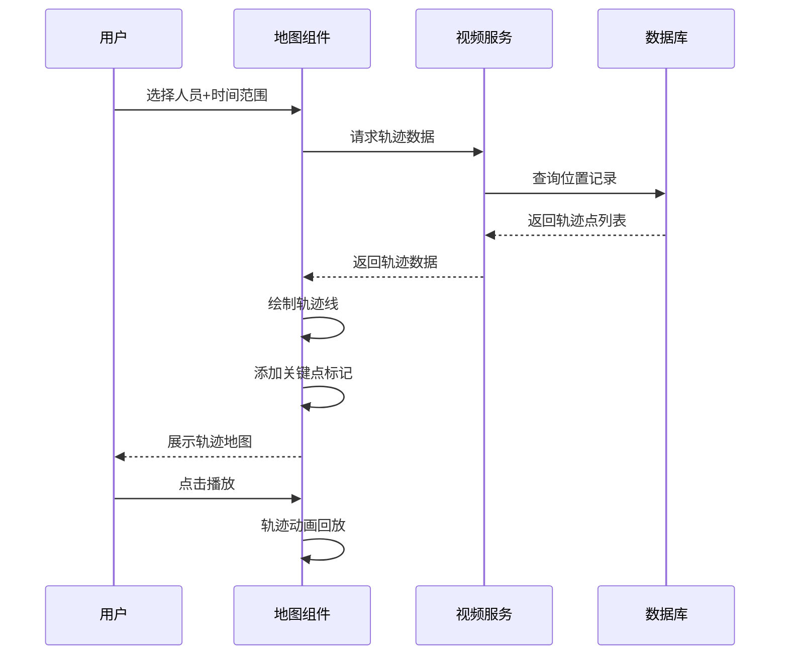

# 地图展示模块 - 完整设计文档

## 📋 模块概述

### 模块定位
地图展示模块提供GIS地图上的设备分布可视化，支持设备定位、轨迹展示、区域划分等功能。

### 核心价值
- **可视化管理**: 地图上直观展示设备分布
- **快速定位**: 通过地图快速定位目标设备
- **轨迹追踪**: 人员/车辆轨迹地图展示

### 技术架构

```
┌─────────────────────────────────────────────────────────────┐
│                      GIS地图展示                             │
├─────────────────────────────────────────────────────────────┤
│  ┌─────────────┐  ┌─────────────┐  ┌─────────────┐         │
│  │ 高德地图API │  │ 百度地图API │  │ 天地图API   │         │
│  └──────┬──────┘  └──────┬──────┘  └──────┬──────┘         │
│         └────────────────┴────────────────┘                │
│                         │                                   │
│              ┌──────────┴──────────┐                       │
│              │   地图服务适配层     │                       │
│              └──────────┬──────────┘                       │
│                         │                                   │
│  ┌─────────────┐  ┌─────────────┐  ┌─────────────┐         │
│  │ 设备图层    │  │ 区域图层    │  │ 轨迹图层    │         │
│  └─────────────┘  └─────────────┘  └─────────────┘         │
└─────────────────────────────────────────────────────────────┘
```

---

## 👥 用户故事

### US-MAP-001: 设备地图展示
**作为** 安保人员  
**我希望** 在地图上查看所有设备位置  
**以便** 直观了解监控覆盖范围

**验收标准**:
1. 设备按类型显示不同图标
2. 在线/离线状态颜色区分
3. 点击设备显示详情弹窗

### US-MAP-002: 区域划分管理
**作为** 系统管理员  
**我希望** 在地图上划分监控区域  
**以便** 按区域管理设备和权限

**验收标准**:
1. 支持绘制多边形区域
2. 区域支持层级嵌套
3. 区域设备自动关联

### US-MAP-003: 人员轨迹展示
**作为** 安保主管  
**我希望** 在地图上查看人员活动轨迹  
**以便** 还原人员行动路线

**验收标准**:
1. 轨迹按时间顺序展示
2. 支持轨迹回放动画
3. 关键节点标注事件信息

---

## 📊 业务流程图

### 设备定位流程



### 轨迹绘制流程



---

## 🗄️ 数据结构设计

### 核心表结构

```sql
-- 设备位置表
CREATE TABLE t_device_location (
    id              BIGINT PRIMARY KEY AUTO_INCREMENT COMMENT 'ID',
    device_id       BIGINT NOT NULL COMMENT '设备ID',
    device_type     TINYINT NOT NULL COMMENT '设备类型',
    longitude       DECIMAL(10,7) NOT NULL COMMENT '经度',
    latitude        DECIMAL(10,7) NOT NULL COMMENT '纬度',
    altitude        DECIMAL(8,2) COMMENT '海拔',
    floor           VARCHAR(32) COMMENT '楼层',
    address         VARCHAR(256) COMMENT '地址描述',
    region_id       BIGINT COMMENT '所属区域ID',
    update_time     DATETIME NOT NULL DEFAULT CURRENT_TIMESTAMP ON UPDATE CURRENT_TIMESTAMP,
    UNIQUE KEY uk_device_id (device_id),
    INDEX idx_region_id (region_id),
    INDEX idx_location (longitude, latitude)
) ENGINE=InnoDB DEFAULT CHARSET=utf8mb4 COMMENT='设备位置表';

-- 地图区域表
CREATE TABLE t_map_region (
    id              BIGINT PRIMARY KEY AUTO_INCREMENT COMMENT '区域ID',
    region_name     VARCHAR(100) NOT NULL COMMENT '区域名称',
    region_code     VARCHAR(64) NOT NULL COMMENT '区域编码',
    parent_id       BIGINT DEFAULT 0 COMMENT '父区域ID',
    level           TINYINT NOT NULL DEFAULT 1 COMMENT '层级',
    region_type     TINYINT NOT NULL DEFAULT 1 COMMENT '类型:1-行政区,2-功能区,3-监控区',
    boundary        JSON COMMENT '边界坐标[[lng,lat],...]',
    center_lng      DECIMAL(10,7) COMMENT '中心经度',
    center_lat      DECIMAL(10,7) COMMENT '中心纬度',
    zoom_level      TINYINT DEFAULT 15 COMMENT '缩放级别',
    fill_color      VARCHAR(32) DEFAULT '#1890ff' COMMENT '填充颜色',
    fill_opacity    DECIMAL(3,2) DEFAULT 0.2 COMMENT '填充透明度',
    stroke_color    VARCHAR(32) DEFAULT '#1890ff' COMMENT '边框颜色',
    status          TINYINT NOT NULL DEFAULT 1 COMMENT '状态',
    deleted_flag    TINYINT NOT NULL DEFAULT 0,
    create_time     DATETIME NOT NULL DEFAULT CURRENT_TIMESTAMP,
    UNIQUE KEY uk_region_code (region_code),
    INDEX idx_parent_id (parent_id)
) ENGINE=InnoDB DEFAULT CHARSET=utf8mb4 COMMENT='地图区域表';

-- 位置轨迹表
CREATE TABLE t_location_track (
    id              BIGINT PRIMARY KEY AUTO_INCREMENT COMMENT '轨迹ID',
    target_id       BIGINT NOT NULL COMMENT '目标ID(人员ID/车辆ID)',
    target_type     TINYINT NOT NULL COMMENT '目标类型:1-人员,2-车辆',
    device_id       BIGINT COMMENT '采集设备ID',
    longitude       DECIMAL(10,7) NOT NULL COMMENT '经度',
    latitude        DECIMAL(10,7) NOT NULL COMMENT '纬度',
    capture_time    DATETIME NOT NULL COMMENT '采集时间',
    event_type      TINYINT COMMENT '事件类型',
    snapshot_path   VARCHAR(512) COMMENT '截图路径',
    create_time     DATETIME NOT NULL DEFAULT CURRENT_TIMESTAMP,
    INDEX idx_target (target_type, target_id),
    INDEX idx_capture_time (capture_time)
) ENGINE=InnoDB DEFAULT CHARSET=utf8mb4 COMMENT='位置轨迹表';
```

---

## 🔌 接口设计

| 方法 | 路径 | 说明 | 权限 |
|------|------|------|------|
| GET | /api/v1/map/devices | 设备位置列表 | Level 2+ |
| PUT | /api/v1/map/devices/{id}/location | 更新设备位置 | Level 4+ |
| GET | /api/v1/map/regions | 区域列表 | Level 2+ |
| POST | /api/v1/map/regions | 创建区域 | Level 4+ |
| GET | /api/v1/map/tracks | 轨迹查询 | Level 3+ |

### 请求/响应示例

```java
// 设备位置查询
public class DeviceLocationVO {
    private Long deviceId;
    private String deviceName;
    private Integer deviceType;
    private BigDecimal longitude;
    private BigDecimal latitude;
    private Integer status;
    private String regionName;
}

// 轨迹查询请求
public class TrackQueryForm {
    @NotNull
    private Long targetId;
    @NotNull
    private Integer targetType;
    @NotNull
    private LocalDateTime startTime;
    @NotNull
    private LocalDateTime endTime;
}
```

---

## 📈 性能指标

| 指标 | 要求 |
|------|------|
| 地图加载时间 | ≤ 3秒 |
| 设备标记渲染 | ≤ 1秒(1000点) |
| 轨迹查询响应 | ≤ 2秒 |

---

## ✅ 验收标准

- [ ] 地图正常加载显示
- [ ] 设备位置标记准确
- [ ] 区域绘制和管理正常
- [ ] 轨迹查询和回放流畅
- [ ] 多地图服务适配正常
