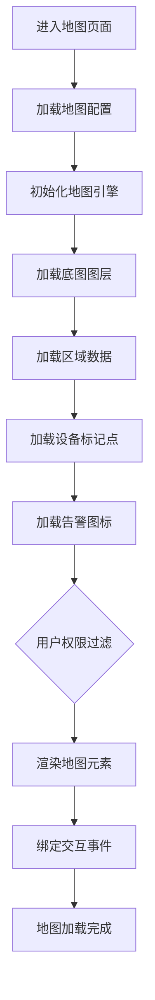
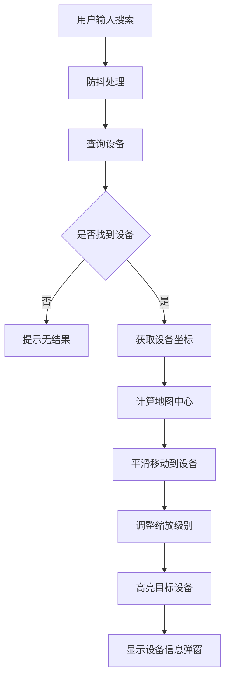
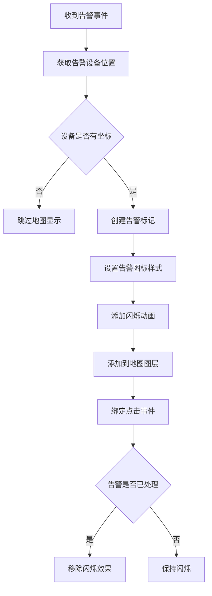
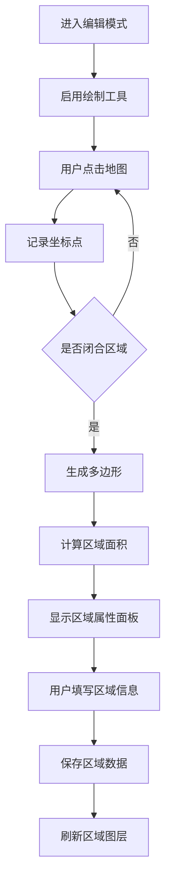
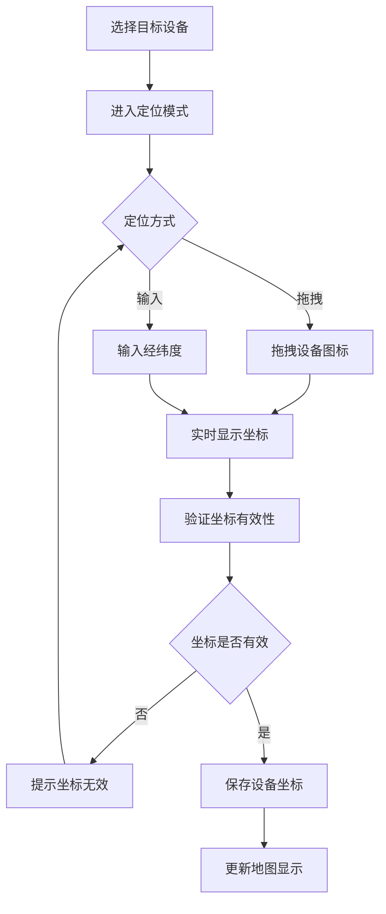
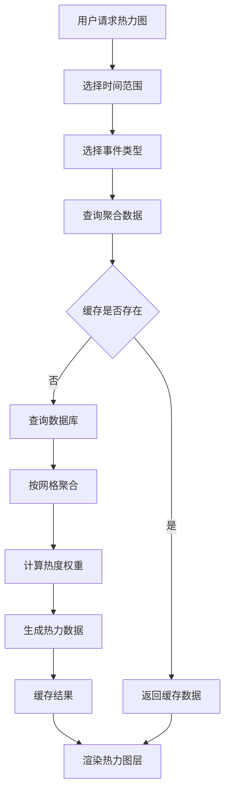
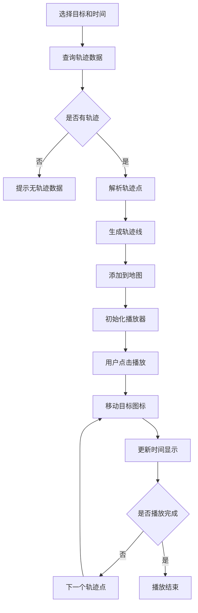
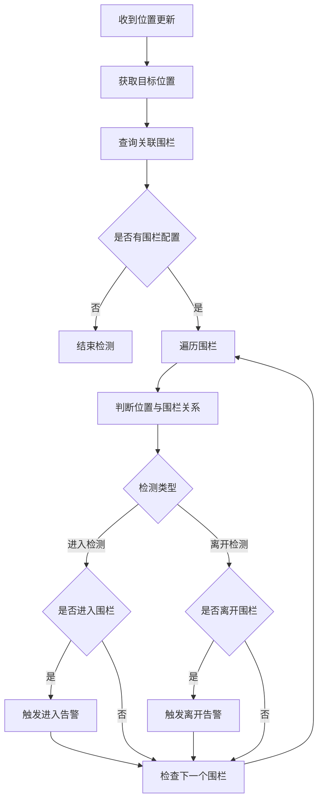

# 地图展示模块 - 业务流程图

## 地图加载流程

```mermaid
flowchart TD
    A[进入地图页面] --> B[加载地图配置]
    B --> C[初始化地图引擎]
    C --> D[加载底图图层]
    D --> E[加载区域数据]
    E --> F[加载设备标记点]
    F --> G[加载告警图标]
    G --> H{用户权限过滤}
    H --> I[渲染地图元素]
    I --> J[绑定交互事件]
    J --> K[地图加载完成]
```

## 设备定位流程

```mermaid
flowchart TD
    A[用户输入搜索] --> B[防抖处理]
    B --> C[查询设备]
    C --> D{是否找到设备}
    D -->|否| E[提示无结果]
    D -->|是| F[获取设备坐标]
    F --> G[计算地图中心]
    G --> H[平滑移动到设备]
    H --> I[调整缩放级别]
    I --> J[高亮目标设备]
    J --> K[显示设备信息弹窗]
```

## 告警地图显示流程

```mermaid
flowchart TD
    A[收到告警事件] --> B[获取告警设备位置]
    B --> C{设备是否有坐标}
    C -->|否| D[跳过地图显示]
    C -->|是| E[创建告警标记]
    E --> F[设置告警图标样式]
    F --> G[添加闪烁动画]
    G --> H[添加到地图图层]
    H --> I[绑定点击事件]
    I --> J{告警是否已处理}
    J -->|是| K[移除闪烁效果]
    J -->|否| L[保持闪烁]
```

## 区域绘制流程

```mermaid
flowchart TD
    A[进入编辑模式] --> B[启用绘制工具]
    B --> C[用户点击地图]
    C --> D[记录坐标点]
    D --> E{是否闭合区域}
    E -->|否| C
    E -->|是| F[生成多边形]
    F --> G[计算区域面积]
    G --> H[显示区域属性面板]
    H --> I[用户填写区域信息]
    I --> J[保存区域数据]
    J --> K[刷新区域图层]
```

## 设备坐标配置流程

```mermaid
flowchart TD
    A[选择目标设备] --> B[进入定位模式]
    B --> C{定位方式}
    C -->|拖拽| D[拖拽设备图标]
    C -->|输入| E[输入经纬度]
    D --> F[实时显示坐标]
    E --> F
    F --> G[验证坐标有效性]
    G --> H{坐标是否有效}
    H -->|否| I[提示坐标无效]
    H -->|是| J[保存设备坐标]
    J --> K[更新地图显示]
    I --> C
```

## 热力图生成流程

```mermaid
flowchart TD
    A[用户请求热力图] --> B[选择时间范围]
    B --> C[选择事件类型]
    C --> D[查询聚合数据]
    D --> E{缓存是否存在}
    E -->|是| F[返回缓存数据]
    E -->|否| G[查询数据库]
    G --> H[按网格聚合]
    H --> I[计算热度权重]
    I --> J[生成热力数据]
    J --> K[缓存结果]
    K --> L[渲染热力图层]
    F --> L
```

## 轨迹回放流程

```mermaid
flowchart TD
    A[选择目标和时间] --> B[查询轨迹数据]
    B --> C{是否有轨迹}
    C -->|否| D[提示无轨迹数据]
    C -->|是| E[解析轨迹点]
    E --> F[生成轨迹线]
    F --> G[添加到地图]
    G --> H[初始化播放器]
    H --> I[用户点击播放]
    I --> J[移动目标图标]
    J --> K[更新时间显示]
    K --> L{是否播放完成}
    L -->|否| M[下一个轨迹点]
    M --> J
    L -->|是| N[播放结束]
```

## 电子围栏检测流程

```mermaid
flowchart TD
    A[收到位置更新] --> B[获取目标位置]
    B --> C[查询关联围栏]
    C --> D{是否有围栏配置}
    D -->|否| E[结束检测]
    D -->|是| F[遍历围栏]
    F --> G[判断位置与围栏关系]
    G --> H{检测类型}
    H -->|进入检测| I{是否进入围栏}
    H -->|离开检测| J{是否离开围栏}
    I -->|是| K[触发进入告警]
    I -->|否| L[检查下一个围栏]
    J -->|是| M[触发离开告警]
    J -->|否| L
    K --> L
    M --> L
    L --> F
```
