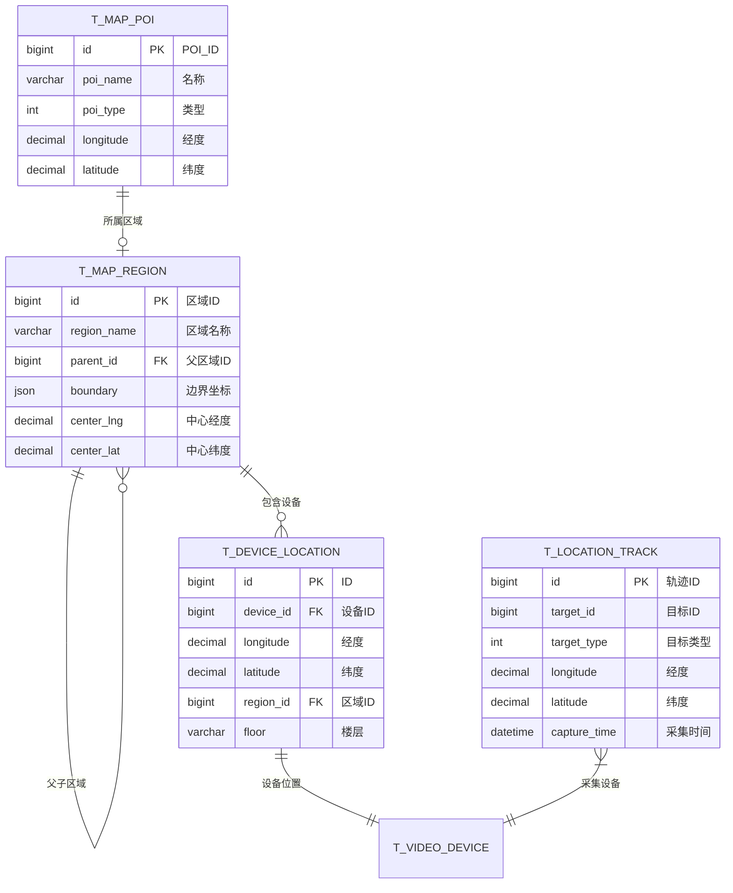

# 地图展示模块 - 数据结构设计

## ER图



## 核心表结构

### 1. 设备位置表

```sql
CREATE TABLE t_device_location (
    id              BIGINT PRIMARY KEY AUTO_INCREMENT COMMENT 'ID',
    device_id       BIGINT NOT NULL COMMENT '设备ID',
    device_type     TINYINT NOT NULL COMMENT '设备类型:1-摄像机,2-门禁,3-考勤机,4-消费机',
    longitude       DECIMAL(10,7) NOT NULL COMMENT '经度(WGS84)',
    latitude        DECIMAL(10,7) NOT NULL COMMENT '纬度(WGS84)',
    altitude        DECIMAL(8,2) COMMENT '海拔(米)',
    floor           VARCHAR(32) COMMENT '楼层(如:B1,1F,2F)',
    building        VARCHAR(100) COMMENT '建筑物名称',
    address         VARCHAR(256) COMMENT '地址描述',
    region_id       BIGINT COMMENT '所属区域ID',
    coordinate_type VARCHAR(32) DEFAULT 'WGS84' COMMENT '坐标系:WGS84/GCJ02/BD09',
    accuracy        DECIMAL(8,2) COMMENT '定位精度(米)',
    direction       DECIMAL(5,2) COMMENT '朝向角度(0-360)',
    indoor_map_id   BIGINT COMMENT '室内地图ID',
    indoor_x        DECIMAL(10,4) COMMENT '室内X坐标',
    indoor_y        DECIMAL(10,4) COMMENT '室内Y坐标',
    status          TINYINT NOT NULL DEFAULT 1 COMMENT '状态:1-有效,2-无效',
    update_time     DATETIME NOT NULL DEFAULT CURRENT_TIMESTAMP ON UPDATE CURRENT_TIMESTAMP COMMENT '更新时间',
    create_time     DATETIME NOT NULL DEFAULT CURRENT_TIMESTAMP COMMENT '创建时间',
    UNIQUE KEY uk_device_id (device_id),
    INDEX idx_region_id (region_id),
    INDEX idx_location (longitude, latitude),
    INDEX idx_device_type (device_type)
) ENGINE=InnoDB DEFAULT CHARSET=utf8mb4 COMMENT='设备位置表';
```

### 2. 地图区域表

```sql
CREATE TABLE t_map_region (
    id              BIGINT PRIMARY KEY AUTO_INCREMENT COMMENT '区域ID',
    region_name     VARCHAR(100) NOT NULL COMMENT '区域名称',
    region_code     VARCHAR(64) NOT NULL COMMENT '区域编码',
    parent_id       BIGINT NOT NULL DEFAULT 0 COMMENT '父区域ID(0为根)',
    level           TINYINT NOT NULL DEFAULT 1 COMMENT '层级(1-5)',
    region_type     TINYINT NOT NULL DEFAULT 1 COMMENT '类型:1-行政区,2-功能区,3-监控区,4-告警区',
    boundary        JSON COMMENT '边界坐标点[[lng1,lat1],[lng2,lat2],...]',
    center_lng      DECIMAL(10,7) COMMENT '中心点经度',
    center_lat      DECIMAL(10,7) COMMENT '中心点纬度',
    zoom_level      TINYINT DEFAULT 15 COMMENT '默认缩放级别(1-20)',
    min_zoom        TINYINT DEFAULT 10 COMMENT '最小缩放级别',
    max_zoom        TINYINT DEFAULT 18 COMMENT '最大缩放级别',
    fill_color      VARCHAR(32) DEFAULT '#1890ff' COMMENT '填充颜色(十六进制)',
    fill_opacity    DECIMAL(3,2) DEFAULT 0.20 COMMENT '填充透明度(0-1)',
    stroke_color    VARCHAR(32) DEFAULT '#1890ff' COMMENT '边框颜色',
    stroke_width    TINYINT DEFAULT 2 COMMENT '边框宽度(px)',
    stroke_opacity  DECIMAL(3,2) DEFAULT 1.00 COMMENT '边框透明度',
    icon_url        VARCHAR(512) COMMENT '区域图标URL',
    description     VARCHAR(512) COMMENT '区域描述',
    sort            INT NOT NULL DEFAULT 0 COMMENT '排序',
    status          TINYINT NOT NULL DEFAULT 1 COMMENT '状态:1-启用,2-禁用',
    deleted_flag    TINYINT NOT NULL DEFAULT 0 COMMENT '删除标记',
    create_time     DATETIME NOT NULL DEFAULT CURRENT_TIMESTAMP COMMENT '创建时间',
    update_time     DATETIME NOT NULL DEFAULT CURRENT_TIMESTAMP ON UPDATE CURRENT_TIMESTAMP COMMENT '更新时间',
    UNIQUE KEY uk_region_code (region_code),
    INDEX idx_parent_id (parent_id),
    INDEX idx_region_type (region_type),
    INDEX idx_level (level)
) ENGINE=InnoDB DEFAULT CHARSET=utf8mb4 COMMENT='地图区域表';
```

### 3. 位置轨迹表

```sql
CREATE TABLE t_location_track (
    id              BIGINT PRIMARY KEY AUTO_INCREMENT COMMENT '轨迹点ID',
    track_id        VARCHAR(64) NOT NULL COMMENT '轨迹ID(同一次追踪)',
    target_id       BIGINT NOT NULL COMMENT '目标ID(人员ID/车辆ID)',
    target_type     TINYINT NOT NULL COMMENT '目标类型:1-人员,2-车辆,3-物品',
    target_name     VARCHAR(64) COMMENT '目标名称',
    device_id       BIGINT COMMENT '采集设备ID',
    device_name     VARCHAR(100) COMMENT '设备名称',
    longitude       DECIMAL(10,7) NOT NULL COMMENT '经度',
    latitude        DECIMAL(10,7) NOT NULL COMMENT '纬度',
    altitude        DECIMAL(8,2) COMMENT '海拔',
    floor           VARCHAR(32) COMMENT '楼层',
    speed           DECIMAL(8,2) COMMENT '速度(km/h)',
    direction       DECIMAL(5,2) COMMENT '方向(0-360)',
    accuracy        DECIMAL(8,2) COMMENT '精度(米)',
    capture_time    DATETIME NOT NULL COMMENT '采集时间',
    event_type      TINYINT COMMENT '事件类型:1-进入,2-离开,3-经过,4-停留',
    event_desc      VARCHAR(256) COMMENT '事件描述',
    snapshot_path   VARCHAR(512) COMMENT '截图路径',
    confidence      DECIMAL(5,2) COMMENT '置信度(0-100)',
    metadata        JSON COMMENT '元数据(JSON)',
    create_time     DATETIME NOT NULL DEFAULT CURRENT_TIMESTAMP COMMENT '创建时间',
    INDEX idx_track_id (track_id),
    INDEX idx_target (target_type, target_id),
    INDEX idx_device_id (device_id),
    INDEX idx_capture_time (capture_time),
    INDEX idx_location (longitude, latitude)
) ENGINE=InnoDB DEFAULT CHARSET=utf8mb4 COMMENT='位置轨迹表'
PARTITION BY RANGE (TO_DAYS(capture_time)) (
    PARTITION p_default VALUES LESS THAN MAXVALUE
);
```

### 4. 地图POI表

```sql
CREATE TABLE t_map_poi (
    id              BIGINT PRIMARY KEY AUTO_INCREMENT COMMENT 'POI_ID',
    poi_name        VARCHAR(100) NOT NULL COMMENT 'POI名称',
    poi_code        VARCHAR(64) COMMENT 'POI编码',
    poi_type        TINYINT NOT NULL COMMENT 'POI类型:1-建筑,2-出入口,3-停车场,4-设施,5-标识点',
    longitude       DECIMAL(10,7) NOT NULL COMMENT '经度',
    latitude        DECIMAL(10,7) NOT NULL COMMENT '纬度',
    altitude        DECIMAL(8,2) COMMENT '海拔',
    floor           VARCHAR(32) COMMENT '楼层',
    region_id       BIGINT COMMENT '所属区域ID',
    address         VARCHAR(256) COMMENT '地址',
    icon_url        VARCHAR(512) COMMENT '图标URL',
    icon_size       VARCHAR(32) DEFAULT '32x32' COMMENT '图标尺寸',
    label_visible   TINYINT NOT NULL DEFAULT 1 COMMENT '标签是否可见',
    min_zoom        TINYINT DEFAULT 10 COMMENT '最小显示级别',
    max_zoom        TINYINT DEFAULT 20 COMMENT '最大显示级别',
    extra_data      JSON COMMENT '扩展数据',
    description     VARCHAR(512) COMMENT '描述',
    sort            INT NOT NULL DEFAULT 0 COMMENT '排序',
    status          TINYINT NOT NULL DEFAULT 1 COMMENT '状态',
    deleted_flag    TINYINT NOT NULL DEFAULT 0 COMMENT '删除标记',
    create_time     DATETIME NOT NULL DEFAULT CURRENT_TIMESTAMP COMMENT '创建时间',
    INDEX idx_poi_type (poi_type),
    INDEX idx_region_id (region_id),
    INDEX idx_location (longitude, latitude)
) ENGINE=InnoDB DEFAULT CHARSET=utf8mb4 COMMENT='地图POI表';
```

### 5. 热力图数据表

```sql
CREATE TABLE t_map_heatmap (
    id              BIGINT PRIMARY KEY AUTO_INCREMENT COMMENT 'ID',
    stat_date       DATE NOT NULL COMMENT '统计日期',
    stat_hour       TINYINT NOT NULL COMMENT '统计小时(0-23)',
    region_id       BIGINT COMMENT '区域ID',
    grid_lng        DECIMAL(10,5) NOT NULL COMMENT '网格经度(降精度)',
    grid_lat        DECIMAL(10,5) NOT NULL COMMENT '网格纬度(降精度)',
    heat_value      INT NOT NULL DEFAULT 0 COMMENT '热力值(人次/事件数)',
    heat_type       TINYINT NOT NULL DEFAULT 1 COMMENT '热力类型:1-人流,2-车流,3-告警',
    create_time     DATETIME NOT NULL DEFAULT CURRENT_TIMESTAMP COMMENT '创建时间',
    INDEX idx_stat (stat_date, stat_hour),
    INDEX idx_grid (grid_lng, grid_lat),
    INDEX idx_region (region_id, stat_date)
) ENGINE=InnoDB DEFAULT CHARSET=utf8mb4 COMMENT='热力图数据表';
```

### 6. 室内地图表

```sql
CREATE TABLE t_indoor_map (
    id              BIGINT PRIMARY KEY AUTO_INCREMENT COMMENT '室内地图ID',
    map_name        VARCHAR(100) NOT NULL COMMENT '地图名称',
    map_code        VARCHAR(64) NOT NULL COMMENT '地图编码',
    building_id     BIGINT COMMENT '建筑物ID',
    floor           VARCHAR(32) NOT NULL COMMENT '楼层',
    map_url         VARCHAR(512) NOT NULL COMMENT '地图图片URL',
    map_width       INT NOT NULL COMMENT '地图宽度(px)',
    map_height      INT NOT NULL COMMENT '地图高度(px)',
    scale           DECIMAL(10,4) COMMENT '比例尺(米/像素)',
    origin_lng      DECIMAL(10,7) COMMENT '原点经度',
    origin_lat      DECIMAL(10,7) COMMENT '原点纬度',
    rotation        DECIMAL(5,2) DEFAULT 0 COMMENT '旋转角度',
    bounds          JSON COMMENT '边界坐标[[minX,minY],[maxX,maxY]]',
    status          TINYINT NOT NULL DEFAULT 1 COMMENT '状态',
    deleted_flag    TINYINT NOT NULL DEFAULT 0 COMMENT '删除标记',
    create_time     DATETIME NOT NULL DEFAULT CURRENT_TIMESTAMP COMMENT '创建时间',
    UNIQUE KEY uk_map_code (map_code),
    INDEX idx_building (building_id, floor)
) ENGINE=InnoDB DEFAULT CHARSET=utf8mb4 COMMENT='室内地图表';
```

## 字段枚举说明

### 设备类型 (device_type)
| 值 | 说明 |
|---|------|
| 1 | 摄像机 |
| 2 | 门禁设备 |
| 3 | 考勤设备 |
| 4 | 消费设备 |
| 5 | 访客设备 |

### 区域类型 (region_type)
| 值 | 说明 | 用途 |
|---|------|------|
| 1 | 行政区 | 组织架构区域 |
| 2 | 功能区 | 办公区/生产区等 |
| 3 | 监控区 | 视频监控覆盖区 |
| 4 | 告警区 | 特殊告警区域 |

### 目标类型 (target_type)
| 值 | 说明 |
|---|------|
| 1 | 人员 |
| 2 | 车辆 |
| 3 | 物品 |

### 坐标系类型
| 值 | 说明 | 使用场景 |
|---|------|----------|
| WGS84 | 国际标准坐标系 | GPS定位 |
| GCJ02 | 国测局坐标系 | 高德/腾讯地图 |
| BD09 | 百度坐标系 | 百度地图 |

## 空间索引说明

对于大量位置数据的高性能查询，建议：

1. **MySQL 8.0+ 空间索引**
```sql
ALTER TABLE t_device_location ADD SPATIAL INDEX idx_spatial_point (point);
```

2. **范围查询优化**
```sql
-- 使用空间函数
SELECT * FROM t_device_location 
WHERE ST_Distance_Sphere(
    POINT(longitude, latitude),
    POINT(116.397428, 39.90923)
) < 1000;  -- 1公里范围内
```

3. **轨迹表分区策略**
- 按天分区，保留90天数据
- 历史数据归档到冷存储
