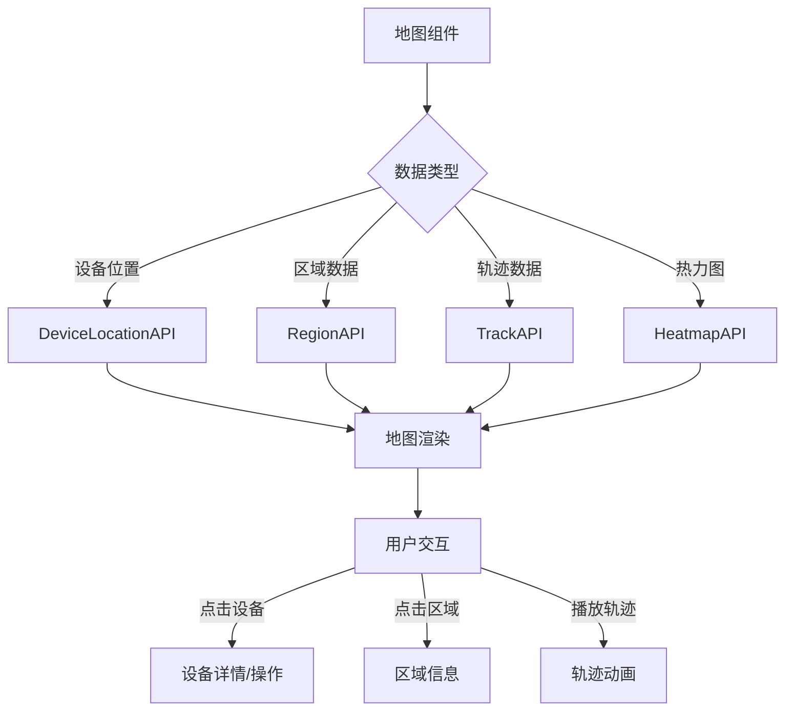

# 地图展示模块 - 详细设计

## 1. 类设计

### 1.1 Controller层

```java
@RestController
@RequestMapping("/ivs/v1/map")
public class MapController {
    @Resource
    private MapService mapService;
    
    @GetMapping("/devices")
    public ResponseDTO<List<DeviceLocationVO>> getDeviceLocations(@Valid DeviceLocationQueryForm form);
    
    @PutMapping("/devices/{deviceId}/location")
    public ResponseDTO<Void> updateDeviceLocation(@PathVariable Long deviceId, @Valid @RequestBody LocationUpdateForm form);
    
    @GetMapping("/regions")
    public ResponseDTO<List<MapRegionVO>> getRegions();
    
    @PostMapping("/regions")
    public ResponseDTO<Long> createRegion(@Valid @RequestBody RegionAddForm form);
    
    @GetMapping("/tracks")
    public ResponseDTO<List<TrackPointVO>> getTracks(@Valid TrackQueryForm form);
    
    @GetMapping("/heatmap")
    public ResponseDTO<List<HeatmapDataVO>> getHeatmapData(@Valid HeatmapQueryForm form);
}
```

### 1.2 Service层

```java
@Service
@Transactional(rollbackFor = Exception.class)
public class MapServiceImpl implements MapService {
    @Resource
    private DeviceLocationDao deviceLocationDao;
    @Resource
    private MapRegionDao mapRegionDao;
    @Resource
    private LocationTrackDao locationTrackDao;
    
    @Override
    public List<DeviceLocationVO> getDeviceLocations(DeviceLocationQueryForm form) {
        // 1. 查询设备位置
        // 2. 关联设备状态
        // 3. 坐标系转换(如需要)
    }
    
    @Override
    public List<TrackPointVO> getTracks(TrackQueryForm form) {
        // 1. 查询轨迹点
        // 2. 轨迹点排序
        // 3. 关联事件信息
    }
}
```

## 2. 前端组件设计

### 2.1 地图组件

```typescript
// components/GisMap.vue
interface GisMapProps {
  mapType: 'amap' | 'bmap' | 'tianditu';
  center: [number, number];
  zoom: number;
  devices?: DeviceLocation[];
  regions?: MapRegion[];
  tracks?: TrackPoint[];
}

// 核心方法
- initMap(): 初始化地图实例
- addDeviceMarkers(devices): 添加设备标记
- drawRegion(region): 绘制区域多边形
- drawTrack(points): 绘制轨迹线
- playTrack(points, speed): 轨迹回放动画
- updateHeatmap(data): 更新热力图
```

### 2.2 地图服务适配器

```typescript
// services/mapAdapter.ts
interface MapAdapter {
  init(container: HTMLElement, options: MapOptions): void;
  setCenter(lng: number, lat: number): void;
  setZoom(zoom: number): void;
  addMarker(point: Point, options?: MarkerOptions): Marker;
  addPolygon(points: Point[], options?: PolygonOptions): Polygon;
  addPolyline(points: Point[], options?: PolylineOptions): Polyline;
  convertCoordinate(lng: number, lat: number, from: CoordType, to: CoordType): Point;
}

class AmapAdapter implements MapAdapter { ... }
class BmapAdapter implements MapAdapter { ... }
class TianDiTuAdapter implements MapAdapter { ... }
```

## 3. 接口详细设计

### 3.1 查询设备位置

**请求**:
```http
GET /ivs/v1/map/devices?regionId=1&deviceType=1
```

**响应**:
```json
{
  "code": 200,
  "data": [
    {
      "deviceId": 1001,
      "deviceName": "大门摄像机",
      "deviceType": 1,
      "longitude": 116.397428,
      "latitude": 39.90923,
      "status": 1,
      "regionName": "A区"
    }
  ]
}
```

### 3.2 查询轨迹

**请求**:
```http
GET /ivs/v1/map/tracks?targetId=1001&targetType=1&startTime=2024-01-15T00:00:00&endTime=2024-01-15T23:59:59
```

**响应**:
```json
{
  "code": 200,
  "data": [
    {
      "trackId": "TK20240115001",
      "longitude": 116.397428,
      "latitude": 39.90923,
      "captureTime": "2024-01-15T10:30:25Z",
      "deviceName": "1号楼大门",
      "eventType": 1,
      "snapshotUrl": "https://xxx/snapshot.jpg"
    }
  ]
}
```

## 4. 坐标系转换

```typescript
// 坐标系类型
type CoordType = 'WGS84' | 'GCJ02' | 'BD09';

// 转换函数
function transformCoord(lng: number, lat: number, from: CoordType, to: CoordType): [number, number] {
  if (from === to) return [lng, lat];
  
  // WGS84 -> GCJ02
  if (from === 'WGS84' && to === 'GCJ02') {
    return wgs84ToGcj02(lng, lat);
  }
  // GCJ02 -> BD09
  if (from === 'GCJ02' && to === 'BD09') {
    return gcj02ToBd09(lng, lat);
  }
  // ... 其他转换
}
```

## 5. 数据流设计


