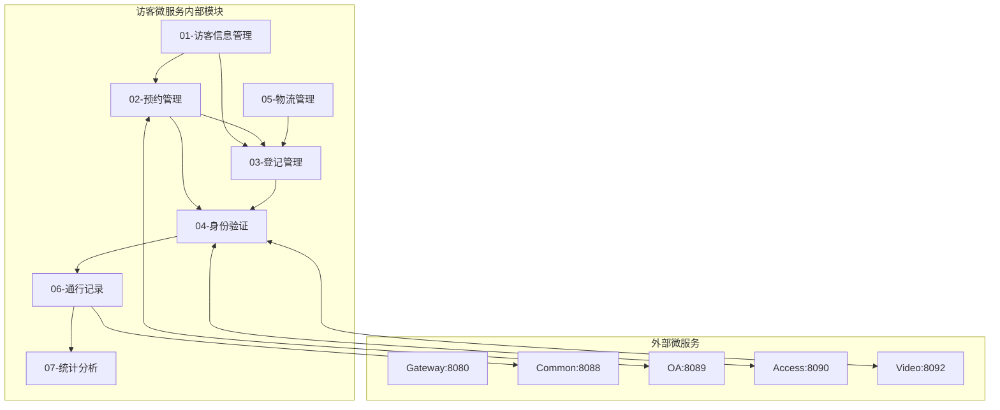
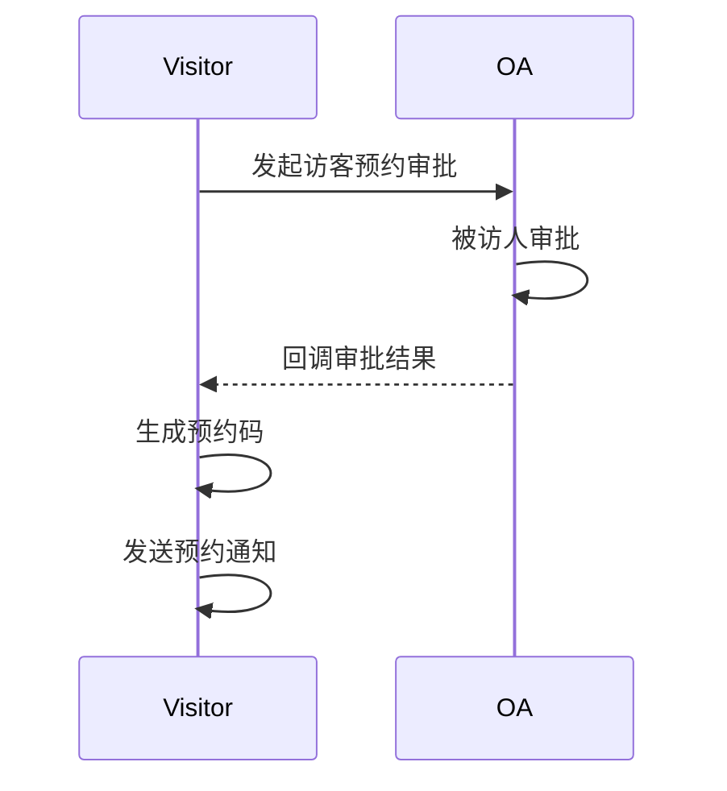
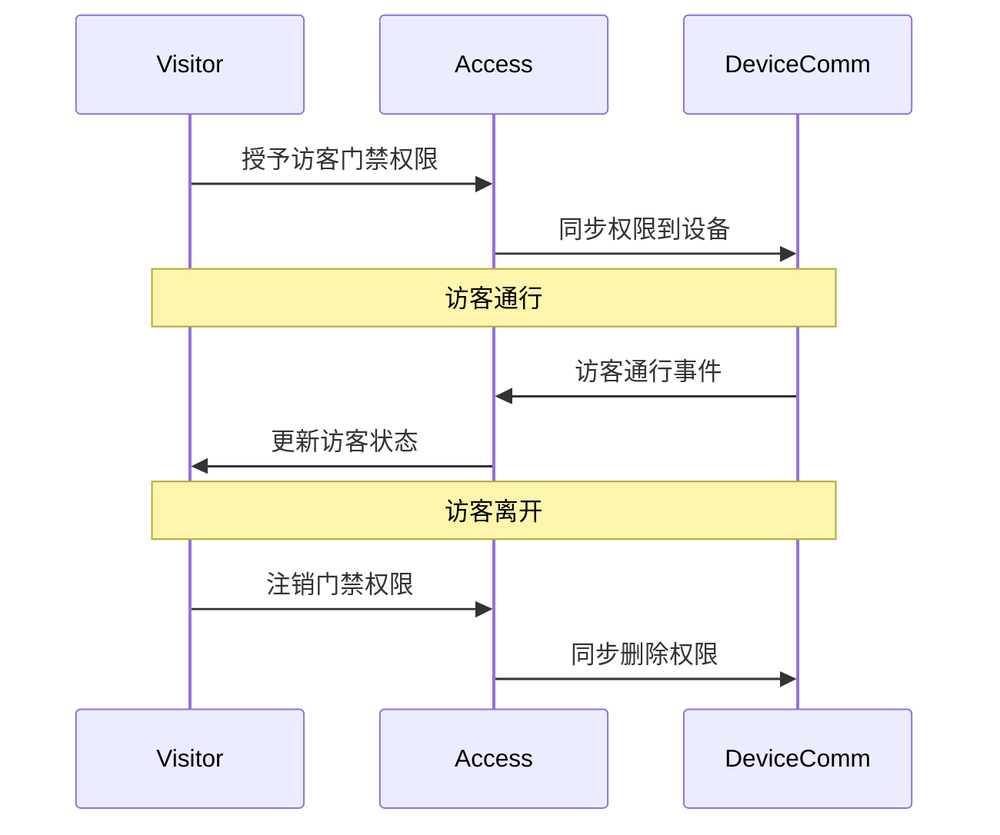
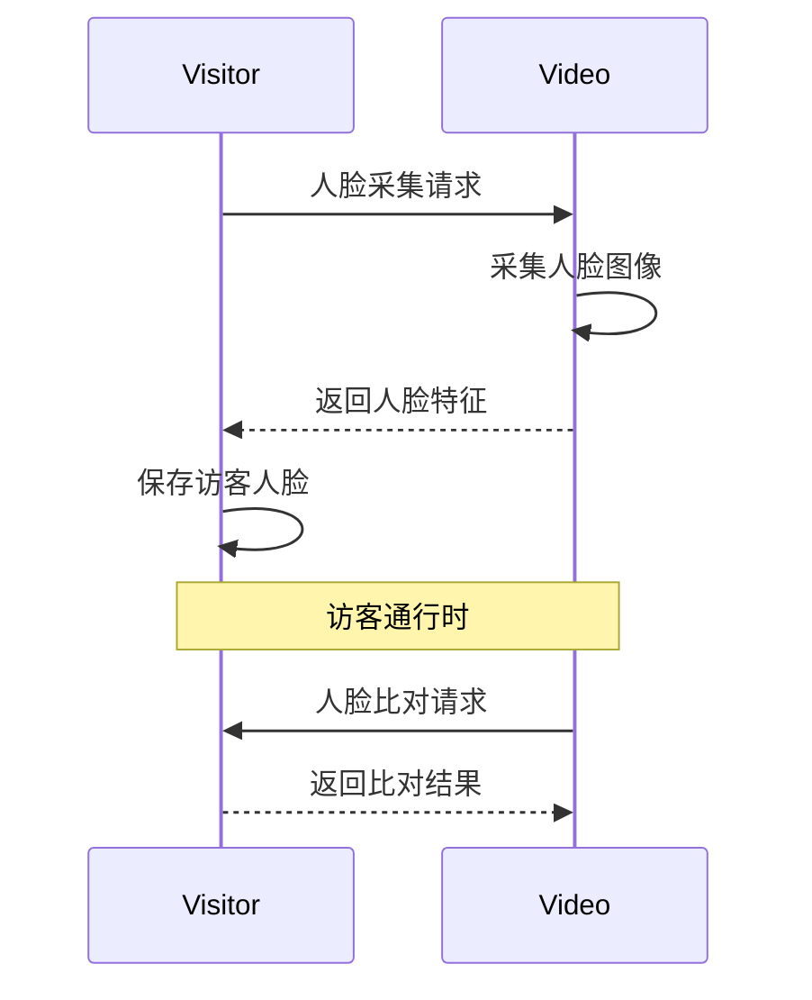
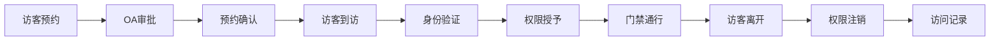

# 访客管理模块 - 模块间关联设计文档

> **版本**: v1.0.0  
> **微服务**: ioedream-visitor-service (8095)  
> **创建日期**: 2025-12-17

---

## 📊 模块关联全景图



---

## 🔗 内部模块关联详细设计

### 1. 预约管理 ↔ 登记管理

| 关联点 | 说明 | 数据流向 |
|--------|------|----------|
| 预约核销 | 登记时核销预约 | APPOINT → REGISTER |
| 信息复用 | 登记时复用预约信息 | APPOINT → REGISTER |
| 状态更新 | 登记完成更新预约状态 | REGISTER → APPOINT |

**关键接口**:
```java
// AppointmentService.java
AppointmentVO getAppointment(String appointmentCode);
void verifyAppointment(Long appointmentId);

// VisitorRegisterService.java
RegisterResultVO register(VisitorRegisterForm form);
```

### 2. 身份验证 ↔ 门禁服务

| 关联点 | 说明 | 数据流向 |
|--------|------|----------|
| 权限授予 | 验证通过后授予门禁权限 | AUTH → ACC |
| 权限注销 | 访客离开后注销权限 | AUTH → ACC |
| 通行校验 | 门禁通行时校验访客状态 | ACC → AUTH |

**关键接口**:
```java
// VisitorAccessService.java
void grantAccessPermission(Long visitorId, List<Long> areaIds);
void revokeAccessPermission(Long visitorId);

// AccessService (门禁服务)
Boolean checkVisitorPermission(Long visitorId, Long areaId);
```

### 3. 身份验证 ↔ 视频服务

| 关联点 | 说明 | 数据流向 |
|--------|------|----------|
| 人脸采集 | 登记时采集人脸 | AUTH → VID |
| 人脸比对 | 通行时人脸比对 | VID → AUTH |
| 照片存储 | 存储访客照片 | AUTH → VID |

**关键接口**:
```java
// VisitorFaceService.java
void captureFace(Long visitorId, byte[] faceImage);

// VideoService (视频服务)
FaceCompareResultVO compareFace(Long visitorId, byte[] currentFace);
```

---

## 🌐 外部微服务关联设计

### 1. 访客服务 ↔ OA服务 (8089)



**关键API**:
```
POST /api/oa/v1/workflow/visitor/approve  # 访客审批
POST /api/visitor/v1/workflow/callback    # 审批回调
```

### 2. 访客服务 ↔ 门禁服务 (8090)



**关键API**:
```
POST /api/access/v1/visitor/grant        # 授予访客权限
DELETE /api/access/v1/visitor/{id}       # 注销访客权限
POST /api/visitor/v1/access/callback     # 通行回调
```

### 3. 访客服务 ↔ 视频服务 (8092)



**关键API**:
```
POST /api/video/v1/face/capture          # 人脸采集
POST /api/video/v1/face/compare          # 人脸比对
```

---

## 📋 数据流转设计

### 访客全流程



---

## 🔧 接口契约规范

| 调用方 | 被调用方 | 接口 | 超时 | 重试 |
|--------|----------|------|------|------|
| VIS | OA | startApproval | 5s | 2次 |
| VIS | ACC | grantPermission | 3s | 2次 |
| VIS | VID | captureFace | 10s | 1次 |
| ACC | VIS | checkVisitor | 500ms | 2次 |

---

**📝 文档维护**: IOE-DREAM架构团队 | 2025-12-17
