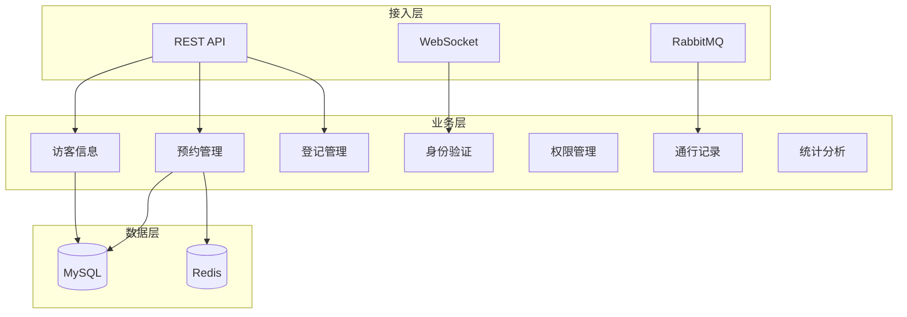
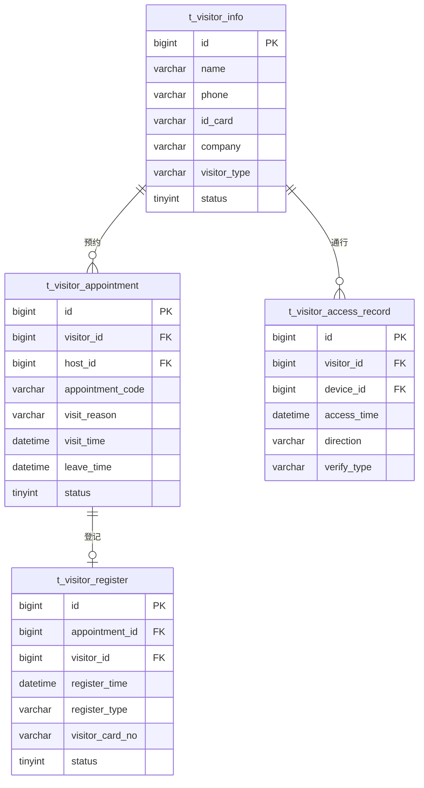

# 访客管理微服务 - 总体设计文档

> **版本**: v1.0.0  
> **微服务**: ioedream-visitor-service (8095)  
> **创建日期**: 2025-12-17

---

## 📋 模块概述

访客管理微服务负责企业访客的全生命周期管理，包括访客预约、登记、身份验证、权限控制、通行记录和统计分析。

---

## 🏗️ 系统架构



---

## 📁 代码结构

```
ioedream-visitor-service/src/main/java/net/lab1024/sa/visitor/
├── VisitorApplication.java                 # 启动类
├── controller/                             # Controller层
│   ├── VisitorInfoController.java         # 访客信息
│   ├── AppointmentController.java         # 预约管理
│   ├── VisitorRegisterController.java     # 登记管理
│   ├── VisitorAuthController.java         # 身份验证
│   ├── VisitorAccessController.java       # 权限管理
│   ├── VisitorRecordController.java       # 通行记录
│   └── VisitorStatController.java         # 统计分析
├── service/                                # Service层
│   ├── VisitorInfoService.java
│   ├── AppointmentService.java
│   ├── VisitorRegisterService.java
│   ├── VisitorAuthService.java
│   ├── VisitorAccessService.java
│   ├── VisitorRecordService.java
│   └── VisitorStatService.java
├── dao/                                    # DAO层
│   ├── VisitorInfoDao.java
│   ├── AppointmentDao.java
│   ├── VisitorRegisterDao.java
│   └── VisitorRecordDao.java
├── domain/                                 # 领域对象
│   ├── entity/
│   ├── form/
│   └── vo/
└── manager/                                # Manager层
    ├── VisitorPermissionManager.java
    └── VisitorStatisticsManager.java
```

---

## 🎯 核心功能模块

### 1. 访客信息管理
- 访客基本信息录入
- 访客类型管理（普通访客、VIP、供应商）
- 访客黑名单管理
- 访客历史查询

### 2. 预约管理
- 线上预约申请
- 被访人审批
- 预约码生成
- 预约通知推送

### 3. 登记管理
- 前台登记
- 自助登记
- 证件识别
- 访客证发放

### 4. 身份验证
- 证件验证
- 人脸识别
- 预约码验证
- 二维码验证

### 5. 通行记录
- 入场记录
- 离场记录
- 滞留预警
- 通行轨迹

### 6. 统计分析
- 访客流量统计
- 来访频次分析
- 时段分布分析
- 区域访问分析

---

## 📊 数据库设计

### 核心表结构

| 表名 | 说明 |
|------|------|
| t_visitor_info | 访客信息表 |
| t_visitor_appointment | 预约记录表 |
| t_visitor_register | 登记记录表 |
| t_visitor_access_record | 通行记录表 |
| t_visitor_permission | 访客权限表 |
| t_visitor_blacklist | 访客黑名单表 |

### ER图



---

## 🔧 API接口设计

### 预约管理

| 方法 | 路径 | 说明 |
|------|------|------|
| POST | /api/visitor/v1/appointment/apply | 预约申请 |
| GET | /api/visitor/v1/appointment/{code} | 预约查询 |
| PUT | /api/visitor/v1/appointment/approve | 预约审批 |
| DELETE | /api/visitor/v1/appointment/{id} | 取消预约 |

### 登记管理

| 方法 | 路径 | 说明 |
|------|------|------|
| POST | /api/visitor/v1/register/checkin | 访客登记 |
| POST | /api/visitor/v1/register/checkout | 访客离开 |
| GET | /api/visitor/v1/register/current | 当前在访 |

### 身份验证

| 方法 | 路径 | 说明 |
|------|------|------|
| POST | /api/visitor/v1/auth/verify | 身份验证 |
| POST | /api/visitor/v1/auth/face | 人脸验证 |
| POST | /api/visitor/v1/auth/qrcode | 二维码验证 |

### 统计分析

| 方法 | 路径 | 说明 |
|------|------|------|
| GET | /api/visitor/v1/stat/daily | 日统计 |
| GET | /api/visitor/v1/stat/monthly | 月统计 |
| GET | /api/visitor/v1/stat/distribution | 分布分析 |

---

## 📈 性能指标

| 指标项 | 要求 |
|--------|------|
| 预约提交响应 | ≤ 1s |
| 登记处理时间 | ≤ 3s |
| 身份验证延迟 | ≤ 2s |
| 人脸识别延迟 | ≤ 1s |
| 并发预约支持 | ≥ 200次/秒 |
| 数据保存周期 | ≥ 2年 |

---

## 🔐 安全要求

- 访客身份信息脱敏存储
- 证件照片加密存储
- 访客权限及时注销
- 敏感操作审计日志
- 黑名单实时校验

---

**📝 文档维护**: IOE-DREAM架构团队 | 2025-12-17
