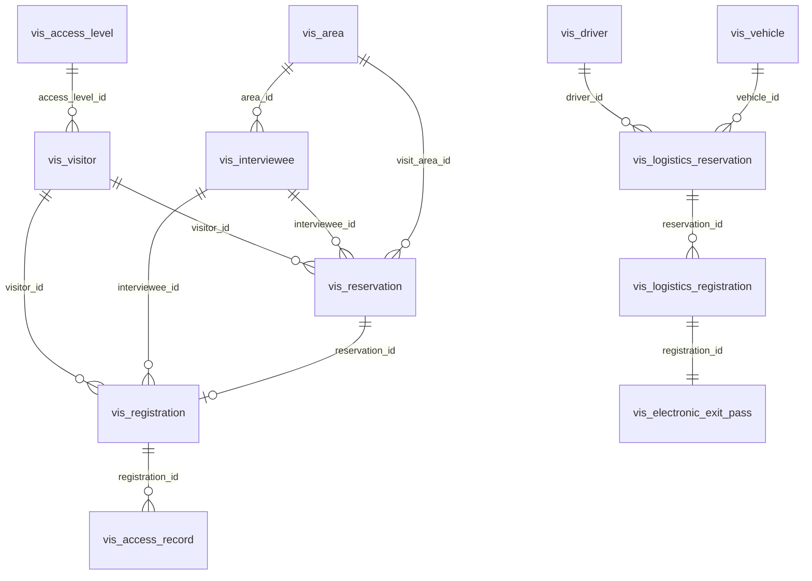

# 访客管理模块数据库设计

## 1. 数据库概述

- **数据库名称**: ioedream_visitor
- **字符集**: utf8mb4
- **存储引擎**: InnoDB
- **表前缀**: vis_

## 2. ER图



## 3. 核心数据表

### 3.1 vis_visitor (访客信息表)

| 字段名 | 类型 | 说明 |
|--------|------|------|
| id | BIGINT | 访客ID (PK) |
| visitor_code | VARCHAR(50) | 访客编号 (UK) |
| name | VARCHAR(100) | 姓名 |
| gender | TINYINT | 性别 |
| id_card | VARCHAR(50) | 证件号 (UK) |
| phone | VARCHAR(20) | 手机号 |
| email | VARCHAR(100) | 邮箱 |
| company_name | VARCHAR(200) | 公司名称 |
| photo_url | VARCHAR(500) | 照片URL |
| visitor_level | VARCHAR(20) | 访客等级 |
| blacklisted | TINYINT | 是否黑名单 |
| blacklist_reason | TEXT | 黑名单原因 |
| access_level_id | BIGINT | 权限级别ID (FK) |
| create_time | DATETIME | 创建时间 |
| update_time | DATETIME | 更新时间 |

### 3.2 vis_reservation (预约信息表)

| 字段名 | 类型 | 说明 |
|--------|------|------|
| id | BIGINT | 预约ID (PK) |
| reservation_code | VARCHAR(50) | 预约编号 (UK) |
| visitor_id | BIGINT | 访客ID (FK) |
| visitor_name | VARCHAR(100) | 访客姓名 |
| id_card | VARCHAR(50) | 证件号 |
| interviewee_id | BIGINT | 被访人ID (FK) |
| interviewee_name | VARCHAR(50) | 被访人姓名 |
| visit_purpose | VARCHAR(200) | 访问目的 |
| visit_date | DATE | 访问日期 |
| start_time | TIME | 开始时间 |
| end_time | TIME | 结束时间 |
| visit_area_id | BIGINT | 访问区域ID (FK) |
| visitor_count | INT | 访客人数 |
| car_number | VARCHAR(50) | 车牌号 |
| status | VARCHAR(20) | 预约状态 |
| approve_user | VARCHAR(100) | 审批人 |
| approve_time | DATETIME | 审批时间 |
| create_time | DATETIME | 创建时间 |

### 3.3 vis_registration (访客登记表)

| 字段名 | 类型 | 说明 |
|--------|------|------|
| id | BIGINT | 登记ID (PK) |
| registration_code | VARCHAR(50) | 登记编号 (UK) |
| reservation_id | BIGINT | 预约ID (FK) |
| visitor_id | BIGINT | 访客ID (FK) |
| visitor_name | VARCHAR(100) | 访客姓名 |
| interviewee_id | BIGINT | 被访人ID (FK) |
| visitor_card | VARCHAR(50) | 访客卡号 |
| access_level_id | BIGINT | 权限级别ID (FK) |
| access_areas | TEXT | 访问区域 |
| expected_leave_time | DATETIME | 预计离开时间 |
| actual_leave_time | DATETIME | 实际离开时间 |
| check_in_photo_url | VARCHAR(500) | 签入照片 |
| check_out_photo_url | VARCHAR(500) | 签出照片 |
| status | VARCHAR(20) | 状态 |
| create_time | DATETIME | 登记时间 |

### 3.4 vis_access_record (通行记录表)

| 字段名 | 类型 | 说明 |
|--------|------|------|
| id | BIGINT | 记录ID (PK) |
| record_code | VARCHAR(50) | 记录编码 (UK) |
| registration_id | BIGINT | 登记ID (FK) |
| visitor_id | BIGINT | 访客ID (FK) |
| device_id | VARCHAR(100) | 设备ID |
| access_type | VARCHAR(20) | 通行类型 |
| access_result | VARCHAR(20) | 通行结果 |
| area_id | BIGINT | 区域ID |
| exception_flag | TINYINT | 是否异常 |
| create_time | DATETIME | 通行时间 |

### 3.5 vis_logistics_reservation (物流预约表)

| 字段名 | 类型 | 说明 |
|--------|------|------|
| id | BIGINT | 预约ID (PK) |
| reservation_code | VARCHAR(50) | 预约编号 (UK) |
| driver_id | BIGINT | 司机ID (FK) |
| vehicle_id | BIGINT | 车辆ID (FK) |
| driver_name | VARCHAR(50) | 司机姓名 |
| plate_number | VARCHAR(20) | 车牌号 |
| transport_company | VARCHAR(200) | 运输公司 |
| reservation_type | VARCHAR(50) | 预约类型 |
| goods_type | VARCHAR(100) | 货物类型 |
| goods_weight | DECIMAL(10,2) | 货物重量 |
| operation_area_id | BIGINT | 作业区域ID |
| expected_arrive_date | DATE | 预计到达日期 |
| interviewee_id | BIGINT | 被访人ID (FK) |
| status | VARCHAR(20) | 预约状态 |
| create_time | DATETIME | 创建时间 |

### 3.6 vis_logistics_registration (物流登记表)

| 字段名 | 类型 | 说明 |
|--------|------|------|
| id | BIGINT | 登记ID (PK) |
| registration_code | VARCHAR(50) | 登记编号 (UK) |
| reservation_id | BIGINT | 预约ID (FK) |
| driver_id | BIGINT | 司机ID (FK) |
| vehicle_id | BIGINT | 车辆ID (FK) |
| goods_verify_status | VARCHAR(20) | 货物验证状态 |
| security_check_status | VARCHAR(20) | 安全检查状态 |
| actual_arrive_time | DATETIME | 实际到达时间 |
| actual_depart_time | DATETIME | 实际离开时间 |
| operation_start_time | DATETIME | 作业开始时间 |
| operation_end_time | DATETIME | 作业结束时间 |
| status | VARCHAR(20) | 状态 |
| create_time | DATETIME | 登记时间 |

### 3.7 vis_electronic_exit_pass (电子出门单表)

| 字段名 | 类型 | 说明 |
|--------|------|------|
| id | BIGINT | 出门单ID (PK) |
| pass_code | VARCHAR(50) | 出门单编号 (UK) |
| registration_id | BIGINT | 登记ID (FK) |
| goods_info | TEXT | 货物信息 |
| load_status | VARCHAR(20) | 装载状态 |
| warehouse_operator | VARCHAR(100) | 仓库操作员 |
| interviewee_confirm_user | VARCHAR(100) | 被访人确认人 |
| interviewee_confirm_time | DATETIME | 确认时间 |
| interviewee_signature | VARCHAR(500) | 电子签名 |
| guard_check_user | VARCHAR(100) | 保安检查人 |
| guard_check_result | VARCHAR(20) | 检查结果 |
| pass_status | VARCHAR(20) | 出门单状态 |
| release_time | DATETIME | 放行时间 |
| create_time | DATETIME | 创建时间 |

### 3.8 vis_driver (司机信息表)

| 字段名 | 类型 | 说明 |
|--------|------|------|
| id | BIGINT | 司机ID (PK) |
| driver_code | VARCHAR(50) | 司机编号 (UK) |
| name | VARCHAR(100) | 姓名 |
| id_card | VARCHAR(18) | 证件号 (UK) |
| phone | VARCHAR(20) | 手机号 |
| driver_license | VARCHAR(50) | 驾驶证号 |
| license_type | VARCHAR(20) | 驾照类型 |
| license_expire_date | DATE | 驾照有效期 |
| transport_company | VARCHAR(200) | 运输公司 |
| driver_status | VARCHAR(20) | 司机状态 |
| total_trips | INT | 总运输次数 |
| create_time | DATETIME | 创建时间 |

### 3.9 vis_vehicle (车辆信息表)

| 字段名 | 类型 | 说明 |
|--------|------|------|
| id | BIGINT | 车辆ID (PK) |
| vehicle_code | VARCHAR(50) | 车辆编号 (UK) |
| plate_number | VARCHAR(20) | 车牌号 (UK) |
| vehicle_type | VARCHAR(50) | 车辆类型 |
| load_capacity | DECIMAL(10,2) | 核载重量 |
| registration_number | VARCHAR(50) | 行驶证号 |
| inspection_expire_date | DATE | 年检有效期 |
| insurance_expire_date | DATE | 保险有效期 |
| vehicle_status | VARCHAR(20) | 车辆状态 |
| current_driver_id | BIGINT | 当前司机ID |
| create_time | DATETIME | 创建时间 |

## 4. 索引设计

### 4.1 访客表索引
```sql
CREATE INDEX idx_visitor_code ON vis_visitor(visitor_code);
CREATE INDEX idx_id_card ON vis_visitor(id_card);
CREATE INDEX idx_phone ON vis_visitor(phone);
CREATE INDEX idx_blacklisted ON vis_visitor(blacklisted);
```

### 4.2 预约表索引
```sql
CREATE INDEX idx_reservation_code ON vis_reservation(reservation_code);
CREATE INDEX idx_visitor_id ON vis_reservation(visitor_id);
CREATE INDEX idx_interviewee_id ON vis_reservation(interviewee_id);
CREATE INDEX idx_visit_date ON vis_reservation(visit_date);
CREATE INDEX idx_status ON vis_reservation(status);
```

### 4.3 登记表索引
```sql
CREATE INDEX idx_registration_code ON vis_registration(registration_code);
CREATE INDEX idx_reservation_id ON vis_registration(reservation_id);
CREATE INDEX idx_status ON vis_registration(status);
CREATE INDEX idx_visitor_card ON vis_registration(visitor_card);
```

## 5. 分区策略

### 5.1 通行记录表按月分区
```sql
ALTER TABLE vis_access_record PARTITION BY RANGE (YEAR(create_time)*100 + MONTH(create_time)) (
    PARTITION p202401 VALUES LESS THAN (202402),
    PARTITION p202402 VALUES LESS THAN (202403),
    ...
);
```

## 6. 数据归档策略

| 表名 | 保留周期 | 归档方式 |
|------|----------|----------|
| vis_access_record | 2年 | 按月归档 |
| vis_registration | 1年 | 按月归档 |
| vis_logistics_registration | 1年 | 按月归档 |
| vis_visitor_statistics | 5年 | 按年归档 |

