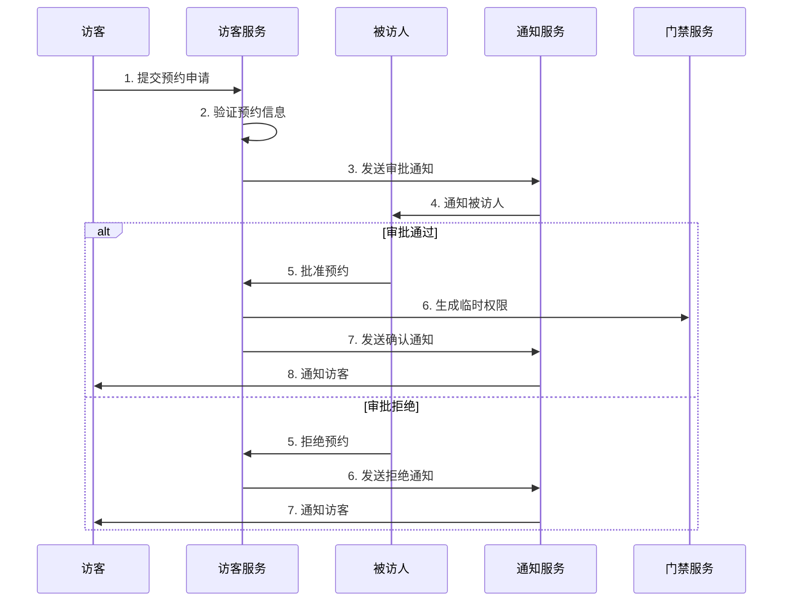
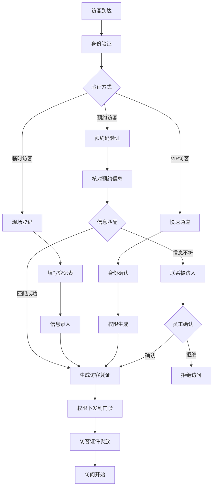
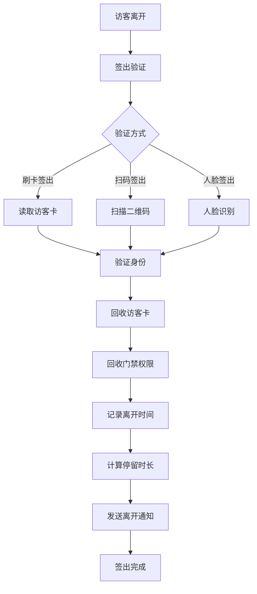
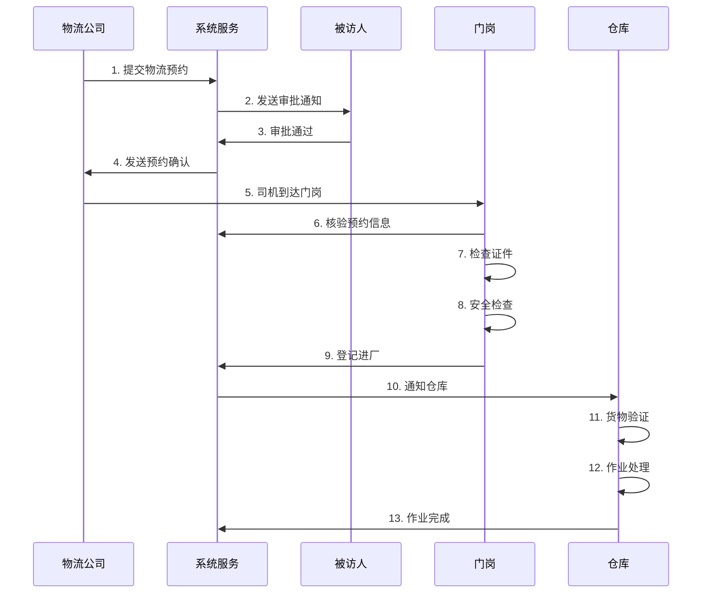
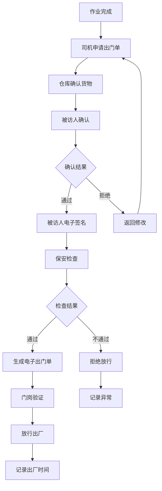
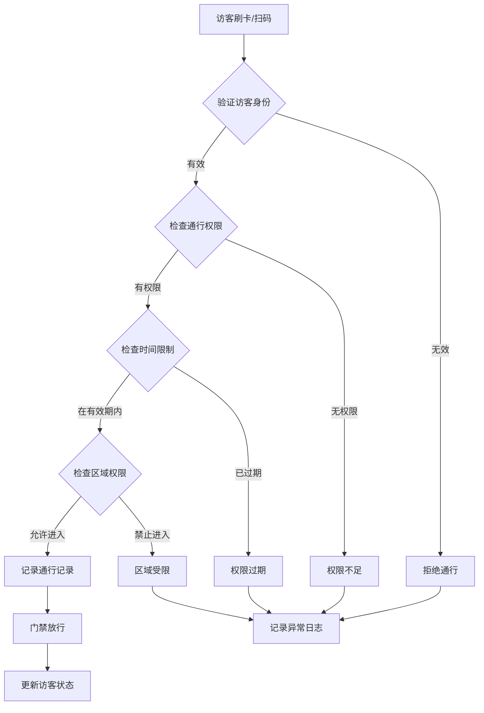
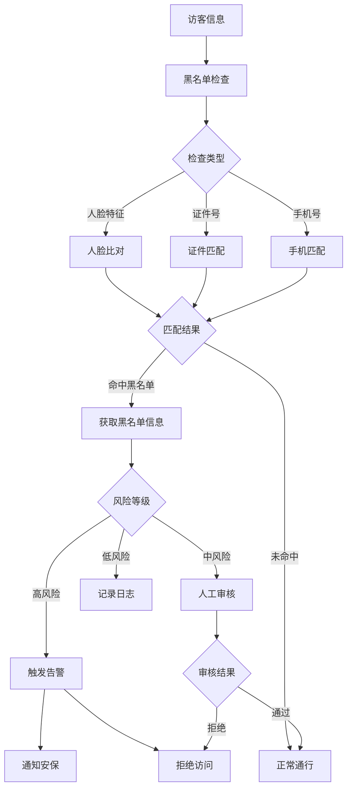
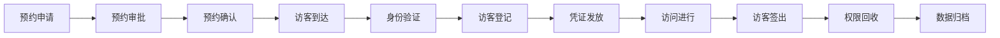
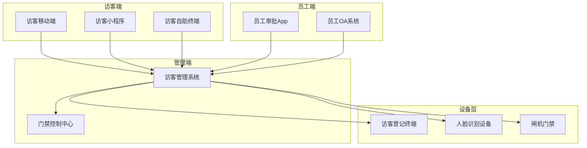

# 访客管理模块业务流程图

## 1. 访客预约审批流程

```mermaid
sequenceDiagram
    participant V as 访客
    participant S as 访客服务
    participant E as 被访人
    participant N as 通知服务
    participant A as 门禁服务

    V->>S: 1. 提交预约申请
    S->>S: 2. 验证预约信息
    S->>N: 3. 发送审批通知
    N->>E: 4. 通知被访人
    
    alt 审批通过
        E->>S: 5. 批准预约
        S->>A: 6. 生成临时权限
        S->>N: 7. 发送确认通知
        N->>V: 8. 通知访客
    else 审批拒绝
        E->>S: 5. 拒绝预约
        S->>N: 6. 发送拒绝通知
        N->>V: 7. 通知访客
    end
```

## 2. 访客登记流程

```mermaid
graph TB
    A[访客到达] --> B[身份验证]
    B --> C{验证方式}
    
    C -->|预约访客| D[预约码验证]
    C -->|临时访客| E[现场登记]
    C -->|VIP访客| F[快速通道]
    
    D --> G[核对预约信息]
    E --> H[填写登记表]
    F --> I[身份确认]
    
    G --> J{信息匹配}
    H --> K[信息录入]
    I --> L[权限生成]
    
    J -->|匹配成功| M[生成访客凭证]
    J -->|信息不符| N[联系被访人]
    K --> M
    L --> M
    
    N --> O{员工确认}
    O -->|确认| M
    O -->|拒绝| P[拒绝访问]
    
    M --> Q[权限下发到门禁]
    Q --> R[访客证件发放]
    R --> S[访问开始]
```

## 3. 访客签出流程

```mermaid
graph TB
    A[访客离开] --> B[签出验证]
    B --> C{验证方式}
    
    C -->|刷卡签出| D[读取访客卡]
    C -->|扫码签出| E[扫描二维码]
    C -->|人脸签出| F[人脸识别]
    
    D --> G[验证身份]
    E --> G
    F --> G
    
    G --> H[回收访客卡]
    H --> I[回收门禁权限]
    I --> J[记录离开时间]
    J --> K[计算停留时长]
    K --> L[发送离开通知]
    L --> M[签出完成]
```

## 4. 物流预约登记流程

```mermaid
sequenceDiagram
    participant LC as 物流公司
    participant S as 系统服务
    participant E as 被访人
    participant G as 门岗
    participant W as 仓库

    LC->>S: 1. 提交物流预约
    S->>E: 2. 发送审批通知
    E->>S: 3. 审批通过
    S->>LC: 4. 发送预约确认
    
    LC->>G: 5. 司机到达门岗
    G->>S: 6. 核验预约信息
    G->>G: 7. 检查证件
    G->>G: 8. 安全检查
    G->>S: 9. 登记进厂
    S->>W: 10. 通知仓库
    
    W->>W: 11. 货物验证
    W->>W: 12. 作业处理
    W->>S: 13. 作业完成
```

## 5. 电子出门单流程

```mermaid
graph TD
    A[作业完成] --> B[司机申请出门单]
    B --> C[仓库确认货物]
    C --> D[被访人确认]
    D --> E{确认结果}
    
    E -->|通过| F[被访人电子签名]
    E -->|拒绝| G[返回修改]
    
    F --> H[保安检查]
    H --> I{检查结果}
    
    I -->|通过| J[生成电子出门单]
    I -->|不通过| K[拒绝放行]
    
    J --> L[门岗验证]
    L --> M[放行出厂]
    M --> N[记录出厂时间]
    
    G --> B
    K --> O[记录异常]
```

## 6. 访客通行验证流程

```mermaid
graph TB
    A[访客刷卡/扫码] --> B{验证访客身份}
    B -->|有效| C{检查通行权限}
    B -->|无效| D[拒绝通行]
    
    C -->|有权限| E{检查时间限制}
    C -->|无权限| F[权限不足]
    
    E -->|在有效期内| G{检查区域权限}
    E -->|已过期| H[权限过期]
    
    G -->|允许进入| I[记录通行记录]
    G -->|禁止进入| J[区域受限]
    
    I --> K[门禁放行]
    K --> L[更新访客状态]
    
    D --> M[记录异常日志]
    F --> M
    H --> M
    J --> M
```

## 7. 黑名单检查流程

```mermaid
graph TB
    A[访客信息] --> B[黑名单检查]
    B --> C{检查类型}
    
    C -->|人脸特征| D[人脸比对]
    C -->|证件号| E[证件匹配]
    C -->|手机号| F[手机匹配]
    
    D --> G{匹配结果}
    E --> G
    F --> G
    
    G -->|命中黑名单| H[获取黑名单信息]
    G -->|未命中| I[正常通行]
    
    H --> J{风险等级}
    J -->|高风险| K[触发告警]
    J -->|中风险| L[人工审核]
    J -->|低风险| M[记录日志]
    
    K --> N[通知安保]
    K --> O[拒绝访问]
    
    L --> P{审核结果}
    P -->|通过| I
    P -->|拒绝| O
```

## 8. 访客全生命周期流程

```mermaid
graph LR
    A[预约申请] --> B[预约审批]
    B --> C[预约确认]
    C --> D[访客到达]
    D --> E[身份验证]
    E --> F[访客登记]
    F --> G[凭证发放]
    G --> H[访问进行]
    H --> I[访客签出]
    I --> J[权限回收]
    J --> K[数据归档]
```

## 9. 系统架构流程

```mermaid
graph TB
    subgraph "访客端"
        A[访客移动端]
        B[访客小程序]
        C[访客自助终端]
    end

    subgraph "员工端"
        D[员工审批App]
        E[员工OA系统]
    end

    subgraph "管理端"
        F[访客管理系统]
        G[门禁控制中心]
    end

    subgraph "设备层"
        H[访客登记终端]
        I[人脸识别设备]
        J[闸机门禁]
    end

    A --> F
    B --> F
    C --> F
    D --> F
    E --> F
    F --> G
    F --> H
    F --> I
    F --> J
```

