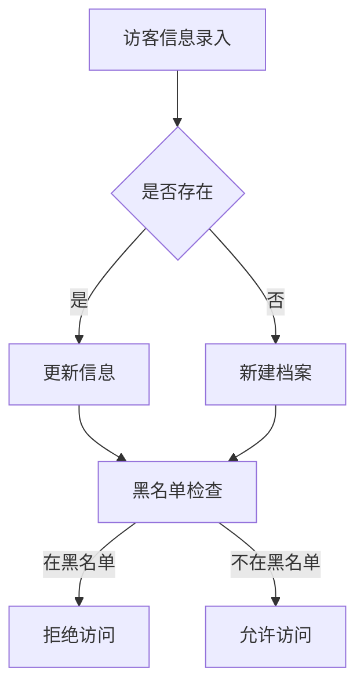

# 访客信息管理子模块

## 1. 功能说明

### 1.1 访客档案管理
- 访客基本信息录入（姓名、性别、证件号、手机、邮箱、公司）
- 访客信息修改和查询
- 访客照片采集和管理
- 访客历史记录查看

### 1.2 黑名单管理
- 黑名单添加（支持单个和批量）
- 黑名单移除
- 黑名单原因记录
- 黑名单有效期设置
- 实时黑名单检查

### 1.3 访客等级管理
- VIP访客：快速通道、免审批
- 普通访客：标准流程
- 受限访客：需额外审批

## 2. 用户故事

### US-VIS-INFO-001: 访客信息录入
**作为** 前台接待人员  
**我希望** 快速录入访客基本信息  
**以便** 建立访客档案

### US-VIS-INFO-002: 黑名单管理
**作为** 安保管理员  
**我希望** 将违规访客加入黑名单  
**以便** 防止其再次进入

## 3. 数据库设计

### vis_visitor 访客信息表
| 字段名 | 类型 | 说明 |
|--------|------|------|
| id | BIGINT | 主键 |
| name | VARCHAR(50) | 姓名 |
| gender | TINYINT | 性别 |
| id_card | VARCHAR(18) | 身份证号(加密) |
| phone | VARCHAR(20) | 手机号(加密) |
| email | VARCHAR(100) | 邮箱 |
| company_name | VARCHAR(100) | 公司名称 |
| visitor_level | VARCHAR(20) | 访客等级 |
| face_feature | TEXT | 人脸特征 |
| blacklisted | TINYINT | 是否黑名单 |
| blacklist_reason | VARCHAR(500) | 黑名单原因 |
| blacklist_expire | DATETIME | 黑名单过期时间 |
| visit_count | INT | 来访次数 |
| last_visit_time | DATETIME | 最后来访时间 |
| create_time | DATETIME | 创建时间 |
| update_time | DATETIME | 更新时间 |
| deleted_flag | TINYINT | 删除标记 |

## 4. API接口

### 4.1 查询访客列表
```http
POST /api/v1/visitor/query
```

### 4.2 添加访客
```http
POST /api/v1/visitor/add
```

### 4.3 加入黑名单
```http
POST /api/v1/visitor/addToBlacklist
```

### 4.4 移出黑名单
```http
POST /api/v1/visitor/removeFromBlacklist
```

## 5. 业务流程



