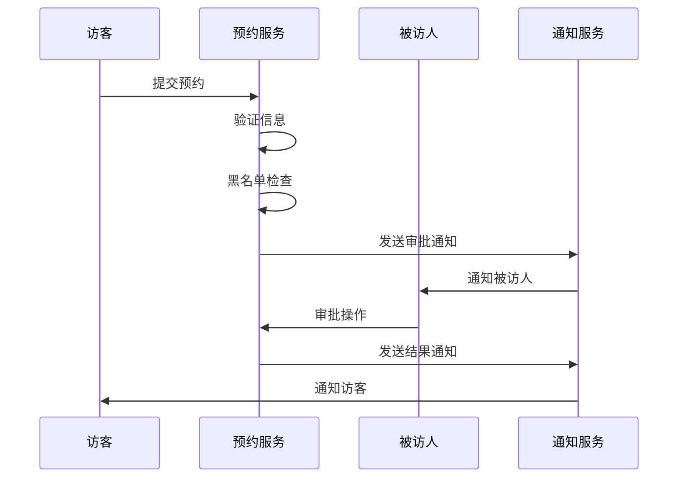
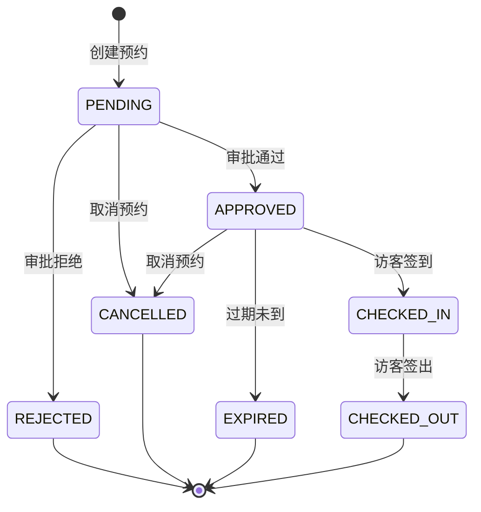

# 预约管理子模块

## 1. 功能说明

### 1.1 在线预约
- 访客自助预约（移动端/Web端）
- 员工代为预约
- 批量预约（会议/活动）
- 预约码生成

### 1.2 预约审批
- 单级/多级审批流程
- 审批通知（短信/APP/邮件）
- 审批意见记录
- 审批超时处理

### 1.3 预约变更
- 预约修改（时间/被访人）
- 预约取消
- 预约延期
- 变更通知

### 1.4 预约提醒
- 到访前提醒（访客/被访人）
- 预约过期提醒
- 审批超时提醒

## 2. 用户故事

### US-VIS-RSV-001: 访客在线预约
**作为** 外部访客  
**我希望** 通过手机提交访问预约  
**以便** 提前安排访问并获得授权

**验收标准:**
- 填写基本信息和访问信息
- 上传照片和证件
- 生成预约编号
- 收到预约确认短信

### US-VIS-RSV-002: 被访人审批
**作为** 公司员工  
**我希望** 收到预约通知并审批  
**以便** 控制访客来访

### US-VIS-RSV-003: 批量预约
**作为** 会议组织者  
**我希望** 一次性预约多位访客  
**以便** 高效安排会议访客

## 3. 数据库设计

### vis_reservation 预约信息表
| 字段名 | 类型 | 说明 |
|--------|------|------|
| id | BIGINT | 主键 |
| reservation_no | VARCHAR(32) | 预约编号 |
| visitor_id | BIGINT | 访客ID |
| interviewee_id | BIGINT | 被访人ID |
| visit_purpose | VARCHAR(200) | 来访事由 |
| visit_date | DATE | 来访日期 |
| start_time | TIME | 开始时间 |
| end_time | TIME | 结束时间 |
| visit_area_id | BIGINT | 访问区域ID |
| companion_count | INT | 随行人数 |
| vehicle_no | VARCHAR(20) | 车牌号 |
| status | VARCHAR(20) | 状态 |
| approval_status | VARCHAR(20) | 审批状态 |
| approval_time | DATETIME | 审批时间 |
| approval_remark | VARCHAR(500) | 审批意见 |
| qr_code | VARCHAR(500) | 预约二维码 |
| create_time | DATETIME | 创建时间 |
| update_time | DATETIME | 更新时间 |

## 4. API接口

### 4.1 创建预约
```http
POST /api/v1/visitor/reservation/create
```

**请求参数:**
```json
{
  "visitorId": 1001,
  "intervieweeId": 2001,
  "visitPurpose": "商务洽谈",
  "visitDate": "2024-01-15",
  "startTime": "09:00",
  "endTime": "12:00",
  "visitAreaId": 101,
  "companionCount": 2,
  "vehicleNo": "沪A12345"
}
```

### 4.2 审批预约
```http
POST /api/v1/visitor/reservation/approve
```

### 4.3 取消预约
```http
POST /api/v1/visitor/reservation/cancel
```

## 5. 业务流程



## 6. 预约状态流转



