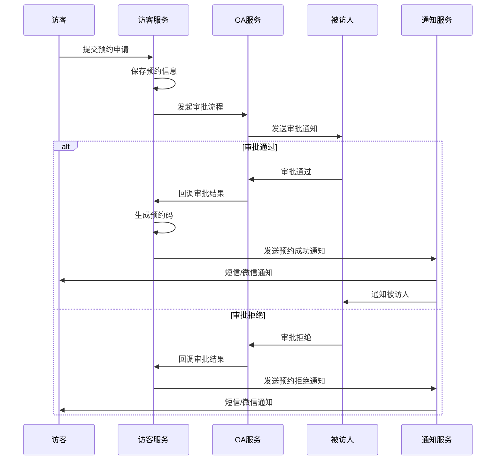
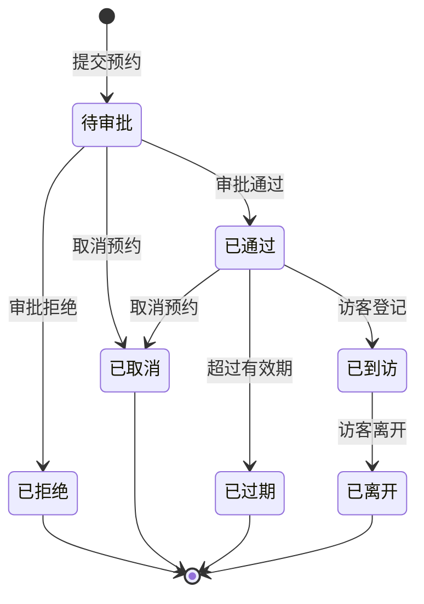

# 预约管理 - 业务流程图

> **版本**: v1.0.0  
> **创建日期**: 2025-12-17

---

## 📊 访客预约完整流程

```mermaid
graph TB
    subgraph 访客预约流程
        Start(开始) --> ApplyType{预约方式}
        
        ApplyType -->|自助预约| SelfApply
        ApplyType -->|代客预约| ProxyApply
        ApplyType -->|批量预约| BatchApply
        
        subgraph 自助预约
            SelfApply --> InputInfo[填写访客信息]
            InputInfo --> SelectHost[选择被访人]
            SelectHost --> InputReason[填写来访事由]
            InputReason --> SelectTime[选择来访时间]
            SelectTime --> AddCompanion[添加随行人]
            AddCompanion --> SubmitApply[提交预约]
        end
        
        subgraph 代客预约
            ProxyApply --> HostInput[被访人填写信息]
            HostInput --> SubmitProxy[提交预约]
            SubmitProxy --> AutoApprove[自动审批通过]
        end
        
        subgraph 批量预约
            BatchApply --> ImportFile[导入预约文件]
            ImportFile --> ValidateData[数据校验]
            ValidateData --> BatchSubmit[批量提交]
        end
        
        SubmitApply --> ApproveFlow
        BatchSubmit --> ApproveFlow
        AutoApprove --> GenerateCode
        
        subgraph 审批流程
            ApproveFlow{需要审批?}
            ApproveFlow -->|是| WaitApprove[等待审批]
            ApproveFlow -->|否| GenerateCode
            WaitApprove --> ApproveResult{审批结果}
            ApproveResult -->|通过| GenerateCode
            ApproveResult -->|拒绝| NotifyReject[通知拒绝]
        end
        
        subgraph 预约确认
            GenerateCode[生成预约码]
            GenerateCode --> GenerateQR[生成二维码]
            GenerateQR --> SendNotify[发送通知]
            SendNotify --> ApplyEnd[预约完成]
        end
        
        NotifyReject --> RejectEnd[预约结束]
    end
```

---

## 📊 预约审批时序图

```mermaid
sequenceDiagram
    participant V as 访客
    participant VIS as 访客服务
    participant OA as OA服务
    participant H as 被访人
    participant N as 通知服务
    
    V->>VIS: 提交预约申请
    VIS->>VIS: 保存预约信息
    VIS->>OA: 发起审批流程
    OA->>H: 发送审批通知
    
    alt 审批通过
        H->>OA: 审批通过
        OA->>VIS: 回调审批结果
        VIS->>VIS: 生成预约码
        VIS->>N: 发送预约成功通知
        N->>V: 短信/微信通知
        N->>H: 通知被访人
    else 审批拒绝
        H->>OA: 审批拒绝
        OA->>VIS: 回调审批结果
        VIS->>N: 发送预约拒绝通知
        N->>V: 短信/微信通知
    end
```

---

## 📊 预约状态流转

```mermaid
stateDiagram-v2
    [*] --> 待审批: 提交预约
    待审批 --> 已通过: 审批通过
    待审批 --> 已拒绝: 审批拒绝
    待审批 --> 已取消: 取消预约
    已通过 --> 已到访: 访客登记
    已通过 --> 已过期: 超过有效期
    已通过 --> 已取消: 取消预约
    已到访 --> 已离开: 访客离开
    已拒绝 --> [*]
    已取消 --> [*]
    已过期 --> [*]
    已离开 --> [*]
```

---

**📝 文档维护**: IOE-DREAM架构团队 | 2025-12-17
