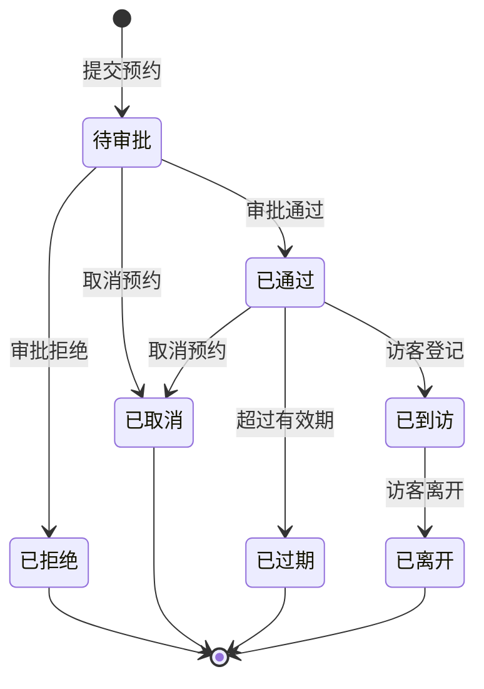

# 预约管理 - 功能说明

> **版本**: v1.0.0  
> **微服务**: ioedream-visitor-service (8095)  
> **创建日期**: 2025-12-17

---

## 📋 功能概述

预约管理模块负责访客来访预约的全流程管理，包括预约申请、审批、确认和通知。

---

## 🎯 核心功能

### 1. 预约申请
- **自助预约**: 访客通过小程序/网页自助预约
- **代客预约**: 被访人为访客代为预约
- **批量预约**: 批量导入访客预约信息

### 2. 预约审批
- **自动审批**: 符合条件的预约自动通过
- **人工审批**: 需要被访人审批确认
- **多级审批**: 特殊访客需多级审批

### 3. 预约确认
- **预约码生成**: 审批通过后生成唯一预约码
- **二维码生成**: 生成访客通行二维码
- **有效期设置**: 设置预约码有效期

### 4. 预约通知
- **短信通知**: 短信发送预约结果
- **微信通知**: 公众号/小程序消息推送
- **邮件通知**: 邮件发送预约详情

### 5. 预约管理
- **预约查询**: 查询预约记录
- **预约修改**: 修改预约信息
- **预约取消**: 取消预约申请
- **预约延期**: 延长预约有效期

---

## 📊 预约状态流转

---

## 🔧 预约类型

| 类型 | 说明 | 审批方式 |
|------|------|----------|
| 普通访客 | 一般来访人员 | 被访人审批 |
| VIP访客 | 重要客户/领导 | 自动审批 |
| 供应商 | 合作供应商人员 | 部门主管审批 |
| 面试者 | 面试候选人 | HR审批 |
| 临时访客 | 临时来访人员 | 前台审批 |

---

## 📈 性能指标

| 指标项 | 要求 |
|--------|------|
| 预约提交响应 | ≤ 1s |
| 预约码生成 | ≤ 500ms |
| 通知发送延迟 | ≤ 30s |
| 并发预约支持 | ≥ 200/s |

---

**📝 文档维护**: IOE-DREAM架构团队 | 2025-12-17
