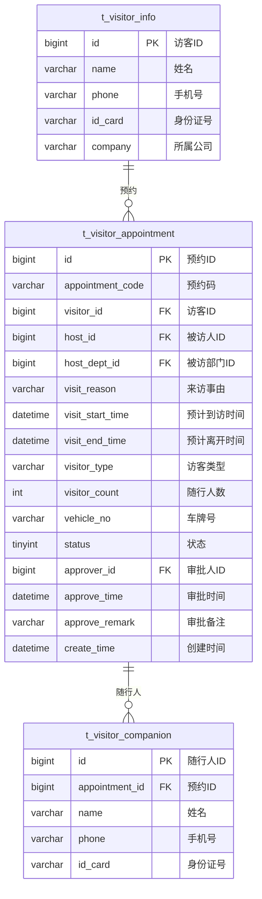

# 预约管理 - 数据结构设计

> **版本**: v1.0.0  
> **创建日期**: 2025-12-17

---

## 📊 ER图



---

## 📋 表结构详细设计

### t_visitor_appointment (访客预约表)

```sql
CREATE TABLE t_visitor_appointment (
    id BIGINT PRIMARY KEY AUTO_INCREMENT COMMENT '预约ID',
    appointment_code VARCHAR(20) NOT NULL COMMENT '预约码',
    visitor_id BIGINT NOT NULL COMMENT '访客ID',
    host_id BIGINT NOT NULL COMMENT '被访人ID',
    host_dept_id BIGINT COMMENT '被访部门ID',
    visit_reason VARCHAR(200) NOT NULL COMMENT '来访事由',
    visit_start_time DATETIME NOT NULL COMMENT '预计到访时间',
    visit_end_time DATETIME NOT NULL COMMENT '预计离开时间',
    visitor_type VARCHAR(20) DEFAULT 'NORMAL' COMMENT '访客类型:NORMAL/VIP/SUPPLIER/INTERVIEW',
    visitor_count INT DEFAULT 1 COMMENT '随行人数',
    vehicle_no VARCHAR(20) COMMENT '车牌号',
    visit_areas VARCHAR(500) COMMENT '可访问区域ID列表',
    qr_code_url VARCHAR(200) COMMENT '二维码地址',
    status TINYINT DEFAULT 0 COMMENT '状态:0待审批1已通过2已拒绝3已取消4已到访5已离开6已过期',
    approver_id BIGINT COMMENT '审批人ID',
    approve_time DATETIME COMMENT '审批时间',
    approve_remark VARCHAR(200) COMMENT '审批备注',
    notify_status TINYINT DEFAULT 0 COMMENT '通知状态:0未通知1已通知',
    create_time DATETIME NOT NULL DEFAULT CURRENT_TIMESTAMP COMMENT '创建时间',
    update_time DATETIME NOT NULL DEFAULT CURRENT_TIMESTAMP ON UPDATE CURRENT_TIMESTAMP COMMENT '更新时间',
    UNIQUE KEY uk_appointment_code (appointment_code),
    INDEX idx_visitor_id (visitor_id),
    INDEX idx_host_id (host_id),
    INDEX idx_visit_time (visit_start_time),
    INDEX idx_status (status)
) ENGINE=InnoDB DEFAULT CHARSET=utf8mb4 COMMENT='访客预约表';
```

### t_visitor_companion (随行人员表)

```sql
CREATE TABLE t_visitor_companion (
    id BIGINT PRIMARY KEY AUTO_INCREMENT COMMENT '随行人ID',
    appointment_id BIGINT NOT NULL COMMENT '预约ID',
    name VARCHAR(50) NOT NULL COMMENT '姓名',
    phone VARCHAR(20) COMMENT '手机号',
    id_card VARCHAR(20) COMMENT '身份证号',
    create_time DATETIME NOT NULL DEFAULT CURRENT_TIMESTAMP COMMENT '创建时间',
    INDEX idx_appointment_id (appointment_id),
    FOREIGN KEY (appointment_id) REFERENCES t_visitor_appointment(id) ON DELETE CASCADE
) ENGINE=InnoDB DEFAULT CHARSET=utf8mb4 COMMENT='随行人员表';
```

---

## 🔧 状态枚举

| 状态值 | 说明 |
|--------|------|
| 0 | 待审批 |
| 1 | 已通过 |
| 2 | 已拒绝 |
| 3 | 已取消 |
| 4 | 已到访 |
| 5 | 已离开 |
| 6 | 已过期 |

---

**📝 文档维护**: IOE-DREAM架构团队 | 2025-12-17
