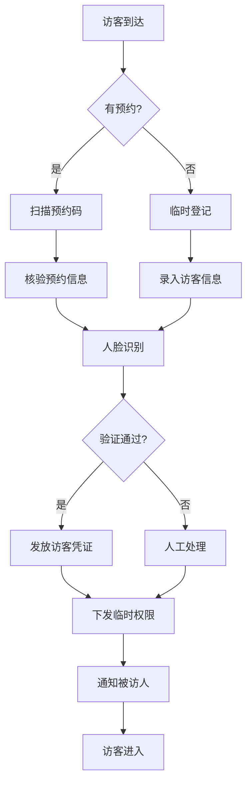
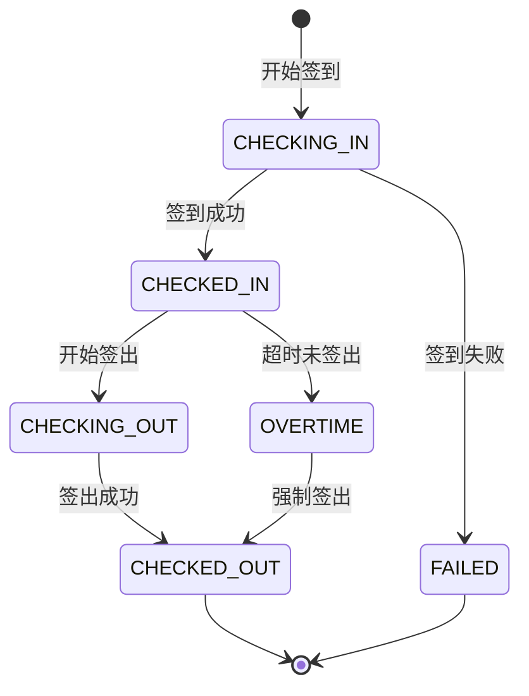

# 登记管理子模块

## 1. 功能说明

### 1.1 访客签到
- 预约访客签到（扫码/人脸）
- 临时访客登记
- VIP快速通道
- 签到信息核验

### 1.2 访客签出
- 主动签出
- 自动签出（超时）
- 批量签出
- 签出提醒

### 1.3 凭证管理
- 访客卡发放/回收
- 二维码生成
- 临时权限下发
- 凭证有效期管理

### 1.4 在场监控
- 在场访客实时监控
- 超时预警
- 区域分布统计
- 异常行为告警

## 2. 用户故事

### US-VIS-REG-001: 预约访客签到
**作为** 已预约访客  
**我希望** 扫描预约码快速签到  
**以便** 尽快开始访问

**验收标准:**
- 扫码后自动核验预约信息
- 人脸比对通过
- 自动发放访客凭证
- 通知被访人

### US-VIS-REG-002: 临时访客登记
**作为** 未预约访客  
**我希望** 在前台完成登记  
**以便** 获得临时访问授权

### US-VIS-REG-003: 访客签出
**作为** 访客  
**我希望** 离开时完成签出  
**以便** 归还访客卡并结束访问

## 3. 数据库设计

### vis_registration 登记信息表
| 字段名 | 类型 | 说明 |
|--------|------|------|
| id | BIGINT | 主键 |
| registration_no | VARCHAR(32) | 登记编号 |
| reservation_id | BIGINT | 预约ID |
| visitor_id | BIGINT | 访客ID |
| interviewee_id | BIGINT | 被访人ID |
| registration_type | VARCHAR(20) | 登记类型 |
| check_in_time | DATETIME | 签到时间 |
| check_out_time | DATETIME | 签出时间 |
| expected_leave_time | DATETIME | 预计离开时间 |
| visitor_card_no | VARCHAR(50) | 访客卡号 |
| qr_code | VARCHAR(500) | 访客二维码 |
| access_areas | JSON | 可访问区域 |
| status | VARCHAR(20) | 状态 |
| check_in_device_id | BIGINT | 签到设备ID |
| check_out_device_id | BIGINT | 签出设备ID |
| create_time | DATETIME | 创建时间 |
| update_time | DATETIME | 更新时间 |

## 4. API接口

### 4.1 访客签到
```http
POST /api/v1/visitor/registration/checkIn
```

**请求参数:**
```json
{
  "reservationId": 1001,
  "visitorId": 2001,
  "faceImage": "base64...",
  "deviceId": 101
}
```

### 4.2 访客签出
```http
POST /api/v1/visitor/registration/checkOut
```

### 4.3 获取在场访客
```http
GET /api/v1/visitor/registration/onsite
```

## 5. 业务流程



## 6. 登记状态流转



