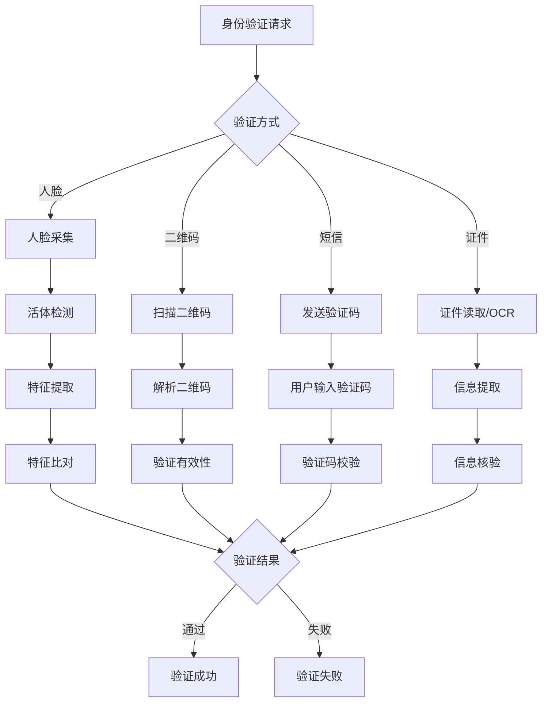

# 身份验证子模块

## 1. 功能说明

### 1.1 人脸识别
- 人脸采集（前端摄像头）
- 活体检测（防照片/视频攻击）
- 人脸特征提取
- 1:1人脸比对
- 1:N人脸搜索

### 1.2 二维码验证
- 预约码生成
- 访客码生成
- 二维码扫描验证
- 动态二维码（防截图）

### 1.3 短信验证
- 验证码发送
- 验证码校验
- 发送频率限制
- 验证码有效期管理

### 1.4 证件验证
- 身份证读取（读卡器）
- 证件OCR识别
- 证件真伪验证
- 证件信息提取

### 1.5 指纹验证
- 指纹采集
- 指纹特征提取
- 指纹比对

## 2. 用户故事

### US-VIS-AUTH-001: 人脸识别签到
**作为** 访客  
**我希望** 通过人脸识别快速签到  
**以便** 无需携带证件即可验证身份

**验收标准:**
- 识别准确率≥99%
- 响应时间<500ms
- 支持活体检测
- 防止照片/视频攻击

### US-VIS-AUTH-002: 二维码验证
**作为** 访客  
**我希望** 扫描预约二维码验证身份  
**以便** 快速完成签到

### US-VIS-AUTH-003: 证件OCR
**作为** 前台人员  
**我希望** 拍照自动识别证件信息  
**以便** 快速录入访客信息

## 3. 数据库设计

### vis_face_feature 人脸特征表
| 字段名 | 类型 | 说明 |
|--------|------|------|
| id | BIGINT | 主键 |
| visitor_id | BIGINT | 访客ID |
| feature_data | TEXT | 特征数据(加密) |
| feature_version | VARCHAR(20) | 特征版本 |
| quality_score | DECIMAL(5,2) | 质量分数 |
| create_time | DATETIME | 创建时间 |
| update_time | DATETIME | 更新时间 |

### vis_verification_log 验证日志表
| 字段名 | 类型 | 说明 |
|--------|------|------|
| id | BIGINT | 主键 |
| visitor_id | BIGINT | 访客ID |
| verification_type | VARCHAR(20) | 验证类型 |
| verification_result | TINYINT | 验证结果 |
| confidence_score | DECIMAL(5,2) | 置信度 |
| device_id | BIGINT | 设备ID |
| ip_address | VARCHAR(50) | IP地址 |
| create_time | DATETIME | 创建时间 |

## 4. API接口

### 4.1 人脸识别
```http
POST /api/v1/visitor/auth/faceVerify
```

**请求参数:**
```json
{
  "visitorId": 1001,
  "faceImage": "base64...",
  "livenessCheck": true
}
```

**响应:**
```json
{
  "code": 200,
  "data": {
    "matched": true,
    "confidence": 0.98,
    "livenessResult": "PASS"
  }
}
```

### 4.2 二维码验证
```http
POST /api/v1/visitor/auth/qrVerify
```

### 4.3 短信验证码
```http
POST /api/v1/visitor/auth/sendSmsCode
POST /api/v1/visitor/auth/verifySmsCode
```

### 4.4 证件OCR
```http
POST /api/v1/visitor/auth/idCardOcr
```

## 5. 业务流程



## 6. 安全措施

### 6.1 人脸识别安全
- 活体检测（眨眼/摇头/张嘴）
- 3D结构光防伪
- 红外活体检测
- 防照片/视频/面具攻击

### 6.2 二维码安全
- 动态二维码（60秒刷新）
- 一次性使用
- 时间戳验证
- 设备绑定

### 6.3 数据安全
- 人脸特征加密存储
- 验证日志完整记录
- 敏感操作审计
- 数据脱敏展示

