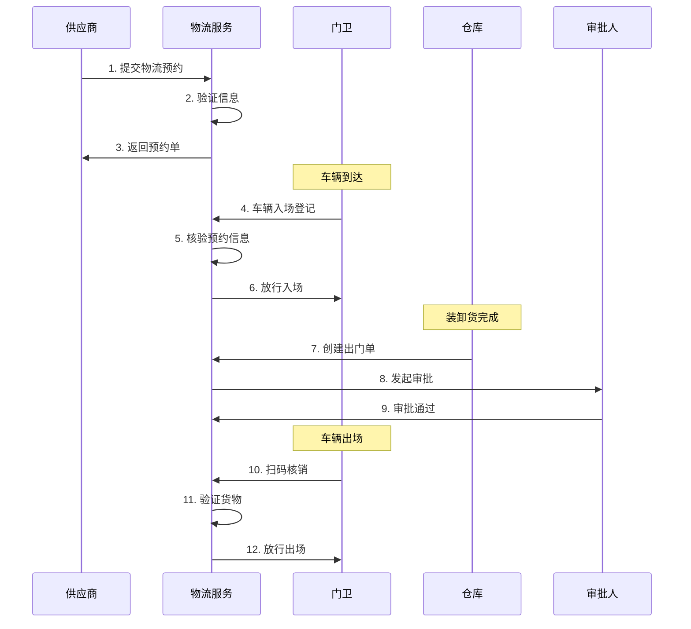
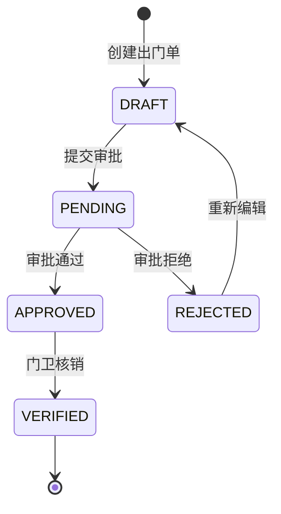

# 物流管理子模块

## 1. 功能说明

### 1.1 司机管理
- 司机信息录入（姓名、证件、驾驶证）
- 司机黑名单管理
- 司机资质审核
- 司机历史记录

### 1.2 车辆管理
- 车辆信息录入（车牌、类型、证件）
- 车辆与司机绑定
- 车辆黑名单管理
- 车辆通行记录

### 1.3 物流预约
- 送货预约
- 提货预约
- 转运预约
- 货物信息登记

### 1.4 物流登记
- 车辆入场登记
- 货物装卸登记
- 车辆出场登记
- 电子出门单

### 1.5 电子出门单
- 出门单创建
- 多级审批
- 二维码核销
- 货物核验

## 2. 用户故事

### US-VIS-LOG-001: 物流预约
**作为** 供应商  
**我希望** 提前预约送货时间  
**以便** 安排物流配送

**验收标准:**
- 填写送货信息和货物清单
- 选择送货日期和时间段
- 生成物流预约单
- 收到预约确认

### US-VIS-LOG-002: 车辆入场
**作为** 司机  
**我希望** 快速完成入场登记  
**以便** 尽快开始装卸货

### US-VIS-LOG-003: 电子出门单
**作为** 仓库管理员  
**我希望** 创建电子出门单  
**以便** 规范货物出场流程

## 3. 数据库设计

### vis_driver 司机信息表
| 字段名 | 类型 | 说明 |
|--------|------|------|
| id | BIGINT | 主键 |
| name | VARCHAR(50) | 姓名 |
| id_card | VARCHAR(18) | 身份证号 |
| phone | VARCHAR(20) | 手机号 |
| driver_license | VARCHAR(50) | 驾驶证号 |
| license_type | VARCHAR(10) | 准驾车型 |
| license_expire | DATE | 驾驶证有效期 |
| company_name | VARCHAR(100) | 所属公司 |
| blacklisted | TINYINT | 是否黑名单 |
| create_time | DATETIME | 创建时间 |

### vis_vehicle 车辆信息表
| 字段名 | 类型 | 说明 |
|--------|------|------|
| id | BIGINT | 主键 |
| plate_no | VARCHAR(20) | 车牌号 |
| vehicle_type | VARCHAR(20) | 车辆类型 |
| brand | VARCHAR(50) | 品牌型号 |
| color | VARCHAR(20) | 颜色 |
| owner_name | VARCHAR(50) | 车主姓名 |
| driver_id | BIGINT | 绑定司机ID |
| blacklisted | TINYINT | 是否黑名单 |
| create_time | DATETIME | 创建时间 |

### vis_logistics_reservation 物流预约表
| 字段名 | 类型 | 说明 |
|--------|------|------|
| id | BIGINT | 主键 |
| reservation_no | VARCHAR(32) | 预约编号 |
| logistics_type | VARCHAR(20) | 物流类型 |
| driver_id | BIGINT | 司机ID |
| vehicle_id | BIGINT | 车辆ID |
| supplier_name | VARCHAR(100) | 供应商名称 |
| contact_person | VARCHAR(50) | 联系人 |
| contact_phone | VARCHAR(20) | 联系电话 |
| visit_date | DATE | 预约日期 |
| time_slot | VARCHAR(20) | 时间段 |
| cargo_info | JSON | 货物信息 |
| destination | VARCHAR(200) | 目的地 |
| status | VARCHAR(20) | 状态 |
| create_time | DATETIME | 创建时间 |

### vis_gate_pass 电子出门单表
| 字段名 | 类型 | 说明 |
|--------|------|------|
| id | BIGINT | 主键 |
| pass_no | VARCHAR(32) | 出门单号 |
| logistics_id | BIGINT | 物流登记ID |
| vehicle_id | BIGINT | 车辆ID |
| driver_id | BIGINT | 司机ID |
| cargo_list | JSON | 货物清单 |
| applicant_id | BIGINT | 申请人ID |
| approval_status | VARCHAR(20) | 审批状态 |
| approver_id | BIGINT | 审批人ID |
| approval_time | DATETIME | 审批时间 |
| qr_code | VARCHAR(500) | 核销二维码 |
| verified | TINYINT | 是否已核销 |
| verify_time | DATETIME | 核销时间 |
| create_time | DATETIME | 创建时间 |

## 4. API接口

### 4.1 创建物流预约
```http
POST /api/v1/visitor/logistics/reservation/create
```

### 4.2 车辆入场登记
```http
POST /api/v1/visitor/logistics/checkIn
```

### 4.3 创建出门单
```http
POST /api/v1/visitor/logistics/gatePass/create
```

### 4.4 审批出门单
```http
POST /api/v1/visitor/logistics/gatePass/approve
```

### 4.5 核销出门单
```http
POST /api/v1/visitor/logistics/gatePass/verify
```

## 5. 业务流程



## 6. 出门单审批流程



