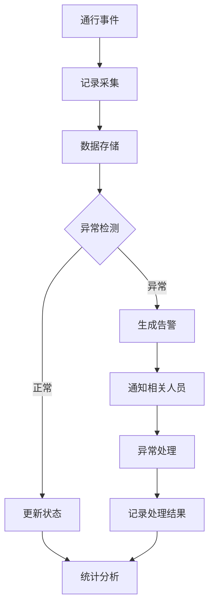

# 通行记录子模块

## 1. 功能说明

### 1.1 通行记录管理
- 访客通行记录采集
- 通行记录查询
- 通行轨迹追踪
- 通行数据统计

### 1.2 异常管理
- 异常事件检测
- 异常告警通知
- 异常处理记录
- 异常统计分析

### 1.3 实时监控
- 在场访客监控
- 区域人员分布
- 超时预警
- 越权告警

## 2. 用户故事

### US-VIS-ACC-001: 通行记录查询
**作为** 安保人员  
**我希望** 查询访客的通行记录  
**以便** 了解访客的活动轨迹

**验收标准:**
- 支持按访客/时间/区域查询
- 显示完整通行轨迹
- 支持导出记录
- 响应时间<2秒

### US-VIS-ACC-002: 异常告警
**作为** 安保人员  
**我希望** 及时收到异常事件告警  
**以便** 快速响应处理

### US-VIS-ACC-003: 在场监控
**作为** 管理人员  
**我希望** 实时查看在场访客情况  
**以便** 掌握园区访客动态

## 3. 数据库设计

### vis_access_record 通行记录表
| 字段名 | 类型 | 说明 |
|--------|------|------|
| id | BIGINT | 主键 |
| registration_id | BIGINT | 登记ID |
| visitor_id | BIGINT | 访客ID |
| device_id | BIGINT | 设备ID |
| area_id | BIGINT | 区域ID |
| access_type | VARCHAR(20) | 通行类型(IN/OUT) |
| access_time | DATETIME | 通行时间 |
| access_method | VARCHAR(20) | 验证方式 |
| access_result | VARCHAR(20) | 通行结果 |
| photo_url | VARCHAR(500) | 抓拍照片 |
| create_time | DATETIME | 创建时间 |

### vis_access_exception 异常记录表
| 字段名 | 类型 | 说明 |
|--------|------|------|
| id | BIGINT | 主键 |
| access_record_id | BIGINT | 通行记录ID |
| visitor_id | BIGINT | 访客ID |
| exception_type | VARCHAR(20) | 异常类型 |
| exception_desc | VARCHAR(500) | 异常描述 |
| severity | VARCHAR(20) | 严重程度 |
| status | VARCHAR(20) | 处理状态 |
| handler_id | BIGINT | 处理人ID |
| handle_time | DATETIME | 处理时间 |
| handle_result | VARCHAR(500) | 处理结果 |
| create_time | DATETIME | 创建时间 |

## 4. API接口

### 4.1 查询通行记录
```http
POST /api/v1/visitor/access/record/query
```

**请求参数:**
```json
{
  "visitorId": 1001,
  "areaId": 101,
  "startTime": "2024-01-01 00:00:00",
  "endTime": "2024-01-31 23:59:59",
  "pageNum": 1,
  "pageSize": 20
}
```

### 4.2 获取访客轨迹
```http
GET /api/v1/visitor/access/track/{visitorId}
```

### 4.3 获取在场访客
```http
GET /api/v1/visitor/access/onsite
```

### 4.4 查询异常记录
```http
POST /api/v1/visitor/access/exception/query
```

### 4.5 处理异常
```http
POST /api/v1/visitor/access/exception/handle
```

## 5. 异常类型

| 异常类型 | 说明 | 处理方式 |
|----------|------|----------|
| OVERTIME | 访客超时未离开 | 通知被访人/安保 |
| UNAUTHORIZED | 未授权区域访问 | 告警+阻止 |
| BLACKLIST | 黑名单人员通行 | 告警+拦截 |
| TAILGATING | 尾随通行 | 告警+复核 |
| FORCED_ENTRY | 强行闯入 | 告警+报警 |
| CREDENTIAL_INVALID | 凭证失效 | 提示重新登记 |

## 6. 业务流程



## 7. 实时监控大屏

### 7.1 监控指标
- 当前在场访客数
- 今日访客总数
- 各区域访客分布
- 实时通行事件
- 异常告警列表
- 访客趋势图

### 7.2 告警规则
| 规则 | 触发条件 | 告警级别 |
|------|----------|----------|
| 超时预警 | 访客超过预计离开时间30分钟 | 警告 |
| 超时告警 | 访客超过预计离开时间2小时 | 严重 |
| 区域人数预警 | 区域人数超过容量80% | 警告 |
| 区域人数告警 | 区域人数超过容量100% | 严重 |
| 黑名单告警 | 检测到黑名单人员 | 紧急 |

