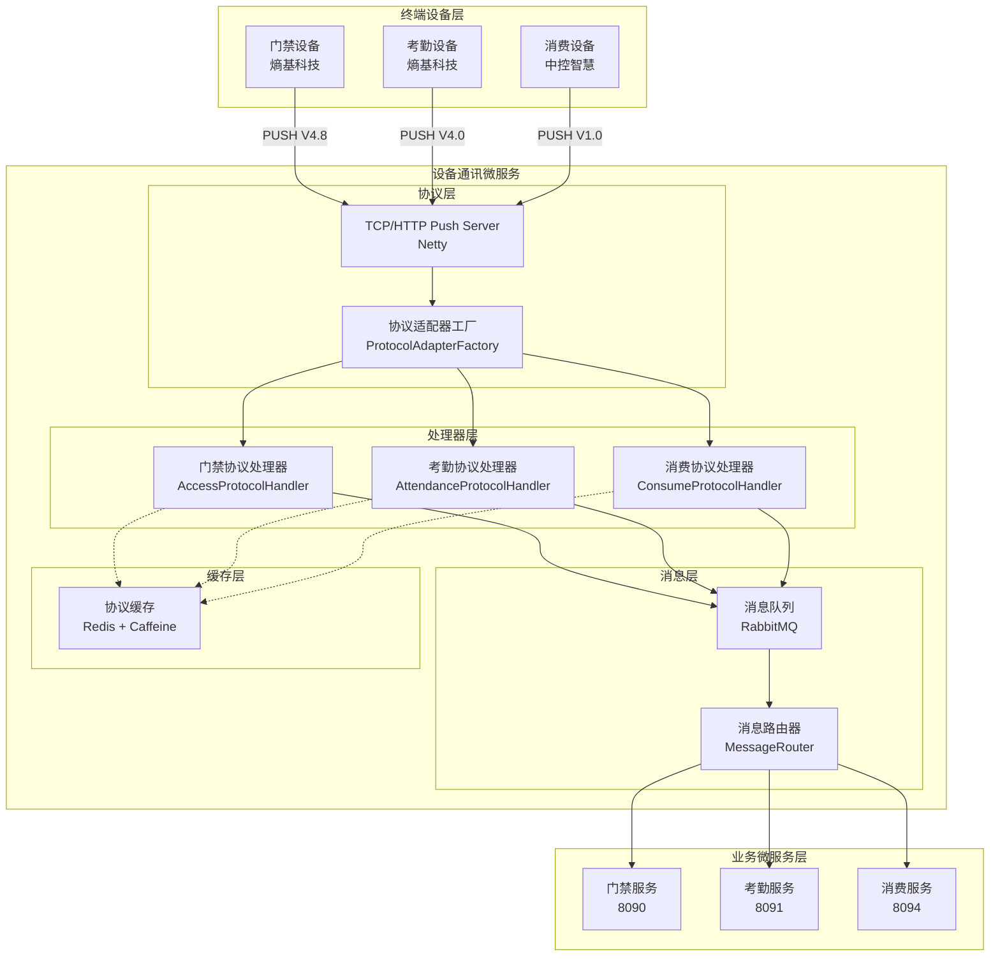

# 设备通讯微服务总体设计文档

> **版本**: v1.0.0  
> **微服务**: ioedream-device-comm-service (端口: 8087)  
> **创建日期**: 2025-12-17  
> **技术栈**: Spring Boot 3.5.8 + Java 17 + RabbitMQ + Netty

---

## 📋 服务概述

设备通讯微服务（ioedream-device-comm-service）是IOE-DREAM智慧园区系统的核心基础设施服务，负责与门禁、考勤、消费等终端设备进行通讯，实现设备数据的采集、解析、转发和命令下发。

### 核心职责

1. **协议解析** - 解析多种设备协议（PUSH协议）
2. **数据采集** - 实时采集设备事件和状态数据
3. **消息路由** - 将解析后的数据路由到对应业务服务
4. **命令下发** - 向设备下发控制命令和配置数据
5. **设备管理** - 设备注册、状态监控、健康检查

---

## 🏗️ 系统架构

### 整体架构图



### 代码结构

```
ioedream-device-comm-service/
└── src/main/java/net/lab1024/sa/devicecomm/
    ├── biometric/                    # 生物识别数据管理
    │   └── BiometricDataManager.java
    ├── cache/                        # 协议缓存服务
    │   ├── ProtocolCacheService.java
    │   └── ProtocolCacheServiceImpl.java
    ├── config/                       # 配置类
    │   ├── DynamicThreadPoolConfig.java
    │   └── ProtocolMessageQueueConfig.java
    ├── consumer/                     # 消息消费者
    │   └── ProtocolMessageConsumer.java
    ├── controller/                   # 控制器层
    │   ├── BiometricController.java
    │   ├── BiometricIntegrationController.java
    │   ├── DeviceSyncController.java
    │   └── ProtocolController.java
    ├── device/                       # 设备管理
    │   ├── enums/DeviceTypeEnum.java
    │   ├── manager/DeviceStatusManager.java
    │   └── monitor/DeviceHealthMonitor.java
    ├── domain/                       # 领域对象
    │   ├── form/DeviceQueryForm.java
    │   └── vo/DeviceListVO.java
    ├── integration/                  # 集成服务
    │   └── BiometricIntegrationService.java
    ├── protocol/                     # 协议处理核心
    │   ├── adapter/ProtocolAdapterFactory.java
    │   ├── client/DeviceProtocolClient.java
    │   ├── enums/                    # 协议枚举
    │   │   ├── AccessEventTypeEnum.java
    │   │   ├── AttendanceStatusEnum.java
    │   │   ├── ProtocolTypeEnum.java
    │   │   ├── PunchTypeEnum.java
    │   │   └── VerifyTypeEnum.java
    │   ├── handler/                  # 协议处理器
    │   │   ├── impl/
    │   │   │   ├── AccessProtocolHandler.java
    │   │   │   ├── AttendanceProtocolHandler.java
    │   │   │   ├── BiometricProtocolHandler.java
    │   │   │   └── ConsumeProtocolHandler.java
    │   │   ├── ProtocolHandler.java
    │   │   ├── ProtocolParseException.java
    │   │   └── ProtocolProcessException.java
    │   ├── message/ProtocolMessage.java
    │   ├── router/MessageRouter.java
    │   └── server/TcpPushServer.java
    └── service/                      # 服务层
        ├── BiometricService.java
        └── DeviceSyncService.java
```

---

## 📡 支持的协议

### 协议类型枚举

| 协议代码 | 协议名称 | 厂商 | 版本 | 设备类型 |
|----------|----------|------|------|----------|
| ACCESS_ENTROPY_V4.8 | 安防PUSH协议 | 熵基科技 | V4.8 | 门禁 |
| ATTENDANCE_ENTROPY_V4.0 | 考勤PUSH协议 | 熵基科技 | V4.0 | 考勤 |
| CONSUME_ZKTECO_V1.0 | 消费PUSH协议 | 中控智慧 | V1.0 | 消费 |

### 协议特点

- **基于HTTP**: 所有协议均基于HTTP协议，使用POST方法传输数据
- **编码**: UTF-8（中文时可能使用GB2312/GB18030）
- **数据格式**: 键值对格式，使用制表符（\t）分隔
- **主动上传**: 设备主动向服务器推送数据
- **断点续传**: 支持网络中断后的数据续传

---

## 🔧 核心组件设计

### 1. 协议处理器接口

```java
public interface ProtocolHandler {
    /**
     * 获取协议类型
     */
    String getProtocolType();
    
    /**
     * 获取设备厂商
     */
    String getManufacturer();
    
    /**
     * 获取协议版本
     */
    String getVersion();
    
    /**
     * 解析协议消息（二进制格式）
     */
    ProtocolMessage parseMessage(byte[] rawData) throws ProtocolParseException;
    
    /**
     * 解析协议消息（文本格式）
     */
    ProtocolMessage parseMessage(String rawData) throws ProtocolParseException;
    
    /**
     * 验证消息
     */
    boolean validateMessage(ProtocolMessage message);
    
    /**
     * 处理消息
     */
    void processMessage(ProtocolMessage message, Long deviceId) throws ProtocolProcessException;
    
    /**
     * 构建响应
     */
    byte[] buildResponse(ProtocolMessage requestMessage, boolean success, String errorCode, String errorMessage);
}
```

### 2. 协议消息结构

```java
public class ProtocolMessage {
    private String protocolType;      // 协议类型
    private String messageType;       // 消息类型
    private String deviceCode;        // 设备编号
    private Long deviceId;            // 设备ID
    private LocalDateTime timestamp;  // 时间戳
    private Map<String, Object> data; // 解析后的数据
    private String status;            // 处理状态
    private String errorCode;         // 错误码
    private String errorMessage;      // 错误信息
    private String rawDataHex;        // 原始数据（十六进制）
    private byte[] rawDataBytes;      // 原始数据（字节）
}
```

### 3. 消息队列配置

| 队列名称 | 用途 | 消费者 |
|----------|------|--------|
| protocol.access.record | 门禁通行记录 | 门禁服务 |
| protocol.attendance.record | 考勤打卡记录 | 考勤服务 |
| protocol.consume.record | 消费交易记录 | 消费服务 |
| protocol.device.status | 设备状态更新 | 设备管理服务 |
| protocol.alarm.event | 报警事件 | 监控服务 |

---

## 📊 性能指标

| 指标项 | 要求 |
|--------|------|
| 协议解析延迟 | ≤ 10毫秒 |
| 消息处理吞吐量 | ≥ 10000条/秒 |
| 设备连接数 | ≥ 5000个 |
| 消息队列延迟 | ≤ 100毫秒 |
| 服务可用性 | ≥ 99.99% |

---

## 🔗 服务依赖

### 依赖的基础设施

- **RabbitMQ**: 消息队列
- **Redis**: 缓存、分布式锁
- **Nacos**: 服务注册与配置中心

### 下游服务

- **ioedream-access-service**: 门禁服务
- **ioedream-attendance-service**: 考勤服务
- **ioedream-consume-service**: 消费服务

---

**📝 文档维护**: IOE-DREAM架构团队 | 2025-12-17
