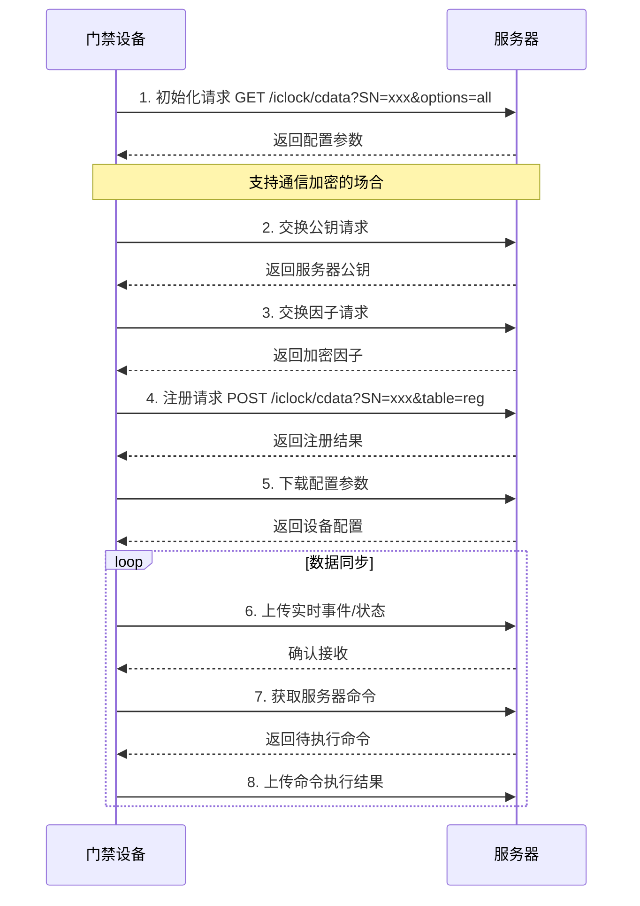

# 安防PUSH通讯协议规范（熵基科技 V4.8）

> **版本**: V4.8  
> **协议版本**: V3.1.2  
> **厂商**: 熵基科技  
> **文档日期**: 2024-01-07  
> **适用设备**: 门禁一体机、门禁控制器、通道控制器

---

## 📋 协议概述

安防PUSH协议是熵基科技定义的门禁设备与服务器之间的数据交互协议，基于HTTP协议实现，主要用于门禁事件上传、设备状态同步、人员数据下发等功能。

### 协议特点

- **基于HTTP**: 使用HTTP POST方法传输数据
- **编码**: 统一使用UTF-8编码
- **数据格式**: 键值对格式，使用制表符（\t）分隔
- **主动推送**: 设备主动向服务器推送数据
- **双向通信**: 支持服务器向设备下发命令

---

## 🔄 通信流程

### 初始化流程



---

## 📤 上传协议

### 1. 上传实时事件（rtlog表）

**请求格式**:
```
POST /iclock/cdata?SN=${SerialNumber}&table=rtlog&Stamp=${Stamp}
Content-Type: application/x-www-form-urlencoded

time=${Time}\tpin=${Pin}\tcardno=${CardNo}\teventaddr=${EventAddr}\tevent=${Event}\tinoutstatus=${InOutStatus}\tverifytype=${VerifyType}\tindex=${Index}
```

**字段说明**:

| 字段名 | 类型 | 必填 | 说明 |
|--------|------|------|------|
| time | String | 是 | 事件时间，格式：YYYY-MM-DD HH:MM:SS |
| pin | String | 是 | 人员工号（用户ID） |
| cardno | String | 否 | 卡号 |
| sitecode | String | 否 | 门禁站点代码 |
| linkid | String | 否 | 关联ID |
| eventaddr | Integer | 是 | 事件点（门号） |
| event | Integer | 是 | 事件码（详见附录） |
| inoutstatus | Integer | 是 | 进出状态：0-进入，1-离开 |
| verifytype | Integer | 是 | 验证方式码（详见附录） |
| index | Integer | 是 | 记录索引号 |
| maskflag | Integer | 否 | 口罩状态：0-无口罩，1-有口罩 |
| temperature | Decimal | 否 | 原始温度值 |
| convtemperature | Decimal | 否 | 转换后温度值 |
| bitCount | Integer | 否 | 韦根位数（韦根2.0） |

### 2. 上传实时状态

**请求格式**:
```
POST /iclock/cdata?SN=${SerialNumber}&table=status&Stamp=${Stamp}

sensor=${Sensor}\trelay=${Relay}\talarm=${Alarm}
```

**字段说明**:

| 字段名 | 类型 | 说明 |
|--------|------|------|
| sensor | Integer | 传感器状态位图 |
| relay | Integer | 继电器状态位图 |
| alarm | Integer | 报警状态位图（详见附录） |

**alarm字段位图**:
- 第0位: 设备主体拆机报警
- 第1位: 门被破坏报警
- 第2位: 人体感应报警
- 第3位: 胁迫密码报警
- 第4位: 紧急呼叫报警
- 第5位: 火警输入报警
- 第6位: 市电掉电报警
- 第7位: 电池掉电报警
- 第8位: 读头拆机报警

### 3. 上传命令返回结果

**请求格式**:
```
POST /iclock/devicecmd?SN=${SerialNumber}

ID=${CmdID}&Return=${ReturnValue}&CMD=DATA
```

---

## 📥 下载协议

### 1. DATA命令

#### 1.1 UPDATE子命令（下发数据）

**下发用户信息**:
```
C:${CmdID}:DATA UPDATE USERINFO PIN=${Pin}\tName=${Name}\tCardNo=${CardNo}\tPasswd=${Passwd}\tPri=${Pri}
```

**下发指纹模板**:
```
C:${CmdID}:DATA UPDATE FINGERTMP PIN=${Pin}\tFID=${FID}\tSize=${Size}\tValid=${Valid}\tTMP=${TmpData}
```

**下发比对照片**:
```
C:${CmdID}:DATA UPDATE BIOPHOTO PIN=${Pin}\tType=${Type}\tSize=${Size}\tContent=${Content}\tFormat=${Format}
```

**下发一体化模板**:
```
C:${CmdID}:DATA UPDATE BIODATA PIN=${Pin}\tType=${Type}\tNo=${No}\tMinorVer=${MinorVer}\tMajorVer=${MajorVer}\tFormat=${Format}\tSize=${Size}\tTMP=${TmpData}
```

#### 1.2 DELETE子命令（删除数据）

**删除用户**:
```
C:${CmdID}:DATA DELETE USERINFO PIN=${Pin}
```

**删除指纹**:
```
C:${CmdID}:DATA DELETE FINGERTMP PIN=${Pin}\tFID=${FID}
```

#### 1.3 QUERY子命令（查询数据）

**查询门禁记录**:
```
C:${CmdID}:DATA QUERY ACCRECORD StartTime=${StartTime}\tEndTime=${EndTime}
```

### 2. CONTROL DEVICE命令

**控制类命令格式**:
```
C:${CmdID}:CONTROL DEVICE ${AA} ${Param}
```

| AA值 | 功能 | 参数说明 |
|------|------|----------|
| 01 | 远程开门 | 门号,开锁时间 |
| 02 | 门常开 | 门号 |
| 03 | 门常闭 | 门号 |
| 04 | 取消报警 | - |
| 05 | 获取电池电量 | - |
| 06 | 重启设备 | - |
| 14 | 同步时间 | 时间戳 |
| 15 | 远程锁定 | 门号 |
| 16 | 远程解锁 | 门号 |

### 3. SET OPTIONS命令

**设置设备参数**:
```
C:${CmdID}:SET OPTIONS ${Key}=${Value}
```

**常用参数**:

| 参数名 | 说明 | 取值范围 |
|--------|------|----------|
| LockDelay | 开锁时间 | 1-254秒 |
| DoorSensorDelay | 门磁超时 | 0-254秒 |
| PassMode | 通行模式 | 0-多人,1-单人 |
| AntiPassback | 反潜模式 | 0-禁用,1-启用 |

---

## 📋 附录

### 附录1: 实时事件码

#### 正常事件（0-255）

| 事件码 | 说明 |
|--------|------|
| 0 | 正常验证通过 |
| 1 | 验证通过-刷卡 |
| 2 | 出门按钮 |
| 3 | 验证通过-卡加密码 |
| 4 | 验证通过-只有密码 |
| 5 | 验证通过-只有用户号 |
| 6 | 验证通过-卡加指纹 |
| 200 | 门被打开 |
| 201 | 门被关闭 |
| 220 | 辅助输入点被打开 |

#### 异常事件（5000-5999）

| 事件码 | 说明 |
|--------|------|
| 5001 | 出门按钮被锁定 |
| 5002 | 无效的时间段 |
| 5003 | 非法时区 |
| 5004 | 非法入场 |
| 5005 | 非法出口 |
| 5006 | 反潜回检查失败 |
| 5007 | 互锁检查失败 |
| 5017 | 梯控-非法层 |
| 5021 | 二维码无效 |
| 5022 | 人脸比对失败 |

#### 报警事件（6000-6999）

| 事件码 | 说明 |
|--------|------|
| 6001 | 黄码健康码 |
| 6002 | 红码健康码 |
| 6003 | 未知健康状态 |
| 6004 | 胁迫密码报警 |
| 6005 | 门磁超时报警 |
| 6006 | 非法开门报警 |
| 6007 | 拆机报警 |

### 附录2: 验证方式码

| 验证码 | 说明 |
|--------|------|
| 0 | 密码 |
| 1 | 指纹 |
| 2 | 卡片 |
| 3 | 卡片+密码 |
| 4 | 指纹+密码 |
| 5 | 指纹+卡片 |
| 6 | 指纹+卡片+密码 |
| 7 | 用户号+密码 |
| 8 | 人脸 |
| 9 | 人脸+指纹 |
| 10 | 人脸+密码 |
| 11 | 人脸+卡片 |
| 15 | 混合验证 |
| 25 | 掌纹 |
| 26 | 掌纹+卡 |
| 27 | 掌纹+人脸 |
| 28 | 掌纹+指纹 |
| 29 | 掌纹+指纹+人脸 |

### 附录3: 生物识别类型索引

| 类型 | 说明 |
|------|------|
| 0 | 通用指纹 |
| 1 | 指纹1 |
| 2 | 指纹2 |
| 3 | 指纹3 |
| 4 | 指静脉 |
| 5 | 红外人脸 |
| 6 | 可见光人脸 |
| 7 | 掌纹 |
| 8 | 指掌 |
| 9 | 虹膜 |
| 10 | 可见光手掌 |

---

## 🔒 数据加密方案

### 加密流程

1. **交换公钥**: 设备和服务器交换RSA公钥
2. **交换因子**: 使用RSA加密传输AES密钥
3. **数据加密**: 使用AES-128-CBC加密数据传输

### 加密参数

- **RSA**: 1024位密钥
- **AES**: 128位密钥，CBC模式
- **填充**: PKCS7

---

**📝 文档维护**: IOE-DREAM架构团队 | 2025-12-17
