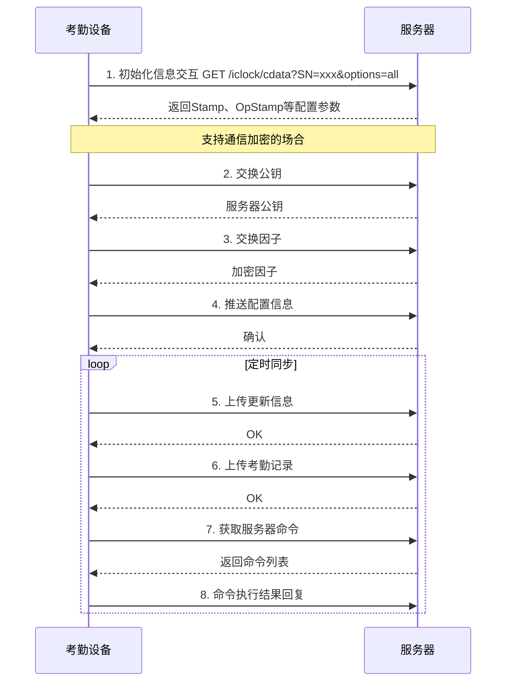

# 考勤PUSH通讯协议规范（熵基科技 V4.0）

> **版本**: V4.0  
> **协议版本**: V2.4.2  
> **厂商**: 熵基科技  
> **文档日期**: 2021-01-13  
> **适用设备**: 考勤机、指纹机、人脸识别终端

---

## 📋 协议概述

考勤PUSH协议是熵基科技定义的考勤设备与服务器之间的数据交互协议，主要用于考勤记录上传、用户数据同步、设备配置管理等功能。

### 协议特点

- **基于HTTP**: 使用HTTP GET/POST方法传输数据
- **编码规则**: 
  - 中文: GB2312编码
  - 其他语言: UTF-8编码
- **数据格式**: 键值对格式，使用制表符（\t）分隔
- **断点续传**: 支持网络中断后的数据续传

---

## 🔄 通信流程

### 协议流程图



---

## 📤 上传协议

### 1. 上传考勤记录（ATTLOG表）

**请求格式**:
```
POST /iclock/cdata?SN=${SerialNumber}&table=ATTLOG&Stamp=${Stamp}
Content-Type: application/x-www-form-urlencoded

${Pin}\t${Time}\t${Status}\t${Verify}\t${Workcode}\t${Reserved1}\t${Reserved2}
```

**字段说明**:

| 字段名 | 类型 | 必填 | 说明 |
|--------|------|------|------|
| Pin | String | 是 | 人员工号 |
| Time | String | 是 | 考勤时间，格式：YYYY-MM-DD HH:MM:SS |
| Status | Integer | 是 | 考勤状态：0-上班签到，1-下班签退，2-外出，3-外出返回，4-加班签到，5-加班签退 |
| Verify | Integer | 是 | 验证方式：0-密码，1-指纹，2-卡片，3-其他 |
| Workcode | String | 否 | 工作代码 |
| Reserved1 | String | 否 | 预留字段1 |
| Reserved2 | String | 否 | 预留字段2 |

**扩展字段（V3.9+）**:

| 字段名 | 类型 | 说明 |
|--------|------|------|
| MaskFlag | Integer | 口罩状态：0-无，1-有 |
| Temperature | Decimal | 原始温度 |
| ConvTemperature | Decimal | 转换温度 |

### 2. 上传考勤照片

**请求格式**:
```
POST /iclock/fdata?SN=${SerialNumber}&table=ATTPHOTO&Stamp=${Stamp}&PIN=${Pin}&CHECKSUM=${Checksum}
Content-Type: application/octet-stream

${BinaryPhotoData}
```

### 3. 上传操作记录（OPERLOG表）

**请求格式**:
```
POST /iclock/cdata?SN=${SerialNumber}&table=OPERLOG&Stamp=${Stamp}

${OpType}\t${OpWho}\t${OpTime}\t${OpObj1}\t${OpObj2}\t${OpObj3}\t${OpObj4}
```

**操作类型（OpType）**:

| 代码 | 说明 |
|------|------|
| 0 | 开机 |
| 1 | 关机 |
| 2 | 管理员确认 |
| 3 | 恢复出厂设置 |
| 4 | 新增用户 |
| 5 | 修改用户 |
| 6 | 删除用户 |
| 7 | 新增指纹 |
| 8 | 删除指纹 |
| 22 | 新增人脸 |
| 23 | 删除人脸 |
| 33 | 门铃呼叫 |
| 124 | 新增掌纹 |
| 125 | 修改掌纹 |
| 126 | 删除掌纹 |

### 4. 上传用户信息（USERINFO表）

**请求格式**:
```
POST /iclock/cdata?SN=${SerialNumber}&table=USERINFO&Stamp=${Stamp}

PIN=${Pin}\tName=${Name}\tPri=${Pri}\tPasswd=${Passwd}\tCard=${CardNo}\tGrp=${Grp}
```

### 5. 上传指纹模板（FINGERTMP表）

**请求格式**:
```
POST /iclock/cdata?SN=${SerialNumber}&table=FINGERTMP&Stamp=${Stamp}

PIN=${Pin}\tFID=${FID}\tSize=${Size}\tValid=${Valid}\tTMP=${TmpData}
```

### 6. 上传一体化模板（BIODATA表）

**请求格式**:
```
POST /iclock/cdata?SN=${SerialNumber}&table=BIODATA&Stamp=${Stamp}

PIN=${Pin}\tNo=${No}\tIndex=${Index}\tValid=${Valid}\tDuress=${Duress}\tType=${Type}\tMajorVer=${MajorVer}\tMinorVer=${MinorVer}\tFormat=${Format}\tTmp=${TmpData}
```

**Type类型**:

| 类型 | 说明 |
|------|------|
| 9 | 可见光人脸 |
| 7 | 掌纹模板 |
| 4 | 指静脉模板 |
| 1-3 | 指纹模板 |

---

## 📥 下载协议

### 1. DATA UPDATE命令

#### 下发用户信息
```
C:${CmdID}:DATA UPDATE USERINFO PIN=${Pin}\tName=${Name}\tPri=${Pri}\tPasswd=${Passwd}\tCard=${CardNo}\tGrp=${Grp}\tTZ=${TZ}\tVerify=${Verify}
```

#### 下发指纹模板
```
C:${CmdID}:DATA UPDATE FINGERTMP PIN=${Pin}\tFID=${FID}\tSize=${Size}\tValid=${Valid}\tTMP=${TmpData}
```

#### 下发一体化模板
```
C:${CmdID}:DATA UPDATE BIODATA PIN=${Pin}\tNo=${No}\tIndex=${Index}\tValid=${Valid}\tType=${Type}\tMajorVer=${MajorVer}\tMinorVer=${MinorVer}\tFormat=${Format}\tTmp=${TmpData}
```

#### 下发比对照片
```
C:${CmdID}:DATA UPDATE BIOPHOTO PIN=${Pin}\tType=${Type}\tSize=${Size}\tContent=${Content}\tURL=${URL}
```

#### 下发短消息
```
C:${CmdID}:DATA UPDATE SMS ID=${ID}\tTag=${Tag}\tValidMinutes=${ValidMinutes}\tStartTime=${StartTime}\tContent=${Content}
```

### 2. DATA DELETE命令

#### 删除用户
```
C:${CmdID}:DATA DELETE USERINFO PIN=${Pin}
```

#### 删除指纹
```
C:${CmdID}:DATA DELETE FINGERTMP PIN=${Pin}\tFID=${FID}
```

#### 删除一体化模板
```
C:${CmdID}:DATA DELETE BIODATA PIN=${Pin}\tType=${Type}\tNo=${No}
```

### 3. DATA QUERY命令

#### 查询考勤记录
```
C:${CmdID}:DATA QUERY ATTLOG StartTime=${StartTime}\tEndTime=${EndTime}
```

#### 查询用户信息
```
C:${CmdID}:DATA QUERY USERINFO PIN=${Pin}
```

### 4. CLEAR命令

#### 清除考勤记录
```
C:${CmdID}:CLEAR LOG
```

#### 清除全部数据
```
C:${CmdID}:CLEAR DATA
```

### 5. 配置选项命令

#### 设置选项
```
C:${CmdID}:SET OPTIONS ${Key}=${Value}
```

#### 获取选项
```
C:${CmdID}:GET OPTIONS ${Key}
```

### 6. 控制命令

#### 重启设备
```
C:${CmdID}:REBOOT
```

#### 远程开门
```
C:${CmdID}:AC_UNLOCK ${DoorNo}\t${Delay}
```

---

## 📋 附录

### 附录1: 错误码

| 错误码 | 说明 |
|--------|------|
| 0 | 成功 |
| -1 | 失败 |
| -2 | 数据格式错误 |
| -3 | 参数错误 |
| -4 | 数据已存在 |
| -5 | 数据不存在 |
| -10 | 容量已满 |
| -30 | 一体化模板算法版本不一致 |

### 附录2: 语言编号

| 编号 | 语言 |
|------|------|
| 0 | 英语 |
| 1 | 简体中文 |
| 2 | 繁体中文 |
| 3 | 韩语 |
| 4 | 日语 |

### 附录3: 验证方式

| 代码 | 说明 |
|------|------|
| 0 | 密码 |
| 1 | 指纹 |
| 2 | 卡片 |
| 3 | 面部 |
| 4 | 指静脉 |
| 5 | 掌纹 |

---

## 🔐 混合识别协议

### 协议规范说明

随着生物识别类型增多，为简化开发流程，统一了生物模板下发/上传/查询/删除规范。

### 对接流程

1. 服务器通过初始化接口下发以下参数：
   - `MultiBioDataSupport`: 设备支持的生物识别类型位图
   - `MultiBioPhotoSupport`: 设备支持的照片类型位图

2. 根据支持的类型下发对应的模板数据

### 位图定义

| 位置 | 类型 |
|------|------|
| 0 | 通用指纹 |
| 1-3 | 指纹1-3 |
| 4 | 指静脉 |
| 5 | 红外人脸 |
| 6 | 可见光人脸 |
| 7 | 掌纹 |
| 8 | 指掌 |
| 9 | 虹膜 |
| 10 | 可见光手掌 |

---

**📝 文档维护**: IOE-DREAM架构团队 | 2025-12-17
