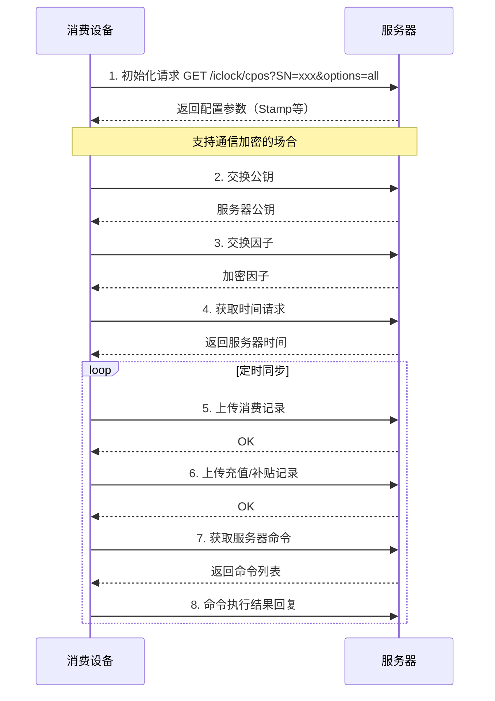

# 消费PUSH通讯协议规范（中控智慧 V1.0）

> **版本**: V1.0  
> **协议版本**: V1.0.0  
> **厂商**: 中控智慧  
> **文档日期**: 2018-10-22  
> **适用设备**: CM102、CM108等新架构消费设备

---

## 📋 协议概述

消费PUSH协议是中控智慧定义的消费设备与服务器之间的数据交互协议，用于消费记录上传、用户数据同步、充值补贴等功能。

### 协议特点

- **基于HTTP**: 使用HTTP GET/POST方法传输数据
- **编码规则**: 
  - 中文: GB18030编码
  - 其他语言: UTF-8编码
- **数据格式**: 键值对格式，使用制表符（\t）分隔
- **断点续传**: 支持网络中断后的数据续传

---

## 🔄 通信流程

### 协议流程图



---

## 📤 上传协议

### 1. 上传消费记录

**请求格式**:
```
POST /iclock/cpos?SN=${SerialNumber}&table=TRANSRECORD&Stamp=${Stamp}
Content-Type: application/x-www-form-urlencoded

${Pin}\t${Time}\t${TransAmount}\t${TransType}\t${MealId}\t${AccNo}\t${Balance}\t${Verify}\t${WorkCode}\t${TransNo}
```

**字段说明**:

| 字段名 | 类型 | 必填 | 说明 |
|--------|------|------|------|
| Pin | String | 是 | 人员工号 |
| Time | String | 是 | 交易时间，格式：YYYY-MM-DD HH:MM:SS |
| TransAmount | Decimal | 是 | 交易金额（分） |
| TransType | Integer | 是 | 交易类型：1-消费，2-充值，3-补贴，4-退款 |
| MealId | Integer | 否 | 餐次ID：1-早餐，2-午餐，3-晚餐，4-夜宵 |
| AccNo | String | 是 | 账户号（卡号） |
| Balance | Decimal | 是 | 交易后余额（分） |
| Verify | Integer | 是 | 验证方式：0-无验证，1-密码，2-指纹，3-人脸 |
| WorkCode | String | 否 | 工作代码 |
| TransNo | String | 是 | 交易流水号 |

### 2. 上传商品消费明细

**请求格式**:
```
POST /iclock/cpos?SN=${SerialNumber}&table=TRANSDETAIL&Stamp=${Stamp}

${TransNo}\t${GoodsId}\t${GoodsName}\t${Qty}\t${Price}\t${Amount}
```

**字段说明**:

| 字段名 | 类型 | 说明 |
|--------|------|------|
| TransNo | String | 交易流水号 |
| GoodsId | String | 商品ID |
| GoodsName | String | 商品名称 |
| Qty | Integer | 数量 |
| Price | Decimal | 单价（分） |
| Amount | Decimal | 金额（分） |

### 3. 上传键值消费明细

**请求格式**:
```
POST /iclock/cpos?SN=${SerialNumber}&table=KEYDETAIL&Stamp=${Stamp}

${TransNo}\t${KeyNo}\t${KeyName}\t${Qty}\t${Price}\t${Amount}
```

### 4. 上传充值记录

**请求格式**:
```
POST /iclock/cpos?SN=${SerialNumber}&table=RECHARGE&Stamp=${Stamp}

${Pin}\t${Time}\t${Amount}\t${Type}\t${AccNo}\t${Balance}\t${Operator}\t${TransNo}
```

**字段说明**:

| 字段名 | 类型 | 说明 |
|--------|------|------|
| Pin | String | 人员工号 |
| Time | String | 充值时间 |
| Amount | Decimal | 充值金额（分） |
| Type | Integer | 充值类型：1-现金，2-银行卡，3-微信，4-支付宝 |
| AccNo | String | 账户号 |
| Balance | Decimal | 充值后余额（分） |
| Operator | String | 操作员 |
| TransNo | String | 交易流水号 |

### 5. 上传补贴记录

**请求格式**:
```
POST /iclock/cpos?SN=${SerialNumber}&table=SUBSIDY&Stamp=${Stamp}

${Pin}\t${Time}\t${Amount}\t${SubType}\t${AccNo}\t${Balance}\t${Period}\t${TransNo}
```

**字段说明**:

| 字段名 | 类型 | 说明 |
|--------|------|------|
| Pin | String | 人员工号 |
| Time | String | 补贴时间 |
| Amount | Decimal | 补贴金额（分） |
| SubType | Integer | 补贴类型：1-固定，2-按次，3-按金额 |
| AccNo | String | 账户号 |
| Balance | Decimal | 补贴后余额（分） |
| Period | String | 补贴周期 |
| TransNo | String | 交易流水号 |

---

## 📥 下载协议

### 1. DATA UPDATE命令

#### 下发用户信息
```
C:${CmdID}:DATA UPDATE USERINFO PIN=${Pin}\tName=${Name}\tCard=${CardNo}\tBalance=${Balance}\tSubsidy=${Subsidy}\tStatus=${Status}
```

#### 下发消费限额
```
C:${CmdID}:DATA UPDATE LIMIT PIN=${Pin}\tDayLimit=${DayLimit}\tMealLimit=${MealLimit}\tTimesLimit=${TimesLimit}
```

#### 下发价格表
```
C:${CmdID}:DATA UPDATE PRICE KeyNo=${KeyNo}\tKeyName=${KeyName}\tPrice=${Price}\tStatus=${Status}
```

### 2. DATA DELETE命令

#### 删除用户
```
C:${CmdID}:DATA DELETE USERINFO PIN=${Pin}
```

### 3. DATA QUERY命令

#### 查询消费记录
```
C:${CmdID}:DATA QUERY TRANSRECORD StartTime=${StartTime}\tEndTime=${EndTime}
```

#### 查询余额
```
C:${CmdID}:DATA QUERY BALANCE PIN=${Pin}
```

### 4. CLEAR命令

#### 清除交易记录
```
C:${CmdID}:CLEAR TRANS
```

### 5. SYNC命令

#### 同步时间
```
C:${CmdID}:SYNC TIME ${ServerTime}
```

#### 同步数据
```
C:${CmdID}:SYNC DATA ${TableName}
```

### 6. 特殊命令

#### 挂失
```
C:${CmdID}:LOSS PIN=${Pin}\tCard=${CardNo}
```

#### 解挂
```
C:${CmdID}:UNLOSS PIN=${Pin}\tCard=${CardNo}
```

#### 修改密码
```
C:${CmdID}:CHGPWD PIN=${Pin}\tOldPwd=${OldPwd}\tNewPwd=${NewPwd}
```

---

## 📋 附录

### 附录1: 错误码

| 错误码 | 说明 |
|--------|------|
| 0 | 成功 |
| -1 | 失败 |
| -2 | 余额不足 |
| -3 | 超过限额 |
| -4 | 卡已挂失 |
| -5 | 卡已过期 |
| -6 | 无效时间段 |
| -7 | 账户不存在 |

### 附录2: 交易类型

| 代码 | 说明 |
|------|------|
| 1 | 消费 |
| 2 | 充值 |
| 3 | 补贴 |
| 4 | 退款 |
| 5 | 冲正 |
| 6 | 结算 |

### 附录3: 餐次定义

| 代码 | 说明 | 时间段 |
|------|------|--------|
| 1 | 早餐 | 06:00-09:00 |
| 2 | 午餐 | 11:00-14:00 |
| 3 | 晚餐 | 17:00-20:00 |
| 4 | 夜宵 | 21:00-23:00 |

### 附录4: 设备功能支持

**IsConsumeFunType字段位图**:

| 位置 | 功能 |
|------|------|
| 0 | 消费补贴一体 |
| 1 | 双钱包功能 |
| 2 | 商品消费 |
| 3 | 键值消费 |
| 4 | 密码验证 |
| 5 | 指纹验证 |
| 6 | 人脸验证 |

---

## 🔧 配置参数

### 初始化参数

| 参数名 | 说明 |
|--------|------|
| PosStamp | 消费记录戳 |
| FullStamp | 全量数据戳 |
| AllowStamp | 白名单戳 |
| Delay | 同步间隔（秒） |
| Realtime | 实时模式 |
| Encrypt | 加密标志 |
| SyncTime | 同步时间 |
| MachineType | 设备类型 |
| UseSection | 使用分区 |
| BackSection | 备用分区 |
| CardPass | 卡片密码 |

---

**📝 文档维护**: IOE-DREAM架构团队 | 2025-12-17
