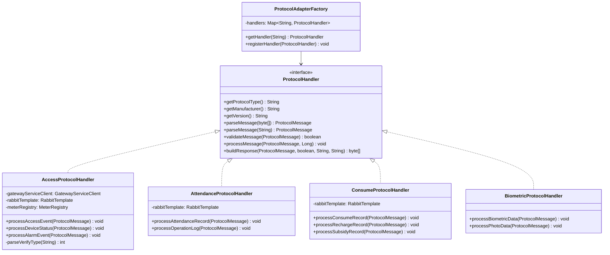

# 协议处理器组件设计文档

> **版本**: v1.0.0  
> **微服务**: ioedream-device-comm-service  
> **创建日期**: 2025-12-17

---

## 📋 组件概述

协议处理器是设备通讯微服务的核心组件，采用策略模式实现多协议支持，每种协议对应一个独立的处理器实现。

---

## 🏗️ 组件架构

### 类图



---

## 📦 核心接口

### ProtocolHandler接口

```java
/**
 * 协议处理器接口
 * <p>
 * 定义协议处理的标准接口，所有协议处理器必须实现此接口
 * </p>
 */
public interface ProtocolHandler {
    
    /**
     * 获取协议类型
     * @return 协议类型代码
     */
    String getProtocolType();
    
    /**
     * 获取设备厂商
     * @return 厂商名称
     */
    String getManufacturer();
    
    /**
     * 获取协议版本
     * @return 版本号
     */
    String getVersion();
    
    /**
     * 解析协议消息（二进制格式）
     * @param rawData 原始字节数据
     * @return 解析后的协议消息
     * @throws ProtocolParseException 解析异常
     */
    ProtocolMessage parseMessage(byte[] rawData) throws ProtocolParseException;
    
    /**
     * 解析协议消息（文本格式）
     * @param rawData 原始文本数据
     * @return 解析后的协议消息
     * @throws ProtocolParseException 解析异常
     */
    ProtocolMessage parseMessage(String rawData) throws ProtocolParseException;
    
    /**
     * 验证消息有效性
     * @param message 协议消息
     * @return true-验证通过，false-验证失败
     */
    boolean validateMessage(ProtocolMessage message);
    
    /**
     * 处理消息
     * @param message 协议消息
     * @param deviceId 设备ID
     * @throws ProtocolProcessException 处理异常
     */
    void processMessage(ProtocolMessage message, Long deviceId) throws ProtocolProcessException;
    
    /**
     * 构建响应消息
     * @param requestMessage 请求消息
     * @param success 是否成功
     * @param errorCode 错误码
     * @param errorMessage 错误信息
     * @return 响应字节数据
     */
    byte[] buildResponse(ProtocolMessage requestMessage, boolean success, 
                         String errorCode, String errorMessage);
}
```

---

## 🔧 处理器实现

### 1. 门禁协议处理器 (AccessProtocolHandler)

**职责**:
- 解析安防PUSH协议（熵基科技V4.8）
- 处理门禁通行事件
- 处理设备状态更新
- 处理报警事件

**消息类型**:

| 类型 | 说明 | 目标队列 |
|------|------|----------|
| ACCESS_RECORD | 门禁通行记录 | protocol.access.record |
| DEVICE_STATUS | 设备状态 | protocol.device.status |
| ALARM_EVENT | 报警事件 | protocol.alarm.event |

**数据字段映射**:

| 协议字段 | 业务字段 | 说明 |
|----------|----------|------|
| pin | userId | 用户ID |
| time | passTime | 通行时间 |
| eventaddr | doorNo | 门号 |
| event | eventCode | 事件码 |
| inoutstatus | passType | 进出类型 |
| verifytype | passMethod | 验证方式 |
| temperature | temperature | 体温 |
| maskflag | maskFlag | 口罩状态 |

### 2. 考勤协议处理器 (AttendanceProtocolHandler)

**职责**:
- 解析考勤PUSH协议（熵基科技V4.0）
- 处理考勤打卡记录
- 处理操作日志

**消息类型**:

| 类型 | 说明 | 目标队列 |
|------|------|----------|
| ATTENDANCE_RECORD | 考勤记录 | protocol.attendance.record |
| OPERATION_LOG | 操作日志 | protocol.operation.log |

**数据字段映射**:

| 协议字段 | 业务字段 | 说明 |
|----------|----------|------|
| Pin | userId | 用户ID |
| Time | punchTime | 打卡时间 |
| Status | punchType | 打卡类型 |
| Verify | verifyMethod | 验证方式 |
| Workcode | workCode | 工作代码 |

### 3. 消费协议处理器 (ConsumeProtocolHandler)

**职责**:
- 解析消费PUSH协议（中控智慧V1.0）
- 处理消费交易记录
- 处理充值记录
- 处理补贴记录

**消息类型**:

| 类型 | 说明 | 目标队列 |
|------|------|----------|
| CONSUME_RECORD | 消费记录 | protocol.consume.record |
| RECHARGE_RECORD | 充值记录 | protocol.recharge.record |
| SUBSIDY_RECORD | 补贴记录 | protocol.subsidy.record |

**数据字段映射**:

| 协议字段 | 业务字段 | 说明 |
|----------|----------|------|
| Pin | userId | 用户ID |
| Time | transTime | 交易时间 |
| TransAmount | amount | 交易金额 |
| TransType | transType | 交易类型 |
| Balance | balance | 余额 |
| AccNo | cardNo | 卡号 |

### 4. 生物识别协议处理器 (BiometricProtocolHandler)

**职责**:
- 处理生物识别模板数据
- 处理比对照片数据
- 支持多种生物识别类型

**支持的生物识别类型**:

| 类型码 | 说明 |
|--------|------|
| 0-3 | 指纹模板 |
| 4 | 指静脉模板 |
| 5 | 红外人脸 |
| 6 | 可见光人脸 |
| 7 | 掌纹模板 |
| 9 | 虹膜模板 |

---

## 🏭 协议适配器工厂

### ProtocolAdapterFactory

```java
/**
 * 协议适配器工厂
 * <p>
 * 管理所有协议处理器，根据协议类型获取对应的处理器
 * </p>
 */
@Component
public class ProtocolAdapterFactory {
    
    private final Map<String, ProtocolHandler> handlers = new ConcurrentHashMap<>();
    
    /**
     * 注册协议处理器
     */
    @PostConstruct
    public void init() {
        // 自动注册所有ProtocolHandler实现
    }
    
    /**
     * 根据协议类型获取处理器
     * @param protocolType 协议类型
     * @return 协议处理器
     */
    public ProtocolHandler getHandler(String protocolType) {
        return handlers.get(protocolType);
    }
    
    /**
     * 根据设备类型和厂商获取处理器
     * @param deviceType 设备类型
     * @param manufacturer 厂商
     * @return 协议处理器
     */
    public ProtocolHandler getHandler(String deviceType, String manufacturer) {
        ProtocolTypeEnum type = ProtocolTypeEnum.getByDeviceTypeAndManufacturer(
            deviceType, manufacturer);
        return type != null ? handlers.get(type.getCode()) : null;
    }
}
```

---

## 📊 扩展新协议

### 步骤

1. **定义协议类型枚举**

```java
// 在ProtocolTypeEnum中添加新协议
NEW_PROTOCOL("NEW_PROTOCOL_V1.0", "新协议", "厂商", "V1.0", "DEVICE_TYPE");
```

2. **实现协议处理器**

```java
@Component
public class NewProtocolHandler implements ProtocolHandler {
    
    @Override
    public String getProtocolType() {
        return ProtocolTypeEnum.NEW_PROTOCOL.getCode();
    }
    
    @Override
    public ProtocolMessage parseMessage(String rawData) throws ProtocolParseException {
        // 实现协议解析逻辑
    }
    
    @Override
    public void processMessage(ProtocolMessage message, Long deviceId) 
            throws ProtocolProcessException {
        // 实现业务处理逻辑
    }
    
    // ... 其他方法实现
}
```

3. **配置消息队列**

```java
// 在ProtocolMessageQueueConfig中添加队列配置
@Bean
public Queue newProtocolQueue() {
    return new Queue("protocol.new.record", true);
}
```

---

## 📈 监控指标

### Micrometer指标

| 指标名 | 类型 | 说明 |
|--------|------|------|
| protocol.message.process | Counter | 消息处理次数 |
| protocol.message.process.duration | Timer | 消息处理耗时 |
| protocol.message.error | Counter | 消息处理错误次数 |
| protocol.queue.operation | Counter | 队列操作次数 |

---

**📝 文档维护**: IOE-DREAM架构团队 | 2025-12-17
