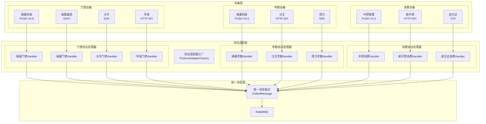

# 多厂商协议扩展架构设计

> **版本**: v1.0.0  
> **微服务**: ioedream-device-comm-service  
> **创建日期**: 2025-12-17

---

## 📋 设计目标

支持多厂商、多协议的设备接入，实现协议处理的组件化、插件化，便于后续扩展新厂商设备。

---

## 🏗️ 多厂商协议架构

### 架构总览



---

## 📦 协议类型枚举扩展

```java
@Getter
public enum ProtocolTypeEnum {

    // ==================== 门禁协议 ====================
    // 熵基科技
    ACCESS_ENTROPY_V4_8("ACCESS_ENTROPY_V4.8", "安防PUSH协议", "熵基科技", "V4.8", "ACCESS", "PUSH"),
    
    // 海康威视
    ACCESS_HIKVISION_ISAPI("ACCESS_HIKVISION_ISAPI", "ISAPI协议", "海康威视", "V2.0", "ACCESS", "HTTP"),
    ACCESS_HIKVISION_EHOME("ACCESS_HIKVISION_EHOME", "EHOME协议", "海康威视", "V5.0", "ACCESS", "TCP"),
    
    // 大华
    ACCESS_DAHUA_SDK("ACCESS_DAHUA_SDK", "SDK协议", "大华", "V3.0", "ACCESS", "SDK"),
    ACCESS_DAHUA_HTTP("ACCESS_DAHUA_HTTP", "HTTP协议", "大华", "V1.0", "ACCESS", "HTTP"),
    
    // 宇视
    ACCESS_UNIVIEW_HTTP("ACCESS_UNIVIEW_HTTP", "HTTP API", "宇视", "V2.0", "ACCESS", "HTTP"),

    // ==================== 考勤协议 ====================
    // 熵基科技
    ATTENDANCE_ENTROPY_V4_0("ATTENDANCE_ENTROPY_V4.0", "考勤PUSH协议", "熵基科技", "V4.0", "ATTENDANCE", "PUSH"),
    
    // 汉王
    ATTENDANCE_HANWANG_HTTP("ATTENDANCE_HANWANG_HTTP", "HTTP协议", "汉王", "V1.0", "ATTENDANCE", "HTTP"),
    
    // 得力
    ATTENDANCE_DELI_SDK("ATTENDANCE_DELI_SDK", "SDK协议", "得力", "V2.0", "ATTENDANCE", "SDK"),

    // ==================== 消费协议 ====================
    // 中控智慧
    CONSUME_ZKTECO_V1_0("CONSUME_ZKTECO_V1.0", "消费PUSH协议", "中控智慧", "V1.0", "CONSUME", "PUSH"),
    
    // 新开普
    CONSUME_NEWCAPEC_HTTP("CONSUME_NEWCAPEC_HTTP", "HTTP协议", "新开普", "V3.0", "CONSUME", "HTTP"),
    
    // 金仕达
    CONSUME_KINGSTAR_TCP("CONSUME_KINGSTAR_TCP", "TCP协议", "金仕达", "V2.0", "CONSUME", "TCP");

    private final String code;           // 协议代码
    private final String name;           // 协议名称
    private final String manufacturer;   // 厂商
    private final String version;        // 版本
    private final String deviceType;     // 设备类型
    private final String transportType;  // 传输类型: PUSH/HTTP/TCP/SDK
    
    // ... 构造函数和方法
}
```

---

## 🔧 协议处理器注册机制

### 自动注册

```java
@Component
public class ProtocolAdapterFactory implements ApplicationContextAware {
    
    private final Map<String, ProtocolHandler> handlers = new ConcurrentHashMap<>();
    private final Map<String, List<ProtocolHandler>> manufacturerHandlers = new ConcurrentHashMap<>();
    
    @Override
    public void setApplicationContext(ApplicationContext context) {
        // 自动发现并注册所有ProtocolHandler实现
        Map<String, ProtocolHandler> beans = context.getBeansOfType(ProtocolHandler.class);
        beans.values().forEach(this::registerHandler);
    }
    
    public void registerHandler(ProtocolHandler handler) {
        handlers.put(handler.getProtocolType(), handler);
        
        // 按厂商分组
        manufacturerHandlers
            .computeIfAbsent(handler.getManufacturer(), k -> new ArrayList<>())
            .add(handler);
            
        log.info("[协议工厂] 注册协议处理器: {} - {} - {}", 
            handler.getManufacturer(), handler.getProtocolType(), handler.getVersion());
    }
    
    /**
     * 根据设备信息自动匹配协议处理器
     */
    public ProtocolHandler matchHandler(String deviceType, String manufacturer, String model) {
        // 1. 精确匹配
        for (ProtocolHandler handler : handlers.values()) {
            if (handler.supports(deviceType, manufacturer, model)) {
                return handler;
            }
        }
        
        // 2. 厂商+设备类型匹配
        ProtocolTypeEnum type = ProtocolTypeEnum.getByDeviceTypeAndManufacturer(deviceType, manufacturer);
        return type != null ? handlers.get(type.getCode()) : null;
    }
}
```

---

## 📋 厂商协议文档规划

### 待集成协议清单

| 厂商 | 设备类型 | 协议 | 优先级 | 状态 |
|------|----------|------|--------|------|
| **熵基科技** | 门禁 | PUSH V4.8 | P0 | ✅ 已完成 |
| **熵基科技** | 考勤 | PUSH V4.0 | P0 | ✅ 已完成 |
| **中控智慧** | 消费 | PUSH V1.0 | P0 | ✅ 已完成 |
| **海康威视** | 门禁 | ISAPI | P1 | 📋 待集成 |
| **海康威视** | 门禁 | EHOME | P1 | 📋 待集成 |
| **大华** | 门禁 | SDK | P1 | 📋 待集成 |
| **宇视** | 门禁 | HTTP API | P2 | 📋 待集成 |
| **汉王** | 考勤 | HTTP | P2 | 📋 待集成 |
| **新开普** | 消费 | HTTP | P2 | 📋 待集成 |

### 文档结构规划

```
06-设备通讯模块/
├── 00-设备通讯微服务总体设计.md
├── 01-门禁设备协议/
│   ├── 01-熵基科技-PUSH-V4.8.md        ✅
│   ├── 02-海康威视-ISAPI-V2.0.md       📋
│   ├── 03-海康威视-EHOME-V5.0.md       📋
│   ├── 04-大华-SDK-V3.0.md             📋
│   └── 05-宇视-HTTP-V2.0.md            📋
├── 02-考勤设备协议/
│   ├── 01-熵基科技-PUSH-V4.0.md        ✅
│   ├── 02-汉王-HTTP-V1.0.md            📋
│   └── 03-得力-SDK-V2.0.md             📋
├── 03-消费设备协议/
│   ├── 01-中控智慧-PUSH-V1.0.md        ✅
│   ├── 02-新开普-HTTP-V3.0.md          📋
│   └── 03-金仕达-TCP-V2.0.md           📋
├── 04-协议处理器组件设计.md
└── 05-多厂商协议扩展架构.md             ✅
```

---

## 🔌 新厂商协议接入流程

### 接入步骤

1. **协议分析** - 获取厂商协议文档，分析通讯方式和数据格式
2. **枚举注册** - 在`ProtocolTypeEnum`中添加新协议类型
3. **处理器实现** - 实现`ProtocolHandler`接口
4. **消息映射** - 将厂商数据映射到统一消息格式
5. **队列配置** - 配置消息队列路由
6. **测试验证** - 进行协议测试和压力测试
7. **文档编写** - 编写协议规范文档

### 处理器模板

```java
@Slf4j
@Component
public class NewManufacturerProtocolHandler implements ProtocolHandler {
    
    private static final String PROTOCOL_TYPE = ProtocolTypeEnum.XXX.getCode();
    
    @Resource
    private RabbitTemplate rabbitTemplate;
    
    @Override
    public String getProtocolType() {
        return PROTOCOL_TYPE;
    }
    
    @Override
    public String getManufacturer() {
        return "新厂商";
    }
    
    @Override
    public boolean supports(String deviceType, String manufacturer, String model) {
        // 判断是否支持该设备
        return "新厂商".equals(manufacturer) && supportedModels.contains(model);
    }
    
    @Override
    public ProtocolMessage parseMessage(String rawData) throws ProtocolParseException {
        // 实现协议解析
    }
    
    @Override
    public void processMessage(ProtocolMessage message, Long deviceId) {
        // 转换为统一格式并发送到消息队列
        UnifiedMessage unified = convertToUnified(message);
        rabbitTemplate.convertAndSend("protocol.unified.record", unified);
    }
}
```

---

## 📊 统一消息格式

```java
/**
 * 统一消息格式
 * 所有厂商协议最终转换为此格式
 */
@Data
public class UnifiedMessage {
    private String messageId;         // 消息ID
    private String protocolType;      // 协议类型
    private String manufacturer;      // 厂商
    private String deviceType;        // 设备类型: ACCESS/ATTENDANCE/CONSUME
    private String deviceCode;        // 设备编号
    private Long deviceId;            // 设备ID
    private String messageType;       // 消息类型: RECORD/STATUS/ALARM
    private LocalDateTime eventTime;  // 事件时间
    private Map<String, Object> data; // 业务数据（统一字段名）
    private String rawData;           // 原始数据（调试用）
}
```

---

**📝 文档维护**: IOE-DREAM架构团队 | 2025-12-17
