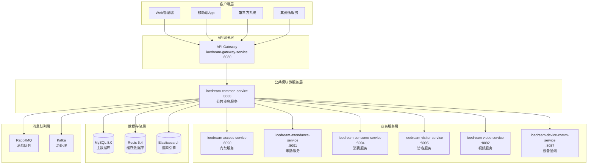

# IOE-DREAM 公共模块总体设计文档

**文档版本**: v1.0.0
**更新日期**: 2025-12-16
**服务名称**: ioedream-common-service
**服务端口**: 8088
**技术架构**: Spring Boot 3.5.8 + Spring Cloud 2025.0.0

---

## 📋 模块概述

### 模块定位
IOE-DREAM公共模块是整个智慧园区一卡通管理平台的核心支撑模块，负责提供用户认证、权限管理、通知服务、AI智能分析、系统监控、审计日志、数据字典等基础公共服务。

### 核心价值
- ✅ **统一认证中心**: 提供统一的用户认证和身份管理服务
- ✅ **权限管控中心**: 基于RBAC模型的细粒度权限控制
- ✅ **通知服务中心**: 多渠道智能通知推送和消息管理
- ✅ **AI智能分析**: 跨系统事件管理和智能决策支持
- ✅ **系统监控中心**: 实时监控预警和性能分析
- ✅ **审计日志中心**: 全系统操作审计和安全监控

### 服务范围
- **用户管理**: 用户信息、认证授权、会话管理
- **权限管理**: 角色权限、资源权限、数据权限
- **通知服务**: 多渠道通知、消息模板、推送管理
- **AI分析**: 事件管理、异常检测、智能预警
- **系统配置**: 参数配置、数据字典、系统设置
- **审计监控**: 操作审计、系统监控、性能统计

---

## 🏗️ 技术架构

### 微服务架构



### 核心功能架构

```mermaid
flowchart TD
    A[公共模块入口] --> B[用户认证中心]
    A --> C[权限管理中心]
    A --> D[通知服务中心]
    A --> E[AI智能分析中心]
    A --> F[系统监控中心]
    A --> G[审计日志中心]

    subgraph "用户认证中心"
        B1[用户管理]
        B2[身份认证]
        B3[会话管理]
        B4[密码策略]
        B5[多因子认证]
    end

    subgraph "权限管理中心"
        C1[角色管理]
        C2[权限管理]
        C3[资源管理]
        C4[数据权限]
        C5[权限继承]
    end

    subgraph "通知服务中心"
        D1[消息模板]
        D2[多渠道推送]
        D3[通知配置]
        D4[推送统计]
        D5[限流重试]
    end

    subgraph "AI智能分析中心"
        E1[事件采集]
        E2[异常检测]
        E3[智能分类]
        E4[风险评估]
        E5[决策支持]
    end

    subgraph "系统监控中心"
        F1[性能监控]
        F2[业务监控]
        F3[安全监控]
        F4[告警管理]
        F5[可视化展示]
    end

    subgraph "审计日志中心"
        G1[操作审计]
        G2[安全审计]
        G3[数据审计]
        G4[合规报告]
        G5[日志分析]
    end

    B --> B1
    B --> B2
    B --> B3
    B --> B4
    B --> B5

    C --> C1
    C --> C2
    C --> C3
    C --> C4
    C --> C5

    D --> D1
    D --> D2
    D --> D3
    D --> D4
    D --> D5

    E --> E1
    E --> E2
    E --> E3
    E --> E4
    E --> E5

    F --> F1
    F --> F2
    F --> F3
    F --> F4
    F --> F5

    G --> G1
    G --> G2
    G --> G3
    G --> G4
    G --> G5
```



---

## 📊 数据库设计

### 核心表结构设计

#### 用户认证相关表

```sql
-- 用户基础信息表
CREATE TABLE `t_user` (
    `user_id` BIGINT NOT NULL AUTO_INCREMENT COMMENT '用户ID',
    `username` VARCHAR(50) NOT NULL COMMENT '用户名',
    `password` VARCHAR(255) NOT NULL COMMENT '密码（加密）',
    `real_name` VARCHAR(100) NOT NULL COMMENT '真实姓名',
    `phone` VARCHAR(20) COMMENT '手机号',
    `email` VARCHAR(100) COMMENT '邮箱',
    `avatar_url` VARCHAR(500) COMMENT '头像URL',
    `user_type` TINYINT DEFAULT 1 COMMENT '用户类型：1-普通用户 2-管理员 3-超级管理员',
    `status` TINYINT DEFAULT 1 COMMENT '状态：1-启用 0-禁用',
    `login_count` INT DEFAULT 0 COMMENT '登录次数',
    `last_login_time` DATETIME COMMENT '最后登录时间',
    `last_login_ip` VARCHAR(45) COMMENT '最后登录IP',
    `password_update_time` DATETIME COMMENT '密码更新时间',
    `create_time` DATETIME NOT NULL DEFAULT CURRENT_TIMESTAMP COMMENT '创建时间',
    `update_time` DATETIME NOT NULL DEFAULT CURRENT_TIMESTAMP ON UPDATE CURRENT_TIMESTAMP COMMENT '更新时间',
    `deleted_flag` TINYINT DEFAULT 0 COMMENT '删除标记：0-未删除 1-已删除',
    PRIMARY KEY (`user_id`),
    UNIQUE KEY `uk_username` (`username`),
    UNIQUE KEY `uk_phone` (`phone`),
    UNIQUE KEY `uk_email` (`email`),
    KEY `idx_status_type` (`status`, `user_type`)
) ENGINE=InnoDB DEFAULT CHARSET=utf8mb4 COMMENT='用户基础信息表';

-- 用户会话表
CREATE TABLE `t_user_session` (
    `session_id` VARCHAR(128) NOT NULL COMMENT '会话ID',
    `user_id` BIGINT NOT NULL COMMENT '用户ID',
    `access_token` VARCHAR(255) NOT NULL COMMENT '访问令牌',
    `refresh_token` VARCHAR(255) COMMENT '刷新令牌',
    `client_type` VARCHAR(20) COMMENT '客户端类型',
    `client_ip` VARCHAR(45) COMMENT '客户端IP',
    `user_agent` VARCHAR(500) COMMENT '用户代理',
    `login_time` DATETIME NOT NULL COMMENT '登录时间',
    `expire_time` DATETIME NOT NULL COMMENT '过期时间',
    `last_access_time` DATETIME COMMENT '最后访问时间',
    `status` TINYINT DEFAULT 1 COMMENT '状态：1-有效 0-无效',
    `create_time` DATETIME NOT NULL DEFAULT CURRENT_TIMESTAMP COMMENT '创建时间',
    PRIMARY KEY (`session_id`),
    UNIQUE KEY `uk_access_token` (`access_token`),
    KEY `idx_user_id` (`user_id`),
    KEY `idx_expire_time` (`expire_time`)
) ENGINE=InnoDB DEFAULT CHARSET=utf8mb4 COMMENT='用户会话表';
```

#### 权限管理相关表

```sql
-- 角色表
CREATE TABLE `t_role` (
    `role_id` BIGINT NOT NULL AUTO_INCREMENT COMMENT '角色ID',
    `role_code` VARCHAR(50) NOT NULL COMMENT '角色编码',
    `role_name` VARCHAR(100) NOT NULL COMMENT '角色名称',
    `role_type` TINYINT DEFAULT 1 COMMENT '角色类型：1-系统角色 2-业务角色',
    `parent_role_id` BIGINT COMMENT '父角色ID',
    `sort_order` INT DEFAULT 0 COMMENT '排序',
    `status` TINYINT DEFAULT 1 COMMENT '状态：1-启用 0-禁用',
    `description` VARCHAR(500) COMMENT '角色描述',
    `create_time` DATETIME NOT NULL DEFAULT CURRENT_TIMESTAMP COMMENT '创建时间',
    `update_time` DATETIME NOT NULL DEFAULT CURRENT_TIMESTAMP ON UPDATE CURRENT_TIMESTAMP COMMENT '更新时间',
    PRIMARY KEY (`role_id`),
    UNIQUE KEY `uk_role_code` (`role_code`),
    KEY `idx_parent_id` (`parent_role_id`),
    KEY `idx_status_type` (`status`, `role_type`)
) ENGINE=InnoDB DEFAULT CHARSET=utf8mb4 COMMENT='角色表';

-- 权限表
CREATE TABLE `t_permission` (
    `permission_id` BIGINT NOT NULL AUTO_INCREMENT COMMENT '权限ID',
    `permission_code` VARCHAR(50) NOT NULL COMMENT '权限编码',
    `permission_name` VARCHAR(100) NOT NULL COMMENT '权限名称',
    `permission_type` TINYINT COMMENT '权限类型：1-菜单 2-按钮 3-接口 4-数据',
    `parent_permission_id` BIGINT COMMENT '父权限ID',
    `resource_path` VARCHAR(200) COMMENT '资源路径',
    `request_method` VARCHAR(10) COMMENT '请求方法',
    `sort_order` INT DEFAULT 0 COMMENT '排序',
    `status` TINYINT DEFAULT 1 COMMENT '状态：1-启用 0-禁用',
    `description` VARCHAR(500) COMMENT '权限描述',
    `create_time` DATETIME NOT NULL DEFAULT CURRENT_TIMESTAMP COMMENT '创建时间',
    `update_time` DATETIME NOT NULL DEFAULT CURRENT_TIMESTAMP ON UPDATE CURRENT_TIMESTAMP COMMENT '更新时间',
    PRIMARY KEY (`permission_id`),
    UNIQUE KEY `uk_permission_code` (`permission_code`),
    KEY `idx_parent_id` (`parent_permission_id`),
    KEY `idx_type_status` (`permission_type`, `status`)
) ENGINE=InnoDB DEFAULT CHARSET=utf8mb4 COMMENT='权限表';

-- 用户角色关联表
CREATE TABLE `t_user_role` (
    `user_role_id` BIGINT NOT NULL AUTO_INCREMENT COMMENT '用户角色ID',
    `user_id` BIGINT NOT NULL COMMENT '用户ID',
    `role_id` BIGINT NOT NULL COMMENT '角色ID',
    `create_time` DATETIME NOT NULL DEFAULT CURRENT_TIMESTAMP COMMENT '创建时间',
    PRIMARY KEY (`user_role_id`),
    UNIQUE KEY `uk_user_role` (`user_id`, `role_id`),
    KEY `idx_user_id` (`user_id`),
    KEY `idx_role_id` (`role_id`)
) ENGINE=InnoDB DEFAULT CHARSET=utf8mb4 COMMENT='用户角色关联表';
```

#### 通知系统相关表

```sql
-- 通知消息表
CREATE TABLE `t_notification` (
    `notification_id` BIGINT NOT NULL AUTO_INCREMENT COMMENT '通知ID',
    `sender_id` BIGINT COMMENT '发送者ID',
    `receiver_type` VARCHAR(20) NOT NULL COMMENT '接收者类型：USER-用户 ROLE-角色 DEPT-部门 ALL-全部',
    `receiver_ids` TEXT COMMENT '接收者ID列表',
    `notification_type` VARCHAR(20) NOT NULL COMMENT '通知类型：SYSTEM-系统 BUSINESS-业务 SECURITY-安全',
    `title` VARCHAR(200) NOT NULL COMMENT '通知标题',
    `content` TEXT NOT NULL COMMENT '通知内容',
    `template_code` VARCHAR(50) COMMENT '模板编码',
    `template_data` TEXT COMMENT '模板数据',
    `channels` VARCHAR(100) COMMENT '推送渠道：EMAIL-邮件 SMS-短信 WECHAT-微信 APP-应用',
    `priority` VARCHAR(10) DEFAULT 'MEDIUM' COMMENT '优先级：HIGH-高 MEDIUM-中 LOW-低',
    `status` VARCHAR(20) DEFAULT 'PENDING' COMMENT '状态：PENDING-待发送 SENT-已发送 FAILED-失败',
    `send_status` VARCHAR(20) COMMENT '发送状态',
    `schedule_time` DATETIME COMMENT '计划发送时间',
    `sent_time` DATETIME COMMENT '发送时间',
    `read_time` DATETIME COMMENT '阅读时间',
    `expire_time` DATETIME COMMENT '过期时间',
    `attachments` TEXT COMMENT '附件信息JSON',
    `buttons` TEXT COMMENT '按钮信息JSON',
    `create_time` DATETIME NOT NULL DEFAULT CURRENT_TIMESTAMP COMMENT '创建时间',
    `update_time` DATETIME NOT NULL DEFAULT CURRENT_TIMESTAMP ON UPDATE CURRENT_TIMESTAMP COMMENT '更新时间',
    PRIMARY KEY (`notification_id`),
    KEY `idx_sender_id` (`sender_id`),
    KEY `idx_type_status` (`notification_type`, `status`),
    KEY `idx_priority_time` (`priority`, `create_time`),
    KEY `idx_schedule_time` (`schedule_time`)
) ENGINE=InnoDB DEFAULT CHARSET=utf8mb4 COMMENT='通知消息表';

-- 通知模板表
CREATE TABLE `t_notification_template` (
    `template_id` BIGINT NOT NULL AUTO_INCREMENT COMMENT '模板ID',
    `template_code` VARCHAR(50) NOT NULL COMMENT '模板编码',
    `template_name` VARCHAR(100) NOT NULL COMMENT '模板名称',
    `template_type` VARCHAR(20) NOT NULL COMMENT '模板类型：EMAIL-邮件 SMS-短信 WECHAT-微信',
    `category` VARCHAR(20) COMMENT '分类：SYSTEM-系统 BUSINESS-业务 SECURITY-安全',
    `subject` VARCHAR(200) COMMENT '主题',
    `content` TEXT NOT NULL COMMENT '内容模板',
    `variables` TEXT COMMENT '变量定义JSON',
    `attachment_enabled` TINYINT DEFAULT 0 COMMENT '是否支持附件',
    `button_enabled` TINYINT DEFAULT 0 COMMENT '是否支持按钮',
    `status` TINYINT DEFAULT 1 COMMENT '状态：1-启用 0-禁用',
    `description` VARCHAR(500) COMMENT '模板描述',
    `create_time` DATETIME NOT NULL DEFAULT CURRENT_TIMESTAMP COMMENT '创建时间',
    `update_time` DATETIME NOT NULL DEFAULT CURRENT_TIMESTAMP ON UPDATE CURRENT_TIMESTAMP COMMENT '更新时间',
    PRIMARY KEY (`template_id`),
    UNIQUE KEY `uk_template_code` (`template_code`),
    KEY `idx_type_status` (`template_type`, `status`),
    KEY `idx_category` (`category`)
) ENGINE=InnoDB DEFAULT CHARSET=utf8mb4 COMMENT='通知模板表';
```

#### AI智能分析相关表

```sql
-- AI事件表
CREATE TABLE `t_ai_event` (
    `event_id` BIGINT NOT NULL AUTO_INCREMENT COMMENT '事件ID',
    `event_code` VARCHAR(50) NOT NULL COMMENT '事件编码',
    `source_module` VARCHAR(50) NOT NULL COMMENT '来源模块',
    `event_type` VARCHAR(50) NOT NULL COMMENT '事件类型',
    `event_subtype` VARCHAR(50) COMMENT '事件子类型',
    `event_title` VARCHAR(200) NOT NULL COMMENT '事件标题',
    `event_content` TEXT COMMENT '事件内容',
    `event_data` TEXT COMMENT '事件数据JSON',
    `confidence_score` DECIMAL(5,4) COMMENT '置信度',
    `risk_level` VARCHAR(20) COMMENT '风险等级：LOW-低 MEDIUM-中 HIGH-高 CRITICAL-极高',
    `urgency_level` VARCHAR(20) COMMENT '紧急程度：NORMAL-一般 URGENT-紧急 CRITICAL-极紧急',
    `impact_scope` VARCHAR(20) COMMENT '影响范围：LOCAL-局部 AREA-区域 GLOBAL-全局',
    `status` VARCHAR(20) DEFAULT 'PENDING' COMMENT '状态：PENDING-待处理 PROCESSING-处理中 RESOLVED-已解决',
    `processed_time` DATETIME COMMENT '处理时间',
    `processor_id` BIGINT COMMENT '处理人ID',
    `processing_result` TEXT COMMENT '处理结果',
    `create_time` DATETIME NOT NULL DEFAULT CURRENT_TIMESTAMP COMMENT '创建时间',
    `update_time` DATETIME NOT NULL DEFAULT CURRENT_TIMESTAMP ON UPDATE CURRENT_TIMESTAMP COMMENT '更新时间',
    PRIMARY KEY (`event_id`),
    UNIQUE KEY `uk_event_code` (`event_code`),
    KEY `idx_source_type` (`source_module`, `event_type`),
    KEY `idx_risk_urgency` (`risk_level`, `urgency_level`),
    KEY `idx_status_time` (`status`, `create_time`)
) ENGINE=InnoDB DEFAULT CHARSET=utf8mb4 COMMENT='AI事件表';

-- AI事件处理记录表
CREATE TABLE `t_ai_event_record` (
    `record_id` BIGINT NOT NULL AUTO_INCREMENT COMMENT '记录ID',
    `event_id` BIGINT NOT NULL COMMENT '事件ID',
    `action_type` VARCHAR(50) NOT NULL COMMENT '处理动作类型',
    `action_content` TEXT COMMENT '处理内容',
    `action_result` VARCHAR(20) COMMENT '处理结果：SUCCESS-成功 FAILED-失败',
    `action_details` TEXT COMMENT '处理详情',
    `processor_id` BIGINT COMMENT '处理人ID',
    `processor_name` VARCHAR(100) COMMENT '处理人姓名',
    `processing_duration` BIGINT COMMENT '处理时长（毫秒）',
    `create_time` DATETIME NOT NULL DEFAULT CURRENT_TIMESTAMP COMMENT '创建时间',
    PRIMARY KEY (`record_id`),
    KEY `idx_event_id` (`event_id`),
    KEY `idx_action_type` (`action_type`),
    KEY `idx_processor_id` (`processor_id`)
) ENGINE=InnoDB DEFAULT CHARSET=utf8mb4 COMMENT='AI事件处理记录表';
```

#### 审计日志相关表

```sql
-- 操作审计日志表
CREATE TABLE `t_audit_log` (
    `log_id` BIGINT NOT NULL AUTO_INCREMENT COMMENT '日志ID',
    `user_id` BIGINT COMMENT '用户ID',
    `username` VARCHAR(50) COMMENT '用户名',
    `operation_type` VARCHAR(50) NOT NULL COMMENT '操作类型',
    `operation_desc` VARCHAR(500) COMMENT '操作描述',
    `request_method` VARCHAR(10) COMMENT '请求方法',
    `request_url` VARCHAR(500) COMMENT '请求URL',
    `request_params` TEXT COMMENT '请求参数',
    `response_result` TEXT COMMENT '响应结果',
    `operation_ip` VARCHAR(45) COMMENT '操作IP',
    `user_agent` VARCHAR(500) COMMENT '用户代理',
    `operation_status` TINYINT COMMENT '操作状态：1-成功 0-失败',
    `error_message` TEXT COMMENT '错误信息',
    `execution_time` BIGINT COMMENT '执行时长（毫秒）',
    `create_time` DATETIME NOT NULL DEFAULT CURRENT_TIMESTAMP COMMENT '创建时间',
    PRIMARY KEY (`log_id`),
    KEY `idx_user_id` (`user_id`),
    KEY `idx_operation_type` (`operation_type`),
    KEY `idx_status_time` (`operation_status`, `create_time`),
    KEY `idx_create_time` (`create_time`)
) ENGINE=InnoDB DEFAULT CHARSET=utf8mb4 COMMENT='操作审计日志表';
```

---

## 🔌 API接口设计

### 用户认证API

```java
@RestController
@RequestMapping("/api/v1/auth")
@Tag(name = "用户认证")
public class AuthController {

    @PostMapping("/login")
    @Operation(summary = "用户登录")
    public ResponseDTO<LoginResponseVO> login(@Valid @RequestBody LoginRequestDTO request);

    @PostMapping("/logout")
    @Operation(summary = "用户登出")
    public ResponseDTO<Void> logout(@RequestHeader("Authorization") String token);

    @PostMapping("/refresh")
    @Operation(summary = "刷新令牌")
    public ResponseDTO<RefreshTokenResultDTO> refreshToken(@Valid @RequestBody RefreshTokenRequestDTO request);

    @GetMapping("/userinfo")
    @Operation(summary = "获取用户信息")
    public ResponseDTO<UserInfoVO> getUserInfo(@RequestHeader("Authorization") String token);

    @PostMapping("/changepassword")
    @Operation(summary = "修改密码")
    public ResponseDTO<Void> changePassword(@Valid @RequestBody ChangePasswordRequestDTO request);
}
```

### 权限管理API

```java
@RestController
@RequestMapping("/api/v1/permission")
@Tag(name = "权限管理")
public class PermissionController {

    @GetMapping("/roles")
    @Operation(summary = "获取角色列表")
    public ResponseDTO<PageResult<RoleVO>> getRoleList(@Valid RoleQueryForm queryForm);

    @PostMapping("/roles")
    @Operation(summary = "创建角色")
    public ResponseDTO<Long> createRole(@Valid @RequestBody RoleAddForm addForm);

    @PutMapping("/roles/{roleId}")
    @Operation(summary = "更新角色")
    public ResponseDTO<Void> updateRole(@PathVariable Long roleId, @Valid @RequestBody RoleUpdateForm updateForm);

    @DeleteMapping("/roles/{roleId}")
    @Operation(summary = "删除角色")
    public ResponseDTO<Void> deleteRole(@PathVariable Long roleId);

    @GetMapping("/permissions")
    @Operation(summary = "获取权限列表")
    public ResponseDTO<List<PermissionVO>> getPermissionList(@RequestParam(required = false) String permissionType);

    @GetMapping("/user/{userId}/permissions")
    @Operation(summary = "获取用户权限")
    public ResponseDTO<List<PermissionVO>> getUserPermissions(@PathVariable Long userId);
}
```

### 通知系统API

```java
@RestController
@RequestMapping("/api/v1/notification")
@Tag(name = "通知管理")
public class NotificationController {

    @PostMapping("/send")
    @Operation(summary = "发送通知")
    public ResponseDTO<NotificationResultVO> sendNotification(@Valid @RequestBody NotificationSendDTO sendDTO);

    @PostMapping("/batch")
    @Operation(summary = "批量发送通知")
    public ResponseDTO<List<NotificationResultVO>> batchSendNotification(@Valid @RequestBody NotificationBatchDTO batchDTO);

    @GetMapping("/user/list")
    @Operation(summary = "获取用户通知列表")
    public ResponseDTO<PageResult<UserNotificationVO>> getUserNotificationList(@Valid UserNotificationQueryForm queryForm);

    @PutMapping("/{notificationId}/read")
    @Operation(summary = "标记通知已读")
    public ResponseDTO<Void> markNotificationRead(@PathVariable Long notificationId);

    @GetMapping("/template/list")
    @Operation(summary = "获取通知模板列表")
    public ResponseDTO<PageResult<NotificationTemplateVO>> getTemplateList(@Valid TemplateQueryForm queryForm);

    @PostMapping("/template")
    @Operation(summary = "创建通知模板")
    public ResponseDTO<Long> createTemplate(@Valid @RequestBody NotificationTemplateAddForm addForm);

    @GetMapping("/statistics")
    @Operation(summary = "获取通知统计")
    public ResponseDTO<NotificationStatisticsVO> getNotificationStatistics(@Valid NotificationStatisticsQueryForm queryForm);
}
```

### AI智能分析API

```java
@RestController
@RequestMapping("/api/v1/ai")
@Tag(name = "AI智能分析")
public class AIAnalysisController {

    @GetMapping("/events")
    @Operation(summary = "获取AI事件列表")
    public ResponseDTO<PageResult<AIEventVO>> getEventList(@Valid AIEventQueryForm queryForm);

    @PostMapping("/events/{eventId}/process")
    @Operation(summary = "处理AI事件")
    public ResponseDTO<Void> processEvent(@PathVariable Long eventId, @Valid @RequestBody EventProcessDTO processDTO);

    @GetMapping("/events/{eventId}/records")
    @Operation(summary = "获取事件处理记录")
    public ResponseDTO<List<EventRecordVO>> getEventRecords(@PathVariable Long eventId);

    @GetMapping("/analysis/statistics")
    @Operation(summary = "获取分析统计")
    public ResponseDTO<AIAnalysisStatisticsVO> getAnalysisStatistics(@Valid AnalysisStatisticsQueryForm queryForm);

    @GetMapping("/risk/assessment")
    @Operation(summary = "风险评估")
    public ResponseDTO<RiskAssessmentVO> riskAssessment(@Valid RiskAssessmentDTO assessmentDTO);
}
```

---

## 🛠️ 技术实现

### 认证授权实现

#### JWT Token管理

```java
@Component
@Slf4j
public class JwtTokenManager {

    @Value("${jwt.secret}")
    private String jwtSecret;

    @Value("${jwt.expiration}")
    private Long jwtExpiration;

    @Value("${jwt.refresh-expiration}")
    private Long refreshExpiration;

    @Resource
    private UserSessionDao userSessionDao;

    /**
     * 生成访问令牌
     */
    public String generateAccessToken(UserEntity user) {
        Date now = new Date();
        Date expiryDate = new Date(now.getTime() + jwtExpiration * 1000);

        return Jwts.builder()
                .setSubject(user.getUserId().toString())
                .setIssuedAt(now)
                .setExpiration(expiryDate)
                .claim("username", user.getUsername())
                .claim("userType", user.getUserType())
                .signWith(SignatureAlgorithm.HS512, jwtSecret)
                .compact();
    }

    /**
     * 生成刷新令牌
     */
    public String generateRefreshToken(UserEntity user) {
        Date now = new Date();
        Date expiryDate = new Date(now.getTime() + refreshExpiration * 1000);

        return Jwts.builder()
                .setSubject(user.getUserId().toString())
                .setIssuedAt(now)
                .setExpiration(expiryDate)
                .claim("type", "refresh")
                .signWith(SignatureAlgorithm.HS512, jwtSecret)
                .compact();
    }

    /**
     * 验证令牌
     */
    public boolean validateToken(String token) {
        try {
            Jwts.parser().setSigningKey(jwtSecret).parseClaimsJws(token);
            return true;
        } catch (JwtException | IllegalArgumentException e) {
            log.error("Invalid JWT token: {}", e.getMessage());
            return false;
        }
    }
}
```

#### 权限拦截器

```java
@Component
@Slf4j
public class PermissionInterceptor implements HandlerInterceptor {

    @Resource
    private PermissionService permissionService;

    @Resource
    private JwtTokenManager jwtTokenManager;

    @Override
    public boolean preHandle(HttpServletRequest request, HttpServletResponse response, Object handler) {
        if (!(handler instanceof HandlerMethod)) {
            return true;
        }

        HandlerMethod handlerMethod = (HandlerMethod) handler;
        RequiresPermissions annotation = handlerMethod.getMethodAnnotation(RequiresPermissions.class);

        if (annotation == null) {
            return true;
        }

        String token = request.getHeader("Authorization");
        if (StringUtils.isEmpty(token) || !token.startsWith("Bearer ")) {
            throw new AuthenticationException("认证令牌无效");
        }

        token = token.substring(7);
        if (!jwtTokenManager.validateToken(token)) {
            throw new AuthenticationException("认证令牌已过期");
        }

        Long userId = jwtTokenManager.getUserIdFromToken(token);
        String[] permissions = annotation.value();

        for (String permission : permissions) {
            if (!permissionService.hasPermission(userId, permission)) {
                throw new AuthorizationException("权限不足：" + permission);
            }
        }

        return true;
    }
}
```

### 通知服务实现

#### 多渠道通知发送器

```java
@Service
@Slf4j
public class NotificationSender {

    @Resource
    private EmailNotificationSender emailSender;

    @Resource
    private SmsNotificationSender smsSender;

    @Resource
    private WechatNotificationSender wechatSender;

    @Resource
    private AppPushNotificationSender appPushSender;

    /**
     * 发送通知
     */
    public NotificationResult sendNotification(NotificationEntity notification) {
        List<NotificationChannelResult> channelResults = new ArrayList<>();

        for (String channel : notification.getChannels().split(",")) {
            try {
                NotificationChannelResult result = sendByChannel(notification, channel);
                channelResults.add(result);

                if (result.isSuccess()) {
                    log.info("通知发送成功: channel={}, messageId={}", channel, result.getMessageId());
                } else {
                    log.error("通知发送失败: channel={}, error={}", channel, result.getErrorMessage());
                }
            } catch (Exception e) {
                log.error("通知发送异常: channel=" + channel, e);
                channelResults.add(NotificationChannelResult.failure(channel, e.getMessage()));
            }
        }

        return NotificationResult.builder()
                .notificationId(notification.getNotificationId())
                .channelResults(channelResults)
                .overallSuccess(channelResults.stream().anyMatch(NotificationChannelResult::isSuccess))
                .build();
    }

    private NotificationChannelResult sendByChannel(NotificationEntity notification, String channel) {
        switch (channel) {
            case "EMAIL":
                return emailSender.send(notification);
            case "SMS":
                return smsSender.send(notification);
            case "WECHAT":
                return wechatSender.send(notification);
            case "APP":
                return appPushSender.send(notification);
            default:
                throw new IllegalArgumentException("不支持的通知渠道: " + channel);
        }
    }
}
```

#### 智能限流器

```java
@Component
@Slf4j
public class NotificationRateLimiter {

    @Resource
    private RedisTemplate<String, Object> redisTemplate;

    /**
     * 滑动窗口限流
     */
    public boolean tryAcquire(String key, int limit, int windowSizeInSeconds) {
        String redisKey = "rate_limit:notification:" + key;
        long currentTime = System.currentTimeMillis();
        long windowStart = currentTime - windowSizeInSeconds * 1000L;

        // 使用Redis原子操作
        String script =
            "local current = redis.call('ZRANGEBYSCORE', KEYS[1], ARGV[1], ARGV[2]) " +
            "redis.call('ZREMRANGEBYSCORE', KEYS[1], '-inf', ARGV[1]) " +
            "redis.call('ZADD', KEYS[1], ARGV[3], ARGV[4]) " +
            "redis.call('EXPIRE', KEYS[1], ARGV[2]) " +
            "return #current";

        List<Object> result = redisTemplate.execute(
            new DefaultRedisScript<>(script, List.class),
            Collections.singletonList(redisKey),
            String.valueOf(windowStart),
            String.valueOf(windowSizeInSeconds),
            String.valueOf(currentTime),
            currentTime + ":" + ThreadLocalRandom.current().nextInt(1000)
        );

        return ((List<Long>) result.get(0)).size() < limit;
    }
}
```

### AI智能分析实现

#### 事件分类器

```java
@Service
@Slf4j
public class AIEventClassifier {

    @Resource
    private MachineLearningClassifier mlClassifier;

    @Resource
    private RuleEngineClassifier ruleEngineClassifier;

    @Resource
    private PatternMatcherClassifier patternClassifier;

    /**
     * 智能事件分类
     */
    public EventClassificationResult classifyEvent(AIEventEntity event) {
        // 并行执行多种分类算法
        CompletableFuture<MLClassificationResult> mlFuture =
            CompletableFuture.supplyAsync(() -> mlClassifier.classify(event));

        CompletableFuture<RuleClassificationResult> ruleFuture =
            CompletableFuture.supplyAsync(() -> ruleEngineClassifier.classify(event));

        CompletableFuture<PatternClassificationResult> patternFuture =
            CompletableFuture.supplyAsync(() -> patternClassifier.classify(event));

        try {
            // 等待所有分类结果
            MLClassificationResult mlResult = mlFuture.get(2, TimeUnit.SECONDS);
            RuleClassificationResult ruleResult = ruleFuture.get(2, TimeUnit.SECONDS);
            PatternClassificationResult patternResult = patternFuture.get(2, TimeUnit.SECONDS);

            // 融合分类结果
            return fuseClassificationResults(event, mlResult, ruleResult, patternResult);

        } catch (Exception e) {
            log.error("事件分类失败: eventId=" + event.getEventId(), e);
            return EventClassificationResult.failure("分类失败: " + e.getMessage());
        }
    }

    /**
     * 融合分类结果
     */
    private EventClassificationResult fuseClassificationResults(
            AIEventEntity event,
            MLClassificationResult mlResult,
            RuleClassificationResult ruleResult,
            PatternClassificationResult patternResult) {

        // 加权融合算法
        Map<String, Double> weights = Map.of(
            "ML", 0.4,
            "RULE", 0.4,
            "PATTERN", 0.2
        );

        String eventType = determineEventType(mlResult, ruleResult, patternResult, weights);
        double confidence = calculateConfidence(mlResult, ruleResult, patternResult, weights);

        return EventClassificationResult.builder()
                .eventType(eventType)
                .confidence(confidence)
                .mlResult(mlResult)
                .ruleResult(ruleResult)
                .patternResult(patternResult)
                .build();
    }
}
```

#### 风险评估器

```java
@Service
@Slf4j
public class AIRiskAssessor {

    @Resource
    private RiskModelRepository riskModelRepository;

    /**
     * 事件风险评估
     */
    public RiskAssessmentResult assessRisk(AIEventEntity event) {
        // 多维度风险评估
        double severityScore = assessSeverity(event);
        double urgencyScore = assessUrgency(event);
        double impactScore = assessImpact(event);
        double likelihoodScore = assessLikelihood(event);

        // 综合风险评分
        double riskScore = calculateRiskScore(severityScore, urgencyScore, impactScore, likelihoodScore);

        // 确定风险等级
        RiskLevel riskLevel = determineRiskLevel(riskScore);

        // 确定紧急程度
        UrgencyLevel urgencyLevel = determineUrgencyLevel(urgencyScore, riskScore);

        // 确定影响范围
        ImpactScope impactScope = determineImpactScope(event, impactScore);

        return RiskAssessmentResult.builder()
                .riskScore(riskScore)
                .riskLevel(riskLevel)
                .urgencyLevel(urgencyLevel)
                .impactScope(impactScope)
                .severityScore(severityScore)
                .urgencyScore(urgencyScore)
                .impactScore(impactScore)
                .likelihoodScore(likelihoodScore)
                .assessmentTime(LocalDateTime.now())
                .build();
    }

    /**
     * 计算风险评分
     */
    private double calculateRiskScore(double severity, double urgency, double impact, double likelihood) {
        // 风险评分公式：Risk = (Severity × Impact × Likelihood) × Urgency
        return (severity * impact * likelihood) * (1 + urgency * 0.2);
    }
}
```

---

## 📈 性能优化

### 缓存策略

```java
@Service
@Slf4j
public class CacheManager {

    @Resource
    private RedisTemplate<String, Object> redisTemplate;

    @Resource
    private Cache caffeineCache;

    /**
     * 多级缓存获取
     */
    public <T> T get(String key, Class<T> clazz, Supplier<T> loader, Duration ttl) {
        // L1: 本地缓存
        T value = (T) caffeineCache.getIfPresent(key);
        if (value != null) {
            return value;
        }

        // L2: Redis缓存
        value = (T) redisTemplate.opsForValue().get(key);
        if (value != null) {
            caffeineCache.put(key, value);
            return value;
        }

        // L3: 数据库加载
        value = loader.get();
        if (value != null) {
            caffeineCache.put(key, value);
            redisTemplate.opsForValue().set(key, value, ttl);
        }

        return value;
    }
}
```

### 异步处理

```java
@Configuration
@EnableAsync
public class AsyncConfig {

    @Bean
    public TaskExecutor notificationTaskExecutor() {
        ThreadPoolTaskExecutor executor = new ThreadPoolTaskExecutor();
        executor.setCorePoolSize(10);
        executor.setMaxPoolSize(50);
        executor.setQueueCapacity(1000);
        executor.setThreadNamePrefix("notification-");
        executor.setRejectedExecutionHandler(new ThreadPoolExecutor.CallerRunsPolicy());
        executor.initialize();
        return executor;
    }

    @Bean
    public TaskExecutor aiAnalysisTaskExecutor() {
        ThreadPoolTaskExecutor executor = new ThreadPoolTaskExecutor();
        executor.setCorePoolSize(5);
        executor.setMaxPoolSize(20);
        executor.setQueueCapacity(500);
        executor.setThreadNamePrefix("ai-analysis-");
        executor.setRejectedExecutionHandler(new ThreadPoolExecutor.CallerRunsPolicy());
        executor.initialize();
        return executor;
    }
}
```

---

## 🔒 安全设计

### 数据加密

```java
@Component
@Slf4j
public class DataEncryption {

    @Value("${encryption.key}")
    private String encryptionKey;

    /**
     * AES加密
     */
    public String encrypt(String plainText) {
        try {
            Cipher cipher = Cipher.getInstance("AES/CBC/PKCS5Padding");
            SecretKeySpec keySpec = new SecretKeySpec(encryptionKey.getBytes(), "AES");
            IvParameterSpec ivSpec = new IvParameterSpec(generateIV());
            cipher.init(Cipher.ENCRYPT_MODE, keySpec, ivSpec);
            byte[] encrypted = cipher.doFinal(plainText.getBytes());
            return Base64.getEncoder().encodeToString(ivSpec.getIV()) + ":" +
                   Base64.getEncoder().encodeToString(encrypted);
        } catch (Exception e) {
            log.error("数据加密失败", e);
            throw new RuntimeException("数据加密失败", e);
        }
    }

    /**
     * AES解密
     */
    public String decrypt(String encryptedText) {
        try {
            String[] parts = encryptedText.split(":");
            byte[] iv = Base64.getDecoder().decode(parts[0]);
            byte[] encrypted = Base64.getDecoder().decode(parts[1]);

            Cipher cipher = Cipher.getInstance("AES/CBC/PKCS5Padding");
            SecretKeySpec keySpec = new SecretKeySpec(encryptionKey.getBytes(), "AES");
            IvParameterSpec ivSpec = new IvParameterSpec(iv);
            cipher.init(Cipher.DECRYPT_MODE, keySpec, ivSpec);
            byte[] decrypted = cipher.doFinal(encrypted);
            return new String(decrypted);
        } catch (Exception e) {
            log.error("数据解密失败", e);
            throw new RuntimeException("数据解密失败", e);
        }
    }

    private byte[] generateIV() {
        byte[] iv = new byte[16];
        SecureRandom secureRandom = new SecureRandom();
        secureRandom.nextBytes(iv);
        return iv;
    }
}
```

---

## 📊 监控指标

### Micrometer监控配置

```java
@Configuration
public class MetricsConfig {

    @Bean
    public MeterRegistryCustomizer<MeterRegistry> metricsCommonTags() {
        return registry -> registry.config().commonTags(
            "application", "ioedream-common-service",
            "version", "1.0.0"
        );
    }

    @Bean
    public TimedAspect timedAspect(MeterRegistry registry) {
        return new TimedAspect(registry);
    }

    @Bean
    public CountedAspect countedAspect(MeterRegistry registry) {
        return new CountedAspect(registry);
    }
}
```

### 业务指标收集

```java
@Component
@Slf4j
public class NotificationMetricsCollector {

    private final MeterRegistry meterRegistry;
    private final Counter sendCounter;
    private final Timer sendTimer;
    private final Counter errorCounter;

    public NotificationMetricsCollector(MeterRegistry meterRegistry) {
        this.meterRegistry = meterRegistry;
        this.sendCounter = Counter.builder("notification.send.total")
                .description("通知发送总数")
                .register(meterRegistry);
        this.sendTimer = Timer.builder("notification.send.duration")
                .description("通知发送耗时")
                .register(meterRegistry);
        this.errorCounter = Counter.builder("notification.send.error")
                .description("通知发送错误数")
                .register(meterRegistry);
    }

    public void recordSend(String channel, boolean success) {
        sendCounter.increment(Tags.of("channel", channel, "result", success ? "success" : "failed"));
    }

    public void recordSendTime(String channel, Duration duration) {
        sendTimer.record(duration, Tags.of("channel", channel));
    }

    public void recordError(String channel, String errorType) {
        errorCounter.increment(Tags.of("channel", channel, "error_type", errorType));
    }
}
```

---

## 🚀 部署配置

### Docker配置

```dockerfile
FROM openjdk:17-jdk-slim

LABEL maintainer="IOE-DREAM Team"
LABEL version="1.0.0"
LABEL description="IOE-DREAM公共模块微服务"

# 创建应用目录
WORKDIR /app

# 复制jar包
COPY target/ioedream-common-service-1.0.0.jar app.jar

# 创建非root用户
RUN groupadd -r appuser && useradd -r -g appuser appuser
RUN chown -R appuser:appuser /app
USER appuser

# JVM参数
ENV JAVA_OPTS="-Xms1g -Xmx2g -XX:+UseG1GC -XX:MaxGCPauseMillis=200"

# 健康检查
HEALTHCHECK --interval=30s --timeout=10s --start-period=60s --retries=3 \
    CMD curl -f http://localhost:8088/actuator/health || exit 1

# 暴露端口
EXPOSE 8088

# 启动命令
ENTRYPOINT ["sh", "-c", "java $JAVA_OPTS -jar app.jar"]
```

### Kubernetes部署配置

```yaml
apiVersion: apps/v1
kind: Deployment
metadata:
  name: ioedream-common-service
  namespace: ioedream
  labels:
    app: ioedream-common-service
spec:
  replicas: 3
  selector:
    matchLabels:
      app: ioedream-common-service
  template:
    metadata:
      labels:
        app: ioedream-common-service
    spec:
      containers:
      - name: ioedream-common-service
        image: ioedream/common-service:1.0.0
        ports:
        - containerPort: 8088
        env:
        - name: SPRING_PROFILES_ACTIVE
          value: "prod"
        - name: NACOS_SERVER_ADDR
          value: "nacos:8848"
        - name: MYSQL_HOST
          value: "mysql"
        - name: REDIS_HOST
          value: "redis"
        resources:
          requests:
            memory: "1Gi"
            cpu: "500m"
          limits:
            memory: "2Gi"
            cpu: "1000m"
        livenessProbe:
          httpGet:
            path: /actuator/health
            port: 8088
          initialDelaySeconds: 60
          periodSeconds: 30
        readinessProbe:
          httpGet:
            path: /actuator/health/readiness
            port: 8088
          initialDelaySeconds: 30
          periodSeconds: 10
---
apiVersion: v1
kind: Service
metadata:
  name: ioedream-common-service
  namespace: ioedream
spec:
  selector:
    app: ioedream-common-service
  ports:
  - protocol: TCP
    port: 8088
    targetPort: 8088
  type: ClusterIP
```

---

## 📚 文档导航

1. **通知系统设计**: [02-通知系统设计文档.md](./02-通知系统设计文档.md)
2. **AI智能分析设计**: [03-AI智能分析设计文档.md](./03-AI智能分析设计文档.md)
3. **权限管理设计**: [04-权限管理设计文档.md](./04-权限管理设计文档.md)
4. **审计日志设计**: [05-审计日志设计文档.md](./05-审计日志设计文档.md)
5. **监控告警设计**: [06-监控告警设计文档.md](./06-监控告警设计文档.md)
6. **数据字典设计**: [07-数据字典设计文档.md](./07-数据字典设计文档.md)

---

**文档维护**: IOE-DREAM架构团队
**版本**: v1.0.0
**最后更新**: 2025-12-16