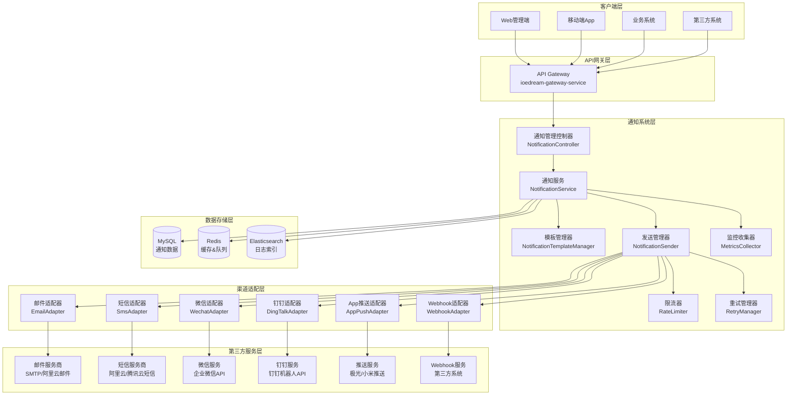
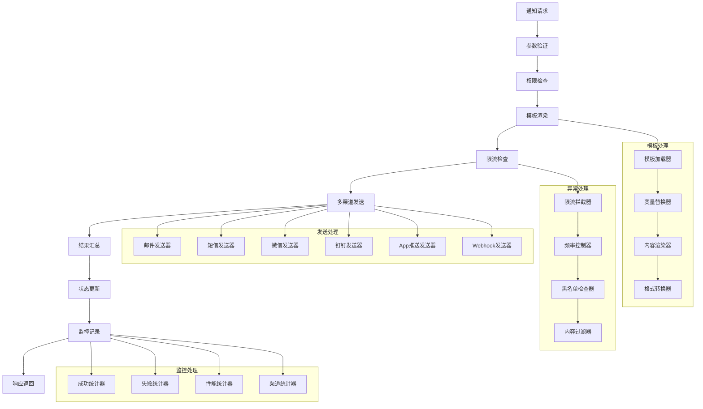

# IOE-DREAM 通知系统设计文档

**文档版本**: v1.0.0
**更新日期**: 2025-12-16
**所属模块**: 公共模块
**服务名称**: ioedream-common-service

---

## 📋 系统概述

### 功能定位
IOE-DREAM通知系统是企业级多渠道智能通知推送平台，提供统一的消息模板管理、多渠道推送、智能路由、限流保护、重试机制等功能，支持邮件、短信、微信、钉钉、App推送等多种通知方式。

### 核心特性
- ✅ **多渠道支持**: 邮件、短信、微信、钉钉、App推送、Webhook
- ✅ **智能模板管理**: 支持变量替换、多级缓存、模板热更新
- ✅ **统一限流保护**: 滑动窗口算法，支持多渠道独立限流
- ✅ **智能重试机制**: 指数退避策略，支持错误码检查
- ✅ **实时监控**: Micrometer集成，支持Prometheus导出
- ✅ **消息格式**: 支持Markdown、ActionCard、FeedCard等多种格式
- ✅ **配置管理**: 统一配置管理，支持加密存储、热更新

### 业务价值
- **统一管理**: 建立企业级统一通知平台，避免重复建设
- **提升效率**: 智能推送和自动化处理，提升通知送达效率
- **降低成本**: 统一渠道管理和优化，降低通知发送成本
- **增强体验**: 个性化通知和多渠道覆盖，提升用户体验
- **数据驱动**: 完整的通知数据分析和监控，支持业务决策

---

## 🏗️ 系统架构

### 整体架构图



### 核心组件架构



---

## 📊 数据库设计

### 核心表结构

#### 通知消息表

```sql
CREATE TABLE `t_notification` (
    `notification_id` BIGINT NOT NULL AUTO_INCREMENT COMMENT '通知ID',
    `batch_id` VARCHAR(50) COMMENT '批次ID',
    `sender_id` BIGINT COMMENT '发送者ID',
    `sender_name` VARCHAR(100) COMMENT '发送者姓名',
    `receiver_type` VARCHAR(20) NOT NULL COMMENT '接收者类型：USER-用户 ROLE-角色 DEPT-部门 ALL-全部',
    `receiver_ids` TEXT COMMENT '接收者ID列表（逗号分隔）',
    `receiver_count` INT DEFAULT 0 COMMENT '接收者数量',
    `notification_type` VARCHAR(20) NOT NULL COMMENT '通知类型：SYSTEM-系统 BUSINESS-业务 SECURITY-安全 REMINDER-提醒',
    `title` VARCHAR(200) NOT NULL COMMENT '通知标题',
    `content` TEXT NOT NULL COMMENT '通知内容',
    `template_code` VARCHAR(50) COMMENT '模板编码',
    `template_data` TEXT COMMENT '模板数据JSON',
    `channels` VARCHAR(100) COMMENT '推送渠道：EMAIL-邮件 SMS-短信 WECHAT-微信 DINGTALK-钉钉 APP-应用',
    `priority` VARCHAR(10) DEFAULT 'MEDIUM' COMMENT '优先级：HIGH-高 MEDIUM-中 LOW-低',
    `status` VARCHAR(20) DEFAULT 'PENDING' COMMENT '状态：PENDING-待发送 SENDING-发送中 SENT-已发送 FAILED-失败 CANCELLED-已取消',
    `send_status` VARCHAR(100) COMMENT '各渠道发送状态JSON',
    `schedule_type` VARCHAR(20) DEFAULT 'IMMEDIATE' COMMENT '发送类型：IMMEDIATE-立即 SCHEDULE-计划',
    `schedule_time` DATETIME COMMENT '计划发送时间',
    `sent_time` DATETIME COMMENT '发送时间',
    `read_time` DATETIME COMMENT '阅读时间',
    `expire_time` DATETIME COMMENT '过期时间',
    `retry_count` INT DEFAULT 0 COMMENT '重试次数',
    `max_retry_count` INT DEFAULT 3 COMMENT '最大重试次数',
    `attachments` TEXT COMMENT '附件信息JSON',
    `buttons` TEXT COMMENT '按钮信息JSON',
    `extra_data` TEXT COMMENT '扩展数据JSON',
    `create_time` DATETIME NOT NULL DEFAULT CURRENT_TIMESTAMP COMMENT '创建时间',
    `update_time` DATETIME NOT NULL DEFAULT CURRENT_TIMESTAMP ON UPDATE CURRENT_TIMESTAMP COMMENT '更新时间',
    PRIMARY KEY (`notification_id`),
    KEY `idx_batch_id` (`batch_id`),
    KEY `idx_sender_id` (`sender_id`),
    KEY `idx_type_status` (`notification_type`, `status`),
    KEY `idx_priority_time` (`priority`, `create_time`),
    KEY `idx_schedule_time` (`schedule_time`),
    KEY `idx_receiver_type` (`receiver_type`),
    KEY `idx_create_time` (`create_time`)
) ENGINE=InnoDB DEFAULT CHARSET=utf8mb4 COMMENT='通知消息表';
```

#### 通知模板表

```sql
CREATE TABLE `t_notification_template` (
    `template_id` BIGINT NOT NULL AUTO_INCREMENT COMMENT '模板ID',
    `template_code` VARCHAR(50) NOT NULL COMMENT '模板编码',
    `template_name` VARCHAR(100) NOT NULL COMMENT '模板名称',
    `template_type` VARCHAR(20) NOT NULL COMMENT '模板类型：EMAIL-邮件 SMS-短信 WECHAT-微信 DINGTALK-钉钉 APP-应用',
    `category` VARCHAR(20) COMMENT '分类：SYSTEM-系统 BUSINESS-业务 SECURITY-安全 REMINDER-提醒 MARKETING-营销',
    `subject` VARCHAR(200) COMMENT '主题（邮件专用）',
    `content` TEXT NOT NULL COMMENT '内容模板',
    `variables` TEXT COMMENT '变量定义JSON',
    `attachment_enabled` TINYINT DEFAULT 0 COMMENT '是否支持附件',
    `button_enabled` TINYINT DEFAULT 0 COMMENT '是否支持按钮',
    `html_enabled` TINYINT DEFAULT 0 COMMENT '是否支持HTML',
    `status` TINYINT DEFAULT 1 COMMENT '状态：1-启用 0-禁用',
    `version` INT DEFAULT 1 COMMENT '版本号',
    `usage_count` INT DEFAULT 0 COMMENT '使用次数',
    `success_rate` DECIMAL(5,4) DEFAULT 0.0000 COMMENT '成功率',
    `description` VARCHAR(500) COMMENT '模板描述',
    `created_by` BIGINT COMMENT '创建人ID',
    `updated_by` BIGINT COMMENT '更新人ID',
    `create_time` DATETIME NOT NULL DEFAULT CURRENT_TIMESTAMP COMMENT '创建时间',
    `update_time` DATETIME NOT NULL DEFAULT CURRENT_TIMESTAMP ON UPDATE CURRENT_TIMESTAMP COMMENT '更新时间',
    PRIMARY KEY (`template_id`),
    UNIQUE KEY `uk_template_code` (`template_code`),
    KEY `idx_type_status` (`template_type`, `status`),
    KEY `idx_category` (`category`),
    KEY `idx_status_success_rate` (`status`, `success_rate`)
) ENGINE=InnoDB DEFAULT CHARSET=utf8mb4 COMMENT='通知模板表';
```

#### 通知配置表

```sql
CREATE TABLE `t_notification_config` (
    `config_id` BIGINT NOT NULL AUTO_INCREMENT COMMENT '配置ID',
    `config_key` VARCHAR(100) NOT NULL COMMENT '配置键',
    `config_value` TEXT COMMENT '配置值',
    `config_type` VARCHAR(20) NOT NULL COMMENT '配置类型：CHANNEL-渠道 TEMPLATE-模板 GLOBAL-全局',
    `config_desc` VARCHAR(200) COMMENT '配置描述',
    `is_encrypted` TINYINT DEFAULT 0 COMMENT '是否加密：1-是 0-否',
    `status` TINYINT DEFAULT 1 COMMENT '状态：1-启用 0-禁用',
    `create_time` DATETIME NOT NULL DEFAULT CURRENT_TIMESTAMP COMMENT '创建时间',
    `update_time` DATETIME NOT NULL DEFAULT CURRENT_TIMESTAMP ON UPDATE CURRENT_TIMESTAMP COMMENT '更新时间',
    PRIMARY KEY (`config_id`),
    UNIQUE KEY `uk_config_key` (`config_key`),
    KEY `idx_type_status` (`config_type`, `status`)
) ENGINE=InnoDB DEFAULT CHARSET=utf8mb4 COMMENT='通知配置表';
```

#### 通知发送记录表

```sql
CREATE TABLE `t_notification_send_record` (
    `record_id` BIGINT NOT NULL AUTO_INCREMENT COMMENT '记录ID',
    `notification_id` BIGINT NOT NULL COMMENT '通知ID',
    `channel` VARCHAR(20) NOT NULL COMMENT '发送渠道',
    `receiver_id` BIGINT COMMENT '接收者ID',
    `receiver_address` VARCHAR(200) COMMENT '接收者地址（邮箱/手机号等）',
    `message_id` VARCHAR(100) COMMENT '外部消息ID',
    `send_status` VARCHAR(20) NOT NULL COMMENT '发送状态：PENDING-待发送 SENDING-发送中 SUCCESS-成功 FAILED-失败',
    `send_time` DATETIME COMMENT '发送时间',
    `response_time` DATETIME COMMENT '响应时间',
    `duration` BIGINT COMMENT '发送耗时（毫秒）',
    `error_code` VARCHAR(50) COMMENT '错误码',
    `error_message` TEXT COMMENT '错误信息',
    `response_data` TEXT COMMENT '响应数据JSON',
    `retry_count` INT DEFAULT 0 COMMENT '重试次数',
    `is_success` TINYINT DEFAULT 0 COMMENT '是否成功：1-是 0-否',
    `read_status` VARCHAR(20) COMMENT '阅读状态：UNREAD-未读 READ-已读',
    `read_time` DATETIME COMMENT '阅读时间',
    `click_status` VARCHAR(20) COMMENT '点击状态：UNCHECKED-未点击 CLICKED-已点击',
    `click_time` DATETIME COMMENT '点击时间',
    `create_time` DATETIME NOT NULL DEFAULT CURRENT_TIMESTAMP COMMENT '创建时间',
    PRIMARY KEY (`record_id`),
    KEY `idx_notification_id` (`notification_id`),
    KEY `idx_channel_status` (`channel`, `send_status`),
    KEY `idx_receiver_id` (`receiver_id`),
    KEY `idx_send_time` (`send_time`),
    KEY `idx_success` (`is_success`)
) ENGINE=InnoDB DEFAULT CHARSET=utf8mb4 COMMENT='通知发送记录表';
```

#### 用户通知偏好表

```sql
CREATE TABLE `t_user_notification_preference` (
    `preference_id` BIGINT NOT NULL AUTO_INCREMENT COMMENT '偏好ID',
    `user_id` BIGINT NOT NULL COMMENT '用户ID',
    `email_enabled` TINYINT DEFAULT 1 COMMENT '邮件通知开关',
    `sms_enabled` TINYINT DEFAULT 1 COMMENT '短信通知开关',
    `wechat_enabled` TINYINT DEFAULT 1 COMMENT '微信通知开关',
    `dingtalk_enabled` TINYINT DEFAULT 1 COMMENT '钉钉通知开关',
    `app_push_enabled` TINYINT DEFAULT 1 COMMENT 'App推送开关',
    `quiet_hours_enabled` TINYINT DEFAULT 0 COMMENT '免打扰时间开关',
    `quiet_hours_start` TIME COMMENT '免打扰开始时间',
    `quiet_hours_end` TIME COMMENT '免打扰结束时间',
    `notification_types` TEXT COMMENT '通知类型偏好JSON',
    `max_daily_count` INT DEFAULT 50 COMMENT '每日最大通知数量',
    `frequency_control` VARCHAR(20) DEFAULT 'NORMAL' COMMENT '频率控制：NORMAL-正常 LOW-低 FREQUENCY-极低',
    `create_time` DATETIME NOT NULL DEFAULT CURRENT_TIMESTAMP COMMENT '创建时间',
    `update_time` DATETIME NOT NULL DEFAULT CURRENT_TIMESTAMP ON UPDATE CURRENT_TIMESTAMP COMMENT '更新时间',
    PRIMARY KEY (`preference_id`),
    UNIQUE KEY `uk_user_id` (`user_id`),
    KEY `idx_enabled_flags` (`email_enabled`, `sms_enabled`, `wechat_enabled`, `app_push_enabled`)
) ENGINE=InnoDB DEFAULT CHARSET=utf8mb4 COMMENT='用户通知偏好表';
```

---

## 🔌 API接口设计

### 通知发送接口

#### 发送单个通知

```java
@RestController
@RequestMapping("/api/v1/notification")
@Tag(name = "通知发送")
public class NotificationController {

    @PostMapping("/send")
    @Operation(summary = "发送通知")
    @RateLimiter(name = "notification-send", fallbackMethod = "sendFallback")
    public ResponseDTO<NotificationResultVO> sendNotification(
            @Valid @RequestBody NotificationSendDTO sendDTO) {

        NotificationResultDTO result = notificationService.sendNotification(sendDTO);
        return ResponseDTO.ok(convertToVO(result));
    }

    @PostMapping("/batch")
    @Operation(summary = "批量发送通知")
    @RateLimiter(name = "notification-batch", fallbackMethod = "batchSendFallback")
    public ResponseDTO<List<NotificationResultVO>> batchSendNotification(
            @Valid @RequestBody NotificationBatchDTO batchDTO) {

        List<NotificationResultDTO> results = notificationService.batchSendNotification(batchDTO);
        return ResponseDTO.ok(results.stream().map(this::convertToVO).collect(Collectors.toList()));
    }

    @PostMapping("/schedule")
    @Operation(summary = "计划发送通知")
    public ResponseDTO<String> scheduleNotification(
            @Valid @RequestBody NotificationScheduleDTO scheduleDTO) {

        String scheduleId = notificationService.scheduleNotification(scheduleDTO);
        return ResponseDTO.ok(scheduleId);
    }
}
```

#### 通知管理接口

```java
@RestController
@RequestMapping("/api/v1/notification/manage")
@Tag(name = "通知管理")
public class NotificationManageController {

    @GetMapping("/list")
    @Operation(summary = "获取通知列表")
    public ResponseDTO<PageResult<NotificationVO>> getNotificationList(
            @Valid @ModelAttribute NotificationQueryForm queryForm) {

        PageResult<NotificationEntity> pageResult = notificationService.queryNotificationPage(queryForm);
        return ResponseDTO.ok(convertToVO(pageResult));
    }

    @GetMapping("/{notificationId}")
    @Operation(summary = "获取通知详情")
    public ResponseDTO<NotificationDetailVO> getNotificationDetail(@PathVariable Long notificationId) {

        NotificationEntity notification = notificationService.getById(notificationId);
        List<NotificationSendRecordEntity> records = notificationService.getSendRecords(notificationId);
        return ResponseDTO.ok(convertToDetailVO(notification, records));
    }

    @PutMapping("/{notificationId}/read")
    @Operation(summary = "标记通知已读")
    public ResponseDTO<Void> markNotificationRead(@PathVariable Long notificationId) {

        notificationService.markAsRead(notificationId);
        return ResponseDTO.ok();
    }

    @DeleteMapping("/{notificationId}")
    @Operation(summary = "取消通知")
    public ResponseDTO<Void> cancelNotification(@PathVariable Long notificationId) {

        notificationService.cancelNotification(notificationId);
        return ResponseDTO.ok();
    }
}
```

#### 模板管理接口

```java
@RestController
@RequestMapping("/api/v1/notification/template")
@Tag(name = "通知模板")
public class NotificationTemplateController {

    @GetMapping("/list")
    @Operation(summary = "获取模板列表")
    public ResponseDTO<PageResult<NotificationTemplateVO>> getTemplateList(
            @Valid @ModelAttribute TemplateQueryForm queryForm) {

        PageResult<NotificationTemplateEntity> pageResult = templateService.queryTemplatePage(queryForm);
        return ResponseDTO.ok(convertToVO(pageResult));
    }

    @PostMapping
    @Operation(summary = "创建通知模板")
    public ResponseDTO<Long> createTemplate(@Valid @RequestBody NotificationTemplateAddForm addForm) {

        Long templateId = templateService.createTemplate(addForm);
        return ResponseDTO.ok(templateId);
    }

    @PutMapping("/{templateId}")
    @Operation(summary = "更新通知模板")
    public ResponseDTO<Void> updateTemplate(@PathVariable Long templateId,
                                           @Valid @RequestBody NotificationTemplateUpdateForm updateForm) {

        templateService.updateTemplate(templateId, updateForm);
        return ResponseDTO.ok();
    }

    @DeleteMapping("/{templateId}")
    @Operation(summary = "删除通知模板")
    public ResponseDTO<Void> deleteTemplate(@PathVariable Long templateId) {

        templateService.deleteTemplate(templateId);
        return ResponseDTO.ok();
    }

    @PostMapping("/render")
    @Operation(summary = "渲染模板")
    public ResponseDTO<String> renderTemplate(@Valid @RequestBody TemplateRenderDTO renderDTO) {

        String content = templateService.renderTemplate(renderDTO);
        return ResponseDTO.ok(content);
    }

    @GetMapping("/{templateCode}/variables")
    @Operation(summary = "获取模板变量")
    public ResponseDTO<List<TemplateVariableVO>> getTemplateVariables(@PathVariable String templateCode) {

        List<TemplateVariableEntity> variables = templateService.getTemplateVariables(templateCode);
        return ResponseDTO.ok(convertToVO(variables));
    }
}
```

#### 统计分析接口

```java
@RestController
@RequestMapping("/api/v1/notification/statistics")
@Tag(name = "通知统计")
public class NotificationStatisticsController {

    @GetMapping("/overview")
    @Operation(summary = "获取通知总览统计")
    public ResponseDTO<NotificationOverviewVO> getOverviewStatistics(
            @Valid @ModelAttribute StatisticsQueryForm queryForm) {

        NotificationOverviewDTO statistics = statisticsService.getOverviewStatistics(queryForm);
        return ResponseDTO.ok(convertToVO(statistics));
    }

    @GetMapping("/channel")
    @Operation(summary = "获取渠道统计")
    public ResponseDTO<List<ChannelStatisticsVO>> getChannelStatistics(
            @Valid @ModelAttribute StatisticsQueryForm queryForm) {

        List<ChannelStatisticsDTO> statistics = statisticsService.getChannelStatistics(queryForm);
        return ResponseDTO.ok(statistics.stream().map(this::convertToVO).collect(Collectors.toList()));
    }

    @GetMapping("/trend")
    @Operation(summary = "获取趋势统计")
    public ResponseDTO<NotificationTrendVO> getTrendStatistics(
            @Valid @ModelAttribute TrendStatisticsQueryForm queryForm) {

        NotificationTrendDTO statistics = statisticsService.getTrendStatistics(queryForm);
        return ResponseDTO.ok(convertToVO(statistics));
    }

    @GetMapping("/performance")
    @Operation(summary = "获取性能统计")
    public ResponseDTO<NotificationPerformanceVO> getPerformanceStatistics(
            @Valid @ModelAttribute PerformanceQueryForm queryForm) {

        NotificationPerformanceDTO statistics = statisticsService.getPerformanceStatistics(queryForm);
        return ResponseDTO.ok(convertToVO(statistics));
    }
}
```

---

## 🛠️ 核心功能实现

### 通知发送服务

#### 核心发送逻辑

```java
@Service
@Slf4j
public class NotificationServiceImpl implements NotificationService {

    @Resource
    private NotificationSender notificationSender;

    @Resource
    private NotificationTemplateService templateService;

    @Resource
    private RateLimiter rateLimiter;

    @Resource
    private RetryManager retryManager;

    @Resource
    private NotificationDao notificationDao;

    @Override
    @Async("notificationTaskExecutor")
    @Retry(name = "notification-send", fallbackMethod = "sendFallback")
    public NotificationResultDTO sendNotification(NotificationSendDTO sendDTO) {
        log.info("开始发送通知: title={}, channels={}", sendDTO.getTitle(), sendDTO.getChannels());

        try {
            // 1. 参数验证
            validateSendDTO(sendDTO);

            // 2. 模板渲染
            if (StringUtils.isNotEmpty(sendDTO.getTemplateCode())) {
                renderTemplateContent(sendDTO);
            }

            // 3. 创建通知记录
            NotificationEntity notification = createNotification(sendDTO);

            // 4. 限流检查
            checkRateLimit(sendDTO);

            // 5. 多渠道发送
            NotificationResultDTO result = notificationSender.sendNotification(notification);

            // 6. 更新通知状态
            updateNotificationStatus(notification.getNotificationId(), result);

            // 7. 记录发送记录
            recordSendHistory(notification, result);

            log.info("通知发送完成: notificationId={}, success={}",
                    notification.getNotificationId(), result.isOverallSuccess());

            return result;

        } catch (Exception e) {
            log.error("通知发送失败: title=" + sendDTO.getTitle(), e);
            throw new BusinessException("NOTIFICATION_SEND_FAILED", "通知发送失败: " + e.getMessage());
        }
    }

    private void renderTemplateContent(NotificationSendDTO sendDTO) {
        Map<String, Object> variables = new HashMap<>();
        if (sendDTO.getTemplateData() != null) {
            variables.putAll(sendDTO.getTemplateData());
        }

        String content = templateService.renderTemplate(
            sendDTO.getTemplateCode(),
            variables
        );

        sendDTO.setContent(content);
    }

    private void checkRateLimit(NotificationSendDTO sendDTO) {
        String[] channels = sendDTO.getChannels().split(",");
        for (String channel : channels) {
            if (!rateLimiter.tryAcquire(channel, getChannelLimit(channel), 60)) {
                throw new BusinessException("RATE_LIMIT_EXCEEDED",
                    "通知发送频率超限: " + channel);
            }
        }
    }
}
```

#### 多渠道发送器

```java
@Service
@Slf4j
public class NotificationSender {

    @Resource
    private Map<String, NotificationChannel> channelMap;

    @Resource
    private NotificationMetricsCollector metricsCollector;

    /**
     * 多渠道发送通知
     */
    public NotificationResultDTO sendNotification(NotificationEntity notification) {
        List<NotificationChannelResult> channelResults = new ArrayList<>();
        boolean overallSuccess = false;

        String[] channels = notification.getChannels().split(",");
        Duration totalDuration = Duration.ZERO;

        for (String channel : channels) {
            Duration channelDuration = Duration.ZERO;
            boolean channelSuccess = false;

            try {
                long startTime = System.currentTimeMillis();

                NotificationChannelResult result = sendByChannel(notification, channel.trim());
                channelResults.add(result);
                channelSuccess = result.isSuccess();

                long endTime = System.currentTimeMillis();
                channelDuration = Duration.ofMillis(endTime - startTime);
                totalDuration = totalDuration.plus(channelDuration);

                if (channelSuccess) {
                    overallSuccess = true;
                    log.info("渠道发送成功: channel={}, messageId={}, duration={}ms",
                            channel, result.getMessageId(), channelDuration.toMillis());
                } else {
                    log.error("渠道发送失败: channel={}, error={}, duration={}ms",
                            channel, result.getErrorMessage(), channelDuration.toMillis());
                }

            } catch (Exception e) {
                log.error("渠道发送异常: channel=" + channel, e);
                channelResults.add(NotificationChannelResult.failure(channel, e.getMessage()));
            }

            // 记录指标
            metricsCollector.recordSend(channel, channelSuccess);
            metricsCollector.recordSendTime(channel, channelDuration);
        }

        return NotificationResultDTO.builder()
                .notificationId(notification.getNotificationId())
                .channelResults(channelResults)
                .overallSuccess(overallSuccess)
                .totalDuration(totalDuration)
                .successCount((int) channelResults.stream().mapToInt(r -> r.isSuccess() ? 1 : 0).sum())
                .failureCount((int) channelResults.stream().mapToInt(r -> r.isSuccess() ? 0 : 1).sum())
                .build();
    }

    private NotificationChannelResult sendByChannel(NotificationEntity notification, String channel) {
        NotificationChannel channelSender = channelMap.get(channel.toUpperCase());
        if (channelSender == null) {
            throw new IllegalArgumentException("不支持的通知渠道: " + channel);
        }

        return channelSender.send(notification);
    }
}
```

### 限流保护机制

#### 滑动窗口限流器

```java
@Service
@Slf4j
public class SlidingWindowRateLimiter implements RateLimiter {

    @Resource
    private RedisTemplate<String, Object> redisTemplate;

    @Override
    public boolean tryAcquire(String key, int limit, int windowSizeInSeconds) {
        String redisKey = "rate_limit:notification:" + key;
        long currentTime = System.currentTimeMillis();
        long windowStart = currentTime - windowSizeInSeconds * 1000L;

        // Redis Lua脚本实现滑动窗口
        String script =
            "local current = redis.call('ZRANGEBYSCORE', KEYS[1], ARGV[1], ARGV[2]) " +
            "redis.call('ZREMRANGEBYSCORE', KEYS[1], '-inf', ARGV[1]) " +
            "redis.call('ZADD', KEYS[1], ARGV[3], ARGV[4]) " +
            "redis.call('EXPIRE', KEYS[1], ARGV[2]) " +
            "return #current";

        try {
            List<Object> result = redisTemplate.execute(
                new DefaultRedisScript<>(script, List.class),
                Collections.singletonList(redisKey),
                String.valueOf(windowStart),
                String.valueOf(windowSizeInSeconds),
                String.valueOf(currentTime),
                currentTime + ":" + ThreadLocalRandom.current().nextInt(1000)
            );

            return ((List<Long>) result.get(0)).size() < limit;

        } catch (Exception e) {
            log.error("限流检查失败: key=" + key, e);
            return false;
        }
    }

    /**
     * 获取渠道限流配置
     */
    private int getChannelLimit(String channel) {
        // 从配置中获取各渠道的限流值
        return switch (channel.toUpperCase()) {
            case "EMAIL" -> 100;
            case "SMS" -> 50;
            case "WECHAT" -> 200;
            case "DINGTALK" -> 200;
            case "APP" -> 500;
            default -> 100;
        };
    }
}
```

### 重试机制

#### 指数退避重试器

```java
@Service
@Slf4j
public class ExponentialBackoffRetryManager implements RetryManager {

    @Value("${notification.retry.max-attempts:3}")
    private int maxAttempts;

    @Value("${notification.retry.initial-delay:1000}")
    private long initialDelayMs;

    @Value("${notification.retry.max-delay:60000}")
    private long maxDelayMs;

    @Value("${notification.retry.multiplier:2}")
    private double multiplier;

    @Override
    public boolean shouldRetry(String errorCode, int attemptCount) {
        return attemptCount < maxAttempts && isRetryableError(errorCode);
    }

    @Override
    public long calculateRetryDelay(int attemptCount) {
        long delay = (long) (initialDelayMs * Math.pow(multiplier, attemptCount - 1));
        return Math.min(delay, maxDelayMs);
    }

    @Override
    public void retrySend(NotificationEntity notification, int attemptCount) {
        log.info("重试发送通知: notificationId={}, attemptCount={}",
                notification.getNotificationId(), attemptCount);

        try {
            long delay = calculateRetryDelay(attemptCount);
            if (delay > 0) {
                Thread.sleep(delay);
            }

            // 重新发送
            NotificationResultDTO result = notificationSender.sendNotification(notification);

            if (result.isOverallSuccess()) {
                log.info("重试发送成功: notificationId={}", notification.getNotificationId());
            } else {
                log.warn("重试发送仍然失败: notificationId={}", notification.getNotificationId());
            }

        } catch (Exception e) {
            log.error("重试发送失败: notificationId={}, attemptCount={}",
                    notification.getNotificationId(), attemptCount, e);
        }
    }

    private boolean isRetryableError(String errorCode) {
        // 定义可重试的错误码
        List<String> retryableErrors = Arrays.asList(
            "TIMEOUT", "NETWORK_ERROR", "SERVICE_UNAVAILABLE",
            "RATE_LIMIT", "TEMPORARY_FAILURE"
        );
        return retryableErrors.contains(errorCode);
    }
}
```

### 模板管理

#### 模板渲染引擎

```java
@Service
@Slf4j
public class FreemarkerTemplateRenderer implements TemplateRenderer {

    @Resource
    private Configuration freemarkerConfiguration;

    @Resource
    private NotificationTemplateDao templateDao;

    @Cacheable(value = "template:content", key = "#templateCode")
    public String renderTemplate(String templateCode, Map<String, Object> variables) {
        try {
            // 获取模板
            NotificationTemplateEntity template = templateDao.selectByCode(templateCode);
            if (template == null || template.getStatus() != 1) {
                throw new BusinessException("TEMPLATE_NOT_FOUND", "模板不存在或已禁用: " + templateCode);
            }

            // 解析模板内容
            Template template = new Template("template",
                    template.getContent(),
                    freemarkerConfiguration);

            // 渲染模板
            StringWriter writer = new StringWriter();
            template.process(variables, writer);

            // 更新使用次数
            templateDao.incrementUsageCount(template.getTemplateId());

            return writer.toString();

        } catch (Exception e) {
            log.error("模板渲染失败: templateCode=" + templateCode, e);
            throw new BusinessException("TEMPLATE_RENDER_FAILED",
                "模板渲染失败: " + e.getMessage());
        }
    }

    /**
     * 验证模板变量
     */
    public void validateTemplateVariables(String templateCode, Map<String, Object> variables) {
        NotificationTemplateEntity template = templateDao.selectByCode(templateCode);
        if (template == null) {
            return;
        }

        List<TemplateVariable> requiredVariables = parseTemplateVariables(template.getVariables());

        for (TemplateVariable variable : requiredVariables) {
            if (variable.isRequired() && !variables.containsKey(variable.getName())) {
                throw new BusinessException("MISSING_VARIABLE",
                    "缺少必需的模板变量: " + variable.getName());
            }
        }
    }

    private List<TemplateVariable> parseTemplateVariables(String variablesJson) {
        try {
            if (StringUtils.isEmpty(variablesJson)) {
                return Collections.emptyList();
            }

            ObjectMapper mapper = new ObjectMapper();
            return mapper.readValue(variablesJson,
                new TypeReference<List<TemplateVariable>>() {});

        } catch (Exception e) {
            log.error("解析模板变量失败", e);
            return Collections.emptyList();
        }
    }
}
```

---

## 🔧 渠道适配器

### 邮件发送适配器

```java
@Component("EMAIL")
@Slf4j
public class EmailNotificationAdapter implements NotificationChannel {

    @Resource
    private JavaMailSender mailSender;

    @Resource
    private FreemarkerTemplateRenderer templateRenderer;

    @Value("${notification.email.from}")
    private String fromEmail;

    @Value("${notification.email.from-name}")
    private String fromName;

    @Override
    public NotificationChannelResult send(NotificationEntity notification) {
        try {
            MimeMessage message = createMimeMessage(notification);
            mailSender.send(message);

            String messageId = generateMessageId();
            log.info("邮件发送成功: to={}, messageId={}",
                    getReceiverAddresses(notification), messageId);

            return NotificationChannelResult.success("EMAIL", messageId, "邮件发送成功");

        } catch (Exception e) {
            log.error("邮件发送失败: to=" + getReceiverAddresses(notification), e);
            return NotificationChannelResult.failure("EMAIL", "邮件发送失败: " + e.getMessage());
        }
    }

    private MimeMessage createMimeMessage(NotificationEntity notification) throws MessagingException {
        MimeMessage message = mailSender.createMimeMessage();
        MimeMessageHelper helper = new MimeMessageHelper(message, true, "UTF-8");

        // 发件人信息
        helper.setFrom(new InternetAddress(fromEmail, fromName));

        // 收件人信息
        String[] toAddresses = parseReceiverAddresses(notification);
        helper.setTo(toAddresses);

        // 邮件主题和内容
        helper.setSubject(notification.getTitle());
        helper.setText(notification.getContent(), true);

        // 添加附件
        addAttachments(helper, notification);

        // 添加按钮（HTML格式）
        if (notification.getButtons() != null) {
            String htmlContent = addButtonsToContent(notification.getContent(), notification.getButtons());
            helper.setText(htmlContent, true);
        }

        return message;
    }

    private void addAttachments(MimeMessageHelper helper, NotificationEntity notification)
            throws MessagingException {

        if (StringUtils.isEmpty(notification.getAttachments())) {
            return;
        }

        try {
            ObjectMapper mapper = new ObjectMapper();
            List<NotificationAttachment> attachments = mapper.readValue(
                notification.getAttachments(),
                new TypeReference<List<NotificationAttachment>>() {}
            );

            for (NotificationAttachment attachment : attachments) {
                // 从文件URL下载附件或从上传中获取
                byte[] attachmentData = downloadAttachment(attachment.getFileUrl());

                helper.addAttachment(
                    attachment.getFileName(),
                    new ByteArrayResource(attachmentData),
                    attachment.getContentType()
                );
            }

        } catch (Exception e) {
            log.error("添加邮件附件失败", e);
        }
    }
}
```

### 短信发送适配器

```java
@Component("SMS")
@Slf4j
public class SmsNotificationAdapter implements NotificationChannel {

    @Resource
    private AliyunSmsService aliyunSmsService;

    @Resource
    private TencentSmsService tencentSmsService;

    @Override
    public NotificationChannelResult send(NotificationEntity notification) {
        try {
            List<String> phoneNumbers = parseReceiverPhones(notification);
            List<SmsResult> results = new ArrayList<>();

            for (String phoneNumber : phoneNumbers) {
                SmsResult result = sendSms(phoneNumber, notification);
                results.add(result);
            }

            boolean allSuccess = results.stream().allMatch(SmsResult::isSuccess);
            String messageId = results.stream()
                    .filter(SmsResult::isSuccess)
                    .map(SmsResult::getMessageId)
                    .collect(Collectors.joining(","));

            if (allSuccess) {
                return NotificationChannelResult.success("SMS", messageId, "短信发送成功");
            } else {
                long successCount = results.stream().mapToLong(r -> r.isSuccess() ? 1 : 0).sum();
                return NotificationChannelResult.failure("SMS",
                    String.format("部分发送失败: 成功%d/%d", successCount, results.size()));
            }

        } catch (Exception e) {
            log.error("短信发送失败: phones=" + parseReceiverPhones(notification), e);
            return NotificationChannelResult.failure("SMS", "短信发送失败: " + e.getMessage());
        }
    }

    private SmsResult sendSms(String phoneNumber, NotificationEntity notification) {
        // 根据配置选择短信服务商
        if (isUseAliyunSms()) {
            return aliyunSmsService.sendSms(phoneNumber, notification);
        } else {
            return tencentSmsService.sendSms(phoneNumber, notification);
        }
    }

    private boolean isUseAliyunSms() {
        // 根据配置或权重选择服务商
        return true; // 简化实现
    }
}
```

### 微信发送适配器

```java
@Component("WECHAT")
@Slf4j
public class WechatNotificationAdapter implements NotificationChannel {

    @Resource
    private WechatService wechatService;

    @Override
    public NotificationChannelResult send(NotificationEntity notification) {
        try {
            List<String> userIds = parseReceiverUserIds(notification);
            List<WechatResult> results = new ArrayList<>();

            for (String userId : userIds) {
                WechatResult result = sendWechatMessage(userId, notification);
                results.add(result);
            }

            boolean allSuccess = results.stream().allMatch(WechatResult::isSuccess);
            String messageId = results.stream()
                    .filter(WechatResult::isSuccess)
                    .map(WechatResult::getMessageId)
                    .collect(Collectors.joining(","));

            if (allSuccess) {
                return NotificationChannelResult.success("WECHAT", messageId, "微信消息发送成功");
            } else {
                return NotificationChannelResult.failure("WECHAT", "微信消息发送失败");
            }

        } catch (Exception e) {
            log.error("微信消息发送失败: userIds=" + parseReceiverUserIds(notification), e);
            return NotificationChannelResult.failure("WECHAT", "微信消息发送失败: " + e.getMessage());
        }
    }

    private WechatResult sendWechatMessage(String userId, NotificationEntity notification) {
        WechatMessageType messageType = determineMessageType(notification);

        switch (messageType) {
            case TEXT:
                return wechatService.sendTextMessage(userId, notification.getContent());
            case MARKDOWN:
                return wechatService.sendMarkdownMessage(userId, notification.getTitle(), notification.getContent());
            case NEWS:
                return wechatService.sendNewsMessage(userId, createNewsMessage(notification));
            case TEMPLATE_CARD:
                return wechatService.sendTemplateCardMessage(userId, createTemplateCardMessage(notification));
            default:
                return wechatService.sendTextMessage(userId, notification.getContent());
        }
    }
}
```

---

## 📊 监控与运维

### 监控指标收集

```java
@Component
@Slf4j
public class NotificationMetricsCollector {

    private final Counter notificationSendCounter;
    private final Counter notificationSuccessCounter;
    private final Counter notificationFailureCounter;
    private final Timer notificationSendTimer;
    private final Gauge activeNotificationsGauge;

    public NotificationMetricsCollector(MeterRegistry meterRegistry) {
        this.notificationSendCounter = Counter.builder("notification.send.total")
                .description("通知发送总数")
                .register(meterRegistry);

        this.notificationSuccessCounter = Counter.builder("notification.send.success")
                .description("通知发送成功数")
                .register(meterRegistry);

        this.notificationFailureCounter = Counter.builder("notification.send.failure")
                .description("通知发送失败数")
                .register(meterRegistry);

        this.notificationSendTimer = Timer.builder("notification.send.duration")
                .description("通知发送耗时")
                .register(meterRegistry);

        this.activeNotificationsGauge = Gauge.builder("notification.active.count")
                .description("活跃通知数量")
                .register(meterRegistry, this, NotificationMetricsCollector::getActiveNotificationCount);
    }

    public void recordSend(String channel, boolean success) {
        notificationSendCounter.increment(Tags.of("channel", channel));

        if (success) {
            notificationSuccessCounter.increment(Tags.of("channel", channel));
        } else {
            notificationFailureCounter.increment(Tags.of("channel", channel));
        }
    }

    public void recordSendTime(String channel, Duration duration) {
        notificationSendTimer.record(duration, Tags.of("channel", channel));
    }

    private double getActiveNotificationCount() {
        // 实现获取活跃通知数量的逻辑
        return notificationService.getActiveNotificationCount();
    }
}
```

### 健康检查

```java
@Component
public class NotificationHealthIndicator implements HealthIndicator {

    @Resource
    private NotificationService notificationService;

    @Override
    public Health health() {
        try {
            // 检查各渠道服务状态
            Map<String, Boolean> channelStatus = checkChannelHealth();

            boolean allHealthy = channelStatus.values().stream().allMatch(Boolean::booleanValue);

            if (allHealthy) {
                return Health.up()
                        .withDetail("channels", channelStatus)
                        .withDetail("message", "所有通知渠道正常")
                        .build();
            } else {
                List<String> unhealthyChannels = channelStatus.entrySet().stream()
                        .filter(entry -> !entry.getValue())
                        .map(Map.Entry::getKey)
                        .collect(Collectors.toList());

                return Health.down()
                        .withDetail("unhealthy_channels", unhealthyChannels)
                        .withDetail("channels", channelStatus)
                        .withDetail("message", "部分通知渠道异常")
                        .build();
            }

        } catch (Exception e) {
            return Health.down()
                    .withDetail("error", e.getMessage())
                    .withDetail("message", "通知系统健康检查失败")
                    .build();
        }
    }

    private Map<String, Boolean> checkChannelHealth() {
        Map<String, Boolean> status = new HashMap<>();

        status.put("EMAIL", checkEmailHealth());
        status.put("SMS", checkSmsHealth());
        status.put("WECHAT", checkWechatHealth());
        status.put("DINGTALK", checkDingTalkHealth());
        status.put("APP", checkAppHealth());

        return status;
    }

    private boolean checkEmailHealth() {
        // 实现邮件服务健康检查
        return true; // 简化实现
    }

    private boolean checkSmsHealth() {
        // 实现短信服务健康检查
        return true; // 简化实现
    }

    private boolean checkWechatHealth() {
        // 实现微信服务健康检查
        return true; // 简化实现
    }

    private boolean checkDingTalkHealth() {
        // 实现钉钉服务健康检查
        return true; // 简化实现
    }

    private boolean checkAppHealth() {
        // 实现App推送服务健康检查
        return true; // 简化实现
    }
}
```

---

## 🚀 部署配置

### Docker配置

```dockerfile
FROM openjdk:17-jdk-slim

# 安装必要的工具
RUN apt-get update && apt-get install -y \
    curl \
    && rm -rf /var/lib/apt/lists/*

# 创建应用用户
RUN groupadd -r notification && useradd -r -g notification notification

# 设置工作目录
WORKDIR /app

# 复制jar包
COPY target/ioedream-common-service-1.0.0.jar app.jar

# 创建日志目录
RUN mkdir -p /app/logs && chown -R notification:notification /app

# 设置用户
USER notification

# JVM参数
ENV JAVA_OPTS="-Xms2g -Xmx4g -XX:+UseG1GC -XX:MaxGCPauseMillis=200 \
               -XX:+PrintGCDetails -XX:+PrintGCTimeStamps \
               -Xloggc:/app/logs/gc.log"

# 应用参数
ENV SPRING_PROFILES_ACTIVE=prod
ENV SERVER_PORT=8088

# 健康检查
HEALTHCHECK --interval=30s --timeout=10s --start-period=60s --retries=3 \
    CMD curl -f http://localhost:8088/actuator/health || exit 1

# 暴露端口
EXPOSE 8088

# 启动命令
ENTRYPOINT ["sh", "-c", "java $JAVA_OPTS -jar app.jar --spring.profiles.active=$SPRING_PROFILES_ACTIVE"]
```

### Kubernetes部署配置

```yaml
apiVersion: apps/v1
kind: Deployment
metadata:
  name: notification-service
  namespace: ioedream
  labels:
    app: notification-service
    version: v1.0.0
spec:
  replicas: 2
  selector:
    matchLabels:
      app: notification-service
  template:
    metadata:
      labels:
        app: notification-service
        version: v1.0.0
    spec:
      containers:
      - name: notification-service
        image: ioedream/notification-service:1.0.0
        ports:
        - containerPort: 8088
          name: http
        env:
        - name: SPRING_PROFILES_ACTIVE
          value: "prod"
        - name: NACOS_SERVER_ADDR
          value: "nacos:8848"
        - name: MYSQL_HOST
          value: "mysql"
        - name: REDIS_HOST
          value: "redis"
        - name: JVM_OPTS
          value: "-Xms2g -Xmx4g -XX:+UseG1GC"
        resources:
          requests:
            memory: "2Gi"
            cpu: "1000m"
          limits:
            memory: "4Gi"
            cpu: "2000m"
        livenessProbe:
          httpGet:
            path: /actuator/health
            port: 8088
          initialDelaySeconds: 60
          periodSeconds: 30
          timeoutSeconds: 10
        readinessProbe:
          httpGet:
            path: /actuator/health/readiness
            port: 8088
          initialDelaySeconds: 30
          periodSeconds: 10
          timeoutSeconds: 5
        volumeMounts:
        - name: logs
          mountPath: /app/logs
      volumes:
      - name: logs
        emptyDir: {}
---
apiVersion: v1
kind: Service
metadata:
  name: notification-service
  namespace: ioedream
spec:
  selector:
    app: notification-service
  ports:
  - protocol: TCP
    port: 8088
    targetPort: 8088
    name: http
  type: ClusterIP
---
apiVersion: autoscaling/v2
kind: HorizontalPodAutoscaler
metadata:
  name: notification-service-hpa
  namespace: ioedream
spec:
  scaleTargetRef:
    apiVersion: apps/v1
    kind: Deployment
    name: notification-service
  minReplicas: 2
  maxReplicas: 10
  metrics:
  - type: Resource
    resource:
      name: cpu
      target:
        type: Utilization
        averageUtilization: 70
  - type: Resource
    resource:
      name: memory
      target:
        type: Utilization
        averageUtilization: 80
```

---

## 📚 相关文档

1. **公共模块总体设计**: [01-公共模块总体设计文档.md](./01-公共模块总体设计文档.md)
2. **AI智能分析设计**: [03-AI智能分析设计文档.md](./03-AI智能分析设计文档.md)
3. **权限管理设计**: [04-权限管理设计文档.md](./04-权限管理设计文档.md)
4. **API接口规范**: [../api/notification/notification-api-contract.md](../api/notification/notification-api-contract.md)
5. **部署运维指南**: [../../deployment/docker/notification-deployment.md](../../deployment/docker/notification-deployment.md)

---

**文档维护**: IOE-DREAM通知团队
**版本**: v1.0.0
**最后更新**: 2025-12-16