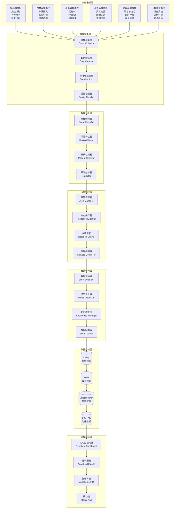
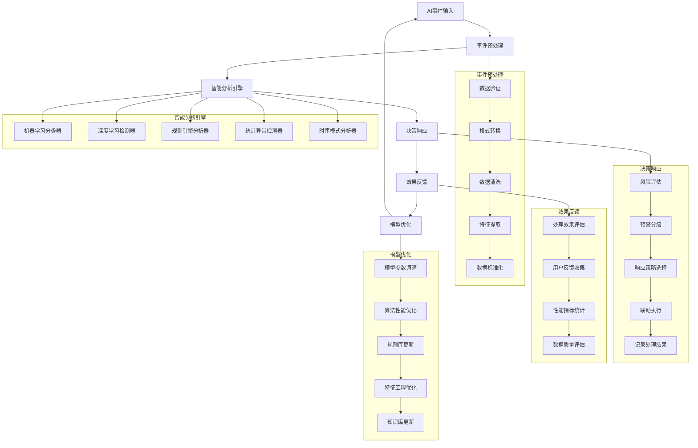

# IOE-DREAM AI智能分析设计文档

**文档版本**: v1.0.0
**更新日期**: 2025-12-16
**所属模块**: 公共模块
**服务名称**: ioedream-common-service

---

## 📋 系统概述

### 功能定位
IOE-DREAM AI智能分析系统是智慧园区一卡通管理平台的核心智能引擎，负责处理来自各业务模块的AI分析事件，实现跨系统的事件汇聚、智能分类、风险评估、预警响应和决策支持，为整个平台提供智能化的安全防护和业务优化能力。

### 核心特性
- ✅ **多源事件汇聚**: 统一采集各业务模块的AI分析事件
- ✅ **智能分类识别**: 基于机器学习的事件自动分类和识别
- ✅ **多维风险评估**: 实时评估事件的风险等级和影响范围
- ✅ **智能预警机制**: 多层级预警和自动化响应执行
- ✅ **决策支持分析**: 基于数据分析的智能决策建议
- ✅ **模式学习优化**: 持续学习和优化分析模型
- ✅ **可视化监控**: 实时监控大屏和分析报表

### 业务价值
- **安全防护提升**: 智能识别安全威胁，提前预警和自动响应
- **运营效率优化**: 自动化事件处理，减少人工干预成本
- **决策智能化**: 基于数据分析提供智能决策支持
- **风险管控强化**: 全方位风险评估和预警机制
- **用户体验提升**: 个性化服务推荐和智能响应

---

## 🏗️ 系统架构

### 整体架构图



### 核心组件架构



---

## 📊 数据库设计

### 核心表结构

#### AI事件表

```sql
CREATE TABLE `t_ai_event` (
    `event_id` BIGINT NOT NULL AUTO_INCREMENT COMMENT '事件ID',
    `event_code` VARCHAR(50) NOT NULL COMMENT '事件编码',
    `batch_id` VARCHAR(50) COMMENT '批次ID',
    `source_module` VARCHAR(50) NOT NULL COMMENT '来源模块：VIDEO-视频 ACCESS-门禁 ATTENDANCE-考勤 CONSUME-消费 VISITOR-访客 DEVICE-设备',
    `source_device_id` VARCHAR(100) COMMENT '来源设备ID',
    `event_type` VARCHAR(50) NOT NULL COMMENT '事件类型：SECURITY-安全 BUSINESS-业务 SYSTEM-系统',
    `event_subtype` VARCHAR(50) COMMENT '事件子类型',
    `event_level` VARCHAR(20) DEFAULT 'NORMAL' COMMENT '事件级别：NORMAL-普通 WARNING-警告 CRITICAL-严重 EMERGENCY-紧急',
    `event_title` VARCHAR(200) NOT NULL COMMENT '事件标题',
    `event_content` TEXT COMMENT '事件内容描述',
    `event_data` LONGTEXT COMMENT '事件原始数据JSON',
    `processed_data` TEXT COMMENT '处理后数据JSON',
    `features` TEXT COMMENT '特征向量JSON',
    `confidence_score` DECIMAL(5,4) COMMENT '置信度0.0000-1.0000',
    `risk_level` VARCHAR(20) COMMENT '风险等级：LOW-低 MEDIUM-中 HIGH-高 CRITICAL-极高',
    `urgency_level` VARCHAR(20) COMMENT '紧急程度：NORMAL-一般 URGENT-紧急 CRITICAL-极紧急',
    `impact_scope` VARCHAR(20) COMMENT '影响范围：LOCAL-局部 AREA-区域 GLOBAL-全局',
    `predicted_probability` DECIMAL(5,4) COMMENT '预测概率0.0000-1.0000',
    `classification_result` TEXT COMMENT '分类结果JSON',
    `risk_assessment` TEXT COMMENT '风险评估JSON',
    `status` VARCHAR(20) DEFAULT 'PENDING' COMMENT '状态：PENDING-待处理 PROCESSING-处理中 RESOLVED-已解决 IGNORED-已忽略',
    `processing_strategy` VARCHAR(50) COMMENT '处理策略：AUTO-自动 MANUAL-手动 HYBRID-混合',
    `processed_time` DATETIME COMMENT '处理时间',
    `processor_id` BIGINT COMMENT '处理人ID',
    `processor_name` VARCHAR(100) COMMENT '处理人姓名',
    `processing_result` TEXT COMMENT '处理结果JSON',
    `response_actions` TEXT COMMENT '响应动作JSON',
    `effectiveness_score` DECIMAL(5,4) COMMENT '处理效果评分0.0000-1.0000',
    `feedback_data` TEXT COMMENT '反馈数据JSON',
    `learning_data` TEXT COMMENT '学习数据JSON',
    `correlation_events` TEXT COMMENT '关联事件ID列表',
    `parent_event_id` BIGINT COMMENT '父事件ID',
    `root_event_id` BIGINT COMMENT '根事件ID',
    `tags` VARCHAR(500) COMMENT '标签',
    `priority_score` DECIMAL(10,2) COMMENT '优先级评分',
    `retention_days` INT DEFAULT 90 COMMENT '保留天数',
    `is_deleted` TINYINT DEFAULT 0 COMMENT '是否删除：0-否 1-是',
    `create_time` DATETIME NOT NULL DEFAULT CURRENT_TIMESTAMP COMMENT '创建时间',
    `update_time` DATETIME NOT NULL DEFAULT CURRENT_TIMESTAMP ON UPDATE CURRENT_TIMESTAMP COMMENT '更新时间',
    PRIMARY KEY (`event_id`),
    UNIQUE KEY `uk_event_code` (`event_code`),
    KEY `idx_source_module` (`source_module`),
    KEY `idx_event_type_level` (`event_type`, `event_level`),
    `idx_risk_urgency` (`risk_level`, `urgency_level`),
    KEY `idx_status_time` (`status`, `create_time`),
    KEY `idx_processor_id` (`processor_id`),
    KEY `idx_priority_score` (`priority_score` DESC),
    KEY `idx_confidence_score` (`confidence_score`),
    KEY `idx_create_time` (`create_time`),
    KEY `idx_parent_root_event` (`parent_event_id`, `root_event_id`)
) ENGINE=InnoDB DEFAULT CHARSET=utf8mb4 COMMENT='AI事件表';
```

#### AI事件处理记录表

```sql
CREATE TABLE `t_ai_event_record` (
    `record_id` BIGINT NOT NULL AUTO_INCREMENT COMMENT '记录ID',
    `event_id` BIGINT NOT NULL COMMENT '事件ID',
    `action_type` VARCHAR(50) NOT NULL COMMENT '处理动作类型：CLASSIFY-分类 ASSESS-评估 ALERT-预警 RESPONSE-响应 LEARN-学习',
    `action_subtype` VARCHAR(50) COMMENT '动作子类型',
    `action_sequence` INT DEFAULT 1 COMMENT '动作序号',
    `action_content` TEXT COMMENT '动作内容描述',
    `action_params` TEXT COMMENT '动作参数JSON',
    `action_result` VARCHAR(20) NOT NULL COMMENT '动作结果：SUCCESS-成功 FAILED-失败 PARTIAL-部分',
    `execution_time` BIGINT COMMENT '执行时长毫秒',
    `executor_id` BIGINT COMMENT '执行器ID',
    `executor_name` VARCHAR(100) COMMENT '执行器名称',
    `execution_details` TEXT COMMENT '执行详情JSON',
    `error_code` VARCHAR(50) COMMENT '错误码',
    `error_message` TEXT COMMENT '错误信息',
    `before_state` TEXT COMMENT '执行前状态JSON',
    `after_state` TEXT COMMENT '执行后状态JSON',
    `metrics` TEXT COMMENT '性能指标JSON',
    `feedback_score` DECIMAL(5,4) COMMENT '反馈评分0.0000-1.0000',
    `learning_impact` TEXT COMMENT '学习影响JSON',
    `correlation_score` DECIMAL(5,4) COMMENT '关联评分0.0000-1.0000',
    `create_time` DATETIME NOT NULL DEFAULT CURRENT_TIMESTAMP COMMENT '创建时间',
    PRIMARY KEY (`record_id`),
    KEY `idx_event_id` (`event_id`),
    KEY `idx_action_type` (`action_type`),
    KEY `idx_action_result` (`action_result`),
    KEY `idx_executor_id` (`executor_id`),
    KEY `idx_create_time` (`create_time`),
    KEY `idx_sequence` (`event_id`, `action_sequence`)
) ENGINE=InnoDB DEFAULT CHARSET=utf8mb4 COMMENT='AI事件处理记录表';
```

#### AI模型配置表

```sql
CREATE TABLE `t_ai_model_config` (
    `model_id` BIGINT NOT NULL AUTO_INCREMENT COMMENT '模型ID',
    `model_name` VARCHAR(100) NOT NULL COMMENT '模型名称',
    `model_code` VARCHAR(50) NOT NULL COMMENT '模型编码',
    `model_type` VARCHAR(50) NOT NULL COMMENT '模型类型：CLASSIFICATION-分类 DETECTION-检测 PREDICTION-预测 RECOMMENDATION-推荐',
    `algorithm` VARCHAR(50) NOT NULL COMMENT '算法：CNN-LSTM-RNN-TRANSFORMER-RANDOM_FOREST-XGBOOST-LIGHTGBM',
    `version` VARCHAR(20) DEFAULT '1.0' COMMENT '模型版本',
    `description` TEXT COMMENT '模型描述',
    `model_file_path` VARCHAR(500) COMMENT '模型文件路径',
    `config_file_path` VARCHAR(500) COMMENT '配置文件路径',
    `input_features` TEXT COMMENT '输入特征JSON',
    `output_features` TEXT COMMENT '输出特征JSON',
    `preprocessing_config` TEXT COMMENT '预处理配置JSON',
    `postprocessing_config` TEXT COMMENT '后处理配置JSON',
    `training_config` TEXT COMMENT '训练配置JSON',
    `evaluation_metrics` TEXT COMMENT '评估指标JSON',
    `accuracy_score` DECIMAL(5,4) COMMENT '准确率0.0000-1.0000',
    `precision_score` DECIMAL(5,4) COMMENT '精确率0.0000-1.0000',
    `recall_score` DECIMAL(5,4) COMMENT '召回率0.0000-1.0000',
    `f1_score` DECIMAL(5,4) COMMENT 'F1分数0.0000-1.0000',
    `auc_score` DECIMAL(5,4) COMMENT 'AUC分数0.0000-1.0000',
    `training_data_count` INT COMMENT '训练数据数量',
    `validation_data_count` INT COMMENT '验证数据数量',
    `test_data_count` INT COMMENT '测试数据数量',
    `training_time` DATETIME COMMENT '训练时间',
    `last_updated_time` DATETIME COMMENT '最后更新时间',
    `status` VARCHAR(20) DEFAULT 'ACTIVE' COMMENT '状态：ACTIVE-激活 INACTIVE-未激活 TRAINING-训练中 FAILED-失败',
    `performance_metrics` TEXT COMMENT '性能指标JSON',
    `deployment_info` TEXT COMMENT '部署信息JSON',
    `monitoring_config` TEXT COMMENT '监控配置JSON',
    `created_by` BIGINT COMMENT '创建人ID',
    `updated_by` BIGINT COMMENT '更新人ID',
    `create_time` DATETIME NOT NULL DEFAULT CURRENT_TIMESTAMP COMMENT '创建时间',
    `update_time` DATETIME NOT NULL DEFAULT CURRENT_TIMESTAMP ON UPDATE CURRENT_TIMESTAMP COMMENT '更新时间',
    PRIMARY KEY (`model_id`),
    UNIQUE KEY `uk_model_code` (`model_code`),
    KEY `idx_model_type` (`model_type`),
    KEY `idx_algorithm` (`algorithm`),
    KEY `idx_status` (`status`),
    KEY `idx_accuracy_score` (`accuracy_score`),
    KEY `idx_create_time` (`create_time`)
) ENGINE=InnoDB DEFAULT CHARSET=utf8mb4 COMMENT='AI模型配置表';
```

#### AI规则配置表

```sql
CREATE TABLE `t_ai_rule_config` (
    `rule_id` BIGINT NOT NULL AUTO_INCREMENT COMMENT '规则ID',
    `rule_code` VARCHAR(50) NOT NULL COMMENT '规则编码',
    `rule_name` VARCHAR(100) NOT NULL COMMENT '规则名称',
    `rule_category` VARCHAR(50) COMMENT '规则分类：SECURITY-安全 BUSINESS-业务 SYSTEM-系统',
    `rule_type` VARCHAR(50) NOT NULL COMMENT '规则类型：THRESHOLD-阈值 PATTERN-模式 CORRELATION-关联 COMPLEX-复杂',
    `rule_expression` TEXT NOT NULL COMMENT '规则表达式',
    `rule_description` TEXT COMMENT '规则描述',
    `input_fields` TEXT COMMENT '输入字段JSON',
    `output_fields` TEXT COMMENT '输出字段JSON',
    `condition_logic` TEXT COMMENT '条件逻辑JSON',
    `action_mapping` TEXT COMMENT '动作映射JSON',
    `priority` INT DEFAULT 0 COMMENT '优先级',
    `weight` DECIMAL(5,4) DEFAULT 1.0000 COMMENT '权重0.0000-1.0000',
    `confidence_threshold` DECIMAL(5,4) DEFAULT 0.8000 COMMENT '置信度阈值0.0000-1.0000',
    `severity_level` VARCHAR(20) DEFAULT 'MEDIUM' COMMENT '严重程度：LOW-低 MEDIUM-中 HIGH-高 CRITICAL-严重',
    `rule_parameters` TEXT COMMENT '规则参数JSON',
    `validation_config` TEXT COMMENT '验证配置JSON',
    `execution_config` TEXT COMMENT '执行配置JSON',
    `test_cases` TEXT COMMENT '测试用例JSON',
    `hit_count` INT DEFAULT 0 COMMENT '命中次数',
    `success_count` INT DEFAULT 0 COMMENT '成功次数',
    `failure_count` INT DEFAULT 0 COMMENT '失败次数',
    `success_rate` DECIMAL(5,4) DEFAULT 0.0000 COMMENT '成功率0.0000-1.0000',
    `avg_execution_time` BIGINT COMMENT '平均执行时间毫秒',
    `last_hit_time` DATETIME COMMENT '最后命中时间',
    `version` INT DEFAULT 1 COMMENT '版本号',
    `status` VARCHAR(20) DEFAULT 'ACTIVE' COMMENT '状态：ACTIVE-激活 INACTIVE-未激活 TESTING-测试',
    `dependencies` TEXT COMMENT '依赖规则JSON',
    `tags` VARCHAR(500) COMMENT '标签',
    `created_by` BIGINT COMMENT '创建人ID',
    `updated_by` BIGINT COMMENT '更新人ID',
    `create_time` DATETIME NOT NULL DEFAULT CURRENT_TIMESTAMP COMMENT '创建时间',
    `update_time` DATETIME NOT NULL DEFAULT CURRENT_TIMESTAMP ON UPDATE CURRENT_TIMESTAMP COMMENT '更新时间',
    PRIMARY KEY (`rule_id`),
    UNIQUE KEY `uk_rule_code` (`rule_code`),
    KEY `idx_rule_category` (`rule_category`),
    KEY `idx_rule_type` (`rule_type`),
    KEY `idx_priority` (`priority` DESC),
    KEY `idx_status` (`status`),
    KEY `idx_severity_level` (`severity_level`),
    KEY `idx_success_rate` (`success_rate`),
    KEY `idx_create_time` (`create_time`)
) ENGINE=InnoDB DEFAULT CHARSET=utf8mb4 COMMENT='AI规则配置表';
```

#### AI知识库表

```sql
CREATE TABLE `t_ai_knowledge_base` (
    `knowledge_id` BIGINT NOT NULL AUTO_INCREMENT COMMENT '知识ID',
    `knowledge_type` VARCHAR(50) NOT NULL COMMENT '知识类型：CASE-案例 PATTERN-模式 SOLUTION-解决方案 BEST_PRACTICE-最佳实践',
    `knowledge_title` VARCHAR(200) NOT NULL COMMENT '知识标题',
    `knowledge_category` VARCHAR(50) COMMENT '知识分类：SECURITY-安全 BUSINESS-业务 SYSTEM-系统',
    `knowledge_content` LONGTEXT NOT NULL COMMENT '知识内容',
    `summary` VARCHAR(500) COMMENT '知识摘要',
    `keywords` VARCHAR(500) COMMENT '关键词',
    `source` VARCHAR(100) COMMENT '知识来源',
    `author` VARCHAR(100) COMMENT '作者',
    `version` VARCHAR(20) DEFAULT '1.0' COMMENT '版本',
    `related_events` TEXT COMMENT '相关事件ID列表',
    `related_rules` TEXT COMMENT '相关规则ID列表',
    `related_models` TEXT COMMENT '相关模型ID列表',
    `applicable_scenarios` TEXT COMMENT '适用场景JSON',
    `effectiveness_rating` DECIMAL(5,4) DEFAULT 0.0000 COMMENT '有效性评分0.0000-1.0000',
    `usage_count` INT DEFAULT 0 COMMENT '使用次数',
    `success_application_count` INT DEFAULT 0 COMMENT '成功应用次数',
    `failure_application_count` INT DEFAULT 0 COMMENT '失败应用次数',
    `application_success_rate` DECIMAL(5,4) DEFAULT 0.0000 COMMENT '应用成功率0.0000-1.0000',
    `last_access_time` DATETIME COMMENT '最后访问时间',
    `access_frequency` INT DEFAULT 0 COMMENT '访问频率',
    `validation_status` VARCHAR(20) DEFAULT 'VALIDATED' COMMENT '验证状态：DRAFT-草稿 VALIDATED-已验证 TESTING-测试 APPROVED-已批准',
    `quality_score` DECIMAL(5,4) DEFAULT 0.0000 COMMENT '质量评分0.0000-1.0000',
    `review_comments` TEXT COMMENT '评审意见',
    `reviewer_id` BIGINT COMMENT '评审人ID',
    `review_date` DATETIME COMMENT '评审日期',
    `publish_date` DATETIME COMMENT '发布日期',
    `expiry_date` DATETIME COMMENT '过期日期',
    `access_level` VARCHAR(20) DEFAULT 'PUBLIC' COMMENT '访问级别：PUBLIC-公开 INTERNAL-内部 RESTRICTED-限制',
    `tags` VARCHAR(500) COMMENT '标签',
    `attachments` TEXT COMMENT '附件信息JSON',
    `references` TEXT COMMENT '参考文献JSON',
    `language` VARCHAR(10) DEFAULT 'ZH-CN' COMMENT '语言',
    `is_deleted` TINYINT DEFAULT 0 COMMENT '是否删除：0-否 1-是',
    `created_by` BIGINT COMMENT '创建人ID',
    `updated_by` BIGINT COMMENT '更新人ID',
    `create_time` DATETIME NOT NULL DEFAULT CURRENT_TIMESTAMP COMMENT '创建时间',
    `update_time` DATETIME NOT NULL DEFAULT CURRENT_TIMESTAMP ON UPDATE CURRENT_TIMESTAMP COMMENT '更新时间',
    PRIMARY KEY (`knowledge_id`),
    KEY `idx_knowledge_type` (`knowledge_type`),
    KEY `idx_knowledge_category` (`knowledge_category`),
    KEY `idx_effectiveness_rating` (`effectiveness_rating`),
    KEY `idx_usage_count` (`usage_count`),
    KEY `idx_access_frequency` (`access_frequency` DESC),
    KEY `idx_validation_status` (`validation_status`),
    KEY `idx_access_level` (`access_level`),
    KEY `idx_create_time` (`create_time`)
) ENGINE=InnoDB DEFAULT CHARSET=utf8mb4 COMMENT='AI知识库表';
```

---

## 🔌 API接口设计

### 事件管理API

```java
@RestController
@RequestMapping("/api/v1/ai/events")
@Tag(name = "AI事件管理")
public class AIEventController {

    @PostMapping("/collect")
    @Operation(summary = "采集AI事件")
    @RateLimiter(name = "ai-event-collect", fallbackMethod = "collectFallback")
    public ResponseDTO<String> collectEvent(@Valid @RequestBody AIEventCollectDTO collectDTO) {

        String eventId = aiEventService.collectEvent(collectDTO);
        return ResponseDTO.ok(eventId);
    }

    @GetMapping("/list")
    @Operation(summary = "获取事件列表")
    public ResponseDTO<PageResult<AIEventVO>> getEventList(@Valid @ModelAttribute AIEventQueryForm queryForm) {

        PageResult<AIEventEntity> pageResult = aiEventService.queryEventPage(queryForm);
        return ResponseDTO.ok(convertToVO(pageResult));
    }

    @GetMapping("/{eventId}")
    @Operation(summary = "获取事件详情")
    public ResponseDTO<AIEventDetailVO> getEventDetail(@PathVariable Long eventId) {

        AIEventEntity event = aiEventService.getById(eventId);
        List<AIEventRecordEntity> records = aiEventService.getEventRecords(eventId);
        return ResponseDTO.ok(convertToDetailVO(event, records));
    }

    @PostMapping("/{eventId}/process")
    @Operation(summary = "处理AI事件")
    public ResponseDTO<Void> processEvent(@PathVariable Long eventId,
                                            @Valid @RequestBody AIEventProcessDTO processDTO) {

        aiEventService.processEvent(eventId, processDTO);
        return ResponseDTO.ok();
    }

    @PostMapping("/batch-process")
    @Operation(summary = "批量处理事件")
    public ResponseDTO<BatchProcessResultVO> batchProcessEvent(@Valid @RequestBody BatchProcessEventDTO batchDTO) {

        BatchProcessResultDTO result = aiEventService.batchProcessEvent(batchDTO);
        return ResponseDTO.ok(convertToVO(result));
    }
}
```

### 分析分析API

```java
@RestController
@RequestMapping("/api/v1/ai/analysis")
@Tag(name = "AI分析")
public class AIAnalysisController {

    @PostMapping("/classify")
    @Operation(summary = "事件分类分析")
    public ResponseDTO<ClassificationResultVO> classifyEvent(@Valid @RequestBody EventClassificationDTO classificationDTO) {

        ClassificationResultDTO result = aiAnalysisService.classifyEvent(classificationDTO);
        return ResponseDTO.ok(convertToVO(result));
    }

    @PostMapping("/risk-assessment")
    @Operation(summary = "风险评估")
    public ResponseDTO<RiskAssessmentVO> assessRisk(@Valid @RequestBody RiskAssessmentDTO assessmentDTO) {

        RiskAssessmentDTO result = aiAnalysisService.assessRisk(assessmentDTO);
        return ResponseDTO.ok(convertToVO(result));
    }

    @PostMapping("/pattern-analysis")
    @Operation(summary = "模式分析")
    public ResponseDTO<PatternAnalysisResultVO> analyzePattern(@Valid @RequestBody PatternAnalysisDTO analysisDTO) {

        PatternAnalysisResultDTO result = aiAnalysisService.analyzePattern(analysisDTO);
        return ResponseDTO.ok(convertToVO(result));
    }

    @PostMapping("/prediction")
    @Operation(summary = "预测分析")
    public ResponseDTO<PredictionResultVO> predict(@Valid @RequestBody PredictionDTO predictionDTO) {

        PredictionResultDTO result = aiAnalysisService.predict(predictionDTO);
        return ResponseDTO.ok(convertToVO(result));
    }

    @GetMapping("/correlation-analysis")
    @Operation(summary = "关联分析")
    public ResponseDTO<CorrelationAnalysisVO> analyzeCorrelation(@Valid @ModelAttribute CorrelationAnalysisDTO analysisDTO) {

        CorrelationAnalysisDTO result = aiAnalysisService.analyzeCorrelation(analysisDTO);
        return ResponseDTO.ok(convertToVO(result));
    }
}
```

### 模型管理API

```java
@RestController
@RequestMapping("/api/v1/ai/models")
@Tag(name = "AI模型管理")
public class AIModelController {

    @GetMapping("/list")
    @Operation(summary = "获取模型列表")
    public ResponseDTO<List<AIModelVO>> getModelList(@Valid @ModelAttribute ModelQueryForm queryForm) {

        List<AIModelEntity> models = aiModelService.queryModelList(queryForm);
        return ResponseDTO.ok(convertToVO(models));
    }

    @PostMapping
    @Operation(summary = "创建AI模型")
    public ResponseDTO<Long> createModel(@Valid @RequestBody AIModelCreateDTO createDTO) {

        Long modelId = aiModelService.createModel(createDTO);
        return ResponseDTO.ok(modelId);
    }

    @PutMapping("/{modelId}")
    @Operation(summary = "更新AI模型")
    public ResponseDTO<Void> updateModel(@PathVariable Long modelId,
                                           @Valid @RequestBody AIModelUpdateDTO updateDTO) {

        aiModelService.updateModel(modelId, updateDTO);
        return ResponseDTO.ok();
    }

    @DeleteMapping("/{modelId}")
    @Operation(summary = "删除AI模型")
    public ResponseDTO<Void> deleteModel(@PathVariable Long modelId) {

        aiModelService.deleteModel(modelId);
        return ResponseDTO.ok();
    }

    @PostMapping("/{modelId}/train")
    @Operation(summary = "训练模型")
    @Async("aiTrainingTaskExecutor")
    public ResponseDTO<String> trainModel(@PathVariable Long modelId,
                                            @Valid @RequestBody ModelTrainingDTO trainingDTO) {

        String trainingTaskId = aiModelService.trainModel(modelId, trainingDTO);
        return ResponseDTO.ok(trainingTaskId);
    }

    @GetMapping("/{modelId}/performance")
    @Operation(summary = "获取模型性能")
    public ResponseDTO<ModelPerformanceVO> getModelPerformance(@PathVariable Long modelId) {

        ModelPerformanceDTO performance = aiModelService.getModelPerformance(modelId);
        return ResponseDTO.ok(convertToVO(performance));
    }
}
```

### 规则管理API

```java
@RestController
@RequestMapping("/api/v1/ai/rules")
@Tag(name = "AI规则管理")
public class AIRuleController {

    @GetMapping("/list")
    @Operation(summary = "获取规则列表")
    public ResponseDTO<List<RuleVO>> getRuleList(@Valid @ModelAttribute RuleQueryForm queryForm) {

        List<RuleEntity> rules = aiRuleService.queryRuleList(queryForm);
        return ResponseDTO.ok(convertToVO(rules));
    }

    @PostMapping
    @Operation(summary = "创建AI规则")
    public ResponseDTO<Long> createRule(@Valid @RequestBody RuleCreateDTO createDTO) {

        Long ruleId = aiRuleService.createRule(createDTO);
        return ResponseDTO.ok(ruleId);
    }

    @PutMapping("/{ruleId}")
    @Operation(summary = "更新AI规则")
    public ResponseDTO<Void> updateRule(@PathVariable Long ruleId,
                                         @Valid @RequestBody RuleUpdateDTO updateDTO) {

        aiRuleService.updateRule(ruleId, updateDTO);
        return ResponseDTO.ok();
    }

    @DeleteMapping("/{ruleId}")
    @Operation(summary = "删除AI规则")
    public ResponseDTO<Void> deleteRule(@PathVariable Long ruleId) {

        aiRuleService.deleteRule(ruleId);
        return ResponseDTO.ok();
    }

    @PostMapping("/test")
    @Operation(summary = "测试规则")
    public ResponseDTO<RuleTestResultVO> testRule(@Valid @RequestBody RuleTestDTO testDTO) {

        RuleTestResultDTO result = aiRuleService.testRule(testDTO);
        return ResponseDTO.ok(convertToVO(result));
    }

    @PostMapping("/validate")
    @Operation(summary = "验证规则")
    public ResponseDTO<RuleValidationResultVO> validateRule(@Valid @RequestBody RuleValidationDTO validationDTO) {

        RuleValidationResultDTO result = aiRuleService.validateRule(validationDTO);
        return ResponseDTO.ok(convertToVO(result));
    }
}
```

### 知识库API

```java
@RestController
@RequestMapping("/api/v1/ai/knowledge")
@Tag(name = "AI知识库")
public class AIKnowledgeController {

    @GetMapping("/search")
    @Operation(summary = "搜索知识")
    public ResponseDTO<PageResult<KnowledgeVO>> searchKnowledge(@Valid @ModelAttribute KnowledgeSearchDTO searchDTO) {

        PageResult<KnowledgeEntity> pageResult = aiKnowledgeService.searchKnowledge(searchDTO);
        return ResponseDTO.ok(convertToVO(pageResult));
    }

    @PostMapping
    @Operation(summary = "创建知识条目")
    public ResponseDTO<Long> createKnowledge(@Valid @RequestBody KnowledgeCreateDTO createDTO) {

        Long knowledgeId = aiKnowledgeService.createKnowledge(createDTO);
        return ResponseDTO.ok(knowledgeId);
    }

    @GetMapping("/{knowledgeId}")
    @Operation(summary = "获取知识详情")
    public ResponseDTO<KnowledgeDetailVO> getKnowledgeDetail(@PathVariable Long knowledgeId) {

        KnowledgeEntity knowledge = aiKnowledgeService.getById(knowledgeId);
        return ResponseDTO.ok(convertToDetailVO(knowledge));
    }

    @PutMapping("/{knowledgeId}")
    @Operation(summary = "更新知识条目")
    public ResponseDTO<Void> updateKnowledge(@PathVariable Long knowledgeId,
                                              @Valid @RequestBody KnowledgeUpdateDTO updateDTO) {

        aiKnowledgeService.updateKnowledge(knowledgeId, updateDTO);
        return ResponseDTO.ok();
    }

    @DeleteMapping("/{knowledgeId}")
    @Operation(summary = "删除知识条目")
    public ResponseDTO<Void> deleteKnowledge(@PathVariable Long knowledgeId) {

        aiKnowledgeService.deleteKnowledge(knowledgeId);
        return ResponseDTO.ok();
    }

    @PostMapping("/feedback")
    @Operation(summary = "知识反馈")
    public ResponseDTO<Void> submitFeedback(@Valid @RequestBody KnowledgeFeedbackDTO feedbackDTO) {

        aiKnowledgeService.submitFeedback(feedbackDTO);
        return ResponseDTO.ok();
    }

    @GetMapping("/recommendations")
    @Operation(summary = "知识推荐")
    public ResponseDTO<List<KnowledgeVO>> getRecommendations(@Valid @ModelAttribute KnowledgeRecommendationDTO recommendationDTO) {

        List<KnowledgeEntity> recommendations = aiKnowledgeService.getRecommendations(recommendationDTO);
        return ResponseDTO.ok(convertToVO(recommendations));
    }
}
```

---

## 🛠️ 核心功能实现

### 事件智能分类

#### 多算法融合分类器

```java
@Service
@Slf4j
public class MultiAlgorithmEventClassifier implements EventClassifier {

    @Resource
    private CNNEventClassifier cnnClassifier;

    @Resource
    private RuleEngineClassifier ruleEngineClassifier;

    @Resource
    private PatternMatcherClassifier patternClassifier;

    @Resource
    private StatisticalClassifier statisticalClassifier;

    /**
     * 多算法融合分类
     */
    @Override
    public ClassificationResultDTO classifyEvent(EventClassificationDTO classificationDTO) {
        long startTime = System.currentTimeMillis();

        try {
            // 并行执行多种分类算法
            CompletableFuture<CNNClassificationResult> cnnFuture =
                CompletableFuture.supplyAsync(() -> cnnClassifier.classify(classificationDTO));

            CompletableFuture<RuleClassificationResult> ruleFuture =
                CompletableFuture.supplyAsync(() -> ruleEngineClassifier.classify(classificationDTO));

            CompletableFuture<PatternClassificationResult> patternFuture =
                CompletableFuture.supplyAsync(() -> patternMatcher.classify(classificationDTO));

            CompletableFuture<StatisticalClassificationResult> statisticalFuture =
                CompletableFuture.supplyAsync(() -> statisticalClassifier.classify(classificationDTO));

            // 等待所有分类结果
            CNNClassificationResult cnnResult = cnnFuture.get(5, TimeUnit.SECONDS);
            RuleClassificationResult ruleResult = ruleFuture.get(3, TimeUnit.SECONDS);
            PatternClassificationResult patternResult = patternFuture.get(3, TimeUnit.SECONDS);
            StatisticalClassificationResult statisticalResult = statisticalFuture.get(2, TimeUnit.SECONDS);

            // 融合分类结果
            ClassificationResultDTO fusedResult = fuseClassificationResults(
                classificationDTO,
                cnnResult,
                ruleResult,
                patternResult,
                statisticalResult
            );

            // 记录分类耗时
            long duration = System.currentTimeMillis() - startTime;
            fusedResult.setClassificationTime(duration);

            log.info("事件分类完成: eventId={}, eventType={}, confidence={}, duration={}ms",
                    classificationDTO.getEventId(),
                    fusedResult.getEventType(),
                    fusedResult.getConfidenceScore(),
                    duration);

            return fusedResult;

        } catch (Exception e) {
            log.error("事件分类失败: eventId=" + classificationDTO.getEventId(), e);
            return ClassificationResultDTO.failure("分类失败: " + e.getMessage());
        }
    }

    /**
     * 融合分类结果
     */
    private ClassificationResultDTO fuseClassificationResults(
            EventClassificationDTO classificationDTO,
            CNNClassificationResult cnnResult,
            RuleClassificationResult ruleResult,
            PatternClassificationResult patternResult,
            StatisticalClassificationResult statisticalResult) {

        // 定义算法权重
        Map<String, Double> weights = Map.of(
            "CNN", 0.35,
            "RULE", 0.30,
            "PATTERN", 0.20,
            "STATISTICAL", 0.15
        );

        // 提取分类结果
        Map<String, String> eventTypeVotes = new HashMap<>();
        Map<String, Double> confidenceScores = new HashMap<>();

        eventTypeVotes.put(cnnResult.getEventType(), cnnResult.getConfidence());
        eventTypeVotes.put(ruleResult.getEventType(), ruleResult.getConfidence());
        eventTypeVotes.put(patternResult.getEventType(), patternResult.getConfidence());
        eventTypeVotes.put(statisticalResult.getEventType(), statisticalResult.getConfidence());

        // 加权融合计算
        String finalEventType = determineEventType(eventTypeVotes, weights);
        double finalConfidence = calculateWeightedConfidence(eventTypeVotes, weights);

        return ClassificationResultDTO.builder()
                .eventId(classificationDTO.getEventId())
                .eventType(finalEventType)
                .confidenceScore(finalConfidence)
                .classificationAlgorithm("MULTI_ALGORITHM_FUSION")
                .cnnResult(cnnResult)
                .ruleResult(ruleResult)
                .patternResult(patternResult)
                .statisticalResult(statisticalResult)
                .fusionMethod("WEIGHTED_AVERAGE")
                .algorithmWeights(weights)
                .build();
    }

    private String determineEventType(Map<String, Double> votes, Map<String, Double> weights) {
        return votes.entrySet().stream()
                .max(Comparator.comparingDouble(entry ->
                    entry.getValue() * weights.getOrDefault(getAlgorithmFromResult(entry.getKey()), 0.0)))
                .map(Map.Entry::getKey)
                .orElse("UNKNOWN");
    }

    private String getAlgorithmFromResult(String resultKey) {
        // 从结果键中提取算法名称
        if (resultKey.equals(cnnResult.getEventType())) return "CNN";
        if (resultKey.equals(ruleResult.getEventType())) return "RULE";
        if (resultKey.equals(patternResult.getEventType())) return "PATTERN";
        if (resultKey.equals(statisticalResult.getEventType())) return "STATISTICAL";
        return "UNKNOWN";
    }

    private double calculateWeightedConfidence(Map<String, Double> votes, Map<String, Double> weights) {
        double weightedSum = votes.entrySet().stream()
                .mapToDouble(entry -> entry.getValue() * weights.getOrDefault(getAlgorithmFromResult(entry.getKey()), 0.0))
                .sum();

        double totalWeight = weights.values().stream().mapToDouble(Double::doubleValue).sum();

        return totalWeight > 0 ? weightedSum / totalWeight : 0.0;
    }
}
```

#### CNN神经网络分类器

```java
@Service
@Slf4j
public class CNNEventClassifier implements EventClassifier {

    @Resource
    private TensorFlowModelService tensorflowModelService;

    @Resource
    private FeatureExtractor featureExtractor;

    @Override
    public CNNClassificationResult classify(EventClassificationDTO classificationDTO) {
        try {
            // 特征提取
            double[] features = featureExtractor.extractFeatures(classificationDTO);

            // 预处理
            double[] preprocessedFeatures = preprocessFeatures(features);

            // CNN模型预测
            float[] predictions = tensorflowModelService.predict(preprocessedFeatures);

            // 解析预测结果
            String eventType = parseEventType(predictions);
            double confidence = calculateConfidence(predictions, eventType);

            return CNNClassificationResult.builder()
                    .eventType(eventType)
                    .confidence(confidence)
                    .predictions(predictions)
                    .featureVector(features)
                    .modelName("cnn_event_classifier_v1")
                    .build();

        } catch (Exception e) {
            log.error("CNN分类失败: eventId=" + classificationDTO.getEventId(), e);
            return CNNClassificationResult.failure("CNN分类失败: " + e.getMessage());
        }
    }

    private double[] preprocessFeatures(double[] features) {
        // 归一化处理
        double[] normalized = new double[features.length];
        double mean = calculateMean(features);
        double std = calculateStd(features, mean);

        for (int i = 0; i < features.length; i++) {
            normalized[i] = (features[i] - mean) / (std + 1e-8);
        }

        return normalized;
    }

    private String parseEventType(float[] predictions) {
        int maxIndex = 0;
        float maxProbability = predictions[0];

        for (int i = 1; i < predictions.length; i++) {
            if (predictions[i] > maxProbability) {
                maxProbability = predictions[i];
                maxIndex = i;
            }
        }

        String[] eventTypes = {"SECURITY", "BUSINESS", "SYSTEM", "USER_BEHAVIOR", "ANOMALY"};
        return eventTypes[Math.min(maxIndex, eventTypes.length - 1)];
    }

    private double calculateConfidence(float[] predictions, String eventType) {
        int eventTypeIndex = getEventTypeIndex(eventType);
        return predictions[eventTypeIndex];
    }

    private int getEventTypeIndex(String eventType) {
        String[] eventTypes = {"SECURITY", "BUSINESS", "SYSTEM", "USER_BEHAVIOR", "ANOMALY"};
        for (int i = 0; i < eventTypes.length; i++) {
            if (eventTypes[i].equals(eventType)) {
                return i;
            }
        }
        return 0;
    }

    private double calculateMean(double[] features) {
        return Arrays.stream(features).average().orElse(0.0);
    }

    private double calculateStd(double[] features, double mean) {
        double variance = Arrays.stream(features)
                .map(x -> Math.pow(x - mean, 2))
                .average()
                .orElse(0.0);
        return Math.sqrt(variance);
    }
}
```

### 风险评估器

#### 多维度风险评估

```java
@Service
@Slf4j
public class MultiDimensionalRiskAssessor implements RiskAssessor {

    @Resource
    private RiskModelRepository riskModelRepository;

    @Resource
    private ContextAnalyzer contextAnalyzer;

    @Override
    public RiskAssessmentResultDTO assessRisk(RiskAssessmentDTO assessmentDTO) {
        try {
            // 多维度风险评估
            RiskFactors factors = extractRiskFactors(assessmentDTO);

            // 各维度评分
            double severityScore = assessSeverity(factors);
            double urgencyScore = assessUrgency(factors);
            double impactScore = assessImpact(factors);
            double likelihoodScore = assessLikelihood(factors);
            double contextScore = assessContext(factors);
            double historicalScore = assessHistoricalRisk(factors);

            // 综合风险评分
            double overallRiskScore = calculateOverallRiskScore(
                    severityScore, urgencyScore, impactScore,
                    likelihoodScore, contextScore, historicalScore
            );

            // 确定风险等级和紧急程度
            RiskLevel riskLevel = determineRiskLevel(overallRiskScore);
            UrgencyLevel urgencyLevel = determineUrgencyLevel(urgencyScore, overallRiskScore);
            ImpactScope impactScope = determineImpactScope(factors, impactScore);

            // 风险缓解建议
            List<String> mitigationSuggestions = generateMitigationSuggestions(
                    riskLevel, urgencyLevel, impactScope, factors
            );

            return RiskAssessmentResultDTO.builder()
                    .eventId(assessmentDTO.getEventId())
                    .overallRiskScore(overallRiskScore)
                    .riskLevel(riskLevel)
                    .urgencyLevel(urgencyLevel)
                    .impactScope(impactScope)
                    .severityScore(severityScore)
                    .urgencyScore(urgencyScore)
                    .impactScore(impactScore)
                    .likelihoodScore(likelihoodScore)
                    .contextScore(contextScore)
                    .historicalScore(historicalScore)
                    .riskFactors(factors)
                    .mitigationSuggestions(mitigationSuggestions)
                    .assessmentTime(LocalDateTime.now())
                    .build();

        } catch (Exception e) {
            log.error("风险评估失败: eventId=" + assessmentDTO.getEventId(), e);
            return RiskAssessmentResultDTO.failure("风险评估失败: " + e.getMessage());
        }
    }

    private RiskFactors extractRiskFactors(RiskAssessmentDTO assessmentDTO) {
        return RiskFactors.builder()
                .eventType(assessmentDTO.getEventType())
                .eventSeverity(assessmentDTO.getEventSeverity())
                .affectedAssetsCount(assessmentDTO.getAffectedAssetsCount())
                .affectedUsersCount(assessmentDTO.getAffectedUsersCount())
                .dataSensitivityLevel(assessmentDTO.getDataSensitivityLevel())
                .systemCriticalityLevel(assessmentDTO.getSystemCriticalityLevel())
                .historicalIncidentCount(assessmentDTO.getHistoricalIncidentCount())
                .environmentalFactors(assessmentDTO.getEnvironmentalFactors())
                .timeOfDay(LocalTime.now().getHour())
                .dayOfWeek(LocalDate.now().getDayOfWeek().getValue())
                .geographicLocation(assessmentDTO.getGeographicLocation())
                .weatherConditions(assessmentDTO.getWeatherConditions())
                .businessImpact(assessmentDTO.getBusinessImpact())
                .complianceImpact(assessmentDTO.getComplianceImpact())
                .build();
    }

    private double assessSeverity(RiskFactors factors) {
        double severityScore = 0.0;

        // 事件严重程度评分
        Map<String, Double> severityScores = Map.of(
            "LOW", 1.0,
            "MEDIUM", 2.0,
            "HIGH", 3.0,
            "CRITICAL", 4.0,
            "EMERGENCY", 5.0
        );

        severityScore += severityScores.getOrDefault(factors.getEventSeverity(), 1.0);

        // 数据敏感度评分
        Map<String, Double> dataSensitivityScores = Map.of(
            "PUBLIC", 0.5,
            "INTERNAL", 1.0,
            "CONFIDENTIAL", 2.0,
            "SECRET", 3.0,
            "TOP_SECRET", 4.0
        );

        severityScore += dataSensitivityScores.getOrDefault(factors.getDataSensitivityLevel(), 1.0);

        return Math.min(severityScore, 5.0);
    }

    private double assessImpact(RiskFactors factors) {
        double impactScore = 0.0;

        // 资产影响评分
        double assetsImpact = Math.min(factors.getAffectedAssetsCount() / 10.0, 5.0);
        impactScore += assetsImpact;

        // 用户影响评分
        double usersImpact = Math.min(factors.getAffectedUsersCount() / 100.0, 3.0);
        impactScore += usersImpact;

        // 业务影响评分
        Map<String, Double> businessImpactScores = Map.of(
            "NONE", 0.0,
            "MINIMAL", 0.5,
            "MODERATE", 1.5,
            "MAJOR", 3.0,
            "SEVERE", 5.0
        );

        impactScore += businessImpactScores.getOrDefault(factors.getBusinessImpact(), 0.0);

        return Math.min(impactScore, 5.0);
    }

    private double assessLikelihood(RiskFactors factors) {
        double likelihoodScore = 1.0;

        // 历史事件频率
        if (factors.getHistoricalIncidentCount() > 0) {
            likelihoodScore += Math.log1p(factors.getHistoricalIncidentCount());
        }

        // 环境因素影响
        if (factors.getEnvironmentalFactors() != null) {
            likelihoodScore += factors.getEnvironmentalFactors().stream()
                    .mapToDouble(f -> getEnvironmentalFactorWeight(f))
                    .sum();
        }

        // 时间因素影响
        int hour = factors.getTimeOfDay();
        if (hour >= 22 || hour < 6) {
            likelihoodScore += 0.5; // 夜间风险增加
        }

        int dayOfWeek = factors.getDayOfWeek();
        if (dayOfWeek == 1 || dayOfWeek == 7) { // 周末
            likelihoodScore += 0.3;
        }

        return Math.min(likelihoodScore, 5.0);
    }

    private double calculateOverallRiskScore(double severity, double urgency, double impact,
                                              double likelihood, double context, double historical) {
        // 风险评分公式: Risk = (Severity × Impact × Likelihood) × Context × Historical
        double baseRisk = (severity * impact * likelihood) / 10.0; // 归一化除以10

        // 应用上下文和历史调整因子
        double contextFactor = 1.0 + (context - 2.5) * 0.2; // 上下文调整因子
        double historicalFactor = 1.0 + (historical - 2.5) * 0.3; // 历史调整因子

        double finalRisk = baseRisk * contextFactor * historicalFactor;

        // 应用紧急度调整
        double urgencyAdjustment = (urgency - 2.5) * 0.1;
        finalRisk *= (1.0 + urgencyAdjustment);

        return Math.min(finalRisk * 20, 100.0); // 转换为0-100分制
    }

    private RiskLevel determineRiskLevel(double riskScore) {
        if (riskScore >= 80) return RiskLevel.CRITICAL;
        if (riskScore >= 60) return RiskLevel.HIGH;
        if (riskScore >= 40) return RiskLevel.MEDIUM;
        if (riskScore >= 20) return RiskLevel.LOW;
        return RiskLevel.MINIMAL;
    }

    private UrgencyLevel determineUrgencyLevel(double urgencyScore, double riskScore) {
        double combinedScore = (urgencyScore + riskScore) / 2.0;

        if (combinedScore >= 75) return UrgencyLevel.CRITICAL;
        if (combinedScore >= 55) return UrgencyLevel.URGENT;
        if (combinedScore >= 35) return UrgencyLevel.NORMAL;
        return UrgencyLevel.LOW;
    }

    private double getEnvironmentalFactorWeight(String factor) {
        Map<String, Double> weights = Map.of(
            "WEATHER_EXTREME", 0.5,
            "NETWORK_OUTAGE", 0.8,
            "SYSTEM_MAINTENANCE", 0.3,
            "HIGH_TRAFFIC", 0.2,
            "RESOURCE_CONSTRAINT", 0.4
        );
        return weights.getOrDefault(factor, 0.1);
    }
}
```

### 智能预警系统

#### 多层级预警机制

```java
@Service
@Slf4j
public class IntelligentAlertManager implements AlertManager {

    @Resource
    private NotificationService notificationService;

    @Resource
    private ResponseExecutor responseExecutor;

    @Resource
    private AlertRuleEngine alertRuleEngine;

    @Override
    public AlertResultDTO generateAlert(AIEventEntity event) {
        try {
            // 预警规则匹配
            AlertRuleMatchResult ruleMatch = alertRuleEngine.matchRules(event);

            if (!ruleMatch.isMatched()) {
                return AlertResultDTO.noMatch();
            }

            // 生成预警事件
            AlertEvent alertEvent = createAlertEvent(event, ruleMatch);

            // 确定预警级别
            AlertLevel alertLevel = determineAlertLevel(event, ruleMatch);

            // 执行预警动作
            List<AlertAction> actions = executeAlertActions(alertEvent, alertLevel);

            // 记录预警结果
            AlertResultDTO result = AlertResultDTO.builder()
                    .alertId(alertEvent.getAlertId())
                    .eventId(event.getEventId())
                    .alertLevel(alertLevel)
                    .alertTitle(alertEvent.getTitle())
                    .alertContent(alertEvent.getContent())
                    .matchedRules(ruleMatch.getMatchedRules())
                    .actions(actions)
                    .generationTime(LocalDateTime.now())
                    .status(AlertStatus.GENERATED)
                    .build();

            log.info("预警生成成功: alertId={}, eventId={}, alertLevel={}",
                    result.getAlertId(), event.getEventId(), alertLevel);

            return result;

        } catch (Exception e) {
            log.error("预警生成失败: eventId=" + event.getEventId(), e);
            return AlertResultDTO.failure("预警生成失败: " + e.getMessage());
        }
    }

    private AlertEvent createAlertEvent(AIEventEntity event, AlertRuleMatchResult ruleMatch) {
        return AlertEvent.builder()
                .alertId(generateAlertId())
                .eventId(event.getEventId())
                .title(generateAlertTitle(event, ruleMatch))
                .content(generateAlertContent(event, ruleMatch))
                .alertLevel(determineAlertLevel(event, ruleMatch))
                .urgencyLevel(determineUrgencyLevel(event))
                .impactScope(determineImpactScope(event))
                .mitigationSuggestions(generateMitigationSuggestions(event, ruleMatch))
                .estimatedResolutionTime(estimateResolutionTime(event))
                .escalationRules(determineEscalationRules(event))
                .createdTime(LocalDateTime.now())
                .build();
    }

    private List<AlertAction> executeAlertActions(AlertEvent alertEvent, AlertLevel alertLevel) {
        List<AlertAction> actions = new ArrayList<>();

        try {
            // 通知动作
            actions.addAll(executeNotificationActions(alertEvent, alertLevel));

            // 自动响应动作
            actions.addAll(executeAutoResponseActions(alertEvent, alertLevel));

            // 升级动作
            actions.addAll(executeEscalationActions(alertEvent, alertLevel));

            // 记录动作
            actions.forEach(action -> {
                action.setExecutionTime(LocalDateTime.now());
                action.setStatus(ActionStatus.COMPLETED);
            });

        } catch (Exception e) {
            log.error("预警动作执行失败: alertId=" + alertEvent.getAlertId(), e);
            actions.add(createFailedAction("ACTION_EXECUTION_FAILED", e.getMessage()));
        }

        return actions;
    }

    private List<AlertAction> executeNotificationActions(AlertEvent alertEvent, AlertLevel alertLevel) {
        List<AlertAction> actions = new ArrayList<>();

        // 根据预警级别选择通知渠道
        Set<String> channels = determineNotificationChannels(alertLevel);

        NotificationSendDTO notificationDTO = NotificationSendDTO.builder()
                .title(alertEvent.getTitle())
                .content(alertEvent.getContent())
                .notificationType("ALERT")
                .priority(convertToNotificationPriority(alertLevel))
                .channels(String.join(",", channels))
                .receiverType("ALL")
                .templateCode("ALERT_TEMPLATE")
                .templateData(buildTemplateData(alertEvent))
                .build();

        try {
            notificationService.sendNotification(notificationDTO);
            actions.add(createNotificationAction(channels, "SUCCESS", "通知发送成功"));
        } catch (Exception e) {
            actions.add(createNotificationAction(channels, "FAILED", "通知发送失败: " + e.getMessage()));
        }

        return actions;
    }

    private List<AlertAction> executeAutoResponseActions(AlertEvent alertEvent, AlertLevel alertLevel) {
        List<AlertAction> actions = new ArrayList<>();

        // 根据事件类型执行自动响应
        switch (alertEvent.getEventType()) {
            case "SECURITY":
                actions.addAll(executeSecurityResponse(alertEvent));
                break;
            case "SYSTEM":
                actions.addAll(executeSystemResponse(alertEvent));
                break;
            case "BUSINESS":
                actions.addAll(executeBusinessResponse(alertEvent));
                break;
            default:
                // 默认响应动作
                actions.add(createAutoResponseAction("DEFAULT_RESPONSE", "执行默认响应"));
        }

        return actions;
    }

    private List<AlertAction> executeSecurityResponse(AlertEvent alertEvent) {
        List<AlertAction> actions = new ArrayList<>();

        // 安全响应动作
        actions.add(createAutoResponseAction("BLOCK_IP", "阻止可疑IP地址"));
        actions.add(createAutoResponseAction("LOCK_ACCOUNT", "锁定相关账户"));
        actions.add(createAutoResponseAction("LOG_ACTIVITY", "记录详细活动日志"));

        return actions;
    }

    private List<AlertAction> executeEscalationActions(AlertEvent alertEvent, AlertLevel alertLevel) {
        List<AlertAction> actions = new ArrayList<>();

        // 根据预警级别和升级规则执行升级
        if (alertLevel == AlertLevel.CRITICAL || alertLevel == AlertLevel.EMERGENCY) {
            actions.add(createEscalationAction("IMMEDIATE_RESPONSE", "立即响应"));
            actions.add(createEscalationAction("MANAGER_NOTIFICATION", "通知管理员"));
            actions.add(createEscalationAction("EXTERNAL_REPORT", "外部报告"));
        }

        return actions;
    }

    private String generateAlertId() {
        return "ALERT_" + System.currentTimeMillis() + "_" + ThreadLocalRandom.current().nextInt(1000);
    }

    private String generateAlertTitle(AIEventEntity event, AlertRuleMatchResult ruleMatch) {
        return String.format("[%s] %s - %s",
                ruleMatch.getMatchedRules().stream().findFirst().orElse("ALERT"),
                event.getEventType(),
                event.getEventTitle()
        );
    }

    private String generateAlertContent(AIEventEntity event, AlertRuleMatchResult ruleMatch) {
        StringBuilder content = new StringBuilder();
        content.append("事件详情: ").append(event.getEventContent()).append("\n");
        content.append("风险等级: ").append(event.getRiskLevel()).append("\n");
        content.append("紧急程度: ").append(event.getUrgencyLevel()).append("\n");
        content.append("影响范围: ").append(event.getImpactScope()).append("\n");

        if (ruleMatch.getMatchedRules() != null && !ruleMatch.getMatchedRules().isEmpty()) {
            content.append("触发规则: ").append(String.join(", ", ruleMatch.getMatchedRules())).append("\n");
        }

        return content.toString();
    }

    private Map<String, Object> buildTemplateData(AlertEvent alertEvent) {
        Map<String, Object> templateData = new HashMap<>();
        templateData.put("alertId", alertEvent.getAlertId());
        templateData.put("alertLevel", alertEvent.getAlertLevel());
        templateData.put("urgencyLevel", alertEvent.getUrgencyLevel());
        templateData.put("eventId", alertEvent.getEventId());
        templateData.put("impactScope", alertEvent.getImpactScope());
        templateData.put("estimatedResolutionTime", alertEvent.getEstimatedResolutionTime());
        templateData.put("generationTime", alertEvent.getCreatedTime());
        templateData.put("mitigationSuggestions", alertEvent.getMitigationSuggestions());
        return templateData;
    }
}
```

---

## 📊 监控与运维

### AI性能监控

```java
@Component
@Slf4j
public class AIAnalysisMetricsCollector {

    private final Counter eventClassificationCounter;
    private final Timer classificationTimer;
    private final Gauge activeModelsGauge;
    private final Counter modelTrainingCounter;
    private final Histogram riskAssessmentHistogram;

    public AIAnalysisMetricsCollector(MeterRegistry meterRegistry) {
        this.eventClassificationCounter = Counter.builder("ai.event.classification.total")
                .description("事件分类总数")
                .register(meterRegistry);

        this.classificationTimer = Timer.builder("ai.event.classification.duration")
                .description("事件分类耗时")
                .register(meterRegistry);

        this.activeModelsGauge = Gauge.builder("ai.models.active.count")
                .description("活跃模型数量")
                .register(meterRegistry, this, AIAnalysisMetricsCollector::getActiveModelCount);

        this.modelTrainingCounter = Counter.builder("ai.model.training.total")
                .description("模型训练总数")
                .register(meterRegistry);

        this.riskAssessmentHistogram = Histogram.builder("ai.risk.assessment.score")
                .description("风险评估评分分布")
                .register(meterRegistry);
    }

    public void recordEventClassification(String eventType, String algorithm, boolean success, Duration duration) {
        eventClassificationCounter.increment(
            Tags.of("event_type", eventType, "algorithm", algorithm, "result", success ? "success" : "failed")
        );
        classificationTimer.record(duration, Tags.of("event_type", eventType, "algorithm", algorithm));
    }

    public void recordModelTraining(String modelType, boolean success, Duration duration) {
        modelTrainingCounter.increment(
            Tags.of("model_type", modelType, "result", success ? "success" : "failed")
        );
    }

    public void recordRiskAssessment(double riskScore) {
        riskAssessmentHistogram.observe(riskScore);
    }

    private double getActiveModelCount() {
        // 实现获取活跃模型数量的逻辑
        return aiModelService.getActiveModelCount();
    }
}
```

### 健康检查

```java
@Component
public class AIAnalysisHealthIndicator implements HealthIndicator {

    @Resource
    private AIEventService aiEventService;

    @Resource
    private AIModelService aiModelService;

    @Override
    public Health health() {
        try {
            // 检查各组件健康状态
            Map<String, Boolean> componentStatus = checkComponentHealth();

            boolean allHealthy = componentStatus.values().stream().allMatch(Boolean::booleanValue);

            if (allHealthy) {
                return Health.up()
                        .withDetail("components", componentStatus)
                        .withDetail("message", "AI分析系统所有组件正常")
                        .build();
            } else {
                List<String> unhealthyComponents = componentStatus.entrySet().stream()
                        .filter(entry -> !entry.getValue())
                        .map(Map.Entry::getKey)
                        .collect(Collectors.toList());

                return Health.down()
                        .withDetail("unhealthy_components", unhealthyComponents)
                        .withDetail("components", componentStatus)
                        .withDetail("message", "部分AI分析组件异常")
                        .build();
            }

        } catch (Exception e) {
            return Health.down()
                    .withDetail("error", e.getMessage())
                    .withDetail("message", "AI分析系统健康检查失败")
                    .build();
        }
    }

    private Map<String, Boolean> checkComponentStatus() {
        Map<String, Boolean> status = new HashMap<>();

        status.put("event_collector", checkEventCollectorHealth());
        status.put("classification_engine", checkClassificationEngineHealth());
        status.put("risk_assessor", checkRiskAssessorHealth());
        status.put("model_manager", checkModelManagerHealth());
        status.put("alert_manager", checkAlertManagerHealth());
        status.put("knowledge_base", checkKnowledgeBaseHealth());

        return status;
    }

    private boolean checkEventCollectorHealth() {
        try {
            // 检查事件采集器状态
            return aiEventService.isEventCollectorHealthy();
        } catch (Exception e) {
            log.error("事件采集器健康检查失败", e);
            return false;
        }
    }

    private boolean checkClassificationEngineHealth() {
        try {
            // 检查分类引擎状态
            return aiEventService.isClassificationEngineHealthy();
        } catch (Exception e) {
            log.error("分类引擎健康检查失败", e);
            return false;
        }
    }

    private boolean checkRiskAssessorHealth() {
        try {
            // 检查风险评估器状态
            return aiEventService.isRiskAssessorHealthy();
        } catch (Exception e) {
            log.error("风险评估器健康检查失败", e);
            return false;
        }
    }

    private boolean checkModelManagerHealth() {
        try {
            // 检查模型管理器状态
            return aiModelService.isModelManagerHealthy();
        } catch (Exception e) {
            log.error("模型管理器健康检查失败", e);
            return false;
        }
    }

    private boolean checkAlertManagerHealth() {
        try {
            // 检查预警管理器状态
            return aiEventService.isAlertManagerHealthy();
        } catch (Exception e) {
            log.error("预警管理器健康检查失败", e);
            return false;
        }
    }

    private boolean checkKnowledgeBaseHealth() {
        try {
            // 检查知识库状态
            return aiKnowledgeService.isKnowledgeBaseHealthy();
        } catch (Exception e) {
            log.error("知识库健康检查失败", e);
            return false;
        }
    }
}
```

---

## 🚀 部署配置

### Docker配置

```dockerfile
FROM python:3.9-slim

# 安装必要的Python库
RUN apt-get update && apt-get install -y \
    gcc \
    g++ \
    && rm -rf /var/lib/apt/lists/*

# 创建应用用户
RUN groupadd -r ai && useradd -r -g ai ai

# 设置工作目录
WORKDIR /app

# 安装Python依赖
COPY requirements.txt .
RUN pip install --no-cache-dir -r requirements.txt

# 复制应用代码
COPY ai_analysis_service/ /app/ai_analysis_service/

# 创建必要的目录
RUN mkdir -p /app/logs /app/models /app/data /app/cache && \
    chown -R ai:ai /app

# 设置用户
USER ai

# 设置环境变量
ENV PYTHONPATH=/usr/local/bin:/usr/bin:/bin \
    PYTHONDONTWRITEBYTECODE=1 \
    AI_MODEL_PATH=/app/models \
    AI_DATA_PATH=/app/data \
    AI_LOG_PATH=/app/logs \
    AI_CACHE_PATH=/app/cache

# 健康检查
HEALTHCHECK --interval=30s --timeout=10s --start-period=60s --retries=3 \
    CMD curl -f http://localhost:8090/health || exit 1

# 暴露端口
EXPOSE 8090

# 启动命令
CMD ["python", "/app/ai_analysis_service/main.py", "--host", "0.0.0.0", "--port", "8090"]
```

### Kubernetes部署配置

```yaml
apiVersion: apps/v1
kind: Deployment
metadata:
  name: ai-analysis-service
  namespace: ioedream
  labels:
    app: ai-analysis-service
    version: v1.0.0
spec:
  replicas: 2
  selector:
    matchLabels:
      app: ai-analysis-service
  template:
    metadata:
      labels:
        app: ai-analysis-service
        version: v1.0.0
    spec:
      containers:
      - name: ai-analysis-service
        image: ioedream/ai-analysis-service:1.0.0
        ports:
        - containerPort: 8090
          name: http
        env:
        - name: SPRING_PROFILES_ACTIVE
          value: "prod"
        - name: NACOS_SERVER_ADDR
          value: "nacos:8848"
        - name: MYSQL_HOST
          value: "mysql"
        - name: REDIS_HOST
          value: "redis"
        - name: MODEL_PATH
          value: "/app/models"
        - name: DATA_PATH
          value: "/app/data"
        - name: LOG_LEVEL
          value: "INFO"
        resources:
          requests:
            memory: "4Gi"
            cpu: "2000m"
          limits:
            memory: "8Gi"
            cpu: "4000m"
        livenessProbe:
          httpGet:
            path: /health
            port: 8090
          initialDelaySeconds: 90
          periodSeconds: 30
          timeoutSeconds: 10
        readinessProbe:
          httpGet:
            path: /health/ready
            port: 8090
          initialDelaySeconds: 60
          periodSeconds: 10
          timeoutSeconds: 5
        volumeMounts:
        - name: models
          mountPath: /app/models
        - name: data
          mountPath: /app/data
        - name: logs
          mountPath: /app/logs
        - name: cache
          mountPath: /app/cache
      volumes:
      - name: models
        persistentVolumeClaim:
          claimName: ai-models-pvc
      - name: data
        persistentVolumeClaim:
          claimName: ai-data-pvc
      - name: logs
        emptyDir: {}
      - name: cache
        emptyDir: {}
---
apiVersion: v1
kind: Service
metadata:
  name: ai-analysis-service
  namespace: ioedream
spec:
  selector:
    app: ai-analysis-service
  ports:
  - protocol: TCP
    port: 8090
    targetPort: 8090
    name: http
  type: ClusterIP
---
apiVersion: autoscaling/v2
kind: HorizontalPodAutoscaler
metadata:
  name: ai-analysis-service-hpa
  namespace: ioedream
spec:
  scaleTargetRef:
    apiVersion: apps/v1
    kind: Deployment
    name: ai-analysis-service
  minReplicas: 2
  maxReplicas: 5
  metrics:
  - type: Resource
    resource:
      name: cpu
      target:
        type: Utilization
        averageUtilization: 80
  - type: Resource
    resource:
      name: memory
      target:
        type: Utilization
        averageUtilization: 85
```

---

## 📚 相关文档

1. **公共模块总体设计**: [01-公共模块总体设计文档.md](./01-公共模块总体设计文档.md)
2. **通知系统设计**: [02-通知系统设计文档.md](./02-通知系统设计文档.md)
3. **权限管理设计**: [04-权限管理设计文档.md](./04-权限管理设计文档.md)
4. **审计日志设计**: [05-审计日志设计文档.md](./05-审计日志设计文档.md)
5. **监控告警设计**: [06-监控告警设计文档.md](./06-监控告警设计文档.md)
6. **数据字典设计**: [07-数据字典设计文档.md](./07-数据字典设计文档.md)

---

**文档维护**: IOE-DREAM AI团队
**版本**: v1.0.0
**最后更新**: 2025-12-16