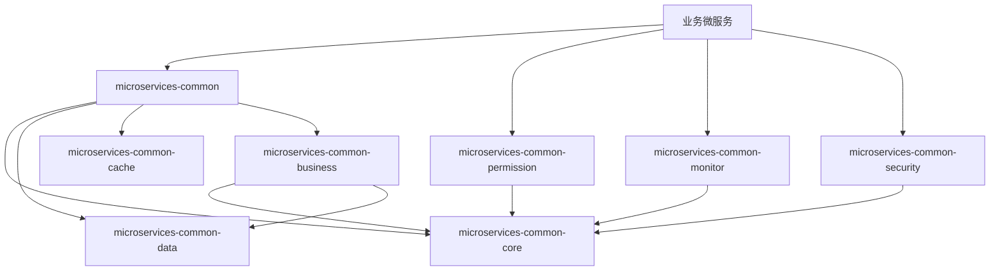

# IOE-DREAM 公共库代码架构说明

> **版本**: v1.0.0  
> **创建日期**: 2025-12-17  
> **适用范围**: microservices-common 及相关公共库模块

---

## 📋 概述

IOE-DREAM 公共库采用聚合模块设计，被所有业务微服务依赖，提供统一的基础能力支撑。

---

## 📁 公共库模块结构（实际目录）

```
microservices/
├── microservices-common/            # 业务公共组件（Entity/DAO/Manager）
├── microservices-common-core/       # 核心工具类（ResponseDTO/PageResult/BaseEntity）
├── microservices-common-data/       # 数据访问层
├── microservices-common-cache/      # 缓存组件
├── microservices-common-business/   # 业务公共组件扩展
├── microservices-common-monitor/    # 监控组件
├── microservices-common-permission/ # 权限组件
├── microservices-common-security/   # 安全组件
├── microservices-common-workflow/   # 工作流组件
└── microservices-common-export/     # 导出组件
```

---

## 🔧 各模块职责

### 1. microservices-common (业务公共组件)

**职责**: 跨微服务共享的业务实体、DAO、Manager

**实际目录结构**:
```
net.lab1024.sa.common/
├── access/entity/           # 门禁公共实体
│   ├── AccessPermissionApplyEntity.java
│   └── AccessRecordEntity.java
├── attendance/entity/       # 考勤公共实体
│   ├── AttendanceRecordEntity.java
│   ├── WorkShiftEntity.java
│   └── ...
├── audit/                   # 审计日志
│   ├── dao/AuditLogDao.java
│   └── entity/AuditLogEntity.java
├── auth/                    # 认证相关
├── cache/                   # 缓存服务
│   ├── SpringCacheServiceImpl.java
│   └── UnifiedCacheManager.java
├── consume/entity/          # 消费公共实体
│   ├── AccountEntity.java
│   ├── ConsumeRecordEntity.java
│   └── PaymentRefundRecordEntity.java
├── organization/            # 组织架构
│   ├── entity/AreaEntity.java
│   ├── entity/DeviceEntity.java
│   └── manager/AreaDeviceManager.java
├── rbac/                    # 权限相关
│   ├── dao/RoleDao.java
│   └── entity/RoleEntity.java
├── video/                   # 视频公共组件
│   ├── dao/VideoMonitorDao.java
│   ├── entity/VideoDeviceEntity.java
│   └── manager/VideoMonitorManager.java
└── visitor/entity/          # 访客公共实体
    ├── VisitorEntity.java
    └── VisitorAppointmentEntity.java
```

### 2. microservices-common-core (核心工具)

**职责**: 提供最基础的工具类和配置

**实际目录结构**:
```
net.lab1024.sa.common/
├── config/                  # 配置类
│   ├── JacksonConfiguration.java
│   ├── UnifiedThreadPoolConfiguration.java
│   └── properties/IoeDreamGatewayProperties.java
├── constant/SystemConstants.java
├── controller/SupportBaseController.java
├── domain/                  # 通用领域对象
│   ├── PageParam.java
│   ├── PageResult.java
│   ├── CursorPageParam.java
│   └── form/BaseQueryForm.java
├── dto/ResponseDTO.java     # 统一响应格式
├── entity/BaseEntity.java   # 实体基类
├── exception/               # 异常定义
│   ├── BusinessException.java
│   ├── ParamException.java
│   └── SystemException.java
├── gateway/                 # 网关客户端
│   ├── GatewayServiceClient.java
│   └── DirectServiceClient.java
├── util/                    # 工具类
│   ├── JsonUtil.java
│   ├── AESUtil.java
│   └── DataMaskUtil.java
└── workflow/constant/       # 工作流常量
    └── BusinessTypeEnum.java
```

### 3. microservices-common-data (数据访问)

**职责**: 数据库访问相关配置和组件

**核心功能**:
- MyBatis-Plus 配置
- Druid 数据源配置
- 分页插件配置
- SQL 审计日志
- 多数据源支持

### 4. microservices-common-cache (缓存组件)

**职责**: 多级缓存管理

**核心功能**:
- Redis 缓存配置
- Caffeine 本地缓存
- 缓存注解增强
- 缓存穿透/雪崩防护

### 5. microservices-common-business (业务公共)

**职责**: 业务层公共组件

**实际目录结构**:
```
net.lab1024.sa.common/
├── cache/
│   ├── CacheNamespace.java
│   ├── CacheService.java
│   └── LightCacheConfiguration.java
├── dict/
│   ├── dao/DictDataDao.java, DictTypeDao.java
│   ├── entity/DictDataEntity.java, DictTypeEntity.java
│   └── manager/DictManager.java
├── menu/
│   ├── dao/MenuDao.java, RoleMenuDao.java
│   ├── entity/MenuEntity.java, RoleMenuEntity.java
│   └── manager/MenuManager.java
├── notification/
│   ├── dao/NotificationConfigDao.java
│   ├── entity/NotificationConfigEntity.java
│   └── manager/NotificationConfigManager.java
├── organization/
│   ├── dao/AreaDao.java, DeviceDao.java
│   ├── entity/AreaEntity.java, DeviceEntity.java
│   └── manager/AreaManager.java, DevicePermissionManager.java
├── preference/
│   └── manager/UserPreferenceManager.java
├── scheduler/
│   └── entity/ScheduledJobEntity.java
├── system/
│   ├── dao/SystemConfigDao.java, SystemDictDao.java
│   ├── entity/SystemConfigEntity.java
│   ├── employee/
│   │   ├── entity/EmployeeEntity.java
│   │   └── manager/EmployeeManager.java
│   └── manager/ConfigManager.java
├── theme/
│   └── manager/ThemeTemplateManager.java
└── workflow/
    ├── dao/ApprovalConfigDao.java
    ├── entity/ApprovalConfigEntity.java
    ├── executor/NodeExecutor.java
    └── manager/WorkflowApprovalManager.java
```

### 6. microservices-common-monitor (监控组件)

**职责**: 系统监控和可观测性

**实际目录结构**:
```
net.lab1024.sa.common/
├── config/
│   └── MonitorBeanAutoConfiguration.java
├── monitor/
│   ├── dao/
│   │   ├── AlertDao.java
│   │   ├── AlertRuleDao.java
│   │   ├── NotificationDao.java
│   │   ├── SystemLogDao.java
│   │   └── SystemMonitorDao.java
│   ├── domain/
│   │   ├── entity/AlertEntity.java
│   │   ├── entity/AlertRuleEntity.java
│   │   ├── entity/SystemMonitorEntity.java
│   │   └── vo/SystemHealthVO.java
│   ├── manager/
│   │   ├── DruidConnectionPoolMonitor.java
│   │   ├── HealthCheckManager.java
│   │   ├── LogManagementManager.java
│   │   ├── NotificationManager.java
│   │   ├── PerformanceMonitorManager.java
│   │   └── SystemMonitorManager.java
│   └── service/
│       ├── AlertService.java
│       ├── MonitorService.java
│       └── SystemHealthService.java
├── monitoring/
│   ├── AlertManager.java
│   ├── AlertNotificationDispatcher.java
│   ├── EnterpriseMonitoringManager.java
│   └── MonitoringConfiguration.java
├── performance/
│   ├── JvmPerformanceManager.java
│   └── model/JvmPerformanceOverview.java
└── tracing/
    ├── TraceIdMdcFilter.java
    └── TracingConfiguration.java
```

### 7. microservices-common-permission (权限组件)

**职责**: 统一权限管理

**实际目录结构**:
```
net.lab1024.sa.common.permission/
├── alert/
│   └── PermissionAlertManager.java
├── annotation/
│   └── PermissionCheck.java              # 权限检查注解
├── aspect/
│   ├── PermissionCheckAspect.java        # 权限检查切面
│   ├── PermissionParameterResolver.java
│   └── PermissionResultHandler.java
├── audit/
│   ├── PermissionAuditAspect.java
│   ├── PermissionAuditConfig.java
│   ├── PermissionAuditDTO.java
│   └── PermissionAuditLogger.java
├── config/
│   └── UnifiedPermissionConfigManager.java
├── domain/
│   ├── dto/PermissionValidationResult.java
│   ├── entity/PermissionEntity.java
│   ├── enums/LogicOperator.java
│   └── vo/UserPermissionVO.java
├── manager/
│   ├── PermissionAuditManager.java
│   ├── PermissionCacheManager.java
│   ├── PermissionValidationManager.java
│   └── impl/PermissionCacheManagerImpl.java
├── monitor/
│   └── PermissionPerformanceMonitor.java
├── optimize/
│   ├── PermissionOptimizationConfig.java
│   └── PermissionPerformanceOptimizer.java
└── service/
    ├── PermissionDataService.java
    ├── UnifiedPermissionService.java
    └── impl/
        ├── PermissionDataServiceImpl.java
        └── UnifiedPermissionServiceImpl.java
```

### 8. microservices-common-security (安全组件)

**职责**: 安全配置和认证

**核心功能**:
- Sa-Token 集成配置
- 接口加解密
- 敏感数据脱敏
- XSS 防护
- CSRF 防护

### 9. microservices-common-workflow (工作流组件)

**职责**: 工作流基础组件

**核心功能**:
- 流程定义接口
- 审批节点抽象
- 流程状态管理
- 与 OA 模块集成

### 10. microservices-common-export (导出组件)

**职责**: 数据导出功能

**核心功能**:
- Excel 导出 (EasyExcel)
- PDF 导出
- 异步导出任务
- 大数据量分批导出

---

## 🏛️ 架构规范

### 四层架构

```
┌─────────────────────────────────────────────────────┐
│  Controller层 - 在微服务中实现                        │
│  - HTTP请求处理、参数验证、权限控制                    │
├─────────────────────────────────────────────────────┤
│  Service层 - 在微服务中实现                          │
│  - 核心业务逻辑、事务管理                             │
├─────────────────────────────────────────────────────┤
│  Manager层 - 可在公共库中定义抽象                     │
│  - 流程编排、缓存管理、第三方集成                      │
├─────────────────────────────────────────────────────┤
│  DAO层 - 可在公共库中定义接口                         │
│  - 数据库CRUD操作、继承BaseMapper                     │
└─────────────────────────────────────────────────────┘
```

### 编码规范

```java
// ✅ 正确 - 使用 @Resource 注入
@Resource
private UserDao userDao;

// ✅ 正确 - 使用 @Mapper + Dao 后缀
@Mapper
public interface UserDao extends BaseMapper<UserEntity> { }

// ✅ 正确 - 使用 jakarta.* 包
import jakarta.annotation.Resource;
import jakarta.validation.Valid;

// ❌ 禁止 - @Autowired, @Repository, javax.*
```

---

## 📦 依赖关系



---

## 🎯 使用示例

### 业务微服务引入公共库

```xml
<dependency>
    <groupId>net.lab1024.sa</groupId>
    <artifactId>microservices-common</artifactId>
    <version>${project.version}</version>
</dependency>

<dependency>
    <groupId>net.lab1024.sa</groupId>
    <artifactId>microservices-common-permission</artifactId>
    <version>${project.version}</version>
</dependency>
```

### 使用统一响应格式

```java
@GetMapping("/{id}")
public ResponseDTO<UserVO> getById(@PathVariable Long id) {
    return ResponseDTO.ok(userService.getById(id));
}

@GetMapping("/page")
public ResponseDTO<PageResult<UserVO>> page(@Valid UserQueryForm form) {
    return ResponseDTO.ok(userService.queryPage(form));
}
```

### 使用权限注解

```java
@RequiresPermission("user:list")
@GetMapping("/list")
public ResponseDTO<List<UserVO>> list() {
    return ResponseDTO.ok(userService.list());
}
```

---

## 📝 注意事项

1. **公共库不包含 @Service 实现** - 仅定义接口和抽象类
2. **公共库不包含 @RestController** - 仅提供基础能力
3. **公共库不直接依赖 spring-boot-starter-web** - 由微服务引入
4. **Manager 层在公共库中不使用 Spring 注解** - 由微服务配置类注册

---

**📝 文档维护**
- **创建人**: IOE-DREAM架构团队
- **最后更新**: 2025-12-17
