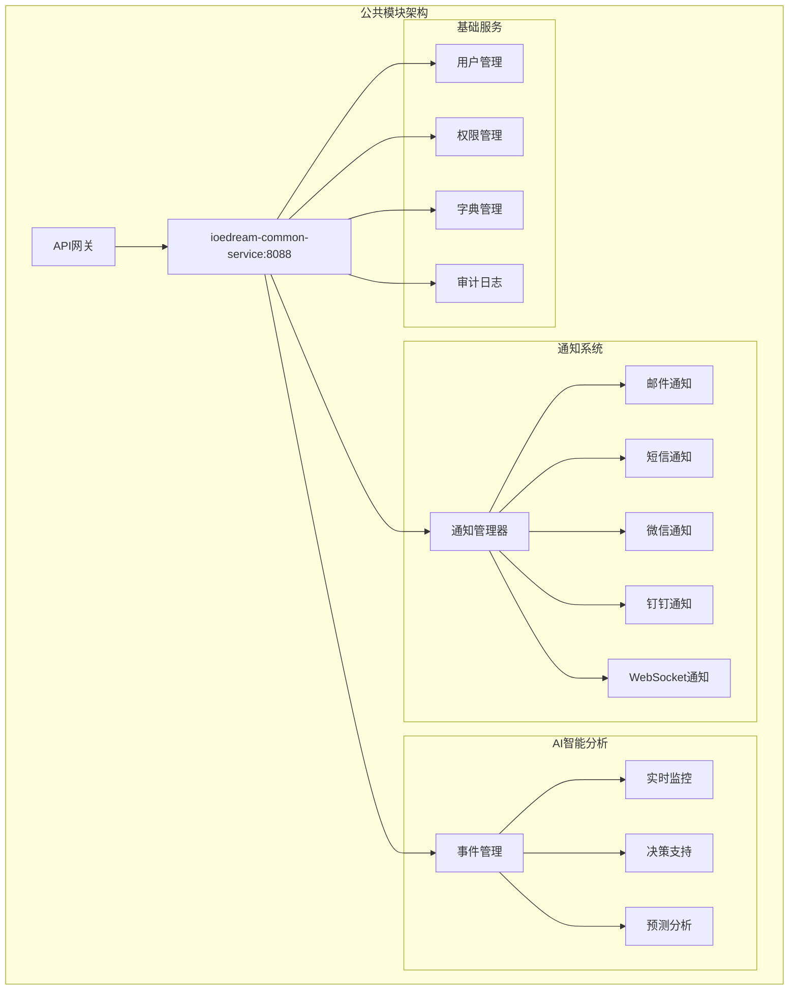

# IOE-DREAM 公共模块完整文档

> **模块定位**: 园区管理平台核心公共服务
> **核心功能**: 通知系统 + AI智能分析
> **技术架构**: Spring Boot 3.5.8 + 微服务架构 + Redis缓存
> **服务端口**: 8088 (ioedream-common-service)
> **更新日期**: 2025-12-16

---

## 📋 模块概述

公共模块是IOE-DREAM智慧园区安防综合管理平台的核心基础模块，承担着通知管理和AI智能分析两大核心功能，为整个平台提供统一的公共服务支撑。

### 🎯 核心价值

- **统一通知管理**: 提供多渠道、高可用的消息通知服务
- **AI智能分析**: 实现事件智能分析、实时监控预警和智能决策支持
- **平台基础服务**: 为其他业务模块提供用户管理、权限控制、字典管理等基础服务
- **数据支撑**: 提供统一的数据分析和报表服务

### 🏗️ 技术架构



---

## 📚 文档目录

### 📢 通知系统
- **[通知系统业务功能说明](./通知系统/01-通知系统业务功能说明.md)** - 详细业务功能介绍
- **[通知系统数据库设计](./通知系统/02-通知系统数据库设计.md)** - 数据模型和ER图
- **[通知系统业务流程设计](./通知系统/03-通知系统业务流程设计.md)** - 完整业务流程图
- **[通知系统跨模块业务流程说明](./通知系统/04-通知系统跨模块业务流程说明.md)** - 与其他模块的集成流程
- **[通知系统用户故事](./通知系统/05-通知系统用户故事.md)** - 典型用户场景
- **[通知系统界面设计](./通知系统/06-通知系统界面设计.md)** - Web和移动端界面设计
- **[通知系统页面交互说明](./通知系统/07-通知系统页面交互说明.md)** - 详细的交互流程

### 🤖 AI智能分析
- **[AI智能分析业务功能说明](./AI智能分析/01-AI智能分析业务功能说明.md)** - AI分析能力介绍
- **[AI智能分析数据库设计](./AI智能分析/02-AI智能分析数据库设计.md)** - AI数据模型设计
- **[AI事件管理业务流程图](./AI智能分析/03-AI事件管理业务流程图.md)** - 事件处理流程
- **[AI实时监控预警业务流程图](./AI智能分析/04-AI实时监控预警业务流程图.md)** - 监控预警流程
- **[AI智能决策支持业务流程图](./AI智能分析/05-AI智能决策支持业务流程图.md)** - 决策支持流程
- **[AI智能分析用户故事](./AI智能分析/06-AI智能分析用户故事.md)** - AI应用场景
- **[AI智能分析界面设计](./AI智能分析/07-AI智能分析界面设计.md)** - AI系统界面设计
- **[AI智能分析页面交互说明](./AI智能分析/08-AI智能分析页面交互说明.md)** - AI系统交互设计

---

## 🎯 核心特性

### 📢 通知系统特性
- ✅ **多渠道支持**: 邮件、短信、微信、钉钉、WebSocket等多种通知方式
- ✅ **模板管理**: 支持自定义通知模板，动态内容替换
- ✅ **限流控制**: 防止消息轰炸，支持频率限制和批量处理
- ✅ **重试机制**: 失败自动重试，确保消息送达率
- ✅ **实时推送**: WebSocket实时推送，即时消息通知
- ✅ **监控统计**: 完整的发送统计和监控指标

### 🤖 AI智能分析特性
- ✅ **事件管理**: 统一的AI事件采集、分类、评估和处理
- ✅ **实时监控**: 7×24小时实时监控，异常自动检测
- ✅ **智能预警**: 多级预警机制，智能风险评估
- ✅ **决策支持**: 基于AI算法的智能决策建议
- ✅ **预测分析**: 趋势预测和异常预警
- ✅ **自适应学习**: 持续优化AI模型和算法

---

## 📊 技术指标

### 通知系统性能指标
- **消息吞吐量**: 10,000+ 消息/分钟
- **送达成功率**: ≥ 99.5%
- **响应时间**: ≤ 100ms (95%的请求)
- **可用性**: 99.9%
- **并发连接**: 50,000+ WebSocket连接

### AI智能分析性能指标
- **事件处理延迟**: ≤ 200ms
- **预警响应时间**: ≤ 500ms
- **分析准确率**: ≥ 95%
- **误报率**: ≤ 2%
- **预测精度**: ≥ 90%

---

## 🔗 模块集成

### 与其他模块的集成关系

| 业务模块 | 集成方式 | 主要功能 | 状态 |
|---------|---------|---------|------|
| **门禁系统** | 异步通知 + AI分析 | 门禁事件通知、异常行为分析 | ✅ 已集成 |
| **考勤系统** | 异步通知 + AI分析 | 考勤提醒、异常考勤检测 | ✅ 已集成 |
| **消费系统** | 异步通知 + AI分析 | 消费通知、异常交易分析 | ✅ 已集成 |
| **访客系统** | 异步通知 + AI分析 | 访客预约通知、安全风险评估 | ✅ 已集成 |
| **视频监控** | AI分析 + 实时监控 | 视频AI分析、实时预警 | ✅ 已集成 |
| **OA系统** | 异步通知 + 工作流 | 工作流通知、审批提醒 | ✅ 已集成 |

### API接口集成

```yaml
# 通知系统API
POST /api/v1/notification/send          # 发送通知
GET  /api/v1/notification/template      # 获取模板
POST /api/v1/notification/batch         # 批量发送

# AI分析API
POST /api/v1/ai/event/analyze          # 事件分析
GET  /api/v1/ai/monitor/status         # 监控状态
POST /api/v1/ai/decision/evaluate      # 决策评估
```

---

## 🚀 部署要求

### 硬件要求
- **CPU**: 8核心以上
- **内存**: 16GB以上
- **存储**: 500GB SSD
- **网络**: 千兆网络

### 软件要求
- **JDK**: OpenJDK 17+
- **数据库**: MySQL 8.0+
- **缓存**: Redis 6.0+
- **消息队列**: RabbitMQ 3.8+

### 环境配置
```yaml
# 生产环境配置
spring:
  profiles:
    active: production

  redis:
    host: redis-cluster
    port: 6379
    database: 0

  rabbitmq:
    host: mq-cluster
    port: 5672
    username: ${RABBITMQ_USERNAME}
    password: ${RABBITMQ_PASSWORD}
```

---

## 📈 运维监控

### 关键监控指标
- **系统性能**: CPU、内存、磁盘使用率
- **业务指标**: 通知发送量、AI事件处理量
- **错误率**: 接口错误率、消息发送失败率
- **响应时间**: 接口响应时间、AI处理时间

### 告警规则
- **CPU使用率** > 80% 持续5分钟
- **内存使用率** > 85% 持续5分钟
- **通知发送失败率** > 5%
- **AI事件处理延迟** > 500ms

---

## 📝 更新日志

### v2.0.0 (2025-12-16)
- ✅ 完成通知系统v2.0架构升级
- ✅ 新增AI智能分析模块
- ✅ 优化多渠道通知性能
- ✅ 增强实时监控预警能力

### v1.5.0 (2025-12-01)
- ✅ 新增WebSocket实时推送
- ✅ 优化AI分析算法
- ✅ 增加更多通知模板

---

## 👥 团队联系

**模块负责人**: 公共模块开发团队
**技术支持**: support@ioedream.com
**文档维护**: IOE-DREAM架构委员会

---

**💡 公共模块作为整个平台的核心基础，将持续优化和增强，为智慧园区管理提供强有力的技术支撑。**