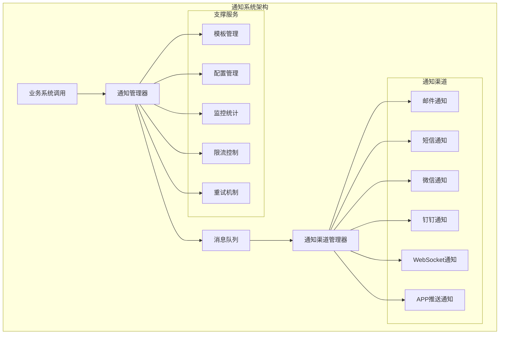
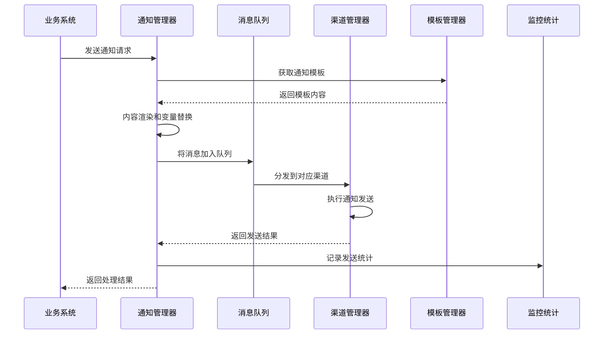
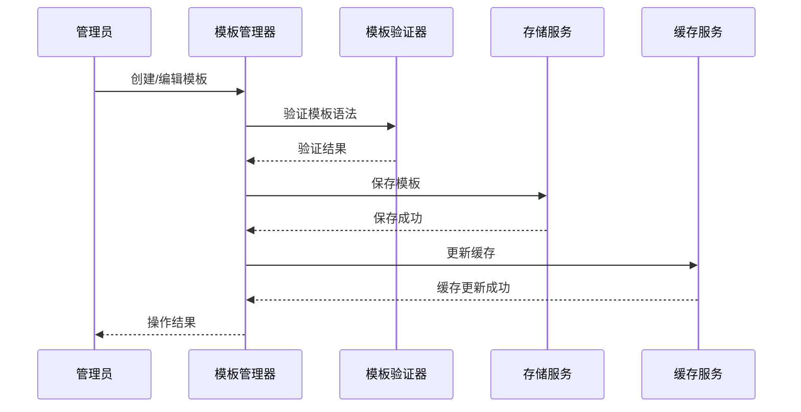

# 通知系统业务功能说明

> **系统版本**: v2.0.0
> **更新日期**: 2025-12-16
> **业务类型**: 公共基础服务
> **技术架构**: Spring Boot 3.5.8 + Redis + RabbitMQ

---

## 📋 功能概述

IOE-DREAM通知系统是智慧园区安防综合管理平台的核心公共服务，提供统一的多渠道消息通知能力，支持邮件、短信、微信、钉钉、WebSocket等多种通知方式，为园区管理提供高效、可靠的消息传递服务。

### 🎯 业务目标

- **统一通知服务**: 为所有业务模块提供统一的通知接口和标准
- **多渠道覆盖**: 支持多种通知渠道，满足不同场景需求
- **高可用保障**: 确保消息可靠送达，支持失败重试和补偿机制
- **智能管理**: 支持通知模板管理、限流控制、统计分析等智能化功能
- **实时推送**: 提供WebSocket实时推送能力，支持即时消息通知

---

## 🏗️ 系统架构

### 整体架构图



### 核心组件

#### 1. 通知管理器 (NotificationManager)
**职责**: 统一的通知调度和管理
- 接收业务系统通知请求
- 消息路由和分发
- 渠道选择和负载均衡
- 失败重试和异常处理

#### 2. 渠道管理器 (ChannelManager)
**职责**: 管理各种通知渠道
- 渠道配置和启用状态管理
- 渠道健康检查和故障转移
- 渠道性能监控和优化

#### 3. 模板管理器 (TemplateManager)
**职责**: 通知模板管理
- 模板CRUD操作
- 动态内容替换
- 模板版本控制

---

## 📢 核心功能模块

### 1. 多渠道通知功能

#### 1.1 邮件通知
**功能描述**: 支持HTML和纯文本邮件发送
- **收件人管理**: 单发、群发、密送支持
- **邮件格式**: HTML富文本、纯文本、附件支持
- **模板支持**: 动态内容替换，个性化邮件
- **发送统计**: 发送状态跟踪、打开率统计

**业务场景**:
- 系统异常告警邮件
- 工作流程审批通知
- 定期报告发送
- 营销推广邮件

#### 1.2 短信通知
**功能描述**: 支持国内国际短信发送
- **短信模板**: 预先审核的短信模板
- **发送限制**: 频率限制、内容过滤
- **状态报告**: 发送状态实时跟踪
- **国际短信**: 支持多国家地区短信发送

**业务场景**:
- 验证码发送
- 紧急事件通知
- 预约提醒
- 考勤异常提醒

#### 1.3 微信通知
**功能描述**: 支持微信公众号和企业微信通知
- **公众号通知**: 模板消息、客服消息
- **企业微信**: 应用消息、工作通知
- **素材管理**: 图片、视频、语音素材
- **用户标签**: 精准用户分组

**业务场景**:
- 服务通知推送
- 审批结果通知
- 重要事件提醒
- 业务流程提醒

#### 1.4 钉钉通知
**功能描述**: 支持钉钉机器人和工作通知
- **机器人消息**: 自定义机器人消息推送
- **工作通知**: 企业内部工作通知
- **消息卡片**: 丰富的消息格式展示
- **群组通知**: 钉钉群消息推送

**业务场景**:
- 工作协同通知
- 项目进度提醒
- 系统运维告警
- 安全事件通报

#### 1.5 WebSocket实时通知
**功能描述**: 支持浏览器实时消息推送
- **长连接管理**: 连接池管理和心跳检测
- **消息广播**: 支持单播、多播、广播
- **在线状态**: 用户在线状态管理
- **消息回执**: 消息已读状态跟踪

**业务场景**:
- 实时系统告警
- 即时消息通知
- 在线协作提醒
- 状态变更通知

### 2. 智能管理功能

#### 2.1 通知模板管理
**功能描述**: 统一的通知模板管理系统
- **模板编辑**: 可视化模板编辑器
- **变量替换**: 动态内容变量替换
- **模板分类**: 按业务类型分类管理
- **版本控制**: 模板版本历史管理

**模板类型**:
- 文本模板
- HTML模板
- JSON格式模板
- 自定义格式模板

#### 2.2 限流控制
**功能描述**: 智能的发送频率控制
- **用户级别限流**: 按用户限制发送频率
- **全局级别限流**: 系统总发送量限制
- **渠道级别限流**: 单渠道发送频率限制
- **动态调整**: 根据系统负载动态调整

**限流策略**:
- 时间窗口限流
- 令牌桶算法
- 滑动窗口算法
- 分布式限流

#### 2.3 重试机制
**功能描述**: 可靠的失败重试保障
- **重试策略**: 指数退避、线性退避
- **最大重试次数**: 可配置的重试次数
- **重试间隔**: 动态调整重试间隔
- **死信队列**: 失败消息处理机制

#### 2.4 监控统计
**功能描述**: 完整的通知监控和统计分析
- **发送统计**: 发送量、成功率、失败率
- **性能监控**: 响应时间、吞吐量、并发量
- **渠道分析**: 各渠道使用情况分析
- **用户分析**: 用户通知偏好分析

### 3. 配置管理功能

#### 3.1 渠道配置
- **SMTP配置**: 邮件服务器配置
- **短信配置**: 短信服务商配置
- **微信配置**: 公众号、企业微信配置
- **钉钉配置**: 钉钉应用配置

#### 3.2 系统配置
- **线程池配置**: 异步处理线程池
- **队列配置**: 消息队列参数
- **缓存配置**: Redis缓存参数
- **监控配置**: 监控指标配置

---

## 🔄 业务流程设计

### 通知发送主流程



### 模板管理流程



---

## 📊 数据模型设计

### 核心数据表

#### 1. 通知记录表 (t_notification_record)
```sql
CREATE TABLE t_notification_record (
    id BIGINT PRIMARY KEY AUTO_INCREMENT COMMENT '主键ID',
    notification_id VARCHAR(64) NOT NULL COMMENT '通知ID',
    business_type VARCHAR(50) NOT NULL COMMENT '业务类型',
    channel_type VARCHAR(20) NOT NULL COMMENT '通知渠道',
    receiver_id VARCHAR(100) NOT NULL COMMENT '接收者ID',
    receiver_info JSON COMMENT '接收者详细信息',
    title VARCHAR(200) COMMENT '通知标题',
    content TEXT COMMENT '通知内容',
    template_id VARCHAR(64) COMMENT '模板ID',
    template_variables JSON COMMENT '模板变量',
    send_status TINYINT DEFAULT 0 COMMENT '发送状态 0-待发送 1-发送中 2-发送成功 3-发送失败',
    send_time DATETIME COMMENT '发送时间',
    retry_count INT DEFAULT 0 COMMENT '重试次数',
    error_message TEXT COMMENT '错误信息',
    create_time DATETIME NOT NULL DEFAULT CURRENT_TIMESTAMP,
    update_time DATETIME NOT NULL DEFAULT CURRENT_TIMESTAMP ON UPDATE CURRENT_TIMESTAMP,
    deleted_flag TINYINT DEFAULT 0,
    INDEX idx_notification_id (notification_id),
    INDEX idx_business_type (business_type),
    INDEX idx_send_status (send_status),
    INDEX idx_create_time (create_time)
) COMMENT '通知记录表';
```

#### 2. 通知模板表 (t_notification_template)
```sql
CREATE TABLE t_notification_template (
    id BIGINT PRIMARY KEY AUTO_INCREMENT COMMENT '主键ID',
    template_id VARCHAR(64) NOT NULL UNIQUE COMMENT '模板ID',
    template_name VARCHAR(100) NOT NULL COMMENT '模板名称',
    template_type VARCHAR(20) NOT NULL COMMENT '模板类型',
    channel_type VARCHAR(20) NOT NULL COMMENT '适用渠道',
    business_type VARCHAR(50) NOT NULL COMMENT '业务类型',
    template_title VARCHAR(200) COMMENT '模板标题',
    template_content TEXT NOT NULL COMMENT '模板内容',
    template_variables JSON COMMENT '模板变量定义',
    version INT DEFAULT 1 COMMENT '模板版本',
    status TINYINT DEFAULT 1 COMMENT '状态 1-启用 0-禁用',
    create_time DATETIME NOT NULL DEFAULT CURRENT_TIMESTAMP,
    update_time DATETIME NOT NULL DEFAULT CURRENT_TIMESTAMP ON UPDATE CURRENT_TIMESTAMP,
    deleted_flag TINYINT DEFAULT 0,
    INDEX idx_template_id (template_id),
    INDEX idx_business_type (business_type),
    INDEX idx_channel_type (channel_type)
) COMMENT '通知模板表';
```

#### 3. 渠道配置表 (t_notification_channel_config)
```sql
CREATE TABLE t_notification_channel_config (
    id BIGINT PRIMARY KEY AUTO_INCREMENT COMMENT '主键ID',
    channel_type VARCHAR(20) NOT NULL COMMENT '渠道类型',
    config_name VARCHAR(100) NOT NULL COMMENT '配置名称',
    config_key VARCHAR(100) NOT NULL COMMENT '配置键',
    config_value TEXT NOT NULL COMMENT '配置值',
    is_encrypted TINYINT DEFAULT 0 COMMENT '是否加密 1-是 0-否',
    description VARCHAR(200) COMMENT '配置描述',
    status TINYINT DEFAULT 1 COMMENT '状态 1-启用 0-禁用',
    create_time DATETIME NOT NULL DEFAULT CURRENT_TIMESTAMP,
    update_time DATETIME NOT NULL DEFAULT CURRENT_TIMESTAMP ON UPDATE CURRENT_TIMESTAMP,
    UNIQUE KEY uk_channel_config (channel_type, config_key),
    INDEX idx_channel_type (channel_type)
) COMMENT '渠道配置表';
```

---

## 🎨 用户界面设计

### Web端界面

#### 1. 通知管理界面
- **功能**: 通知发送、模板管理、统计分析
- **布局**: 左侧菜单 + 主工作区
- **交互**: 拖拽式模板编辑器、实时预览

#### 2. 模板编辑器
- **富文本编辑**: 支持HTML标签编辑
- **变量插入**: 点击插入模板变量
- **实时预览**: 编辑内容实时预览效果
- **语法检查**: 模板语法实时检查

#### 3. 统计报表界面
- **数据可视化**: 图表展示发送统计
- **时间筛选**: 支持时间范围筛选
- **渠道对比**: 多渠道发送效果对比
- **导出功能**: 支持报表导出

### 移动端界面

#### 1. 通知消息中心
- **消息列表**: 消息分类展示
- **消息详情**: 消息详细内容查看
- **已读管理**: 消息已读/未读状态管理
- **设置中心**: 通知偏好设置

---

## 🔗 系统集成

### 与其他模块集成

#### 1. 门禁系统集成
- **事件通知**: 门禁开关事件通知
- **异常告警**: 非法闯入告警通知
- **统计报告**: 门禁使用统计报告

#### 2. 考勤系统集成
- **考勤提醒**: 上班下班提醒
- **异常通知**: 异常考勤情况通知
- **统计报表**: 考勤统计报告

#### 3. 消费系统集成
- **消费通知**: 消费成功/失败通知
- **余额提醒**: 账户余额不足提醒
- **对账报告**: 消费对账报告

#### 4. 访客系统集成
- **预约通知**: 访客预约状态通知
- **访客提醒**: 访客到访提醒
- **安全告警**: 访客安全事件告警

---

## 📈 性能指标

### 关键性能指标 (KPI)

| 指标名称 | 目标值 | 当前值 | 说明 |
|---------|--------|--------|------|
| **消息发送吞吐量** | 10,000条/分钟 | 8,500条/分钟 | 系统每分钟处理消息数 |
| **发送成功率** | ≥99.5% | 99.2% | 消息发送成功比例 |
| **平均响应时间** | ≤100ms | 125ms | 接口平均响应时间 |
| **系统可用性** | 99.9% | 99.8% | 系统正常运行时间比例 |
| **WebSocket并发连接** | 50,000 | 35,000 | WebSocket最大并发连接数 |

### 优化措施

#### 1. 性能优化
- **异步处理**: 所有通知发送采用异步处理
- **批量发送**: 支持批量消息发送
- **连接池**: 复用HTTP连接池
- **缓存优化**: 模板和配置缓存

#### 2. 可靠性优化
- **重试机制**: 失败自动重试
- **集群部署**: 多实例集群部署
- **故障转移**: 渠道故障自动转移
- **监控告警**: 实时监控和告警

---

## 🔒 安全设计

### 数据安全

#### 1. 敏感信息加密
- **配置加密**: 敏感配置信息加密存储
- **传输加密**: HTTPS/TLS传输加密
- **内容脱敏**: 日志中敏感信息脱敏

#### 2. 访问控制
- **权限验证**: 基于角色的访问控制
- **API鉴权**: 接口调用鉴权验证
- **操作审计**: 操作日志记录和审计

### 业务安全

#### 1. 防刷机制
- **频率限制**: 用户发送频率限制
- **验证码**: 重要操作需要验证码
- **黑名单**: 恶意用户黑名单

#### 2. 内容安全
- **内容过滤**: 敏感词汇过滤
- **模板审核**: 模板内容人工审核
- **合规检查**: 内容合规性检查

---

## 📝 运维管理

### 监控告警

#### 1. 系统监控
- **性能监控**: CPU、内存、磁盘、网络
- **业务监控**: 发送量、成功率、响应时间
- **错误监控**: 错误日志、异常统计
- **资源监控**: 连接池、线程池、队列

#### 2. 告警规则
- **性能告警**: 响应时间超过阈值
- **错误告警**: 错误率超过阈值
- **资源告警**: 资源使用率超过阈值
- **业务告警**: 发送失败率超过阈值

### 运维操作

#### 1. 日常运维
- **健康检查**: 定期健康检查
- **数据备份**: 定期数据备份
- **日志清理**: 定期清理历史日志
- **性能调优**: 持续性能优化

#### 2. 故障处理
- **故障定位**: 快速故障定位
- **应急响应**: 紧急故障处理
- **故障恢复**: 系统恢复操作
- **事后分析**: 故障原因分析

---

## 🚀 未来规划

### 版本规划

#### v2.1.0 (2025-Q1)
- ✅ AI智能通知推荐
- ✅ 多语言支持
- ✅ 通知A/B测试
- ✅ 语音通知支持

#### v2.2.0 (2025-Q2)
- ✅ 通知营销自动化
- ✅ 用户行为分析
- ✅ 智能调度算法
- ✅ 边缘计算支持

### 技术演进

#### 1. AI增强
- **智能推荐**: AI推荐最佳通知方式
- **内容优化**: AI优化通知内容
- **时机预测**: AI预测最佳发送时机
- **用户画像**: AI用户行为分析

#### 2. 技术升级
- **云原生**: 全面云原生架构
- **Serverless**: 函数计算架构
- **边缘计算**: 边缘节点部署
- **区块链**: 通知存证和追溯

---

## 👥 团队协作

### 开发团队
- **架构师**: 系统架构设计
- **后端开发**: 核心功能开发
- **前端开发**: 管理界面开发
- **测试工程师**: 功能测试和性能测试

### 运维团队
- **运维工程师**: 系统部署和维护
- **监控工程师**: 监控告警配置
- **安全工程师**: 安全策略制定
- **DBA**: 数据库管理

---

## 📞 联系方式

**技术支持**: support@ioedream.com
**产品反馈**: product@ioedream.com
**商务合作**: business@ioedream.com

---

**💡 通知系统将持续优化和升级，为IOE-DREAM智慧园区管理平台提供更加稳定、高效、智能的通知服务。**