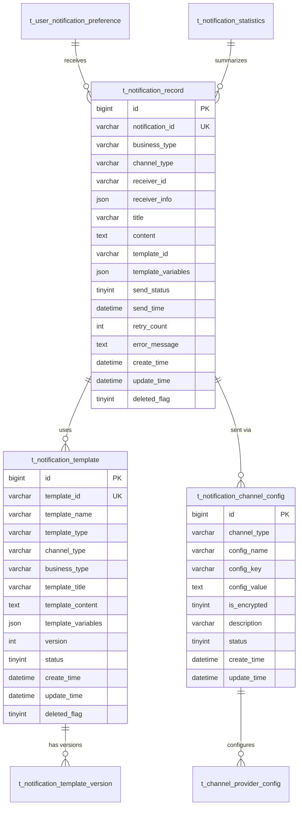
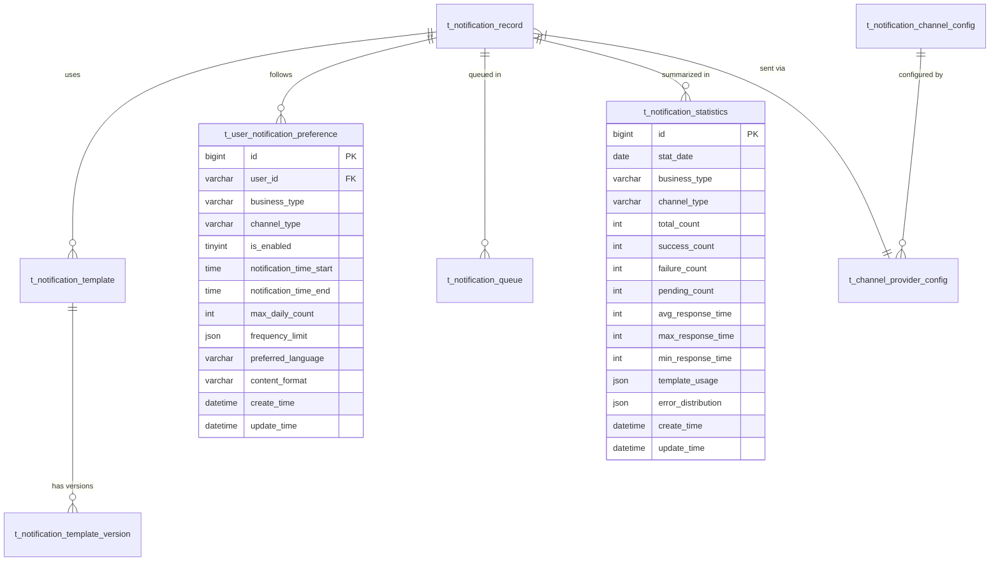

# 通知系统数据库设计

> **设计版本**: v2.0.0
> **数据库**: MySQL 8.0
> **ORM框架**: MyBatis-Plus 3.5.15
> **设计日期**: 2025-12-16
> **设计原则**: 高性能、高可用、可扩展

---

## 📋 数据库概述

### 设计目标

- **高性能**: 支持高并发读写操作，满足大规模通知需求
- **高可用**: 数据冗余和故障转移，确保系统稳定运行
- **可扩展**: 支持水平扩展，适应业务增长需求
- **数据一致性**: 保证通知数据的准确性和完整性

### 数据库规范

- **字符集**: UTF8MB4 (支持完整Unicode字符)
- **排序规则**: utf8mb4_unicode_ci
- **存储引擎**: InnoDB (支持事务和外键约束)
- **命名规范**: 统一使用 `t_notification_` 前缀

---

## 🏗️ 数据库架构

### 整体架构图



---

## 📊 核心数据表设计

### 1. 通知记录表 (t_notification_record)

**表说明**: 存储所有通知的发送记录

```sql
CREATE TABLE t_notification_record (
    id BIGINT PRIMARY KEY AUTO_INCREMENT COMMENT '主键ID',
    notification_id VARCHAR(64) NOT NULL COMMENT '通知唯一标识',
    batch_id VARCHAR(64) COMMENT '批次ID',
    business_type VARCHAR(50) NOT NULL COMMENT '业务类型',
    business_id VARCHAR(100) COMMENT '业务ID',
    channel_type VARCHAR(20) NOT NULL COMMENT '通知渠道',
    provider_type VARCHAR(20) COMMENT '服务商类型',
    receiver_id VARCHAR(100) NOT NULL COMMENT '接收者ID',
    receiver_type VARCHAR(20) NOT NULL COMMENT '接收者类型',
    receiver_info JSON COMMENT '接收者详细信息',
    title VARCHAR(200) COMMENT '通知标题',
    content TEXT COMMENT '通知内容',
    template_id VARCHAR(64) COMMENT '模板ID',
    template_variables JSON COMMENT '模板变量',
    send_status TINYINT DEFAULT 0 COMMENT '发送状态: 0-待发送, 1-发送中, 2-发送成功, 3-发送失败, 4-已重试',
    send_time DATETIME COMMENT '实际发送时间',
    receive_time DATETIME COMMENT '接收时间',
    read_time DATETIME COMMENT '阅读时间',
    retry_count INT DEFAULT 0 COMMENT '重试次数',
    max_retry_count INT DEFAULT 3 COMMENT '最大重试次数',
    next_retry_time DATETIME COMMENT '下次重试时间',
    priority TINYINT DEFAULT 1 COMMENT '优先级: 1-低, 2-中, 3-高, 4-紧急',
    error_code VARCHAR(50) COMMENT '错误码',
    error_message TEXT COMMENT '错误信息',
    external_id VARCHAR(100) COMMENT '外部系统ID',
    trace_id VARCHAR(64) COMMENT '链路追踪ID',
    create_time DATETIME NOT NULL DEFAULT CURRENT_TIMESTAMP,
    update_time DATETIME NOT NULL DEFAULT CURRENT_TIMESTAMP ON UPDATE CURRENT_TIMESTAMP,
    deleted_flag TINYINT DEFAULT 0 COMMENT '删除标记: 0-未删除, 1-已删除',

    -- 索引
    UNIQUE KEY uk_notification_id (notification_id),
    INDEX idx_batch_id (batch_id),
    INDEX idx_business_type (business_type),
    INDEX idx_business_id (business_id),
    INDEX idx_channel_type (channel_type),
    INDEX idx_receiver_id (receiver_id),
    INDEX idx_send_status (send_status),
    INDEX idx_send_time (send_time),
    INDEX idx_create_time (create_time),
    INDEX idx_priority (priority),
    INDEX idx_trace_id (trace_id)

) ENGINE=InnoDB DEFAULT CHARSET=utf8mb4 COLLATE=utf8mb4_unicode_ci COMMENT='通知记录表';
```

**字段说明**:

| 字段名 | 类型 | 说明 | 备注 |
|--------|------|------|------|
| `notification_id` | VARCHAR(64) | 通知唯一标识 | 全局唯一UUID |
| `batch_id` | VARCHAR(64) | 批次ID | 批量发送时的批次标识 |
| `business_type` | VARCHAR(50) | 业务类型 | 如: ACCESS, ATTENDANCE, CONSUME |
| `channel_type` | VARCHAR(20) | 通知渠道 | EMAIL, SMS, WECHAT, DINGTALK, WEBSOCKET |
| `send_status` | TINYINT | 发送状态 | 0-待发送, 1-发送中, 2-成功, 3-失败, 4-重试 |
| `priority` | TINYINT | 优先级 | 1-低, 2-中, 3-高, 4-紧急 |

### 2. 通知模板表 (t_notification_template)

**表说明**: 存储通知模板信息

```sql
CREATE TABLE t_notification_template (
    id BIGINT PRIMARY KEY AUTO_INCREMENT COMMENT '主键ID',
    template_id VARCHAR(64) NOT NULL COMMENT '模板ID',
    template_name VARCHAR(100) NOT NULL COMMENT '模板名称',
    template_code VARCHAR(50) COMMENT '模板编码',
    template_type VARCHAR(20) NOT NULL COMMENT '模板类型',
    channel_type VARCHAR(20) NOT NULL COMMENT '适用渠道',
    business_type VARCHAR(50) NOT NULL COMMENT '业务类型',
    template_title VARCHAR(200) COMMENT '模板标题',
    template_content TEXT NOT NULL COMMENT '模板内容',
    template_variables JSON COMMENT '模板变量定义',
    css_style TEXT COMMENT '样式定义(HTML模板专用)',
    example_data JSON COMMENT '示例数据',
    version INT DEFAULT 1 COMMENT '版本号',
    status TINYINT DEFAULT 1 COMMENT '状态: 0-禁用, 1-启用',
    approval_status TINYINT DEFAULT 0 COMMENT '审核状态: 0-待审核, 1-已审核, 2-审核拒绝',
    approver_id VARCHAR(100) COMMENT '审核人ID',
    approve_time DATETIME COMMENT '审核时间',
    approve_remark VARCHAR(500) COMMENT '审核备注',
    description TEXT COMMENT '模板描述',
    tags VARCHAR(200) COMMENT '标签',
    create_user_id VARCHAR(100) NOT NULL COMMENT '创建人ID',
    create_time DATETIME NOT NULL DEFAULT CURRENT_TIMESTAMP,
    update_time DATETIME NOT NULL DEFAULT CURRENT_TIMESTAMP ON UPDATE CURRENT_TIMESTAMP,
    deleted_flag TINYINT DEFAULT 0 COMMENT '删除标记',

    -- 索引
    UNIQUE KEY uk_template_id (template_id),
    INDEX idx_template_code (template_code),
    INDEX idx_template_type (template_type),
    INDEX idx_channel_type (channel_type),
    INDEX idx_business_type (business_type),
    INDEX idx_status (status),
    INDEX idx_approval_status (approval_status),
    INDEX idx_create_user_id (create_user_id)

) ENGINE=InnoDB DEFAULT CHARSET=utf8mb4 COLLATE=utf8mb4_unicode_ci COMMENT='通知模板表';
```

**模板变量结构示例**:
```json
{
    "variables": [
        {
            "name": "userName",
            "type": "string",
            "required": true,
            "description": "用户姓名",
            "defaultValue": ""
        },
        {
            "name": "currentTime",
            "type": "datetime",
            "required": true,
            "description": "当前时间",
            "format": "yyyy-MM-dd HH:mm:ss"
        }
    ]
}
```

### 3. 通知模板版本表 (t_notification_template_version)

**表说明**: 存储模板版本历史

```sql
CREATE TABLE t_notification_template_version (
    id BIGINT PRIMARY KEY AUTO_INCREMENT COMMENT '主键ID',
    template_id VARCHAR(64) NOT NULL COMMENT '模板ID',
    version INT NOT NULL COMMENT '版本号',
    template_name VARCHAR(100) NOT NULL COMMENT '模板名称',
    template_content TEXT NOT NULL COMMENT '模板内容',
    template_variables JSON COMMENT '模板变量定义',
    change_log TEXT COMMENT '变更日志',
    create_user_id VARCHAR(100) NOT NULL COMMENT '创建人ID',
    create_time DATETIME NOT NULL DEFAULT CURRENT_TIMESTAMP,

    -- 索引
    UNIQUE KEY uk_template_version (template_id, version),
    INDEX idx_template_id (template_id),
    INDEX idx_create_time (create_time)

) ENGINE=InnoDB DEFAULT CHARSET=utf8mb4 COLLATE=utf8mb4_unicode_ci COMMENT='通知模板版本表';
```

### 4. 渠道配置表 (t_notification_channel_config)

**表说明**: 存储通知渠道配置信息

```sql
CREATE TABLE t_notification_channel_config (
    id BIGINT PRIMARY KEY AUTO_INCREMENT COMMENT '主键ID',
    channel_type VARCHAR(20) NOT NULL COMMENT '渠道类型',
    provider_type VARCHAR(20) NOT NULL COMMENT '服务商类型',
    config_name VARCHAR(100) NOT NULL COMMENT '配置名称',
    config_key VARCHAR(100) NOT NULL COMMENT '配置键',
    config_value TEXT NOT NULL COMMENT '配置值',
    config_type VARCHAR(20) DEFAULT 'STRING' COMMENT '配置类型',
    is_encrypted TINYINT DEFAULT 0 COMMENT '是否加密: 0-否, 1-是',
    is_required TINYINT DEFAULT 1 COMMENT '是否必填: 0-否, 1-是',
    default_value TEXT COMMENT '默认值',
    validation_rule VARCHAR(500) COMMENT '验证规则',
    description VARCHAR(500) COMMENT '配置描述',
    sort_order INT DEFAULT 0 COMMENT '排序',
    status TINYINT DEFAULT 1 COMMENT '状态: 0-禁用, 1-启用',
    create_time DATETIME NOT NULL DEFAULT CURRENT_TIMESTAMP,
    update_time DATETIME NOT NULL DEFAULT CURRENT_TIMESTAMP ON UPDATE CURRENT_TIMESTAMP,

    -- 索引
    UNIQUE KEY uk_channel_config (channel_type, provider_type, config_key),
    INDEX idx_channel_type (channel_type),
    INDEX idx_provider_type (provider_type),
    INDEX idx_status (status)

) ENGINE=InnoDB DEFAULT CHARSET=utf8mb4 COLLATE=utf8mb4_unicode_ci COMMENT='渠道配置表';
```

### 5. 渠道服务商配置表 (t_channel_provider_config)

**表说明**: 存储具体服务商配置值

```sql
CREATE TABLE t_channel_provider_config (
    id BIGINT PRIMARY KEY AUTO_INCREMENT COMMENT '主键ID',
    channel_type VARCHAR(20) NOT NULL COMMENT '渠道类型',
    provider_type VARCHAR(20) NOT NULL COMMENT '服务商类型',
    provider_name VARCHAR(100) NOT NULL COMMENT '服务商名称',
    config_data JSON NOT NULL COMMENT '配置数据',
    is_default TINYINT DEFAULT 0 COMMENT '是否默认: 0-否, 1-是',
    rate_limit INT DEFAULT 0 COMMENT '频率限制(条/分钟)',
    max_retry_count INT DEFAULT 3 COMMENT '最大重试次数',
    retry_interval INT DEFAULT 60 COMMENT '重试间隔(秒)',
    timeout_config JSON COMMENT '超时配置',
    status TINYINT DEFAULT 1 COMMENT '状态: 0-禁用, 1-启用',
    health_check_url VARCHAR(500) COMMENT '健康检查URL',
    last_health_check_time DATETIME COMMENT '最后健康检查时间',
    health_status TINYINT DEFAULT 1 COMMENT '健康状态: 0-异常, 1-正常',
    create_time DATETIME NOT NULL DEFAULT CURRENT_TIMESTAMP,
    update_time DATETIME NOT NULL DEFAULT CURRENT_TIMESTAMP ON UPDATE CURRENT_TIMESTAMP,

    -- 索引
    INDEX idx_channel_provider (channel_type, provider_type),
    INDEX idx_provider_name (provider_name),
    INDEX idx_status (status),
    INDEX idx_health_status (health_status)

) ENGINE=InnoDB DEFAULT CHARSET=utf8mb4 COLLATE=utf8mb4_unicode_ci COMMENT='渠道服务商配置表';
```

**配置数据结构示例**:
```json
{
    "smtp": {
        "host": "smtp.example.com",
        "port": 587,
        "username": "notification@example.com",
        "password": "encrypted_password",
        "useSSL": true,
        "useTLS": true
    },
    "sms": {
        "apiKey": "encrypted_api_key",
        "apiSecret": "encrypted_secret",
        "signName": "IOEDREAM",
        "templateCode": "SMS_123456"
    }
}
```

### 6. 用户通知偏好表 (t_user_notification_preference)

**表说明**: 存储用户通知偏好设置

```sql
CREATE TABLE t_user_notification_preference (
    id BIGINT PRIMARY KEY AUTO_INCREMENT COMMENT '主键ID',
    user_id VARCHAR(100) NOT NULL COMMENT '用户ID',
    business_type VARCHAR(50) COMMENT '业务类型',
    channel_type VARCHAR(20) NOT NULL COMMENT '通知渠道',
    is_enabled TINYINT DEFAULT 1 COMMENT '是否启用: 0-禁用, 1-启用',
    notification_time_start TIME COMMENT '通知开始时间',
    notification_time_end TIME COMMENT '通知结束时间',
    max_daily_count INT COMMENT '每日最大通知数量',
    frequency_limit JSON COMMENT '频率限制配置',
    preferred_language VARCHAR(10) DEFAULT 'zh-CN' COMMENT '偏好语言',
    content_format VARCHAR(20) DEFAULT 'HTML' COMMENT '内容格式',
    create_time DATETIME NOT NULL DEFAULT CURRENT_TIMESTAMP,
    update_time DATETIME NOT NULL DEFAULT CURRENT_TIMESTAMP ON UPDATE CURRENT_TIMESTAMP,

    -- 索引
    UNIQUE KEY uk_user_channel_type (user_id, business_type, channel_type),
    INDEX idx_user_id (user_id),
    INDEX idx_business_type (business_type),
    INDEX idx_channel_type (channel_type),
    INDEX idx_is_enabled (is_enabled)

) ENGINE=InnoDB DEFAULT CHARSET=utf8mb4 COLLATE=utf8mb4_unicode_ci COMMENT='用户通知偏好表';
```

### 7. 通知统计表 (t_notification_statistics)

**表说明**: 存储通知统计数据

```sql
CREATE TABLE t_notification_statistics (
    id BIGINT PRIMARY KEY AUTO_INCREMENT COMMENT '主键ID',
    stat_date DATE NOT NULL COMMENT '统计日期',
    business_type VARCHAR(50) NOT NULL COMMENT '业务类型',
    channel_type VARCHAR(20) NOT NULL COMMENT '通知渠道',
    total_count INT DEFAULT 0 COMMENT '总发送数',
    success_count INT DEFAULT 0 COMMENT '成功数',
    failure_count INT DEFAULT 0 COMMENT '失败数',
    pending_count INT DEFAULT 0 COMMENT '待处理数',
    avg_response_time INT DEFAULT 0 COMMENT '平均响应时间(毫秒)',
    max_response_time INT DEFAULT 0 COMMENT '最大响应时间(毫秒)',
    min_response_time INT DEFAULT 0 COMMENT '最小响应时间(毫秒)',
    template_usage JSON COMMENT '模板使用统计',
    error_distribution JSON COMMENT '错误分布统计',
    create_time DATETIME NOT NULL DEFAULT CURRENT_TIMESTAMP,
    update_time DATETIME NOT NULL DEFAULT CURRENT_TIMESTAMP ON UPDATE CURRENT_TIMESTAMP,

    -- 索引
    UNIQUE KEY uk_stat_business_channel (stat_date, business_type, channel_type),
    INDEX idx_stat_date (stat_date),
    INDEX idx_business_type (business_type),
    INDEX idx_channel_type (channel_type),
    INDEX idx_total_count (total_count)

) ENGINE=InnoDB DEFAULT CHARSET=utf8mb4 COLLATE=utf8mb4_unicode_ci COMMENT='通知统计表';
```

### 8. 通知队列表 (t_notification_queue)

**表说明**: 存储待处理的通知队列

```sql
CREATE TABLE t_notification_queue (
    id BIGINT PRIMARY KEY AUTO_INCREMENT COMMENT '主键ID',
    queue_id VARCHAR(64) NOT NULL COMMENT '队列ID',
    notification_id VARCHAR(64) NOT NULL COMMENT '通知ID',
    business_type VARCHAR(50) NOT NULL COMMENT '业务类型',
    channel_type VARCHAR(20) NOT NULL COMMENT '通知渠道',
    priority TINYINT DEFAULT 1 COMMENT '优先级',
    scheduled_time DATETIME COMMENT '计划发送时间',
    retry_count INT DEFAULT 0 COMMENT '重试次数',
    max_retry_count INT DEFAULT 3 COMMENT '最大重试次数',
    payload JSON NOT NULL COMMENT '消息载荷',
    status TINYINT DEFAULT 0 COMMENT '状态: 0-待处理, 1-处理中, 2-已处理, 3-处理失败',
    error_message TEXT COMMENT '错误信息',
    create_time DATETIME NOT NULL DEFAULT CURRENT_TIMESTAMP,
    process_time DATETIME COMMENT '处理时间',
    complete_time DATETIME COMMENT '完成时间',

    -- 索引
    UNIQUE KEY uk_queue_id (queue_id),
    INDEX idx_notification_id (notification_id),
    INDEX idx_status_scheduled (status, scheduled_time),
    INDEX idx_priority (priority),
    INDEX idx_channel_type (channel_type),
    INDEX idx_create_time (create_time)

) ENGINE=InnoDB DEFAULT CHARSET=utf8mb4 COLLATE=utf8mb4_unicode_ci COMMENT='通知队列表';
```

---

## 🔗 ER图设计

### 完整ER关系图



---

## 📈 数据分区策略

### 按时间分区

#### 通知记录表分区
```sql
-- 创建分区表
ALTER TABLE t_notification_record PARTITION BY RANGE (YEAR(create_time) * 100 + MONTH(create_time)) (
    PARTITION p202501 VALUES LESS THAN (202502),
    PARTITION p202502 VALUES LESS THAN (202503),
    PARTITION p202503 VALUES LESS THAN (202504),
    PARTITION p202504 VALUES LESS THAN (202505),
    PARTITION p202505 VALUES LESS THAN (202506),
    PARTITION p202506 VALUES LESS THAN (202507),
    PARTITION p202507 VALUES LESS THAN (202508),
    PARTITION p202508 VALUES LESS THAN (202509),
    PARTITION p202509 VALUES LESS THAN (202510),
    PARTITION p202510 VALUES LESS THAN (202511),
    PARTITION p202511 VALUES LESS THAN (202512),
    PARTITION p202512 VALUES LESS THAN (202601),
    PARTITION p_future VALUES LESS THAN MAXVALUE
);
```

#### 统计表分区
```sql
-- 统计表按月分区
ALTER TABLE t_notification_statistics PARTITION BY RANGE (TO_DAYS(stat_date)) (
    PARTITION p202501 VALUES LESS THAN (TO_DAYS('2025-02-01')),
    PARTITION p202502 VALUES LESS THAN (TO_DAYS('2025-03-01')),
    PARTITION p202503 VALUES LESS THAN (TO_DAYS('2025-04-01')),
    PARTITION p202504 VALUES LESS THAN (TO_DAYS('2025-05-01')),
    PARTITION p202505 VALUES LESS THAN (TO_DAYS('2025-06-01')),
    PARTITION p202506 VALUES LESS THAN (TO_DAYS('2025-07-01')),
    PARTITION p202507 VALUES LESS THAN (TO_DAYS('2025-08-01')),
    PARTITION p202508 VALUES LESS THAN (TO_DAYS('2025-09-01')),
    PARTITION p202509 VALUES LESS THAN (TO_DAYS('2025-10-01')),
    PARTITION p202510 VALUES LESS THAN (TO_DAYS('2025-11-01')),
    PARTITION p202511 VALUES LESS THAN (TO_DAYS('2025-12-01')),
    PARTITION p202512 VALUES LESS THAN (TO_DAYS('2026-01-01')),
    PARTITION p_future VALUES LESS THAN MAXVALUE
);
```

---

## 🚀 性能优化

### 索引优化策略

#### 1. 复合索引设计
```sql
-- 通知记录表复合索引
CREATE INDEX idx_record_status_time ON t_notification_record(send_status, create_time);
CREATE INDEX idx_record_receiver_channel ON t_notification_record(receiver_id, channel_type);
CREATE INDEX idx_record_business_status ON t_notification_record(business_type, send_status);

-- 模板表复合索引
CREATE INDEX idx_template_channel_status ON t_notification_template(channel_type, status);
CREATE INDEX idx_template_business_status ON t_notification_template(business_type, status);
```

#### 2. 覆盖索引优化
```sql
-- 统计查询覆盖索引
CREATE INDEX idx_statistics_cover ON t_notification_statistics(stat_date, business_type, total_count, success_count);

-- 用户偏好覆盖索引
CREATE INDEX idx_preference_cover ON t_user_notification_preference(user_id, channel_type, is_enabled);
```

### 查询优化

#### 1. 分页查询优化
```sql
-- 使用游标分页避免深度分页
SELECT * FROM t_notification_record
WHERE id > #{lastId}
ORDER BY id
LIMIT #{pageSize};

-- 分区表查询优化
SELECT * FROM t_notification_record PARTITION(p202512)
WHERE send_status = 2
AND create_time >= '2025-12-01'
ORDER BY create_time DESC;
```

#### 2. 统计查询优化
```sql
-- 使用预聚合统计表
SELECT business_type, channel_type, COUNT(*) as total_count,
       SUM(CASE WHEN send_status = 2 THEN 1 ELSE 0 END) as success_count
FROM t_notification_record
WHERE create_time >= #{startDate}
GROUP BY business_type, channel_type;
```

### 数据归档策略

#### 1. 历史数据归档
```sql
-- 创建归档表
CREATE TABLE t_notification_record_archive LIKE t_notification_record;

-- 归档6个月前的数据
INSERT INTO t_notification_record_archive
SELECT * FROM t_notification_record
WHERE create_time < DATE_SUB(NOW(), INTERVAL 6 MONTH);

-- 删除已归档数据
DELETE FROM t_notification_record
WHERE create_time < DATE_SUB(NOW(), INTERVAL 6 MONTH);
```

#### 2. 统计数据预聚合
```sql
-- 每日统计数据汇总
INSERT INTO t_notification_daily_summary (stat_date, business_type, channel_type, total_count, success_count)
SELECT DATE(create_time) as stat_date, business_type, channel_type, COUNT(*) as total_count,
       SUM(CASE WHEN send_status = 2 THEN 1 ELSE 0 END) as success_count
FROM t_notification_record
WHERE DATE(create_time) = CURDATE() - INTERVAL 1 DAY
GROUP BY DATE(create_time), business_type, channel_type
ON DUPLICATE KEY UPDATE
total_count = VALUES(total_count),
success_count = VALUES(success_count);
```

---

## 🔒 数据安全

### 敏感数据加密

#### 1. 配置信息加密
```sql
-- 加密存储的配置值示例
INSERT INTO t_channel_provider_config (channel_type, provider_type, config_data) VALUES
('SMS', 'ALIYUN',
'{"apiKey": "AES:encrypted_api_key", "apiSecret": "AES:encrypted_secret"}');
```

#### 2. 个人信息保护
```sql
-- 接收者信息脱敏处理
UPDATE t_notification_record SET
receiver_info = JSON_REPLACE(receiver_info, '$.phone', CONCAT(LEFT(JSON_UNQUOTE(JSON_EXTRACT(receiver_info, '$.phone')), 3), '****', RIGHT(JSON_UNQUOTE(JSON_EXTRACT(receiver_info, '$.phone')), 4)))
WHERE channel_type = 'SMS';
```

### 数据备份策略

#### 1. 全量备份
```bash
# 每日凌晨全量备份
mysqldump -u backup_user -p --single-transaction --routines --triggers ioedream_notification > notification_backup_$(date +%Y%m%d).sql
```

#### 2. 增量备份
```bash
# 每小时增量备份
mysqlbinlog --start-datetime="$(date -d '1 hour ago' '+%Y-%m-%d %H:%M:%S')" --stop-datetime="$(date '+%Y-%m-%d %H:%M:%S')" /var/log/mysql/mysql-bin.log > notification_incremental_$(date +%Y%m%d_%H).sql
```

---

## 📊 监控指标

### 数据库性能监控

#### 1. 关键性能指标
```sql
-- 表大小监控
SELECT table_name,
       ROUND(((data_length + index_length) / 1024 / 1024), 2) AS size_mb,
       table_rows
FROM information_schema.tables
WHERE table_schema = 'ioedream_notification'
AND table_name LIKE 't_notification_%';
```

#### 2. 查询性能监控
```sql
-- 慢查询监控
SELECT query_time, lock_time, rows_sent, rows_examined, sql_text
FROM mysql.slow_log
WHERE start_time >= DATE_SUB(NOW(), INTERVAL 1 HOUR)
ORDER BY query_time DESC
LIMIT 10;
```

#### 3. 索引使用情况
```sql
-- 索引使用统计
SELECT table_name, index_name, cardinality,
       ROUND((cardinality / (SELECT table_rows FROM information_schema.tables WHERE table_name = s.table_name)) * 100, 2) as selectivity
FROM information_schema.statistics s
WHERE table_schema = 'ioedream_notification'
AND table_name IN ('t_notification_record', 't_notification_template')
ORDER BY table_name, selectivity DESC;
```

---

## 🔄 数据迁移

### 版本升级脚本

#### v1.x -> v2.0 升级脚本
```sql
-- 01_add_notification_queue_table.sql
CREATE TABLE IF NOT EXISTS t_notification_queue (
    id BIGINT PRIMARY KEY AUTO_INCREMENT COMMENT '主键ID',
    queue_id VARCHAR(64) NOT NULL COMMENT '队列ID',
    notification_id VARCHAR(64) NOT NULL COMMENT '通知ID',
    business_type VARCHAR(50) NOT NULL COMMENT '业务类型',
    channel_type VARCHAR(20) NOT NULL COMMENT '通知渠道',
    priority TINYINT DEFAULT 1 COMMENT '优先级',
    scheduled_time DATETIME COMMENT '计划发送时间',
    retry_count INT DEFAULT 0 COMMENT '重试次数',
    max_retry_count INT DEFAULT 3 COMMENT '最大重试次数',
    payload JSON NOT NULL COMMENT '消息载荷',
    status TINYINT DEFAULT 0 COMMENT '状态',
    error_message TEXT COMMENT '错误信息',
    create_time DATETIME NOT NULL DEFAULT CURRENT_TIMESTAMP,
    process_time DATETIME COMMENT '处理时间',
    complete_time DATETIME COMMENT '完成时间',
    UNIQUE KEY uk_queue_id (queue_id),
    INDEX idx_notification_id (notification_id),
    INDEX idx_status_scheduled (status, scheduled_time),
    INDEX idx_priority (priority)
) ENGINE=InnoDB DEFAULT CHARSET=utf8mb4 COLLATE=utf8mb4_unicode_ci;

-- 02_add_user_notification_preference_table.sql
CREATE TABLE IF NOT EXISTS t_user_notification_preference (
    id BIGINT PRIMARY KEY AUTO_INCREMENT,
    user_id VARCHAR(100) NOT NULL,
    business_type VARCHAR(50),
    channel_type VARCHAR(20) NOT NULL,
    is_enabled TINYINT DEFAULT 1,
    notification_time_start TIME,
    notification_time_end TIME,
    max_daily_count INT,
    json frequency_limit,
    preferred_language VARCHAR(10) DEFAULT 'zh-CN',
    content_format VARCHAR(20) DEFAULT 'HTML',
    create_time DATETIME NOT NULL DEFAULT CURRENT_TIMESTAMP,
    update_time DATETIME NOT NULL DEFAULT CURRENT_TIMESTAMP ON UPDATE CURRENT_TIMESTAMP,
    UNIQUE KEY uk_user_channel_type (user_id, business_type, channel_type)
) ENGINE=InnoDB DEFAULT CHARSET=utf8mb4 COLLATE=utf8mb4_unicode_ci;
```

---

## 📝 总结

通知系统数据库设计遵循以下核心原则：

1. **高性能设计**: 通过合理的索引策略、分区表和数据归档，确保高并发场景下的性能表现
2. **高可用保障**: 通过数据冗余、备份策略和故障转移机制，确保系统稳定性
3. **可扩展架构**: 通过标准化设计、模块化结构，支持未来功能扩展
4. **数据安全**: 通过加密存储、访问控制和审计日志，保障数据安全

该数据库设计能够支撑IOE-DREAM智慧园区管理平台的通知系统需求，为园区管理提供可靠、高效的消息通知服务。