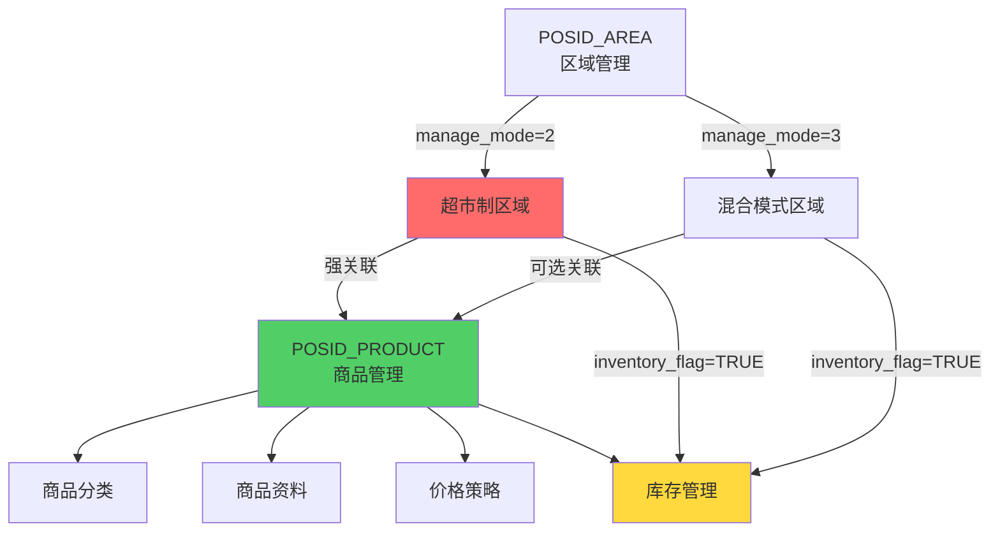
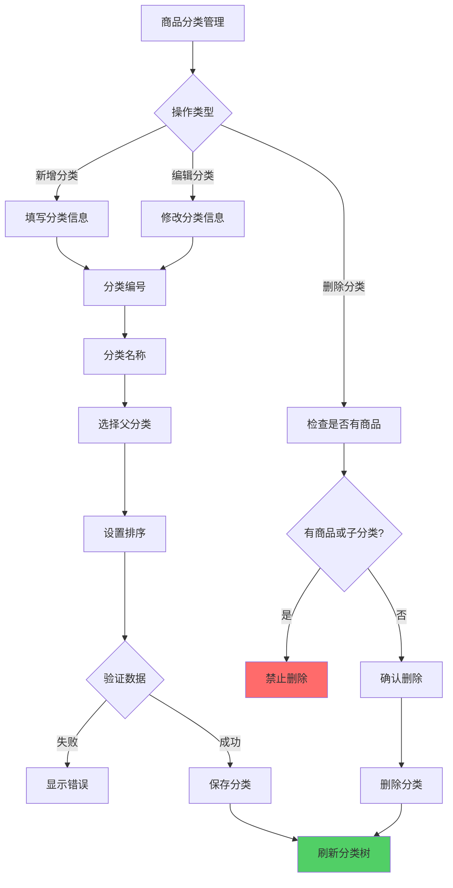
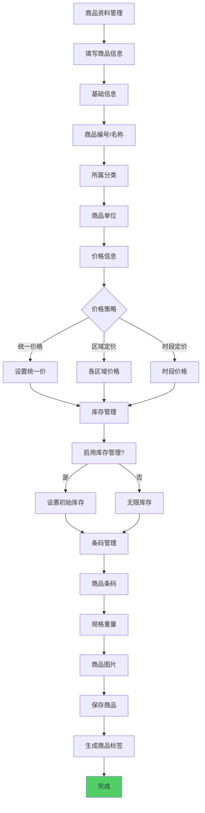
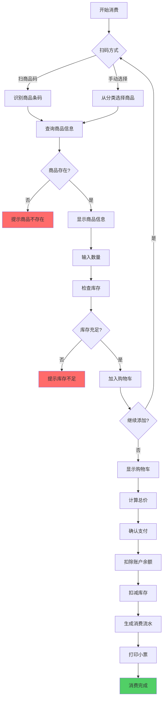
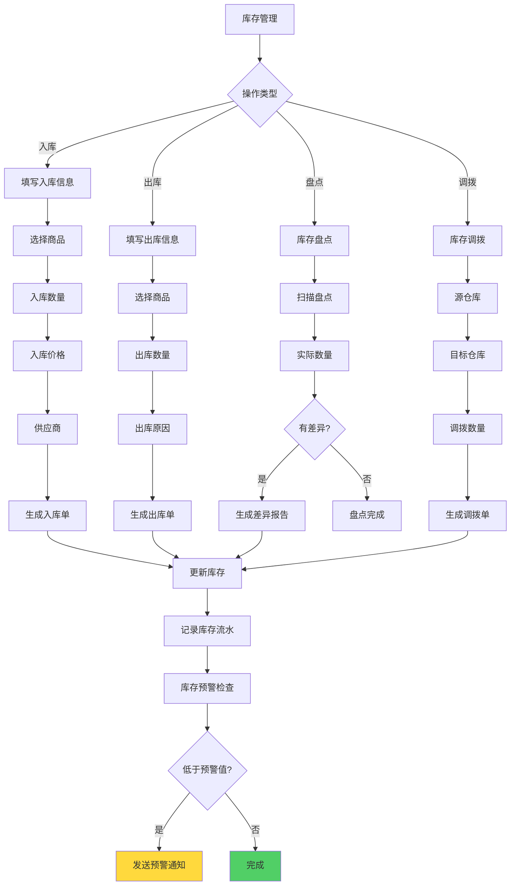
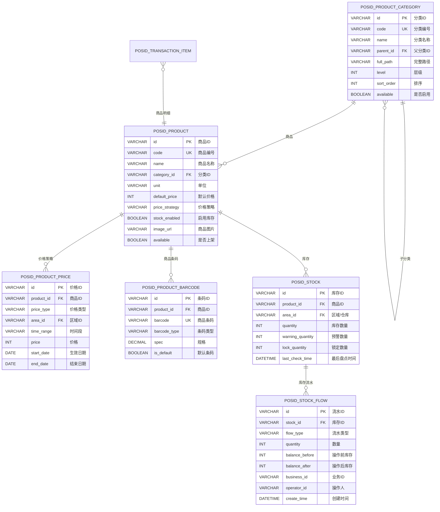
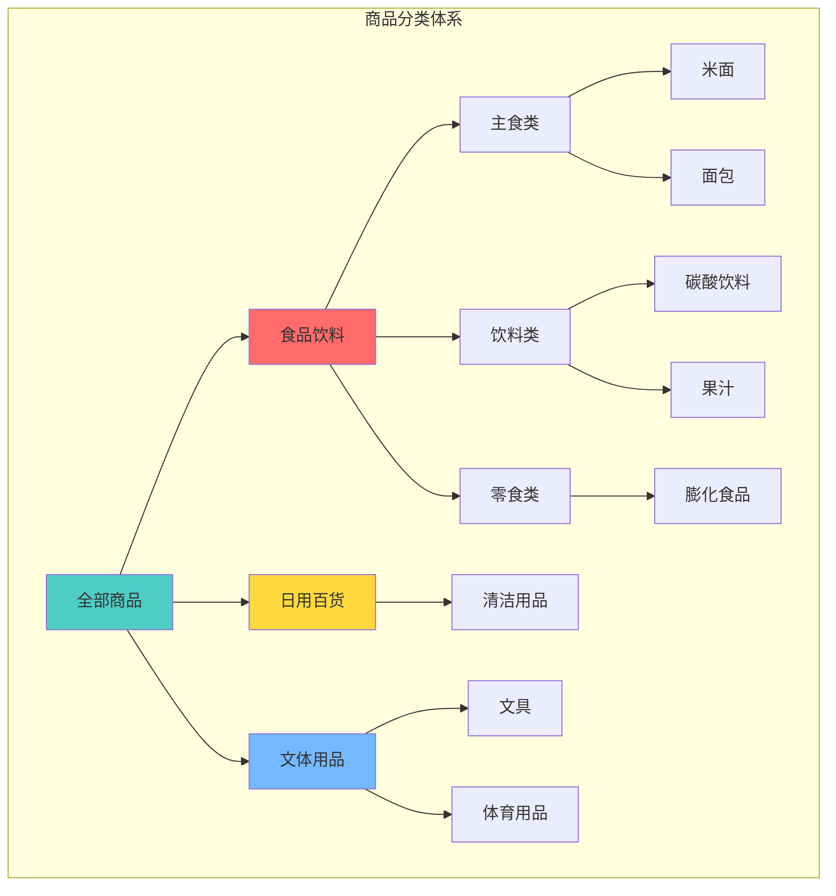
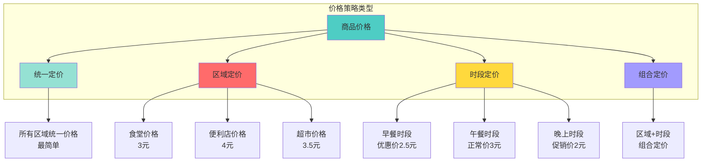
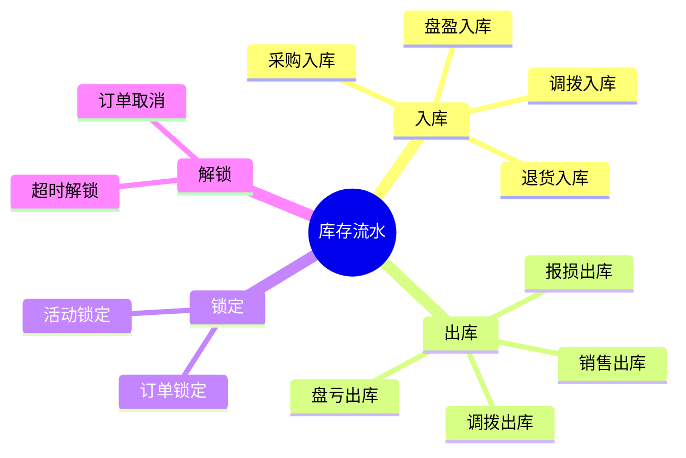

# 12-商品管理模块重构设计

## 📋 模块概述

**重构目标**：构建完整的商品管理体系，支持超市、便利店等商品消费场景。

**核心问题**：
- 商品分类管理混乱
- 商品价格策略单一
- 库存管理缺失
- 商品条码管理不规范

**重构收益**：
- ✅ 树形商品分类结构
- ✅ 灵活的价格策略
- ✅ 完整的库存管理
- ✅ 标准化条码管理

---

## 🔗 与区域经营模式的关联

### 适用场景

**商品管理模块主要服务于超市制区域（manage_mode=2）**：

| 区域经营模式 | 是否需要商品管理 | 使用场景 | 说明 |
|------------|---------------|---------|------|
| **餐别制**（1） | ❌ 不需要 | 食堂、员工餐厅 | 使用定值消费，不涉及商品扫码 |
| **超市制**（2） | ✅ **必需** | 超市、便利店 | 核心消费方式为商品扫码 |
| **混合模式**（3） | ✅ 可选 | 综合餐厅、美食广场 | 支持定值+商品混合消费 |

### 业务关联关系



### 核心设计原则

**1. 超市制区域与商品管理的强绑定**：
- 创建`manage_mode=2`的区域时，系统提示配置商品分类
- 超市制区域的设备必须支持`PRODUCT`消费模式
- 推荐启用`inventory_flag`进行库存管理

**2. 进销存（inventory_flag）与商品管理的关系**：
- `inventory_flag=TRUE`：启用完整的进销存管理（入库、出库、盘点、报表）
- `inventory_flag=FALSE`：仅使用商品价格，不管理库存（适合小型便利店）

**3. 商品与区域的关联方式**：
```sql
-- 商品表新增区域关联字段
ALTER TABLE POSID_PRODUCT
ADD COLUMN area_ids TEXT COMMENT '可售区域ID列表(JSON数组)';

-- 示例
-- area_ids: ["area001", "area002", "area003"]
-- 表示该商品可在这3个区域销售
```

**配置示例**：

**超市制区域配置**：
```json
{
  "id": "area001",
  "name": "园区超市",
  "type": 2,
  "area_sub_type": 1,
  "manage_mode": 2,
  "inventory_flag": true,
  "business_hours": {
    "weekday": "08:00-22:00",
    "weekend": "09:00-21:00"
  }
}
```

**商品配置（关联区域）**：
```json
{
  "id": "product001",
  "name": "农夫山泉550ml",
  "category_id": "cat001",
  "barcode": "6901939121351",
  "price": 2.00,
  "area_ids": ["area001", "area002"],
  "inventory_enabled": true,
  "stock": 1000
}
```

### 业务流程说明

**超市制区域消费流程**：
1. 用户刷卡/刷脸 → 身份识别
2. 获取区域信息（manage_mode=2）
3. 扫描商品条码
4. 查询商品信息（价格、库存、可售区域）
5. 验证商品是否可在当前区域销售（检查area_ids）
6. 累计商品金额
7. 扣减账户余额
8. 扣减商品库存（如果inventory_flag=TRUE）
9. 记录交易流水

---

## 🔄 业务流程设计

### 1.1 商品分类管理流程



### 1.2 商品资料管理流程



### 1.3 商品消费流程



### 1.4 库存管理流程



---

## 🗄️ 数据库设计

### 2.1 ER关系图



### 2.2 商品分类树形结构



### 2.3 商品价格策略



### 2.4 库存流水类型



---

## 💾 缓存策略设计

### 3.1 核心缓存

| 缓存项 | Redis Key | 过期时间 | 说明 |
|-------|-----------|---------|------|
| 商品信息 | `product:info:{productId}` | 30分钟 | 商品基础信息 |
| 商品分类树 | `product:category:tree` | 1小时 | 完整分类树 |
| 商品价格 | `product:price:{productId}:{areaId}` | 1小时 | 区域价格 |
| 商品库存 | `product:stock:{productId}:{areaId}` | 5分钟 | 实时库存 |
| 热销商品 | `product:hot:top100` | 10分钟 | TOP100热销 |

---

## 📊 监控指标

### 4.1 核心指标

| 指标 | 说明 | 告警阈值 |
|------|------|---------|
| 商品销售TOP10 | 热销商品排行 | - |
| 库存预警商品数 | 低于预警线 | > 50个 |
| 缺货商品数 | 库存为0 | > 10个 |
| 商品条码识别率 | 扫码成功率 | < 95% |
| 库存准确率 | 系统vs实际 | < 98% |

### 4.2 业务报表

- **商品销售统计**：按商品、分类、时间统计销量
- **库存状况报表**：库存分布、周转率、呆滞商品
- **价格调整记录**：价格变更历史、调价分析
- **进销存报表**：采购、销售、库存综合分析

---

## 🎯 总结

### 关键设计

✅ **树形分类**：支持无限层级商品分类  
✅ **灵活定价**：统一价/区域价/时段价多种策略  
✅ **库存管理**：入库/出库/盘点/调拨完整流程  
✅ **条码管理**：支持多条码、规格管理  
✅ **实时监控**：库存预警、热销分析

### 支持场景

- 🏪 **校园超市**：文具、零食、日用品销售
- 🏬 **企业便利店**：员工购物，卡片结算
- 🍞 **园区面包房**：面包、糕点、饮料销售
- 🍎 **水果店**：称重商品、组合商品销售

---

**文档版本**：v2.0  
**创建时间**：2025-10-31  
**更新时间**：2025-10-31  
**适用版本**：POSID v3.13.1+  
**更新说明**：
- v2.0: 新增与区域经营模式的关联章节，明确商品管理适用于超市制（manage_mode=2）和混合模式（manage_mode=3），新增商品与区域关联设计
- v1.0: 初始版本，完整的商品管理体系设计

