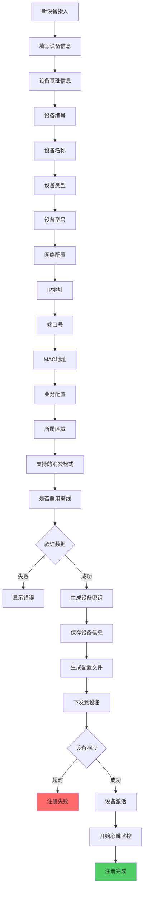
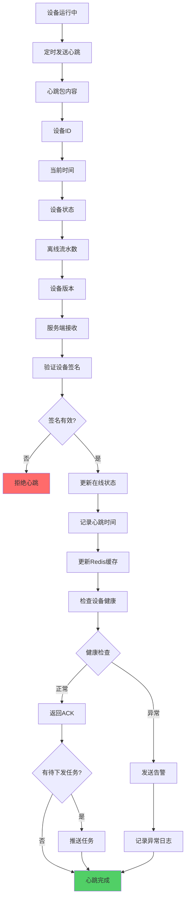
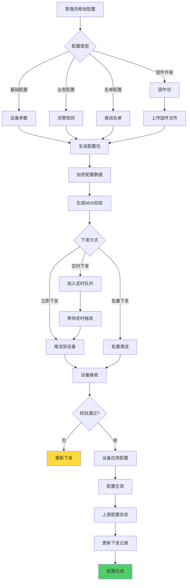
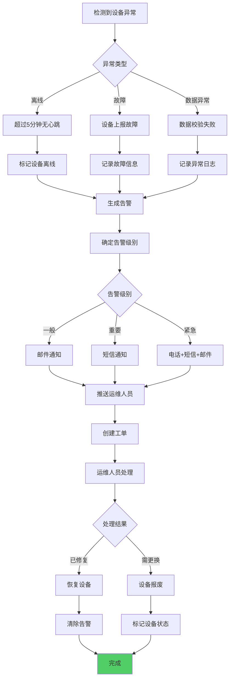
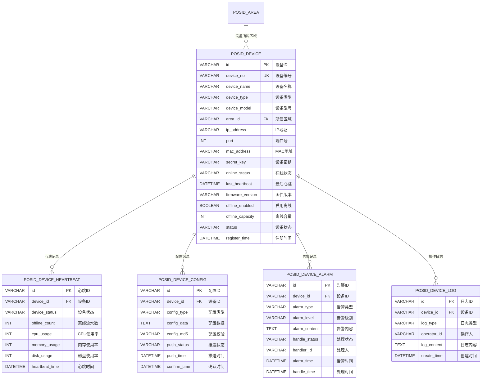
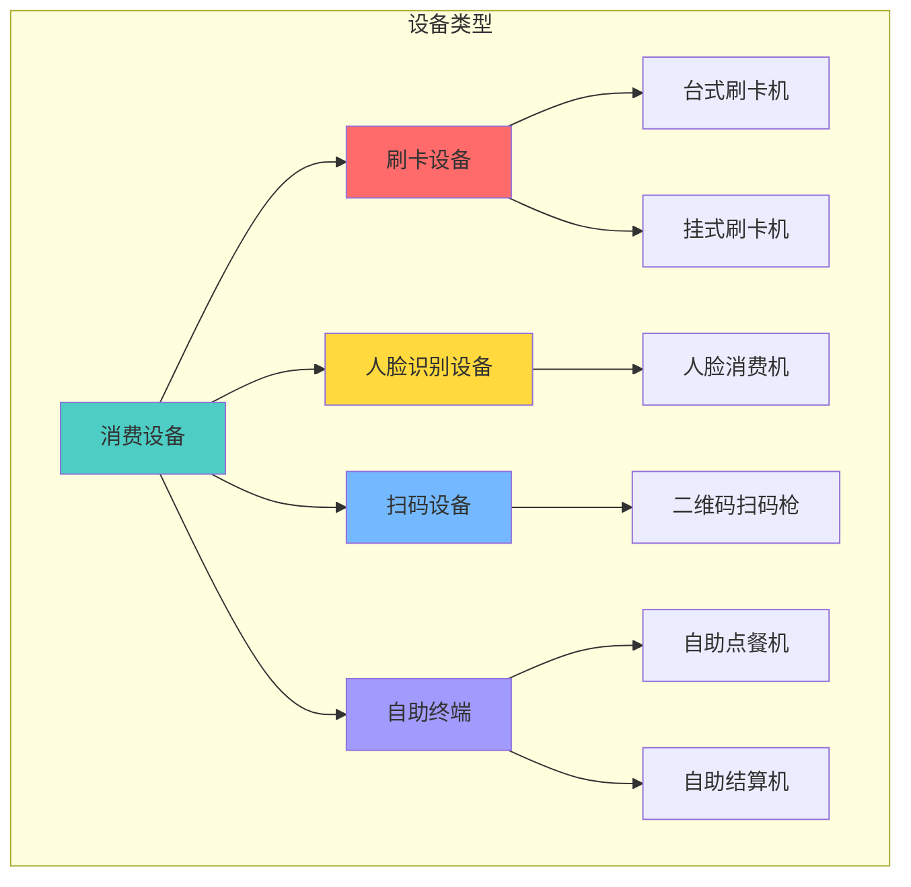
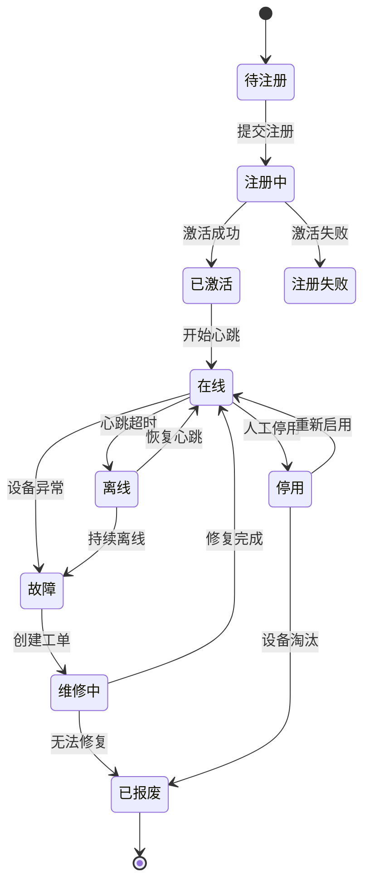
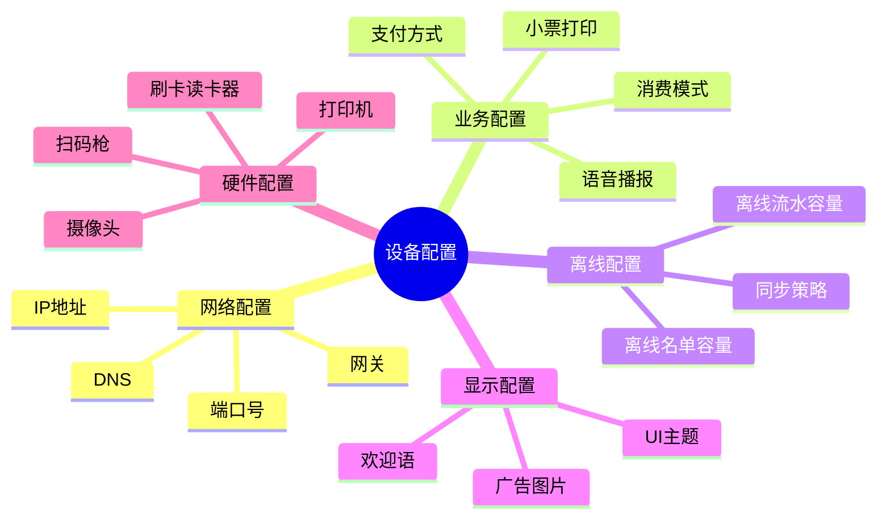
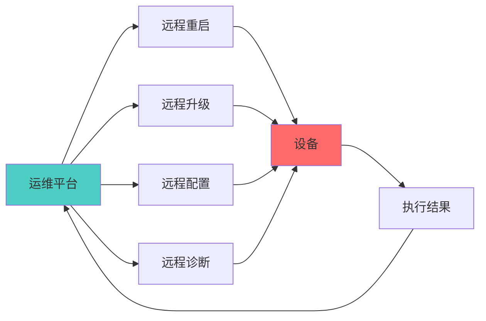

# 14-设备管理模块重构设计

## 📋 模块概述

**重构目标**：构建完整的设备管理体系，支持设备全生命周期管理。

**核心问题**：
- 设备注册流程不规范
- 设备状态监控缺失
- 设备配置管理混乱
- 缺乏设备运维工具
- **未明确设备与经营模式的关系**

**重构收益**：
- ✅ 规范的设备注册流程
- ✅ 实时设备状态监控
- ✅ 灵活的设备参数配置
- ✅ 完整的设备运维体系
- ✅ **明确设备能力与经营模式的适配关系**

---

## 🏗️ 设备与经营模式关系

### 设备能力与模式适配

**设备关联区域时需验证能力匹配**：

| 设备类型 | 支持的经营模式 | 必需功能 | 适用场景 |
|---------|---------------|---------|---------|
| **定值消费终端** | 餐别制(1)、混合(3) | 人脸识别/刷卡、定值扣款 | 食堂、餐厅固定餐次 |
| **商品扫码终端** | 超市制(2)、混合(3) | 扫码枪、商品查询、金额计算 | 超市、便利店 |
| **综合消费终端** | 全部支持(1/2/3) | 全功能支持 | 高端综合场所 |
| **移动POS终端** | 全部支持(1/2/3) | 便携、多模式切换 | 临时活动、外卖 |

### 设备配置与区域经营模式

**设备关联区域时的校验规则**：

| 校验项 | 规则 | 失败提示 |
|--------|------|---------|
| **设备与区域模式匹配** | 设备必须支持区域的经营模式 | "该设备不支持当前区域的经营模式" |
| **消费模式配置** | 设备的`consume_mode`必须与区域`manage_mode`匹配 | "设备消费模式与区域经营模式不一致" |
| **离线能力** | 餐别制需要离线定值配置 | "餐别制区域设备需要离线配置能力" |

**业务规则**：
1. **餐别制区域**：只能关联定值消费终端或综合终端
2. **超市制区域**：只能关联商品扫码终端或综合终端
3. **混合模式区域**：可关联任何类型设备，但需支持模式切换

---

## 🔄 业务流程设计

### 1.1 设备注册流程

### 1.2 设备心跳监控流程

### 1.3 设备配置下发流程

### 1.4 设备故障处理流程

---

## 🗄️ 数据库设计

### 2.1 ER关系图

### 2.2 设备类型体系

### 2.3 设备状态机

### 2.4 设备配置分类

---

## 💾 缓存策略设计

### 3.1 核心缓存

| 缓存项 | Redis Key | 过期时间 | 说明 |
|-------|-----------|---------|------|
| 设备在线状态 | `device:online:{deviceId}` | 5分钟 | 心跳更新 |
| 设备基础信息 | `device:info:{deviceId}` | 30分钟 | 设备详情 |
| 设备配置 | `device:config:{deviceId}` | 1小时 | 当前配置 |
| 在线设备列表 | `device:online:list` | 1分钟 | 在线设备ID |
| 告警队列 | `device:alarm:queue` | 持久化 | 待处理告警 |

---

## 📊 监控指标

### 4.1 核心指标

| 指标 | 说明 | 告警阈值 |
|------|------|---------|
| 设备在线率 | 在线设备/总设备 | < 90% |
| 设备故障率 | 故障设备/总设备 | > 5% |
| 心跳延迟 | 平均心跳间隔 | > 90秒 |
| 配置下发成功率 | 成功/总推送 | < 95% |
| 告警响应时长 | 平均处理时间 | > 30分钟 |

### 4.2 运维报表

- **设备在线监控大屏**：实时在线率、区域分布
- **设备健康报告**：设备状态、故障统计
- **告警统计报表**：告警类型、处理效率
- **设备使用分析**：消费笔数、使用率排行

---

## 🔧 设备运维工具

### 5.1 远程控制

### 5.2 批量操作

- **批量注册**：Excel导入批量注册设备
- **批量配置**：按区域/类型批量修改配置
- **批量升级**：分批次推送固件升级
- **批量重启**：维护窗口批量重启设备

---

## 🎯 总结

### 关键设计

✅ **规范注册**：标准化设备接入流程  
✅ **实时监控**：心跳机制，5分钟监控周期  
✅ **配置管理**：灵活的配置下发和版本管理  
✅ **告警机制**：多级告警，自动工单创建  
✅ **运维工具**：远程控制、批量操作

### 支持场景

- 🏫 **校园食堂**：50+设备统一管理
- 🏢 **企业园区**：跨区域设备集中监控
- 🏭 **工厂车间**：恶劣环境设备健康监控
- 🏥 **医院餐厅**：7×24小时设备运维保障

---

## 📝 更新说明

### v2.0 (2025-10-31)
- ✅ 新增"设备与经营模式关系"章节
- ✅ 明确设备能力与模式适配关系
- ✅ 补充设备关联区域时的校验规则

---

**文档版本**：v2.0  
**创建时间**：2025-10-31  
**适用版本**：POSID v3.13.1+

