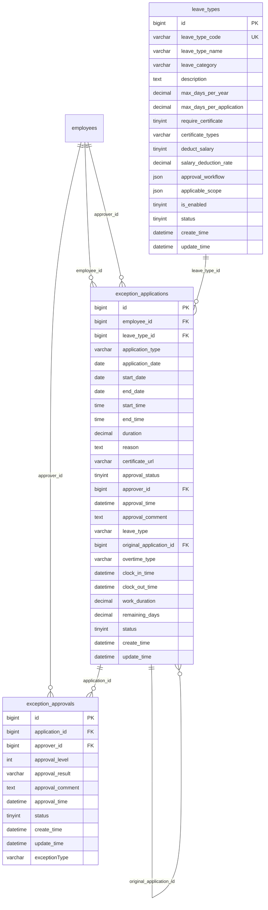

# 异常管理模块设计

## 模块概述
异常管理模块负责处理各种考勤异常情况，包括请假、加班、调班、补签、销假等申请的提交、审批和管理，支持多级审批流程和灵活的审批规则配置。

## 涉及的核心数据表

### 1. leave_types（假种配置表）
```sql
CREATE TABLE leave_types (
    bigint id PK "主键ID，自增长"
    varchar leave_type_code UK "假种编码，唯一标识，如：LEAVE001"
    varchar leave_type_name "假种名称，如：年假、病假、事假"
    varchar leave_category "假种分类：法定假期/福利假期/病假/事假"
    text description "假种描述，详细说明假种用途和规则"
    decimal max_days_per_year "每年最大天数，如：15.0天"
    decimal max_days_per_application "每次申请最大天数，如：5.0天"
    tinyint require_certificate "是否需要证明：0-不需要，1-需要"
    varchar certificate_types "证明类型：病假条/事假证明/医院证明"
    tinyint deduct_salary "是否扣工资：0-不扣，1-扣"
    decimal salary_deduction_rate "扣工资比例，如：0.5表示扣50%"
    json approval_workflow "审批流程配置JSON，包含审批层级和条件"
    json applicable_scope "适用范围JSON，指定适用部门/岗位/员工"
    tinyint is_enabled "是否启用：0-禁用，1-启用"
    tinyint status "状态：0-删除，1-正常"
    datetime create_time "创建时间，记录假种创建时间"
    datetime update_time "更新时间，记录最后修改时间"
);
```

### 2. exception_applications（异常申请表）
```sql
CREATE TABLE exception_applications (
    bigint id PK "主键ID，自增长"
    bigint employee_id FK "员工ID，关联employees表"
    bigint leave_type_id FK "假种ID，关联leave_types表(请假时使用)"
    varchar application_type "申请类型：请假/补签/加班/调班/销假/周末加班"
    date application_date "申请日期，如：2024-01-15"
    date start_date "开始日期，如：2024-01-16"
    date end_date "结束日期，如：2024-01-18"
    time start_time "开始时间，如：09:00:00"
    time end_time "结束时间，如：18:00:00"
    decimal duration "时长，如：3.0天或8.0小时"
    text reason "申请原因，详细说明申请理由"
    varchar certificate_url "凭证文件URL，如：病假条照片链接"
    tinyint approval_status "审批状态：0-待审批，1-已通过，2-已拒绝"
    bigint approver_id FK "审批人ID，关联employees表"
    datetime approval_time "审批时间，记录审批完成时间"
    text approval_comment "审批意见，审批人的处理意见"
    varchar leave_type "假种类型：病假/事假/年假/调休等"
    bigint original_application_id FK "原申请ID，销假时关联原请假申请"
    varchar overtime_type "加班类型：平时加班/周末加班/节假日加班"
    datetime clock_in_time "打卡时间，补签时使用"
    datetime clock_out_time "打卡时间，补签时使用"
    decimal work_duration "工作时长，加班时使用"
    decimal remaining_days "剩余天数，销假时使用"
    tinyint status "状态：0-删除，1-正常"
    datetime create_time "创建时间，记录申请创建时间"
    datetime update_time "更新时间，记录最后修改时间"
);
```

### 3. exception_approvals（异常审批表）
```sql
CREATE TABLE exception_approvals (
    bigint id PK "主键ID，自增长"
    bigint application_id FK "申请ID，关联exception_applications表"
    bigint approver_id FK "审批人ID，关联employees表"
    int approval_level "审批级别，如：1-一级审批，2-二级审批"
    varchar approval_result "审批结果：通过/拒绝"
    text approval_comment "审批意见，审批人的处理意见"
    datetime approval_time "审批时间，记录审批完成时间"
    tinyint status "状态：0-删除，1-正常"
    datetime create_time "创建时间，记录审批创建时间"
    datetime update_time "更新时间，记录最后修改时间"
    varchar exceptionType "异常类型，冗余字段便于查询"
);
```

## 表之间的关联关系

### ER图关系


### 关联说明
1. **假种-申请关系**：请假申请关联具体的假种配置
2. **申请-审批关系**：一个申请可有多个审批记录（多级审批）
3. **销假关联**：销假申请关联原请假申请
4. **员工关联**：申请人和审批人都关联员工表

## 关键业务逻辑说明

### 1. 假种管理逻辑
- **假种分类**：法定假期、福利假期、病假、事假等分类管理
- **额度控制**：年度额度、单次申请额度限制
- **证明要求**：不同假种的证明文件要求
- **薪资扣除**：配置不同假种的薪资扣除规则

### 2. 请假申请逻辑
- **申请类型**：支持多种请假申请类型
- **时间范围**：支持单日、多日、跨时间段请假
- **额度检查**：实时检查剩余请假额度
- **冲突检测**：检查与排班、其他申请的时间冲突

### 3. 加班申请逻辑
- **加班类型**：平时加班、周末加班、节假日加班
- **加班时长**：精确计算加班工作时长
- **加班补偿**：支持调休、加班费等补偿方式
- **加班限制**：加班时长和频次限制

### 4. 补签申请逻辑
- **补签类型**：签到补签、签退补签
- **补签时间**：记录实际的打卡时间
- **补签原因**：详细说明补签原因
- **证明要求**：可能需要相关证明材料

### 5. 调班申请逻辑
- **调班类型**：员工间调班、个人调班
- **时间交换**：调班前后的时间对应关系
- **双方确认**：涉及他人时需要双方确认
- **审批流程**：根据调班类型确定审批流程

### 6. 销假申请逻辑
- **销假关联**：必须关联原请假申请
- **销假时长**：计算实际销假时长
- **额度恢复**：恢复相应的请假额度
- **部分销假**：支持部分销假操作

### 7. 审批流程逻辑
- **多级审批**：支持多层级审批流程
- **条件审批**：根据申请类型、时长等条件确定审批流程
- **审批权限**：基于岗位、部门的审批权限配置
- **审批时效**：审批时间限制和超时处理

## JSON配置结构说明

### 1. approval_workflow（审批流程）JSON结构
```json
{
  "workflow_name": "病假审批流程",
  "approval_levels": [
    {
      "level": 1,
      "approver_type": "direct_manager",
      "approver_role": "直属领导",
      "required": true,
      "time_limit_hours": 24,
      "conditions": {
        "max_duration_days": 3,
        "min_employee_level": 1
      }
    },
    {
      "level": 2,
      "approver_type": "hr_manager",
      "approver_role": "HR经理",
      "required": false,
      "time_limit_hours": 48,
      "conditions": {
        "duration_days >= 3",
        "leave_types": ["病假", "事假"]
      }
    },
    {
      "level": 3,
      "approver_type": "company_director",
      "approver_role": "公司总监",
      "required": false,
      "time_limit_hours": 72,
      "conditions": {
        "duration_days >= 7",
        "employee_level >= 3"
      }
    }
  ],
  "escalation_rules": [
    {
      "condition": "approval_timeout",
      "action": "escalate_to_next_level",
      "timeout_hours": 24
    },
    {
      "condition": "approver_absent",
      "action": "notify_backup_approver",
      "backup_approver_type": "department_manager"
    }
  ],
  "notification_rules": {
    "notify_applicant": true,
    "notify_approver": true,
    "notify_hr": true,
    "notification_channels": ["system", "email", "wechat"]
  }
}
```

### 2. applicable_scope（适用范围）JSON结构
```json
{
  "departments": [1, 2, 3],                    // 适用部门ID列表
  "positions": [10, 20, 30],                   // 适用岗位ID列表
  "employee_levels": ["manager", "staff"],     // 适用员工级别
  "hire_duration_months": 6,                   // 入职满多少月才能申请
  "exclude_employees": [1001, 1002],          // 排除的员工ID列表
  "conditions": {
    "performance_rating": ">= B",              // 绩效评级要求
    "attendance_rate": ">= 0.9",              // 出勤率要求
    "no_disciplinary_records": true           // 无违纪记录
  }
}
```

## 数据流转过程

### 1. 请假申请流程
```
选择假种 -> 填写申请信息 -> 上传证明 -> 提交申请 -> 检查额度 -> 启动审批流程 -> 逐级审批 -> 审批完成 -> 更新考勤记录
```

### 2. 加班申请流程
```
选择加班类型 -> 填写加班时间 -> 说明加班原因 -> 提交申请 -> 主管审批 -> 审批通过 -> 记录加班 -> 计算补偿
```

### 3. 补签申请流程
```
选择补签类型 -> 填写补签时间 -> 说明补签原因 -> 上传证明 -> 提交申请 -> 主管审批 -> 审批通过 -> 更新打卡记录
```

### 4. 审批处理流程
```
接收审批通知 -> 查看申请详情 -> 审核申请理由 -> 做出审批决定 -> 填写审批意见 -> 提交审批 -> 通知相关方 -> 更新申请状态
```

### 5. 销假处理流程
```
选择原请假申请 -> 填写销假时间 -> 计算销假时长 -> 确认销假 -> 恢复请假额度 -> 更新考勤记录 -> 通知相关方
```

## 模块间的接口依赖

### 1. 依赖其他模块
- **基础信息管理模块**：需要员工和岗位信息
- **排班管理模块**：需要排班信息进行冲突检测
- **考勤数据采集模块**：需要打卡记录进行补签

### 2. 被其他模块依赖
- **考勤数据计算模块**：需要异常申请信息调整考勤计算
- **考勤汇总报表模块**：需要异常申请数据进行统计

### 3. 核心接口定义

#### 假种管理接口
```javascript
// 获取假种列表
GET /api/leave-types?category={category}&enabled={enabled}
// 创建假种
POST /api/leave-types
// 更新假种
PUT /api/leave-types/{id}
// 删除假种
DELETE /api/leave-types/{id}
// 获取员工假种余额
GET /api/leave-types/balance?employee_id={id}
```

#### 异常申请接口
```javascript
// 获取申请列表
GET /api/exception-applications?employee_id={id}&type={type}&status={status}
// 创建申请
POST /api/exception-applications
// 更新申请
PUT /api/exception-applications/{id}
// 撤销申请
POST /api/exception-applications/{id}/cancel
// 获取申请详情
GET /api/exception-applications/{id}
// 上传证明文件
POST /api/exception-applications/{id}/upload-certificate
```

#### 审批处理接口
```javascript
// 获取待审批申请
GET /api/pending-approvals?approver_id={id}
// 审批申请
POST /api/exception-applications/{id}/approve
// 拒绝申请
POST /api/exception-applications/{id}/reject
// 批量审批
POST /api/exception-applications/batch-approve
// 获取审批历史
GET /api/approval-history?application_id={id}
```

#### 销假管理接口
```javascript
// 获取可销假的申请
GET /api/available-cancellations?employee_id={id}
// 创建销假申请
POST /api/leave-cancellations
// 获取销假记录
GET /api/leave-cancellations?employee_id={id}
```

## 前端页面设计建议

### 1. 申请提交页面
- **申请类型选择**：标签页切换不同申请类型
- **表单填写**：动态表单根据申请类型显示不同字段
- **时间选择**：日历组件选择申请时间
- **文件上传**：支持证明文件上传和预览

### 2. 申请管理页面
- **申请列表**：表格展示申请记录，支持筛选和搜索
- **申请状态**：不同状态用不同颜色标识
- **批量操作**：支持批量撤销、批量审批

### 3. 审批处理页面
- **待审批列表**：集中展示待审批申请
- **审批详情**：显示完整申请信息和材料
- **快速审批**：支持一键通过/拒绝操作
- **审批意见**：富文本编辑器填写审批意见

### 4. 统计报表页面
- **申请统计**：按类型、部门、时间统计申请情况
- **审批效率**：统计审批时效和通过率
- **假种使用**：统计各假种使用情况

## 开发优先级建议

### 1. 高优先级（核心功能）
- 请假申请管理
- 基础审批流程
- 加班申请管理
- 补签申请管理

### 2. 中优先级（增强功能）
- 多级审批流程
- 销假功能
- 假种额度管理
- 证明文件管理

### 3. 低优先级（扩展功能）
- 调班功能
- 复杂审批规则
- 统计分析功能
- 移动端支持

## 技术实现要点

### 1. 工作流引擎
- 审批流程定义和执行
- 条件判断和流程分支
- 审批权限控制
- 超时处理机制

### 2. 业务规则引擎
- 假种额度计算
- 时间冲突检测
- 审批规则判断
- 业务约束验证

### 3. 文件管理
- 证明文件上传存储
- 文件格式验证
- 文件预览功能
- 文件安全控制

### 4. 通知机制
- 实时通知推送
- 多渠道通知支持
- 通知模板管理
- 通知历史记录