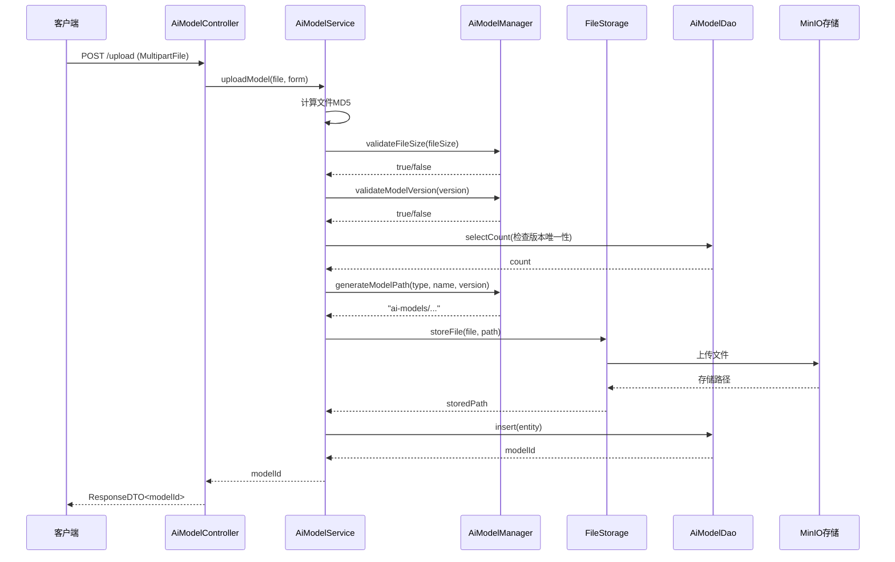
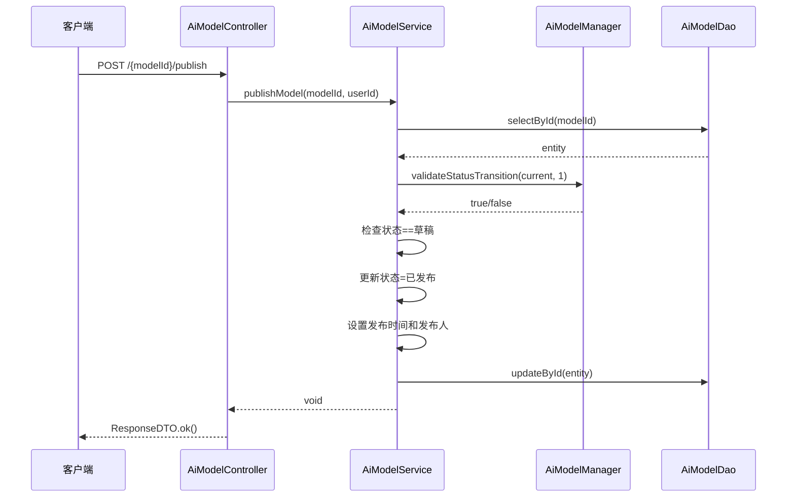
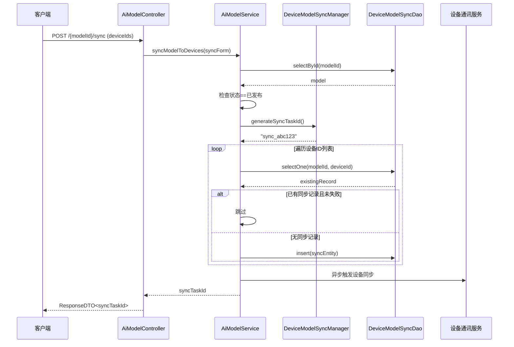

# AI模型管理模块设计文档

## 1. 概述

### 1.1 模块定位

AI模型管理模块是IOE-DREAM视频监控服务的核心组件，负责AI模型的全生命周期管理，包括模型上传、版本控制、发布管理、设备同步等功能。该模块支持边缘AI计算场景，实现AI模型从云端到边缘设备的智能分发。

### 1.2 核心功能

- **模型上传**: 支持大文件上传（最大500MB），自动计算MD5，版本管理
- **模型发布**: 草稿→发布状态流转，支持版本审核机制
- **设备同步**: 将已发布模型同步到边缘设备，实时进度跟踪
- **模型查询**: 分页查询、条件筛选、详情查看
- **模型删除**: 草稿模型的安全删除

---

## 2. 架构设计

### 2.1 系统架构

```
┌─────────────────────────────────────────────────────────────┐
│                     前端层 (Frontend)                       │
│  ┌──────────────┐  ┌──────────────┐  ┌──────────────┐     │
│  │  模型上传页面  │  │  模型管理页面  │  │  同步进度监控  │     │
│  └──────────────┘  └──────────────┘  └──────────────┘     │
└─────────────────────────────────────────────────────────────┘
                           │
                           ▼
┌─────────────────────────────────────────────────────────────┐
│                   Controller层                              │
│  ┌───────────────────────────────────────────────────┐    │
│  │      AiModelController                            │    │
│  │  - uploadModel()                                   │    │
│  │  - publishModel()                                  │    │
│  │  - syncModelToDevices()                            │    │
│  │  - queryModelList()                                │    │
│  │  - getModelDetail()                               │    │
│  │  - querySyncProgress()                             │    │
│  │  - deleteModel()                                   │    │
│  └───────────────────────────────────────────────────┘    │
└─────────────────────────────────────────────────────────────┘
                           │
                           ▼
┌─────────────────────────────────────────────────────────────┐
│                   Service层                                 │
│  ┌───────────────────────────────────────────────────┐    │
│  │      AiModelService (interface)                    │    │
│  │                                                   │    │
│  │  ┌─────────────────────────────────────────────┐ │    │
│  │  │  AiModelServiceImpl                         │ │    │
│  │  │  - 注入: AiModelDao                          │ │    │
│  │  │  - 注入: DeviceModelSyncDao                   │ │    │
│  │  │  - 注入: AiModelManager                       │ │    │
│  │  │  - 注入: DeviceModelSyncManager              │ │    │
│  │  │  - 注入: FileStorageStrategy                 │ │    │
│  │  └─────────────────────────────────────────────┘ │    │
│  └───────────────────────────────────────────────────┘    │
└─────────────────────────────────────────────────────────────┘
                           │
            ┌──────────────┬──────────────┐
            ▼              ▼              ▼
┌─────────────────┐ ┌──────────────┐ ┌─────────────────┐
│   Manager层     │ │   DAO层       │ │  Storage层      │
│ ┌─────────────┐ │ ┌────────────┐ │ ┌───────────────┐│
│ │AiModelMgr   │ │ │AiModelDao   │ │ │FileStorage    ││
│ │             │ │ │             │ │ │  Strategy     ││
│ │- validate() │ │ │- CRUD       │ │ │               ││
│ │- format()   │ │ │- query()    │ │ │- storeFile()  ││
│ └─────────────┘ │ └────────────┘ │ │- getFile()    ││
│                 │                 │ │- deleteFile() ││
│ ┌─────────────┐ │                 │ └───────────────┘│
│ │DeviceModel  │ │                 │                   │
│ │SyncManager  │ │                 │                   │
│ │             │ │                 │                   │
│ │- generate() │ │                 │                   │
│ │- calculate() │ │                 │                   │
│ └─────────────┘ │                 │                   │
└─────────────────┘ └──────────────┘ └─────────────────┘
         │                   │                 │
         ▼                   ▼                 ▼
┌─────────────────┐ ┌──────────────┐ ┌─────────────────┐
│ Business Logic  │ │   Database   │ │     MinIO       │
│                 │ │              │ │                 │
│ - 版本验证      │ │ - t_ai_model │ │ - 模型文件存储  │
│ - 状态转换      │ │ - t_device_  │ │ - 预签名URL     │
│ - 进度计算      │ │   model_sync │ │ - 文件元数据    │
└─────────────────┘ └──────────────┘ └─────────────────┘
```

### 2.2 分层职责

#### Controller层 (AiModelController)
- **职责**: 接收HTTP请求，参数验证，调用Service层，返回响应
- **技术**: Spring MVC, @RestController, @Validated
- **特点**:
  - 统一响应格式 ResponseDTO<T>
  - 参数校验 @Valid, @NotNull
  - 异常统一处理

#### Service层 (AiModelService/AiModelServiceImpl)
- **职责**: 业务逻辑编排，事务控制，跨组件协调
- **技术**: @Service, @Transactional
- **特点**:
  - 协调DAO、Manager、Storage多组件
  - 异常处理和日志记录
  - 事务一致性保证

#### Manager层 (AiModelManager/DeviceModelSyncManager)
- **职责**: 纯业务逻辑工具类，无状态计算
- **技术**: 纯Java类，构造函数注入
- **特点**:
  - 无Spring依赖，可单元测试
  - 可重用的业务逻辑
  - 参数验证、格式化、状态转换

#### DAO层 (AiModelDao/DeviceModelSyncDao)
- **职责**: 数据访问，SQL执行
- **技术**: MyBatis-Plus, @Mapper
- **特点**:
  - 继承BaseMapper，获得CRUD能力
  - LambdaQueryWrapper类型安全查询
  - 分页查询支持

---

## 3. 数据库设计

### 3.1 表结构

#### t_ai_model (AI模型表)

| 字段名 | 类型 | 长度 | 主键 | 非空 | 索引 | 说明 |
|--------|------|------|------|------|------|------|
| model_id | BIGINT | - | 是 | 是 | PK | 模型ID（雪花算法） |
| model_name | VARCHAR | 100 | - | 是 | IDX | 模型名称 |
| model_version | VARCHAR | 20 | - | 是 | IDX | 模型版本（x.y.z） |
| model_type | VARCHAR | 50 | - | 是 | IDX | 模型类型 |
| file_path | VARCHAR | 500 | - | 是 | - | MinIO存储路径 |
| file_size | BIGINT | - | - | 是 | - | 文件大小（字节） |
| file_md5 | VARCHAR | 32 | - | 是 | - | 文件MD5值 |
| supported_events | VARCHAR | 500 | - | 否 | - | 支持的事件类型 |
| model_status | TINYINT | - | - | 是 | IDX | 模型状态 |
| accuracy_rate | DECIMAL | (5,4) | - | 否 | - | 准确率 |
| publish_time | DATETIME | - | - | 否 | - | 发布时间 |
| published_by | BIGINT | - | - | 否 | - | 发布人ID |
| create_time | DATETIME | - | - | 是 | IDX | 创建时间 |
| update_time | DATETIME | - | - | 是 | - | 更新时间 |
| deleted_flag | TINYINT | - | - | 是 | IDX | 删除标记 |

**索引设计**:
- PRIMARY KEY: `model_id`
- UNIQUE INDEX: `uk_model_name_version` (`model_name`, `model_version`, `deleted_flag`) - 防止重复版本
- INDEX: `idx_model_type` (`model_type`)
- INDEX: `idx_model_status` (`model_status`)
- INDEX: `idx_create_time` (`create_time`)

#### t_device_model_sync (设备模型同步表)

| 字段名 | 类型 | 长度 | 主键 | 非空 | 索引 | 说明 |
|--------|------|------|------|------|------|------|
| sync_id | BIGINT | - | 是 | 是 | PK | 同步ID |
| model_id | BIGINT | - | - | 是 | IDX | 模型ID |
| device_id | VARCHAR | 50 | - | 是 | IDX | 设备ID |
| sync_status | TINYINT | - | - | 是 | IDX | 同步状态 |
| sync_progress | INT | - | - | 是 | - | 同步进度 |
| error_message | VARCHAR | 500 | - | 否 | - | 错误信息 |
| create_time | DATETIME | - | - | 是 | - | 创建时间 |
| update_time | DATETIME | - | - | 是 | - | 更新时间 |

**索引设计**:
- PRIMARY KEY: `sync_id`
- INDEX: `idx_model_id` (`model_id`)
- INDEX: `idx_device_id` (`device_id`)
- INDEX: `idx_sync_status` (`sync_status`)
- UNIQUE INDEX: `uk_model_device` (`model_id`, `device_id`) - 防止重复同步

---

## 4. 核心业务流程

### 4.1 模型上传流程



### 4.2 模型发布流程



### 4.3 设备同步流程



---

## 5. 技术实现

### 5.1 文件上传

**技术选型**: Spring MultipartFile + MinIO

**核心代码**:
```java
@Override
public Long uploadModel(MultipartFile file, AiModelUploadForm uploadForm) {
    // 1. 计算MD5
    String fileMd5 = calculateFileMd5(file.getInputStream());

    // 2. 验证文件大小
    if (!aiModelManager.validateFileSize(file.getSize())) {
        throw new IllegalArgumentException("模型文件不能超过500MB");
    }

    // 3. 验证版本格式
    if (!aiModelManager.validateModelVersion(uploadForm.getModelVersion())) {
        throw new IllegalArgumentException("模型版本格式应为x.y.z");
    }

    // 4. 检查版本唯一性
    Long count = aiModelDao.selectCount(queryWrapper);
    if (count > 0) {
        throw new IllegalArgumentException("该模型版本已存在");
    }

    // 5. 生成MinIO路径
    String minioPath = aiModelManager.generateModelPath(
        uploadForm.getModelType(),
        uploadForm.getModelName(),
        uploadForm.getModelVersion()
    );

    // 6. 上传到MinIO
    String storedPath = fileStorageStrategy.storeFile(file, minioPath);

    // 7. 创建模型记录
    AiModelEntity entity = new AiModelEntity();
    entity.setModelName(uploadForm.getModelName());
    entity.setModelVersion(uploadForm.getModelVersion());
    entity.setModelType(uploadForm.getModelType());
    entity.setFilePath(storedPath);
    entity.setFileSize(file.getSize());
    entity.setFileMd5(fileMd5);
    entity.setModelStatus(0); // 草稿

    aiModelDao.insert(entity);
    return entity.getModelId();
}
```

### 5.2 版本验证

**正则表达式验证**:
```java
public boolean validateModelVersion(String modelVersion) {
    // 版本格式应为 x.y.z (例如: 1.0.0, 2.5.10)
    boolean valid = modelVersion.matches("^\\d+\\.\\d+\\.\\d+$");
    return valid;
}
```

**唯一性约束**:
```java
LambdaQueryWrapper<AiModelEntity> queryWrapper = new LambdaQueryWrapper<>();
queryWrapper.eq(AiModelEntity::getModelName, uploadForm.getModelName())
        .eq(AiModelEntity::getModelVersion, uploadForm.getModelVersion())
        .eq(AiModelEntity::getDeletedFlag, 0);
Long count = aiModelDao.selectCount(queryWrapper);
if (count > 0) {
    throw new IllegalArgumentException("该模型版本已存在");
}
```

### 5.3 状态转换

**状态转换规则**:
```java
public boolean validateStatusTransition(Integer currentStatus, Integer targetStatus) {
    boolean valid = switch (currentStatus) {
        case 0 -> targetStatus == 1 || targetStatus == 2; // 草稿 -> 已发布/已弃用
        case 1 -> targetStatus == 2; // 已发布 -> 已弃用
        default -> false;
    };
    return valid;
}
```

**状态矩阵**:
| 当前状态 → 目标状态 | 草稿(0) | 已发布(1) | 已弃用(2) |
|-------------------|---------|-----------|-----------|
| **草稿(0)** | ✅ 允许 | ✅ 允许 | ✅ 允许 |
| **已发布(1)** | ❌ 禁止 | ✅ 保持 | ✅ 允许 |
| **已弃用(2)** | ❌ 禁止 | ❌ 禁止 | ✅ 保持 |

### 5.4 同步进度计算

**进度计算公式**:
```java
public Integer calculateProgress(Integer totalDevices, Integer completedDevices) {
    if (totalDevices == null || totalDevices == 0) {
        return 0;
    }
    Integer actualCompleted = completedDevices != null ? completedDevices : 0;
    int progress = actualCompleted * 100 / totalDevices;
    return progress;
}
```

**状态统计**:
```java
// 0-待同步, 1-同步中, 2-成功, 3-失败
int pendingDevices = 0;
int syncingDevices = 0;
int successDevices = 0;
int failedDevices = 0;

for (DeviceModelSyncEntity record : syncRecords) {
    switch (record.getSyncStatus()) {
        case 0 -> pendingDevices++;
        case 1 -> syncingDevices++;
        case 2 -> successDevices++;
        case 3 -> failedDevices++;
    }
}

int progress = calculateProgress(totalDevices, successDevices + failedDevices);
```

---

## 6. MinIO存储设计

### 6.1 存储路径结构

```
ai-models/                          # AI模型根目录
├── YOLOv8/                          # 模型类型目录
│   ├── fall_detection/            # 模型名称目录
│   │   ├── 1.0.0/                # 模型版本目录
│   │   │   └── model.onnx        # 模型文件
│   │   └── 2.0.0/
│   │       └── model.onnx
│   └── face_recognition/
│       └── 1.2.0/
│           └── model.onnx
├── RESNET/
│   └── ...
└── BERT/
    └── ...
```

### 6.2 路径生成规则

**路径模板**:
```
ai-models/{modelType}/{modelName}/{modelVersion}/model.onnx
```

**示例**:
- 模型类型: `YOLOv8`
- 模型名称: `fall_detection`
- 模型版本: `2.0.0`
- 生成路径: `ai-models/YOLOv8/fall_detection/2.0.0/model.onnx`

### 6.3 存储策略

**存储接口**:
```java
public interface FileStorageStrategy {
    String storeFile(MultipartFile file, String path);
    InputStream getFileStream(String path);
    void deleteFile(String path);
    boolean fileExists(String path);
    FileInfo getFileInfo(String path);
    String getPresignedUploadUrl(String path, long expireSeconds);
    String getPresignedDownloadUrl(String path, long expireSeconds);
}
```

**MinIO实现**:
- 使用 `minio-client` SDK
- 支持大文件分片上传
- 自动生成预签名URL
- 断点续传支持

---

## 7. 异常处理

### 7.1 异常分类

| 异常类型 | HTTP状态码 | 示例 |
|---------|-----------|------|
| IllegalArgumentException | 400 | 参数验证失败 |
| BusinessException | 400 | 业务规则违反 |
| SystemException | 500 | 系统内部错误 |

### 7.2 异常处理策略

**Controller层**:
```java
@RestControllerAdvice
@Slf4j
public class GlobalExceptionHandler {

    @ExceptionHandler(IllegalArgumentException.class)
    public ResponseDTO<Void> handleIllegalArgumentException(IllegalArgumentException e) {
        log.warn("[参数验证异常] message={}", e.getMessage());
        return ResponseDTO.userError(e.getMessage());
    }

    @ExceptionHandler(BusinessException.class)
    public ResponseDTO<Void> handleBusinessException(BusinessException e) {
        log.warn("[业务异常] code={}, message={}", e.getCode(), e.getMessage());
        return ResponseDTO.error(e.getCode(), e.getMessage());
    }

    @ExceptionHandler(Exception.class)
    public ResponseDTO<Void> handleException(Exception e) {
        log.error("[系统异常] error={}", e.getMessage(), e);
        return ResponseDTO.error("SYSTEM_ERROR", "系统繁忙，请稍后重试");
    }
}
```

---

## 8. 性能优化

### 8.1 数据库优化

**索引优化**:
- 模型名称+版本联合索引
- 模型类型索引
- 模型状态索引
- 创建时间索引（支持时间范围查询）

**查询优化**:
```java
// 分页查询
Page<AiModelEntity> page = new Page<>(pageNum, pageSize);
LambdaQueryWrapper<AiModelEntity> queryWrapper = new LambdaQueryWrapper<>();
queryWrapper.eq(AiModelEntity::getModelType, modelType)
             .eq(AiModelEntity::getModelStatus, modelStatus)
             .orderByDesc(AiModelEntity::getCreateTime);
IPage<AiModelEntity> result = aiModelDao.selectPage(page, queryWrapper);
```

### 8.2 文件上传优化

**大文件分片上传**:
- 前端分片（每片10MB）
- 后端并发接收
- 临时文件合并
- 原子性保证

**MD5计算优化**:
- 使用BufferedInputStream
- 分块读取（8KB buffer）
- 避免全文件加载到内存

### 8.3 缓存策略

**模型元数据缓存**:
```java
@Cacheable(value = "ai:model", key = "#modelId")
public AiModelVO getModelDetail(Long modelId) {
    // ...
}
```

**同步进度缓存**:
```java
@Cacheable(value = "sync:progress", key = "#modelId", expire = 60)
public DeviceModelSyncProgressVO querySyncProgress(Long modelId) {
    // 缓存60秒
}
```

---

## 9. 安全设计

### 9.1 文件安全

**文件类型验证**:
```java
private static final List<String> ALLOWED_EXTENSIONS =
    Arrays.asList(".onnx", ".pb", ".h5");

private void validateFileType(MultipartFile file) {
    String filename = file.getOriginalFilename();
    String extension = filename.substring(filename.lastIndexOf("."));
    if (!ALLOWED_EXTENSIONS.contains(extension)) {
        throw new IllegalArgumentException("不支持的文件类型");
    }
}
```

**文件内容检查**:
- 文件头验证（Magic Number）
- 恶意文件检测
- 病毒扫描集成

### 9.2 访问控制

**权限验证**:
```java
@PreAuthorize("hasAuthority('video:model:upload')")
public Long uploadModel(...) {
    // 只有拥有 video:model:upload 权限的用户才能上传
}
```

**用户隔离**:
- 只能管理自己创建的模型
- 管理员可以管理所有模型

---

## 10. 监控与日志

### 10.1 业务监控

**关键指标**:
- 模型上传成功率
- 模型同步成功率
- 平均同步时间
- 存储空间使用

**日志记录**:
```java
@Slf4j
@Service
public class AiModelServiceImpl {

    @Override
    public Long uploadModel(MultipartFile file, AiModelUploadForm uploadForm) {
        log.info("[AI模型Service] 开始上传AI模型: fileName={}, modelName={}, modelVersion={}",
                file.getOriginalFilename(), uploadForm.getModelName(), uploadForm.getModelVersion());

        try {
            // 业务逻辑...
            log.info("[AI模型Service] 模型上传成功: modelId={}, minioPath={}",
                    entity.getModelId(), storedPath);
            return entity.getModelId();
        } catch (Exception e) {
            log.error("[AI模型Service] AI模型上传失败: modelName={}, error={}",
                    uploadForm.getModelName(), e.getMessage(), e);
            throw new RuntimeException("AI模型上传失败: " + e.getMessage(), e);
        }
    }
}
```

---

## 11. 测试策略

### 11.1 单元测试

**测试覆盖率目标**: ≥80%

**测试类**:
- AiModelManagerTest: 35个测试
- DeviceModelSyncManagerTest: 24个测试
- AiModelServiceImplTest: 17个测试

**测试场景**:
- 正常场景（成功路径）
- 边界条件（空值、零值、最大值）
- 异常场景（参数错误、业务规则违反）

### 11.2 集成测试

**测试范围**:
- Controller → Service → DAO
- Service → Storage → MinIO
- 端到端API测试

---

## 12. 部署说明

### 12.1 配置项

**application.yml配置**:
```yaml
# MinIO配置
minio:
  endpoint: http://localhost:9000
  access-key: minioadmin
  secret-key: minioadmin
  bucket-name: ai-models
  connection-timeout: 10000
  socket-timeout: 10000

# 文件上传配置
spring:
  servlet:
    multipart:
      max-file-size: 500MB
      max-request-size: 500MB
```

### 12.2 依赖服务

**MinIO服务**:
- 版本: RELEASE.2023-03-20T01-53-14Z
- 端口: 9000
- 默认账号: minioadmin/minioadmin

**MySQL数据库**:
- 版本: 8.0+
- 字符集: utf8mb4
- 存储引擎: InnoDB

---

## 13. 未来扩展

### 13.1 计划功能

1. **模型转换**: 支持不同格式间转换（ONNX↔TensorRT）
2. **模型压缩**: 模型量化、剪枝优化
3. **A/B测试**: 多版本模型并行测试
4. **自动同步**: 新设备自动推送指定模型
5. **模型市场**: 第三方模型上架和分发

### 13.2 技术优化

1. **CDN加速**: 模型文件全球分发
2. **边缘缓存**: 设备本地模型缓存
3. **增量同步**: 只同步模型差异部分
4. **P2P分发**: 设备间P2P模型共享

---

**文档维护**: IOE-DREAM AI Team
**最后更新**: 2025-01-30
**版本**: 1.0.0
