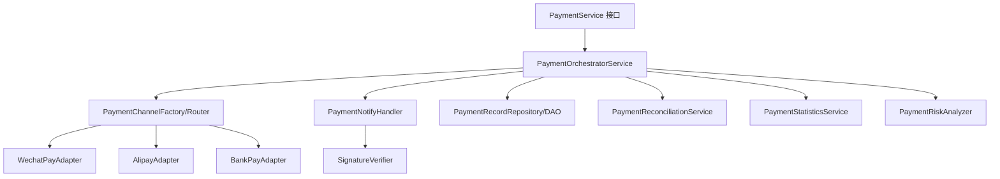
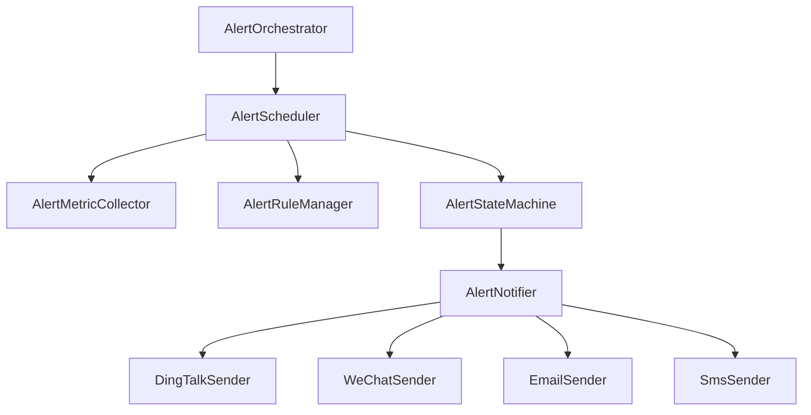
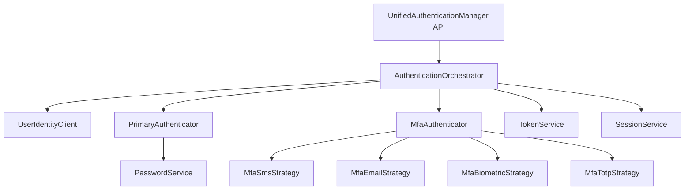

## 1.1 四个热点类职责切面与目标组件图

本文用于落实 `tasks.md` 的 1.1：对 `PaymentService`、`DeviceSyncService`、`AlertManager`、`UnifiedAuthenticationManager` 进行单一职责切面梳理，并给出目标组件拆解图，为后续 1.2/1.4/1.6 的渐进重构提供边界与验收基线。

### A. PaymentService（consume 领域）

**现状职责切面**
- **渠道 SDK 初始化与配置管理**
  - 微信/支付宝/银行等配置注入、证书/私钥加载、SDK client 延迟初始化（`initWechatPayConfig`、`initAlipayClient`、`getWechatPayPrivateKey`、`getWechatPayPlatformCertificate`）。
- **多渠道下单**
  - 微信多形态下单：JSAPI/APP/H5/Native（`createWechatPayOrder` + `create*PayOrder`）。
  - 支付宝多形态下单（`createAlipayOrder`）。
  - 银行/授信支付等扩展（`createBankPaymentOrder`、`processCreditLimitPayment`）。
- **回调/通知处理**
  - 微信 V3 回调验签、解析、幂等、防重放、状态落库（`handleWechatPayNotify`）。
  - 支付宝回调验签、解析（`handleAlipayNotify`）。
  - 审计日志/通知推送（`recordPaymentAuditLog`、`sendPaymentNotification`）。
- **退款全流程**
  - 退款申请/审核/执行（`applyRefund`、`auditRefund`、`executeRefund`）。
  - 三方退款接口调用（`wechatRefund`、`alipayRefund`）。
- **订单查询 / 对账 / 统计 / 风险识别**
  - 三方订单查询（`queryWechatOrderByOutTradeNo`、`queryAlipayOrderByOutTradeNo`）。
  - 对账编排、差异比对、报表（`performPaymentReconciliation` 及其 `query*/compare*/build*` 私有方法族）。
  - 用户/商户统计与高风险扫描（`getUserPaymentStatistics`、`getMerchantSettlementStatistics`、`getHighRiskPayments` 等）。
- **数据访问与通用工具**
  - DAO 混入、Map/金额/状态转换（`querySystemPaymentRecords`、`convert*`、`convertPayment*ToInt`）。

**主要问题**
- 单类 4113 行，混杂“编排/渠道协议/验签/DAO/统计/风控”，变更半径与测试成本极高。
- 交易热路径与统计/对账长链路耦合，异常场景难以隔离。

**目标组件拆解**
- `PaymentOrchestratorService`（Spring Service）
  - 事务边界、对外 API 保持兼容；仅编排支付/退款/查询的高层流程。
- `PaymentChannelAdapter`（接口）+ 具体实现
  - `WechatPayAdapter`：仅负责微信下单/查询/退款 SDK 交互与参数组装。
  - `AlipayAdapter`：仅负责支付宝下单/查询/退款 SDK 交互。
  - `BankPayAdapter`（阶段性）：银行/授信支付。
- `PaymentNotifyHandler`
  - 处理微信/支付宝回调的解析、幂等、状态机推进；对外暴露 `handleWechatNotify/handleAlipayNotify`。
- `SignatureVerifier`
  - 微信 V3 证书验签、支付宝 RSA 验签、各渠道验签共用策略。
- `PaymentReconciliationService`
  - 对账编排与差异分析；不参与交易热路径。
- `PaymentStatisticsService`
  - 用户/商户统计与报表读取。
- `PaymentRiskAnalyzer`
  - 高风险支付/退款扫描与规则收敛。
- `PaymentRecordRepository`（或沿用 DAO 层）
  - 仅数据访问，禁止渠道/编排逻辑回流到 DAO。



---

### B. DeviceSyncService（device-comm 领域）

**现状职责切面**
- **同步业务编排**
  - 用户同步/撤销/查询、业务属性同步、健康检查、性能指标、心跳处理（`syncUserInfo`、`revokeUserPermission`、`getDeviceUsers`、`syncBusinessAttributes`、`checkDeviceHealth`、`getDeviceMetrics`、`processHeartbeat`）。
- **设备校验与数据访问**
  - `DeviceDao` 直查设备、状态判断。
- **协议与传输细节**
  - 选择 `ProtocolHandler`、构建命令、socket 发送、解析响应（`perform*/execute*Command`、`sendCommandToDevice`、`build*Command`、`parse*Response`）。
- **缓存/降级**
  - `@Cacheable/@CacheEvict` 缓存设备用户列表与降级默认指标（`getDefaultMetrics`）。

**主要问题**
- 单类 2384 行，“业务编排”和“协议传输细节”深度耦合，难以复用/测试。
- socket I/O、命令构建、解析规则全部塞在同一类，扩展新协议代价高。

**目标组件拆解**
- `DeviceSyncOrchestratorService`（Spring Service）
  - 作为对外 API 门面与事务边界；只做流程编排/缓存注解。
- 领域管理器（纯 Java Manager）
  - `DeviceUserSyncManager`：用户同步/撤销/查询流程。
  - `DeviceAttributeSyncManager`：业务属性同步。
  - `DeviceHealthManager`：健康检查/心跳。
  - `DeviceMetricsManager`：指标采集与降级策略。
- `ProtocolClient`（基础设施）
  - 封装 socket 连接、超时、发送/接收；不感知业务语义。
- `ProtocolCommandBuilder` / `ProtocolResponseParser`
  - 以协议类型维度隔离命令构建与响应解析，可由 `ProtocolHandler` 复用或下沉。
- `DeviceRepository`
  - 包装 `DeviceDao` 只做设备读取/校验。

```mermaid
flowchart TD
  API[DeviceSyncService API] --> Orchestrator[DeviceSyncOrchestratorService]
  Orchestrator --> UserMgr[DeviceUserSyncManager]
  Orchestrator --> AttrMgr[DeviceAttributeSyncManager]
  Orchestrator --> HealthMgr[DeviceHealthManager]
  Orchestrator --> MetricsMgr[DeviceMetricsManager]
  UserMgr --> Repo[DeviceRepository]
  AttrMgr --> Repo
  HealthMgr --> Repo
  MetricsMgr --> Repo
  UserMgr --> Handler[ProtocolHandler]
  AttrMgr --> Handler
  HealthMgr --> Handler
  MetricsMgr --> Handler
  Handler --> Builder[ProtocolCommandBuilder]
  Handler --> Parser[ProtocolResponseParser]
  Handler --> Client[ProtocolClient(Socket)]
```

---

### C. AlertManager（monitoring 领域，microservices-common）

**现状职责切面**
- **告警配置与规则管理**
  - 阈值/渠道/收敛配置、从 DB/配置中心刷新（`AlertConfig`、`refreshAlertConfig`、`add/removeAlertRule`）。
- **监控调度与状态机**
  - 定时扫描、规则匹配、重复告警抑制、恢复判定、状态与历史维护（`startAlertMonitoring`、`checkAlertRules`、`triggerAlert`、`resolveAlert`、`cleanupExpiredAlerts`）。
- **指标采集与计算**
  - 读取 Micrometer/系统信息并计算业务/系统指标（`getMetricOverview`、`calculate*Rate`、`getSystemCpuUsage`、`getJvmMemoryUsage`）。
- **多渠道通知集成**
  - 钉钉/企微/邮件/短信通道选择与发送（`send*Notification`、`send*Directly`、`sendAliyunSms/sendTencentSms`）。

**主要问题**
- 监控、规则、状态、通知、通道 SDK 全堆在一个 Manager，难以替换或独立演进。
- 通道逻辑与告警状态机纠缠，扩展新通道或改收敛策略风险大。

**目标组件拆解**
- `AlertOrchestrator`（Manager）
  - 对外门面；调度与高层编排。
- `AlertRuleManager`
  - 规则 CRUD、阈值与收敛策略维护。
- `AlertMetricCollector`
  - 统一指标快照与计算函数。
- `AlertStateMachine`
  - 告警触发/重复/恢复/过期清理的状态流转。
- `AlertNotifier`
  - 通知路由与模板渲染。
- 通道适配器
  - `DingTalkSender`、`WeChatSender`、`EmailSender`、`SmsSender`，只负责单通道发送实现。



---

### D. UnifiedAuthenticationManager（auth 领域，microservices-common）

**现状职责切面**
- **认证入口编排**
  - 用户名密码/短信/多因子认证入口（`authenticateByUsernamePassword`、`authenticateBySmsCode`、`multiFactorAuthentication`）。
- **用户与权限数据获取**
  - 通过网关读取用户、角色、权限（`getUserBy*`、`getUserRoles/getUserPermissions`）。
- **密码/验证码/生物识别/TOTP 验证**
  - 密码校验、短信/邮件/生物识别/TOTP 二次校验（`verifyPassword`、`verifySmsCode`、`authenticateByEmail/Biometric/Totp`）。
- **Token 生命周期**
  - JWT 生成/解析/刷新、登出（`generateAuthToken`、`parseJwtToken`、`validateToken`、`refreshToken`、`logout`）。
- **会话与风控**
  - Redis 会话、token 黑名单、登录失败次数限制、MFA 配置与密钥管理（`isLoginExceeded`、`addToTokenBlacklist`、`getUserMfaType`、`getTotpSecretKey` 等）。

**主要问题**
- 单类 1428 行，认证编排、数据访问、密码/验证码策略、token/会话管理耦合，后续演进（新增认证方式/替换 token 实现）风险高。

**目标组件拆解**
- `AuthenticationOrchestrator`（Manager）
  - 对外认证门面与主流程编排。
- `UserIdentityClient`
  - 统一封装通过网关获取用户/角色/权限。
- `PrimaryAuthenticator`
  - 用户名密码、短信等一次认证策略。
- `MfaAuthenticator` + `MfaStrategy`
  - 邮件/生物识别/TOTP 等二次认证策略集合。
- `TokenService`
  - JWT 生成/解析/刷新与校验。
- `SessionService`
  - Redis 会话、token 黑名单、登录失败次数/锁定。
- `PasswordService`
  - 密码加密/校验，封装 Encoder 与 PasswordUtil fallback。



---

### 下一步（对应 tasks 1.2/1.4/1.6）
1. 先以 `PaymentService` 为第一试点：保持外部接口不变，将渠道/验签/回调/退款/统计分离到目标组件；每迁一块补齐单测。
2. 第二试点 `DeviceSyncService`：优先抽离 `ProtocolClient` 与 `CommandBuilder/Parser`，再拆分领域管理器。
3. 最后拆 `AlertManager` 与 `UnifiedAuthenticationManager`：先包级重整再逐类抽离通道/策略。

