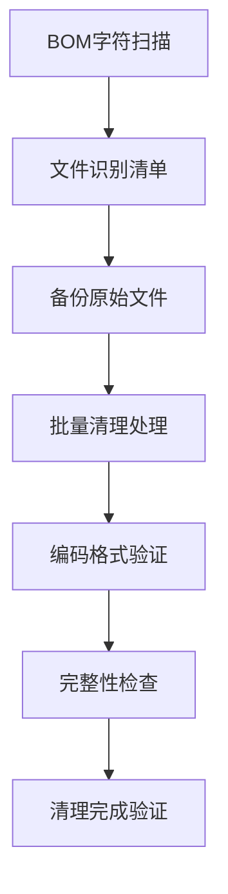
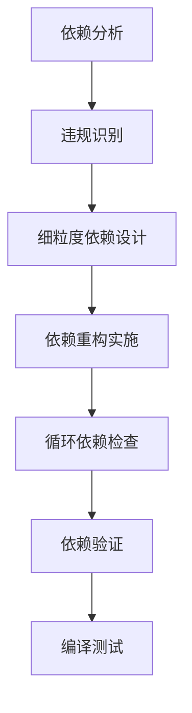
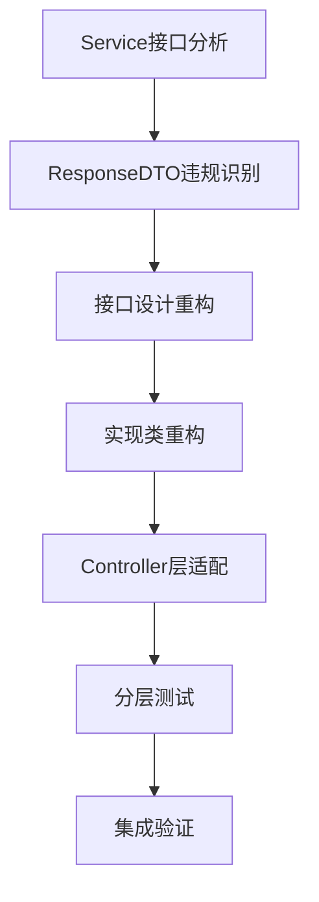
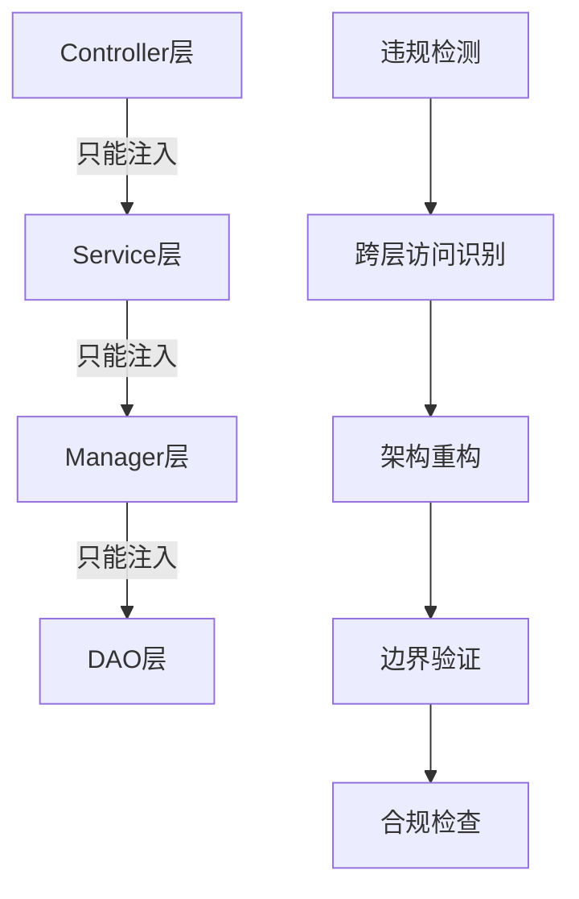
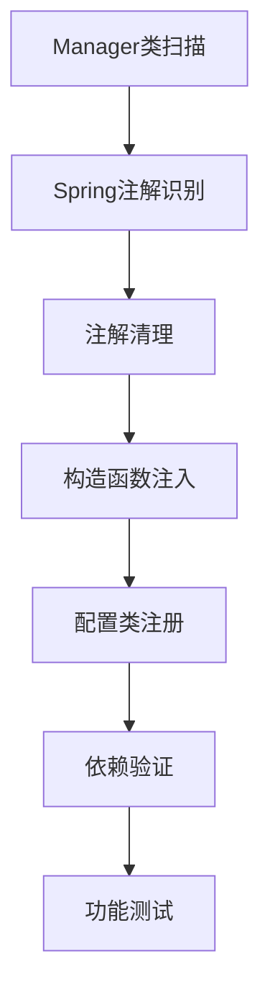

# P0/P1阶段全局重构设计方案

## 设计概述

本设计方案详细阐述IOE-DREAM项目P0/P1阶段全局重构的技术架构决策、实施策略和关键设计原则，确保重构过程可控、可验证、可回滚。

## 架构设计原则

### 1. 分阶段渐进式重构
- **最小化风险**: 每个阶段独立可验证
- **渐进式改进**: 从编译错误到架构质量逐步提升
- **快速反馈**: 每日构建和验证机制

### 2. 严格的分层架构
```
Controller → Service → Manager → DAO
```
- **单向依赖**: 严格禁止跨层访问
- **职责清晰**: 每层只处理对应级别的业务逻辑
- **依赖注入**: 统一使用@Resource注解

### 3. 企业级代码质量标准
- **UTF-8编码**: 无BOM字符，支持国际化
- **依赖注入规范**: @Resource优先，构造函数次之
- **日志规范**: 统一模板，模块化标识
- **异常处理**: 分层异常处理机制

## 技术架构设计

### P0阶段: 编译错误清零架构

#### 1.1 BOM字符清理架构


**关键设计决策**:
- **无损处理**: 确保文件内容完整性
- **批量处理**: 提高处理效率
- **备份机制**: 支持快速回滚
- **验证机制**: 确保清理质量

#### 1.2 Maven依赖重构架构


**依赖层次设计**:
```
Level 1: microservices-common-core (最小内核)
Level 2: microservices-common-* (细粒度模块)
Level 3: 业务微服务 (按需依赖)
Level 4: microservices-common (配置容器，仅网关使用)
```

**细粒度模块清单**:
- `microservices-common-core`: 核心基元
- `microservices-common-data`: 数据访问
- `microservices-common-security`: 安全认证
- `microservices-common-cache`: 缓存管理
- `microservices-common-business`: 业务组件

### P1阶段: 架构规范统一架构

#### 2.1 依赖注入规范架构
```mermaid
graph TD
    A[违规扫描] --> B[@Autowired识别]
    B --> C[批量修复]
    C --> D[@Resource验证]
    D --> E[功能测试]
    E --> F[性能验证]

    G[DAO扫描] --> H[@Repository识别]
    H --> I[批量修复]
    I --> J[@Mapper验证]
    J --> K[MyBatis测试]
    K --> L[数据访问验证]
```

**注入层次设计**:
```java
// Controller层: 只注入Service
@RestController
public class UserController {
    @Resource
    private UserService userService;
}

// Service层: 注入DAO和Manager
@Service
public class UserServiceImpl implements UserService {
    @Resource
    private UserDao userDao;
    @Resource
    private UserManager userManager;
}

// Manager层: 纯Java类，构造函数注入
public class UserManager {
    private final UserDao userDao;

    public UserManager(UserDao userDao) {
        this.userDao = userDao;
    }
}

// DAO层: 使用@Mapper注解
@Mapper
public interface UserDao extends BaseMapper<UserEntity> {
}
```

#### 2.2 Service接口规范架构


**分层职责设计**:
```java
// Service接口: 纯业务逻辑定义
public interface UserService {
    UserVO getUserById(Long userId);
    Long addUser(UserAddForm form);
    void updateUser(Long userId, UserUpdateForm form);
}

// Service实现: 业务逻辑处理，无HTTP响应包装
@Service
public class UserServiceImpl implements UserService {
    @Override
    public UserVO getUserById(Long userId) {
        // 业务逻辑处理
        return convertToVO(userDao.selectById(userId));
    }
}

// Controller: HTTP请求处理和响应包装
@RestController
public class UserController {
    @GetMapping("/users/{id}")
    public ResponseDTO<UserVO> getUser(@PathVariable Long id) {
        UserVO result = userService.getUserById(id);
        return ResponseDTO.ok(result);
    }
}
```

#### 2.3 四层架构边界控制


**边界控制规则**:
- ❌ Controller → DAO (直接数据访问)
- ❌ Controller → Manager (跳过Service层)
- ❌ Service → 直接数据库访问
- ✅ Controller → Service → Manager → DAO

#### 2.4 Manager类规范架构


**Manager类设计模式**:
```java
// 纯Java类，无Spring注解
public class UserManager {
    private final UserDao userDao;
    private final DepartmentDao departmentDao;

    // 构造函数注入依赖
    public UserManager(UserDao userDao, DepartmentDao departmentDao) {
        this.userDao = userDao;
        this.departmentDao = departmentDao;
    }

    // 业务方法
    public UserWithDepartmentVO getUserWithDepartment(Long userId) {
        UserEntity user = userDao.selectById(userId);
        DepartmentEntity dept = departmentDao.selectById(user.getDepartmentId());
        return combineUserAndDepartment(user, dept);
    }
}

// 配置类中注册为Spring Bean
@Configuration
public class ManagerConfiguration {
    @Bean
    public UserManager userManager(UserDao userDao, DepartmentDao departmentDao) {
        return new UserManager(userDao, departmentDao);
    }
}
```

#### 2.5 日志规范统一架构
```mermaid
graph TD
    A[日志扫描] --> B[违规识别]
    B --> C[@Slf4j统一]
    C --> D[模板标准化]
    D --> E[敏感信息过滤]
    E --> F[性能验证]
    F --> G[日志质量检查]
```

**日志模板标准**:
```java
@Slf4j
@RestController
public class UserController {

    @GetMapping("/users/{id}")
    public ResponseDTO<UserVO> getUser(@PathVariable Long id) {
        // 统一入口日志
        log.info("[用户管理] 查询用户详情: userId={}", id);

        try {
            UserVO result = userService.getUserById(id);
            // 成功日志
            log.info("[用户管理] 查询用户成功: userId={}, username={}",
                id, result.getUsername());
            return ResponseDTO.ok(result);
        } catch (BusinessException e) {
            // 业务异常日志
            log.warn("[用户管理] 用户不存在: userId={}, error={}", id, e.getMessage());
            throw e;
        } catch (Exception e) {
            // 系统异常日志
            log.error("[用户管理] 查询用户异常: userId={}", id, e);
            throw new SystemException("SYSTEM_ERROR", "系统异常", e);
        }
    }
}
```

## 关键技术决策

### 1. 工具选择和使用策略

#### BOM字符处理
- **主要工具**: PowerShell脚本 + .NET Encoding类
- **备选方案**: Python脚本 + chardet库
- **决策原因**: Windows环境下PowerShell更原生

#### 依赖管理
- **主要工具**: Maven Dependency Plugin
- **验证工具**: Maven Dependency Tree
- **决策原因**: Maven原生工具，无额外依赖

#### 代码质量检查
- **静态分析**: SonarQube + PMD + CheckStyle
- **动态分析**: JUnit + Jacoco
- **决策原因**: 企业级标准工具链

### 2. 风险控制策略

#### 代码安全保障
- **备份策略**: 每个任务前强制备份
- **版本控制**: Git分支管理，支持快速回滚
- **权限控制**: 限制重构期间的代码提交权限

#### 性能影响控制
- **分批处理**: 避免大文件同时处理
- **资源监控**: 监控CPU和内存使用
- **增量验证**: 每个子阶段完成后验证

### 3. 质量保证机制

#### 自动化验证
- **编译检查**: 自动化Maven编译验证
- **代码质量**: 集成SonarQube质量门禁
- **功能测试**: 自动化回归测试套件

#### 人工审查
- **架构评审**: 每个阶段完成后架构师评审
- **代码审查**: 关键文件必须经过代码审查
- **文档审查**: 技术文档完整性和准确性审查

## 实施策略

### 1. 并行化处理策略

#### 服务并行处理
```bash
# 可并行处理的服务组
Group 1: access-service, attendance-service, consume-service
Group 2: video-service, visitor-service, biometric-service
Group 3: message-service, notification-service, report-service
```

#### 任务并行化
- **扫描任务**: 可并行执行
- **修复任务**: 根据依赖关系确定并行度
- **验证任务**: 可并行执行

### 2. 回滚策略

#### 快速回滚机制
```bash
# Git回滚
git checkout pre-refactor-branch

# 文件级回滚
cp backup/* original-location/

# 配置回滚
git checkout HEAD~1 -- pom.xml
```

#### 分阶段回滚
- **P0阶段回滚**: 回滚到BOM清理前状态
- **P1阶段回滚**: 回滚到P0完成状态
- **完整回滚**: 回滚到重构开始前状态

### 3. 监控和度量

#### 关键指标监控
- **编译成功率**: 实时监控编译通过率
- **架构合规率**: 监控架构违规修复进度
- **代码质量**: SonarQube质量指标变化
- **功能稳定性**: 核心功能测试通过率

#### 度量报告
- **日报**: 每日执行进度和问题统计
- **周报**: 阶段性成果和风险分析
- **里程碑报告**: 关键节点完成情况

## 成功标准

### 技术标准
- **编译成功率**: 100% (0个编译错误)
- **架构合规率**: ≥95% (0个严重违规)
- **代码质量**: SonarQube 0个阻塞问题
- **测试覆盖率**: Service层 ≥80%

### 业务标准
- **功能完整性**: 核心功能100%正常
- **性能影响**: 重构后性能不降级
- **兼容性**: API接口向后兼容
- **可维护性**: 代码可读性和可维护性提升

---

**本设计方案确保P0/P1阶段重构过程科学、可控、可验证，为后续的P2阶段质量提升奠定坚实基础。**